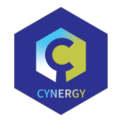

# CyneRgy <a href="https://Cytel-Inc.github.io/CyneRgy/"></a>

R integration with Cytel products provides a highly efficient approach to achieving custom adaptive clinical trial designs, without requiring you to develop an entire R code base. The CyneRgy R package illustrates the synergy of using R and Cytel products for clinical trial simulation and provides tools to help develop new functions.  

# Introduction 

This repository and corresponding website provide an overview of the R examples provided in this repository. Each example is intended to be used with one of Cytel's products (East or Solara). Each example is included in a directory that provides an R Studio project file, a Description file that describes the example, RCode folder which contains the example R scripts, and FillInTheBlankRCode - examples with various code deleted so you can practice and fill in the blanks. 

In addition, the CyneRgy package provides helpful functions for you to create your own R functions based on templates and a seamless R experience for viewing examples in R Studio.   

Lastly, the Sandbox directory contains incomplete, in-progress examples. The examples in this directory have not been completed or tested. 

# Examples 
A variety of examples can be found in this package. Please see [Examples](articles/ExampleOutline.html) for a complete list of examples. The CyneRgy package provides many built-in functions that may be used directly in Cytel products. For a complete list see [References](reference/index.html). 

# Installation 
Currently this package is not officially released and is not available on CRAN. However, it may be installed directly from GitHub using the [remotes package](https://remotes.r-lib.org/) package with the following code:

```
remotes::install_github( "Cytel-Inc/CyneRgy@main" )
```

You must have the remotes package to use the above command. To launch the examples, you will also need to have the rstudioapi package. 


