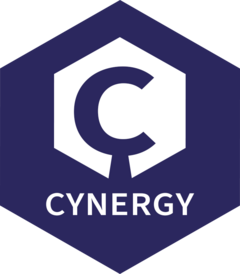

[//]: # (Comment: When editing this file, do not forget to edit pkgdown/index.md too.)

# CyneRgy <a href="https://Cytel-Inc.github.io/CyneRgy/"></a>

# Introduction

R integration with Cytel's products provides a highly efficient way to create custom adaptive clinical trial designs and enhance your simulation capabilities, without requiring you to develop an entire R code base.

The CyneRgy repository provides documentation, templates, and complete examples for Cytel products such as East Horizon. The accompanying R package provides tools for finding those examples, creating custom scripts from templates, preparing R code for use in Cytel products, and running selected common simulation functions directly from R.

Important (January 2026): **ArrivalTime** is a new required parameter for the Response integration point. Existing R scripts must be updated to include this parameter in the function definition, even if it is not used. See [**Integration Point: Response**](https://cytel-inc.github.io/CyneRgy/articles/IntegrationPointResponse.html) for more information.

# Getting Started

For a quick start, visit the [Getting Started](https://cytel-inc.github.io/CyneRgy/articles/Overview.html) section. This guide covers the basics of integrating your R scripts with Cytel's products, including detailed steps for accessing integration points, what input variables are available, what output variables are expected, and links to related templates and examples.

# Examples and Templates

A variety of examples showing how R scripts integrate with Cytel's simulation tools are stored in the repository's [`inst/Examples`](inst/Examples) directory. Please see the [Examples Outline](https://cytel-inc.github.io/CyneRgy/articles/ExampleOutline.html) for the complete list and descriptions.

Selected functions from common examples are also exported by the package and can be called directly with `CyneRgy::`. Specialized and advanced functions remain in their example directories. Each repository example is self-contained and generally includes:

- A `Description.Rmd` file explaining the example.
- An `R` folder containing its scripts.
- Any inputs or supporting files required by that example.
- A matching `<ExampleName>.Rproj` file as an optional RStudio entry point.

The R scripts do not depend on the RStudio project. It is provided for users who clone or copy an example and prefer to open the
whole folder directly in RStudio. Some examples also include hands-on practice files.

After installing CyneRgy, list and open the included examples with:

```r
CyneRgy::RunExample()
CyneRgy::RunExample( "TreatmentSelection" )
```

For an installed package, the second call creates or reuses a writable copy under `~/CyneRgyExamples`; files inside the R package
library are never opened. When CyneRgy is loaded from a development checkout with `pkgload::load_all()`, it opens the repository
example directly. To choose another copy location, provide an existing destination directory:

```r
CyneRgy::RunExample( "TreatmentSelection", strDirectory = getwd() )
```

The default user location can also be changed with `options( CyneRgy.examples.path = "path" )`.

`RunExample()` opens the matching project in RStudio. In VS Code it opens the example folder, `Description.Rmd`, and every R script
under `R/`. Positron and browser-based environments use their available IDE hooks. In other environments the function displays and
returns the example path so it can be opened manually.

Templates are available in the [Templates directory](inst/Templates), and exploratory, in-progress examples can be found in the [Sandbox directory](Sandbox). Note that Sandbox examples are incomplete and untested.

# Functions

The package keeps a focused public API. Selected common functions cover:

- Trial operations: arrival, randomization, and dropout.
- Binary, continuous, time-to-event, and repeated-measures response generation and analysis.
- Dual-endpoint (DEP) patient simulation, analysis, and decisions.
- Multiple-endpoint (MEP) arrival, response generation, and decisions.

For example, `GeneratePoissonArrival()`, `SimulatePatientOutcomePercentAtZero.Binary()`,
`SimulatePatientOutcomePercentAtZero()`, `SimulatePatientSurvivalWeibull()`,
`GenRespDiffOfMeansRepMeasures()`, `AnalyzeDEPUsingFisherExact()`, and `GenerateMEPResponse()` can be called directly from R.
The package functions use the same implementations as the corresponding repository examples.

Functions for working with the repository examples and integration templates include:

- `RunExample()` lists, opens, or copies an included example.
- `CreateCyneRgyFunction()` creates one R script from an integration-point template.
- `CreateCyneRgyExample()` creates an example folder with a matching RStudio project by default; the project can be omitted.
- `CombineAllRFiles()` combines a folder of R scripts for upload to a Cytel product.
- `GetDecisionString()` and `GetDecision()` help create valid analysis decisions.

`PlotExampleFlowchart()` supports the diagrams used in example documentation. For details, see the [function reference](https://cytel-inc.github.io/CyneRgy/reference/index.html).

# Installation

Currently, this package is not officially released and is not available on CRAN. However, it may be installed directly from GitHub using the [remotes package](https://remotes.r-lib.org/) with the following code:

```r
remotes::install_github( "Cytel-Inc/CyneRgy@main" )
```

You must have the `remotes` package to use the command above. The optional `rstudioapi` package provides the best opening experience in RStudio and Positron; it is not required to list, locate, or copy examples.
