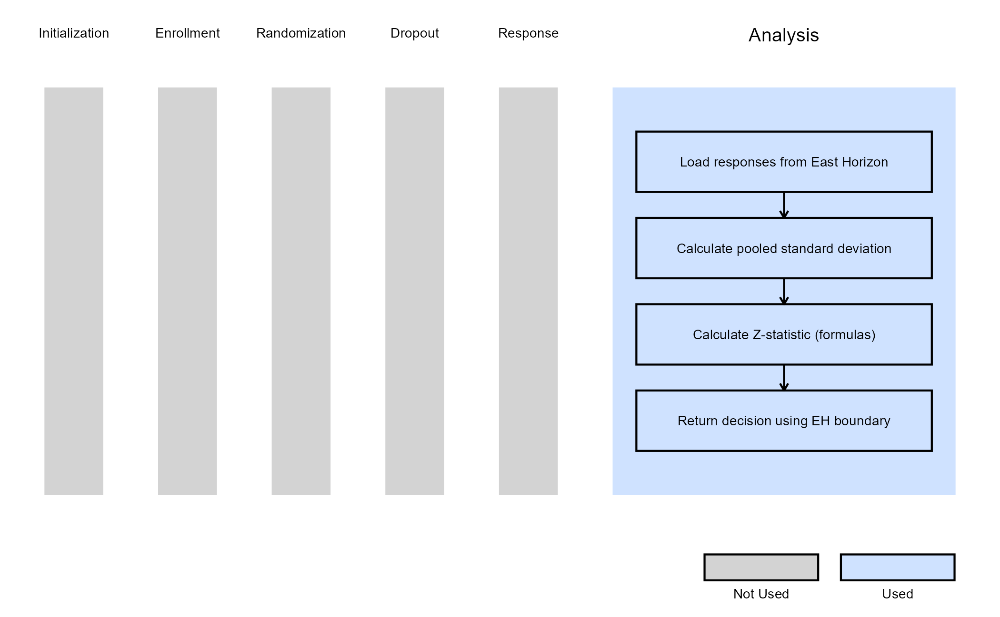
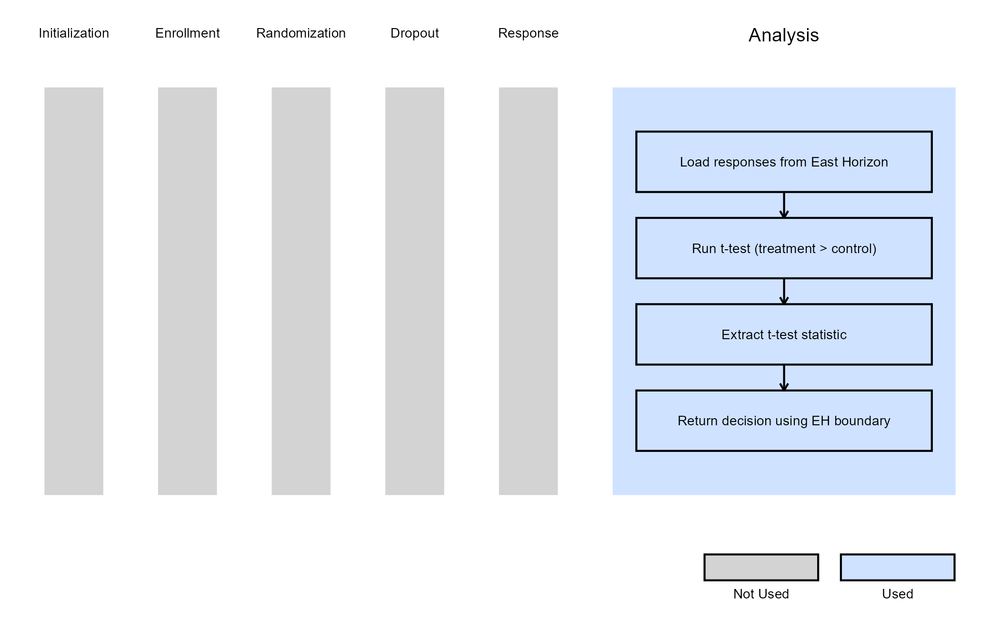
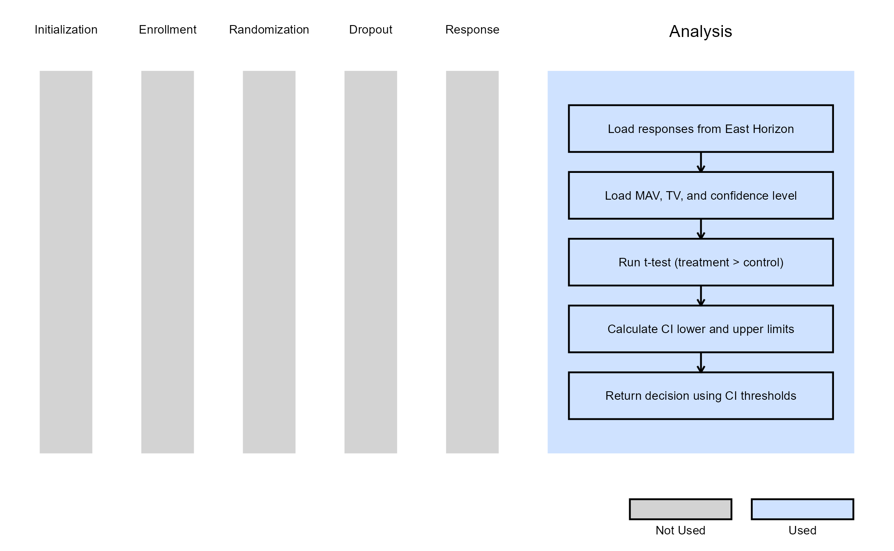
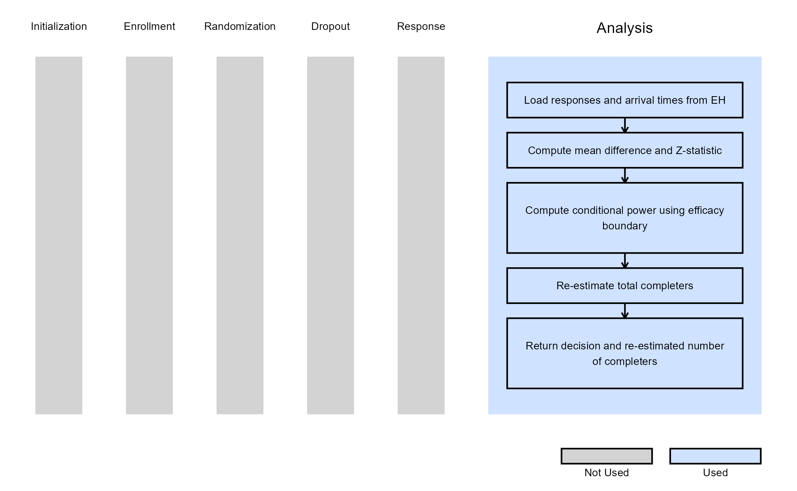

# 2-Arm, Continuous Outcome - Analysis

This example is related to the [**Integration Point: Analysis -
Continuous
Outcome**](https://Cytel-Inc.github.io/CyneRgy/articles/IntegrationPointAnalysisContinuous.md).
Click the link for setup instructions, variable details, and additional
information about this integration point.

To try this example, create a new project in East Horizon using the
following configuration:

- **Study objective:** Two Arm Confirmatory
- **Number of endpoints:** Single Endpoint
- **Endpoint type:** Continuous Outcome
- **Task:** Any
- **Statistical Design:**
  - *Fixed Sample* or *Group Sequential* for Examples 1, 2, 3
  - *Group Sequential with Sample Size Re-Estimation* for Example 4

**Note:** Examples 1, 2, and 3 are compatible with both *Fixed Sample*
and *Group Sequential* statistical designs. The R code automatically
detects whether interim look information (*LookInfo*) is available and
adjusts the analysis parameters accordingly.

## Introduction

The following examples illustrate how to integrate new analysis
capabilities into East Horizon or East using R functions in the context
of a two-arm trial. In each example, the trial design includes a
standard-of-care control arm and an experimental treatment arm, with
patient outcomes assumed to follow a normal distribution. The design
includes two interim analyses (IA) and one final analysis (FA). At each
IA, an analysis is conducted which may lead to early stopping for
efficacy or futility, depending on the predefined design criteria.

Once CyneRgy is installed, you can load this example in RStudio with the
following commands:

``` r
CyneRgy::RunExample( "2ArmNormalOutcomeAnalysis" )
```

Running the command above will load the RStudio project in RStudio.

**East Workbook**:
[2ArmNormalOutcomeAnalysis.cywx](https://github.com/Cytel-Inc/CyneRgy/blob/main/inst/Examples/2ArmNormalOutcomeAnalysis/2ArmNormalOutcomeAnalysis.cywx)

**RStudio Project File**:
[2ArmNormalOutcomeAnalysis.Rproj](https://github.com/Cytel-Inc/CyneRgy/blob/main/inst/Examples/2ArmNormalOutcomeAnalysis/2ArmNormalOutcomeAnalysis.Rproj)

In the [R directory of this
example](https://github.com/Cytel-Inc/CyneRgy/tree/main/inst/Examples/2ArmNormalOutcomeAnalysis/R)
you will find the following R files:

1.  [AnalyzeUsingEastManualFormulaNormal.R](https://github.com/Cytel-Inc/CyneRgy/blob/main/inst/Examples/2ArmNormalOutcomeAnalysis/R/AnalyzeUsingEastManualFormulaNormal.R) -
    Contains a function named *AnalyzeUsingEastManualFormula* that
    computes the two-sample Z-statistic for a continuous endpoint using
    Formulas of Appendix Q.3.3 from the East manual.

2.  [AnalyzeUsingTTestNormal.R](https://github.com/Cytel-Inc/CyneRgy/blob/main/inst/Examples/2ArmNormalOutcomeAnalysis/R/AnalyzeUsingTTestNormal.R) -
    Contains a function named *AnalyzeUsingTTest* that performs the
    analysis using R’s built-in
    [`t.test()`](https://rdrr.io/r/stats/t.test.html) function.

3.  [AnalyzeUsingMeanLimitsOfCI.R](https://github.com/Cytel-Inc/CyneRgy/blob/main/inst/Examples/2ArmNormalOutcomeAnalysis/R/AnalyzeUsingMeanLimitsOfCI.R) -
    Contains a function named *AnalyzeUsingMeanLimitsOfCI* that bases
    interim and final decisions on confidence interval limits rather
    than East Horizon-provided boundaries. The function uses
    user-defined parameters (MAV, TV, and confidence level) to implement
    a Go / No-Go decision framework.

4.  [AnalyzeNormalSSR.R](https://github.com/Cytel-Inc/CyneRgy/blob/main/inst/Examples/2ArmNormalOutcomeAnalysis/R/AnalyzeNormalSSR.R) -
    Contains a function named *AnalyzeNormalSSR* that extends the
    standard continuous analysis to support conditional power–based
    sample size re-estimation (SSR) in a group sequential design.

## Example 1 - Using Formulas Q.3.3 from the East manual

This example is related to this R file:
[AnalyzeUsingEastManualFormulaNormal.R](https://github.com/Cytel-Inc/CyneRgy/blob/main/inst/Examples/2ArmNormalOutcomeAnalysis/R/AnalyzeUsingEastManualFormulaNormal.R)

In this example, the analysis is customized by replacing the default
method with a user-defined calculation based on formulas of the
**Appendix Q.3.3 - Parallel Design: Difference of Means** from the East
manual.

**Estimate of the pooled standard deviation:**

``` math
\hat\sigma^{2} = \sqrt{ 
\frac{(n_t - 1) \cdot \sigma_t^2 + (n_c - 1) \cdot \sigma_c^2}
{n - 2}
}
```

Where:

- $`n_t`$ and $`n_c`$ are the number of patients in the treatment and
  control groups, respectively.
- $`\hat\sigma_t`$ and $`\hat\sigma_e`$ are the standard deviations of
  responses in the treatment and control groups, respectively.
- $`n = n_t + n_c`$ is the total number of patients.

**Test Statistic:**

``` math
Z = \frac{\hat{\mu}_t - \hat{\mu}_c}
{ \sqrt{\hat\sigma^{2} \cdot (\frac{1}{n_c} + \frac{1}{n_t})}}
```

Where:

- $`\hat{\mu}_t`$ and $`\hat{\mu}_e`$ are the means of responses in the
  treatment and control groups, respectively.
- $`\hat\sigma^{2}`$ is the estimate of the pooled standard deviation.
- $`n_t`$ and $`n_c`$ are the numbers of patients in the treatment and
  control groups, respectively.

The objective is to demonstrate a straightforward way to modify both the
analysis and decision-making process. The computed test statistic is
compared to the efficacy boundary provided by East Horizon or East as
input. This example does not include a futility rule and does not use
any user-defined parameters.

The figure below illustrates where this example fits within the R
integration points of Cytel products, accompanied by a flowchart
outlining the general steps performed by the R code.



## Example 2 - Using the `t.test()` Function in R

This example is related to this R file:
[AnalyzeUsingTTestNormal.R](https://github.com/Cytel-Inc/CyneRgy/blob/main/inst/Examples/2ArmNormalOutcomeAnalysis/R/AnalyzeUsingTTestNormal.R)

This example utilizes the base R
[`t.test()`](https://rdrr.io/r/stats/t.test.html) function to perform
the interim and final analyses. The resulting t-statistic is compared
against the efficacy boundary provided by East Horizon or East. Like
Example 1, this example does not include a futility rule and does not
use any user-defined parameters.

The figure below illustrates where this example fits within the R
integration points of Cytel products, accompanied by a flowchart
outlining the general steps performed by the R code.



## Example 3 - Utilization of Confidence Interval Limits for Go/No-Go Decision-Making

This example is related to this R file:
[AnalyzeUsingMeanLimitsOfCI.R](https://github.com/Cytel-Inc/CyneRgy/blob/main/inst/Examples/2ArmNormalOutcomeAnalysis/R/AnalyzeUsingMeanLimitsOfCI.R)

In many Phase II trials, Go/No-Go decisions are made based on whether a
treatment shows sufficient promise to justify further development. These
decisions are often guided by two key thresholds:

- **Minimum Acceptable Value (MAV)**: The smallest treatment effect
  considered meaningful.
- **Target Value (TV)**: A highly desirable treatment effect based on
  clinical or strategic considerations.

This example demonstrates how to approximate probabilistic
decision-making using frequentist confidence intervals (CIs), ignoring
the boundaries provided by East Horizon or East in favor of a CI-based
logic. We use the function
[`t.test()`](https://rdrr.io/r/stats/t.test.html) from base R to analyze
the data and compute the desired confidence intervals. If the treatment
difference is likely to exceed the MAV, a Go decision is made. If not,
and it is unlikely to exceed the TV, a No-Go decision is made.
Specifically:

**At Interim Analysis**

- Let LL and UL be the lower and upper limits of the confidence interval
  for the treatment effect.
- If $`LL > \text{MAV} \rightarrow \text{Go}`$
- If $`UL < \text{TV} \rightarrow \text{No-Go}`$
- Otherwise $`\rightarrow`$ Continue to the next analysis

**At Final Analysis**

- If $`LL > \text{MAV} \rightarrow \text{Go}`$
- Otherwise $`\rightarrow`$ No-Go

In this example, the team has resources for 100 patients and is
comparing two fixed designs and one group sequential design with a
single interim analysis. Refer to the table below for the definitions of
the user-defined parameters used in this example.

| **User parameter** | **Definition** |
|----|----|
| **dMAV** | Minimum Acceptable Value: the smallest treatment effect considered clinically meaningful to warrant further development. |
| **dTV** | Target Value: the desired treatment effect that would represent a strong clinical benefit or strategic advantage. |
| **dConfLevel** | Confidence Level: the level of confidence used to construct the confidence interval for Go/No-Go decision-making (e.g., 0.80 for an 80% CI). |

**Note:** In this example, the boundary information that is computed in
East Horizon or East is ignored. User-defined parameters and the
function [`t.test()`](https://rdrr.io/r/stats/t.test.html) from base R
are used to analyze the data and compute the desired confidence
intervals.

The figure below illustrates where this example fits within the R
integration points of Cytel products, accompanied by a flowchart
outlining the general steps performed by the R code.



### Option 1 - Fixed Design (80% CI)

The decisions are made as follows:

- **Go**: If there is at least a 90% probability that the treatment
  effect exceeds MAV = 0.1 (approximated by lower bound of 80% CI \>
  MAV).
- **No-Go**: If a Go decision is not made, and there is less than a 10%
  probability that the effect exceeds TV = 0.3 (approximated by upper
  bound of 80% CI \< TV).

This framework can be approximated using frequentist logic by applying
the decision rules to an 80% confidence interval assuming to range from
the 10th to the 90th percentile.

Refer to the table below for the values of the user-defined parameters
used in this option.

| **User parameter** | **Value** |
|--------------------|-----------|
| **dMAV**           | 0.1       |
| **dTV**            | 0.3       |
| **dConfLevel**     | 0.8       |

### Option 2 - Fixed Design (70% CI)

The decisions are made as follows:

- **Go**: If there is at least an 85% probability that the treatment
  effect exceeds MAV = 0.1 (approximated by lower bound of 70% CI \>
  MAV).
- **No-Go**: If a Go decision is not made, and there is less than a 15%
  probability that the effect exceeds TV = 0.3 (approximated by upper
  bound of 70% CI \< TV).

This framework can be approximated using frequentist logic by applying
the decision rules to an 80% confidence interval assuming to range from
the 15th to the 85th percentile.

Refer to the table below for the values of the user-defined parameters
used in this option.

| **User parameter** | **Value** |
|--------------------|-----------|
| **dMAV**           | 0.1       |
| **dTV**            | 0.3       |
| **dConfLevel**     | 0.7       |

### Option 3 - Group Sequential Design

In this option, an interim analysis at 50 patients is included with an
option to stop for early Go or No-Go decision.

The decisions are made as follows:

- **Go** (or continue to the next analysis if IA): If there is at least
  an 92.5% probability that the treatment effect exceeds MAV = 0.1
  (approximated by lower bound of 85% CI \> MAV).
- **No-Go** (or stop for futility if IA): If a Go decision is not made,
  and there is less than a 7.5% probability that the effect exceeds TV =
  0.3 (approximated by upper bound of 85% CI \< TV).

This framework can be approximated using frequentist logic by applying
the decision rules to an 85% confidence interval assuming to range from
the 7.5 to the 92.5th percentile.

Refer to the table below for the values of the user-defined parameters
used in this option.

| **User parameter** | **Value** |
|--------------------|-----------|
| **dMAV**           | 0.1       |
| **dTV**            | 0.3       |
| **dConfLevel**     | 0.85      |

## Example 4 - Analysis With Sample Size Re-Estimation

This example is related to this R file:
[AnalyzeNormalSSR.R](https://github.com/Cytel-Inc/CyneRgy/blob/main/inst/Examples/2ArmNormalOutcomeAnalysis/R/AnalyzeNormalSSR.R)

This example illustrates how to customize the analysis when using
`Statistical Design = Group Sequential with Sample Size Re-Estimation`
in East Horizon. The key difference from the previous examples is that
the analysis function is responsible not only for producing a test
statistic and interim decision, but also for computing a re-estimated
total number of completers based on interim results. This is achieved
using a conditional power–based SSR approach, which allows the trial to
increase its planned number of completers when interim results fall
within a “promising zone”.

**Test Statistic:**

A standardized Z-statistic is computed based on the observed difference
in mean outcomes between the experimental and control arms:

``` math
Z = \frac{\bar{X}_{exp} - \bar{X}_{ctrl}}{\sqrt{ \frac{s^2_{exp}}{n_{exp}} + \frac{s^2{ctrl}}{n_{ctrl}} }}
```

where $`\bar{X}_{exp}`$ and $`\bar{X}_{ctrl}`$ are the sample means in
the experimental and control arms, $`s^2_{exp}`$ and $`s^2_{ctrl}`$ are
the corresponding sample variances, and $`n_{exp}`$ and $`n_{ctrl}`$ are
the numbers of observed patients in each arm at the current look.

**Conditional Power:**

Using the observed Z-statistic, the information fraction at the current
look, and the efficacy boundary provided by East Horizon, the
conditional power is computed. This represents the probability of
eventually crossing the final efficacy boundary, given the interim data
and assuming the currently observed effect persists for the remainder of
the trial.

**Sample Size Re-Estimation (SSR):**

Based on the computed conditional power, the total number of completers
is re-estimated using one of two SSR rules:

| Condition | Rule |
|----|----|
| The SSR function scale for promising zone selected in East Horizon is “Continuous” (`AdaptInfo$SSRFuncScale == 0`) | If the conditional power falls between the lower and upper promising-zone thresholds selected in East Horizon (`AdaptInfo$PromZoneMin` and `AdaptInfo$PromZoneMax`), the maximum number of completers is multiplied by the maximum sample size multiplier input specified in East Horizon (`AdaptInfo$MaxSSMultInp$MaxSSMult`). |
| The SSR function scale for promising zone selected in East Horizon is “Step” (`AdaptInfo$SSRFuncScale == 1`) | The conditional power is mapped to intervals specified in East Horizon (`AdaptInfo$MaxSSMultInp$From`, `AdaptInfo$MaxSSMultInp$To`), each associated with a specific sample size multiplier specified in East Horizon (`AdaptInfo$MaxSSMultInp$MaxSSMult`). |

If the conditional power falls outside the promising zone, the original
planned number of completers is retained.

Finally, the Z-statistic is compared against the efficacy boundary
provided by East Horizon. At interim looks, crossing the boundary
results in an early efficacy decision, while at the final look a lack of
boundary crossing results in a futility decision. Both the decision and
the re-estimated total number of completers (`ReEstCompleters`) are
returned to East Horizon.

The figure below illustrates where this example fits within the R
integration points of Cytel products, accompanied by a flowchart
outlining the general steps performed by the R code.


