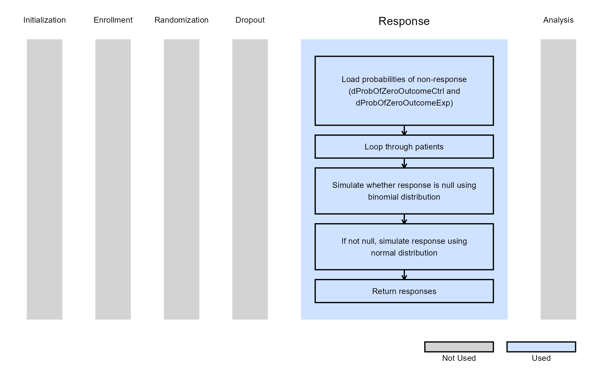
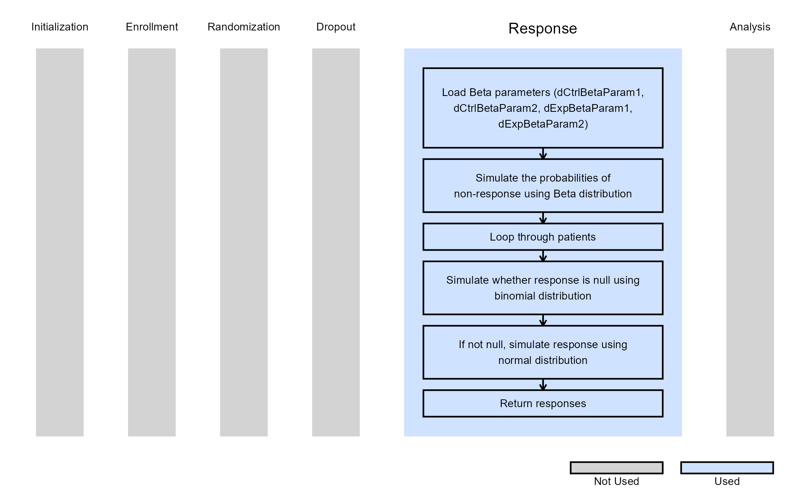

# 2-Arm, Continuous Outcome - Patient Simulation

This example is related to the [**Integration Point: Response -
Continuous
Outcome**](https://Cytel-Inc.github.io/CyneRgy/articles/IntegrationPointResponseContinuous.md).
Click the link for setup instructions, variable details, and additional
information about this integration point.

To try this example, create a new project in East Horizon using the
following configuration:

- **Study objective:** Two Arm Confirmatory
- **Number of endpoints:** Single Endpoint
- **Endpoint type:** Continuous Outcome
- **Task:** Any

Important: **ArrivalTime** is a new required parameter. Existing R
scripts must be updated to include this parameter in the function
definition, even if it is not used. See [**Integration Point: Response -
Continuous
Outcome**](https://Cytel-Inc.github.io/CyneRgy/articles/IntegrationPointResponseContinuous.md)
for more information.

## Introduction

The following examples illustrate how to integrate new patient outcome
simulation (*response*) capabilities into East Horizon or East using R
functions in the context of a two-arm trial. In each example, the trial
design includes a standard-of-care control arm and an experimental
treatment arm, with patient outcomes assumed to follow a normal
distribution.

Once CyneRgy is installed, you can load this example in RStudio with the
following commands:

``` r
CyneRgy::RunExample( "2ArmNormalOutcomePatientSimulation" )
```

Running the command above will load the RStudio project in RStudio.

**East Workbook**:
[2ArmNormalOutcomePatientSimulation.cywx](https://github.com/Cytel-Inc/CyneRgy/blob/main/inst/Examples/2ArmNormalOutcomePatientSimulation/2ArmNormalOutcomePatientSimulation.Rproj)

**RStudio Project File**:
[2ArmNormalOutcomePatientSimulation.Rproj](https://github.com/Cytel-Inc/CyneRgy/blob/main/inst/Examples/2ArmNormalOutcomePatientSimulation/2ArmNormalOutcomePatientSimulation.Rproj)

In the [R directory of this
example](https://github.com/Cytel-Inc/CyneRgy/tree/main/inst/Examples/2ArmNormalOutcomePatientSimulation/R)
you will find the following R files:

1.  [SimulatePatientOutcomePercentAtZero.R](https://github.com/Cytel-Inc/CyneRgy/blob/main/inst/Examples/2ArmNormalOutcomePatientSimulation/R/SimulatePatientOutcomePercentAtZero.R) -
    This file provides an example R function to simulate patient data
    from a mixture distribution where a proportion of patients have a
    null response. The code in Example 1 can be used when the proportion
    of patients with null response is a fixed value.

2.  [SimulatePatientOutcomePercentAtZeroBetaDist.R](https://github.com/Cytel-Inc/CyneRgy/blob/main/inst/Examples/2ArmNormalOutcomePatientSimulation/R/SimulatePatientOutcomePercentAtZeroBetaDist.R) -
    This file provides an example R function to simulate patient data
    from a mixture distribution where a proportion of patients have a
    null response. This approach assumes that the probability of null
    response is unknown and must first be drawn from a Beta
    distribution.

3.  [TestingAndExploration.R](https://github.com/Cytel-Inc/CyneRgy/blob/main/inst/Examples/2ArmNormalOutcomePatientSimulation/R/TestingAndExploration.R) -
    This file provides an example of loading East output and calling the
    R functions in in Example 1 from within R. The intent of this file
    is to help users call and test the function in Example 1.

In addition, if you would like to experiment with these examples without
looking at the complete solution, you can find fill-in-the-blank-type
code files in the [FillInTheBlankR
directory](https://github.com/Cytel-Inc/CyneRgy/tree/main/inst/Examples/2ArmNormalOutcomePatientSimulation/FillInTheBlankR).

## Example 1 - Simulation of Patient Normal Data from a Mixture Distribution

This example is related to this R file:
[SimulatePatientOutcomePercentAtZero.R](https://github.com/Cytel-Inc/CyneRgy/blob/main/inst/Examples/2ArmNormalOutcomePatientSimulation/R/SimulatePatientOutcomePercentAtZero.R)

In this example, the patient outcome is measured as a change from
baseline. However, a certain proportion of patients will not respond to
treatment, resulting in no change from baseline (i.e., non-responders).
Based on historical data, this proportion is estimated to be between 20%
and 40%.

The R function *SimulatePatientOutcomePercentAtZero*, provided in the R
file, allows users to explore the impact of varying proportions of
non-responders on the expected study power.

Refer to the table below for the definitions of the user-defined
parameters used in this example.

| **User parameter** | **Definition** |
|----|----|
| **dProbOfZeroOutcomeCtrl** | Value between 0 and 1 representing the probability a patient is a non-responder in the control arm. |
| **dProbOfZeroOutcomeExp** | Value between 0 and 1 representing the probability a patient is a non-responder in the experimental arm. |

The figure below illustrates where this example fits within the R
integration points of Cytel products, accompanied by a flowchart
outlining the general steps performed by the R code.



### Example 1.1 - All Patients Respond

Assume that all patients will respond to treatment. A binomial
distribution is used to determine whether a patient is a responder or a
non-responder. If the patient is a responder, their outcome is simulated
from a normal distribution using the mean and standard deviation
specified in East Horizon or East and sent to R. In this example, the
probability of a patient being a non-responder is set to zero. Refer to
the table below for the values of the user-defined parameters used in
this example.

| **User parameter**         | **Value** |
|----------------------------|-----------|
| **dProbOfZeroOutcomeCtrl** | 0.0       |
| **dProbOfZeroOutcomeExp**  | 0.0       |

This demonstrates that using the R function with a non-responder
probability of zero produces the same results as simulating the data
directly with the default engine of East Horizon or East.

### Example 1.2 - 20% of Non-Responders

Now, assume that, on average, 20% of patients will not respond to
treatment. A binomial distribution is used to determine whether a
patient is a non-responder. If the patient is a responder, their outcome
is simulated from a normal distribution using the mean and standard
deviation specified in East or East Horizon and sent to R. Refer to the
table below for the values of the user-defined parameters used in this
example.

| **User parameter**         | **Value** |
|----------------------------|-----------|
| **dProbOfZeroOutcomeCtrl** | 0.2       |
| **dProbOfZeroOutcomeExp**  | 0.2       |

### Example 1.3 - 40% of Non-Responders

This example is similar to the previous one, but here we assume that, on
average, 40% of patients will not respond to treatment. Refer to the
table below for the values of the user-defined parameters used in this
example.

| **User parameter**         | **Value** |
|----------------------------|-----------|
| **dProbOfZeroOutcomeCtrl** | 0.4       |
| **dProbOfZeroOutcomeExp**  | 0.4       |

## Example 2 - Simulation of Patient Normal Data from a Mixture Distribution with Mixture Percent Sampled from a Beta Distribution

This example is related to this R file:
[SimulatePatientOutcomePercentAtZeroBetaDist.R](https://github.com/Cytel-Inc/CyneRgy/blob/main/inst/Examples/2ArmNormalOutcomePatientSimulation/R/SimulatePatientOutcomePercentAtZeroBetaDist.R)

Now, the probability of a patient being a non-responder is treated as a
random variable following a Beta distribution. This approach accounts
for the uncertainty in the true probability of non-response.
Additionally, the R function
*SimulatePatientOutcomePercentAtZeroBetaDist*, provided in the script,
allows for different Beta distributions to be assigned to each
treatment. This feature can help assess how a treatment that reduces the
likelihood of non-response would impact trial outcomes.

Refer to the table below for the definitions of the user-defined
parameters used in this example.

| **User parameter** | **Definition** |
|----|----|
| **dCtrlBetaParam1** | Alpha parameter for the Beta Distribution used to get the probability a patient is a non-responder in the control arm. |
| **dCtrlBetaParam2** | Beta parameter for the Beta Distribution used to get the probability a patient is a non-responder in the control arm. |
| **dExpBetaParam1** | Alpha parameter for the Beta Distribution used to get the probability a patient is a non-responder in the experimental arm. |
| **dExpBetaParam2** | Beta parameter for the Beta Distribution used to get the probability a patient is a non-responder in the experimental arm. |

The figure below illustrates where this example fits within the R
integration points of Cytel products, accompanied by a flowchart
outlining the general steps performed by the R code.



### Example 2.1 - 20%-40% (95% CI) of Non-Responders

For this example, independent $`\text{Beta} ( 23.1, 55.2 )`$
distributions are used, which have a 95% credible interval of (0.2,
0.4). The function first simulates the probability of non-response for
both the control and experimental arms using these Beta distributions.
It then uses the simulated probabilities to determine the proportion of
patients with a null response. Refer to the table below for the values
of the user-defined parameters used in this example.

| **User parameter**  | **Value** |
|---------------------|-----------|
| **dCtrlBetaParam1** | 23.1      |
| **dCtrlBetaParam2** | 55.2      |
| **dExpBetaParam1**  | 23.1      |
| **dExpBetaParam2**  | 55.2      |

In this example, it is assumed that the two probabilities are sampled
from the same distribution but are not identical within a given
simulation. The R code can be easily adapted to modify this assumption
if needed.

### Example 2.2 - 20%-40% (95% CI) of Control Non-Responders, 10%-30% (95% CI) of Experimental Non-Responders

In this example, the treatment reduces the probability of non-response
by 10% on average compared to the control. Specifically, assume that the
probability of non-response in the control group follows a
$`\text{Beta} ( 23.1, 55.2 )`$ distribution, with a 95% credible
interval of (0.2, 0.4). For the experimental treatment, assume the
probability of non-response follows a $`\text{Beta} ( 10.8, 46.3 )`$
distribution, with a 95% credible interval of (0.1, 0.3). Refer to the
table below for the values of the user-defined parameters used in this
example.

| **User parameter**  | **Value** |
|---------------------|-----------|
| **dCtrlBetaParam1** | 23.1      |
| **dCtrlBetaParam2** | 55.2      |
| **dExpBetaParam1**  | 10.8      |
| **dExpBetaParam2**  | 46.3      |
