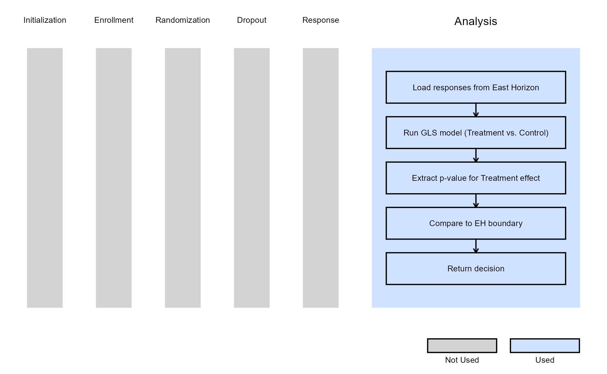

# 2-Arm, Continuous Outcome, Repeated Measures - Analysis

This example is related to the [**Integration Point: Analysis -
Continuous Outcome with Repeated
Measures**](https://Cytel-Inc.github.io/CyneRgy/articles/IntegrationPointAnalysisRepeatedMeasures.md).
Click the link for setup instructions, variable details, and additional
information about this integration point.

To try this example, create a new project in East Horizon using the
following configuration:

- **Study objective:** Two Arm Confirmatory
- **Number of endpoints:** Single Endpoint
- **Endpoint type:** Continuous Outcome with Repeated Measures
- **Task:** Explore

**Note:** This example is compatible with both Fixed Sample and Group
Sequential statistical designs. The R code automatically detects whether
interim look information (*LookInfo*) is available and adjusts the
analysis parameters accordingly.

## Introduction

Repeated measures analyses are used when multiple observations of the
same endpoint are collected from each subject over time. This design
provides insights into how responses evolve across visits and allows for
within-subject correlation modeling.

In this example, we demonstrate how to integrate a **custom
repeated-measures analysis** into East Horizon through R integration.
The example focuses on a two-arm (treatment vs. control) continuous
outcome trial.

In the [R directory of this
example](https://github.com/Cytel-Inc/CyneRgy/tree/main/inst/Examples/2ArmNormalRepeatedMeasuresAnalysis/R)
you will find the following R file:

1.  [Analyze.RepeatedMeasures.R](https://github.com/Cytel-Inc/CyneRgy/tree/main/inst/Examples/2ArmNormalRepeatedMeasuresAnalysis/R/Analyze.RepeatedMeasures.R) -
    The R function named *Analyze.RepeatedMeasures* in the file is used
    to perform repeated measures analysis as described in Example 1
    below.

## Example 1 - Continuous Endpoint

This example is related to this R file:
[Analyze.RepeatedMeasures.R](https://github.com/Cytel-Inc/CyneRgy/tree/main/inst/Examples/2ArmNormalRepeatedMeasuresAnalysis/R/Analyze.RepeatedMeasures.R)

This example demonstrates how to analyze a **continuous
repeated-measures endpoint** within a two-arm clinical trial.

The preceding data generation step returns a list containing one
response variable per visit: `Response1`, `Response2`, etc., each stored
as a numeric vector. These responses are both outputs of the data
generation step and inputs to the current analysis step. They can be
accessed using the `SimData` object (a list-like data frame) via the \$
operator, for example: `SimData$Response1`, `SimData$Response2`, etc.

The analysis is performed using the
[`nlme::gls()`](https://rdrr.io/pkg/nlme/man/gls.html) model, which
accounts for within-subject correlations across repeated visits and
compares treatment effects using the model’s estimated parameters. The
analysis automatically adapts for interim or final looks depending on
the availability of `LookInfo`. As in other analysis integration
examples, the decision logic uses helper functions
([`GetDecisionString()`](https://Cytel-Inc.github.io/CyneRgy/reference/GetDecisionString.md)
and
[`GetDecision()`](https://Cytel-Inc.github.io/CyneRgy/reference/GetDecision.md))
to determine whether efficacy or futility boundaries were crossed based
on the computed test statistic.

The figure below illustrates where this example fits within the R
integration points of Cytel products, accompanied by a flowchart
outlining the general steps performed by the R code.

