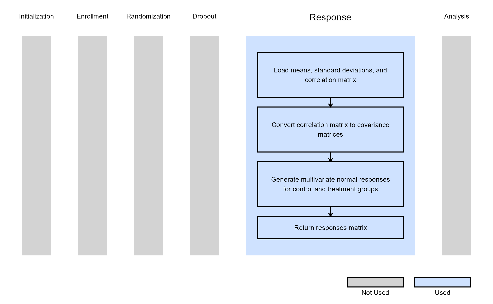

# 2-Arm, Continuous Outcome, Repeated Measures - Patient Simulation

This example is related to the [**Integration Point: Response -
Continuous Outcome with Repeated
Measures**](https://Cytel-Inc.github.io/CyneRgy/articles/IntegrationPointResponseRepeatedMeasures.md).
Click the link for setup instructions, variable details, and additional
information about this integration point.

To try this example, create a new project in East Horizon using the
following configuration:

- **Study objective:** Two Arm Confirmatory
- **Number of endpoints:** Single Endpoint
- **Endpoint type:** Continuous Outcome with Repeated Measures
- **Task:** Explore

## Introduction

Repeated measures involve collecting multiple data points for the same
variable from the same subjects across multiple time periods. This
method provides insights into the subjects’ development and changes over
time. In this context, a single subject can have multiple responses over
time, and these responses can be correlated across different visits.

The following example illustrates how to integrate new patient outcome
simulation (*response*) capabilities into East Horizon or East using R
functions in the context of a two-arm trial with repeated measures.

Once CyneRgy is installed, you can load this example in RStudio with the
following commands:

``` r
CyneRgy::RunExample( "2ArmNormalRepeatedMeasuresResponseGeneration" )
```

Running the command above will load the RStudio project in RStudio.

**RStudio Project File**:
[2ArmNormalRepeatedMeasuresResponseGeneration.Rproj](https://github.com/Cytel-Inc/CyneRgy/blob/main/inst/Examples/2ArmNormalRepeatedMeasuresResponseGeneration/2ArmNormalRepeatedMeasuresResponseGeneration.Rproj)

In the [R directory of this
example](https://github.com/Cytel-Inc/CyneRgy/tree/main/inst/Examples/2ArmNormalRepeatedMeasuresResponseGeneration/R)
you will find the following R files:

1.  [GenerateResponseDiffOfMeansRepeatedMeasures.R](https://github.com/Cytel-Inc/CyneRgy/blob/main/inst/Examples/2ArmNormalRepeatedMeasuresResponseGeneration/R/GenerateResponseDiffOfMeansRepeatedMeasures.R) -
    The R function named *GenRespDiffOfMeansRepMeasures* in the file is
    used to generate the normal responses across multiple visits for
    2-arm normal repeated measures design.

2.  [LibraryMASS.R](https://github.com/Cytel-Inc/CyneRgy/blob/main/inst/Examples/2ArmNormalRepeatedMeasuresResponseGeneration/R/LibraryMASS.R) -
    This file is used to load the library `MASS` to run the `mvrnorm`
    function.

## Example 1 - Continuous Endpoint

This example is related to this R file:
[GenerateResponseDiffOfMeansRepeatedMeasures.R](https://github.com/Cytel-Inc/CyneRgy/blob/main/inst/Examples/2ArmNormalRepeatedMeasuresResponseGeneration/R/GenerateResponseDiffOfMeansRepeatedMeasures.R)

For a continuous endpoint with repeated measures, the generation of
responses primarily depends on the mean and standard deviation across
all visits, as well as the correlation between these visits. This
examples uses built-in input variables coming from East Horizon or East
to simulate repeated measures data. It uses the
[`MASS::mvrnorm`](https://rdrr.io/pkg/MASS/man/mvrnorm.html) function.
This example does not use any user-defined parameters.

The figure below illustrates where this example fits within the R
integration points of Cytel products, accompanied by a flowchart
outlining the general steps performed by the R code.



## Accessing Responses in Analysis

The data generation function returns a list object that includes
multiple repeated response variables, each corresponding to a specified
visit. These responses are stored as numeric vectors and are labeled
sequentially as `Response1`, `Response2` and so on, depending on the
number of visits specified. These Response variables serve as both
outputs of the data generation step and inputs for subsequent analyses.
For the analysis, all the data is combined into a `SimData` object (list
of variables), therefore each response can be accessed directly using
the \$ operator, for example: `SimData$Response1`, `SimData$Response2`,
etc. This structure facilitates the handling of multiple outcomes in
repeated measures analyses. For further details on how to incorporate
these multiple responses into your analysis, refer to [Integration
Point: Analysis - Continuous Outcome with Repeated
Measures](https://Cytel-Inc.github.io/CyneRgy/articles/IntegrationPointAnalysisRepeatedMeasures.md).
