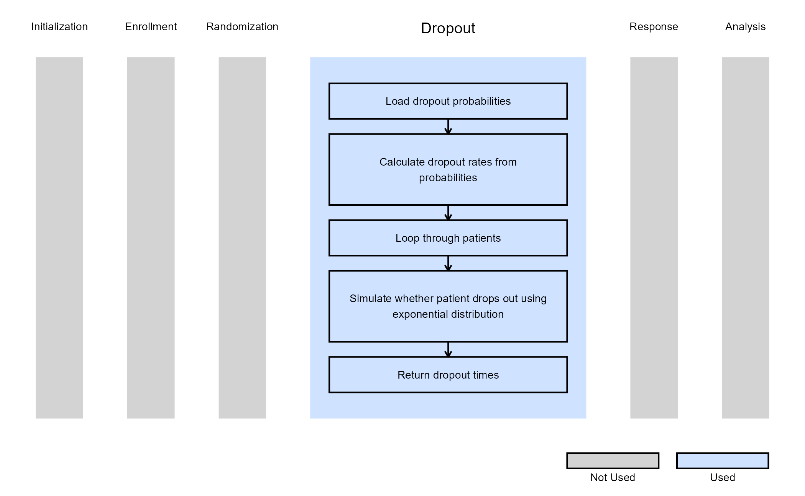

# 2-Arm, Single Endpoint - Simulate Patient Dropout

This example is related to the [**Integration Point:
Dropout**](https://Cytel-Inc.github.io/CyneRgy/articles/IntegrationPointDropout.md).
Click the link for setup instructions, variable details, and additional
information about this integration point.

To try this example, create a new project in East Horizon using the
following configuration:

- **Study objective:** Two Arm Confirmatory
- **Number of endpoints:** Single Endpoint
- **Endpoint type:**
  - Continuous or Binary Outcome for Example 1
  - Time-to-Event Outcome for Example 2
  - Continuous Outcome with Repeated Measures for Example 3
- **Task:** Any

## Introduction

The following examples illustrate how to customize the dropout
distribution in East Horizon or East using R functions. Patients may
drop out of a trial for various reasons, including safety concerns,
treatment burden, or non-trial-related factors. In some cases, dropout
rates can reach 30%, particularly if the drug has adverse side effects.
Incorporating dropout probabilities or hazard rates is crucial during
data generation and can significantly impact subsequent analysis. In all
examples, we assume a trial design consisting of a control group and an
experimental treatment.

Once CyneRgy is installed, you can load this example in RStudio with the
following command:

``` r
CyneRgy::RunExample( "2ArmPatientDropout" )
```

Running the command above will load the RStudio project in RStudio.

**RStudio Project File**:
[2ArmPatientDropout.Rproj](https://github.com/Cytel-Inc/CyneRgy/blob/main/inst/Examples/2ArmPatientDropout/2ArmPatientDropout.Rproj)

In the [R directory of this
example](https://github.com/Cytel-Inc/CyneRgy/tree/main/inst/Examples/2ArmPatientDropout/R)
you will find the following R files:

1.  [GenerateCensoringUsingBinomialProportion.R](https://github.com/Cytel-Inc/CyneRgy/blob/main/inst/Examples/2ArmPatientDropout/R/GenerateCensoringUsingBinomialProportion.R) -
    Contains a function named *GenerateCensoringUsingBinomialProportion*
    to demonstrate the R code necessary for Example 1 as described
    below.

2.  [GenerateDropoutTimeForSurvival.R](https://github.com/Cytel-Inc/CyneRgy/blob/main/inst/Examples/2ArmPatientDropout/R/GenerateDropoutTimeForSurvival.R) -
    Contains a function named *GenerateDropoutTimeForSurvival* to
    demonstrate the R code necessary for Example 2 as described below.

3.  [GenerateDropoutTimeForRM.R](https://github.com/Cytel-Inc/CyneRgy/blob/main/inst/Examples/2ArmPatientDropout/R/GenerateDropoutTimeForRM.R) -
    Contains a function named *GenerateDropoutTimeForRM* to demonstrate
    the R code necessary for Example 3 as described below.

## Example 1 - Dropout Using Binomial Proportion (Continuous or Binary Outcome)

This example is related to this R file:
[GenerateCensoringUsingBinomialProportion.R](https://github.com/Cytel-Inc/CyneRgy/blob/main/inst/Examples/2ArmPatientDropout/R/GenerateCensoringUsingBinomialProportion.R)

The R function *GenerateCensoringUsingBinomialProportion* generates the
censoring indicator using the dropout probability specified in East
Horizon (*ProbDrop* in the script, *Probability of Dropout* in East
Horizon) for continuous or binary outcome. This function applies the
binomial distribution using the
[`rbinom()`](https://rdrr.io/r/stats/Binomial.html) function in R to
determine dropout status. In this case, the dropout probability is the
same across both treatment groups, but this can be customized using
user-defined parameters.

This function does not use any user-defined parameters, but uses
parameters specified in East Horizon. Refer to the table below for more
information.

| **Name of the parameter in East Horizon** | **Where to find the parameter in East Horizon** | **Name of the variable in the R script** |
|----|----|----|
| Probability of Dropout | Response Card | $`ProbDrop`$ |

Steps:

1.  Let $`pd`$ be the dropout probability.  
2.  Draw a random sample from a Bernoulli distribution with
    $`p = 1 - pd`$, i.e., $`Binomial(1, pd)`$, of size $`n = NumSub`$.  
3.  The generated sample serves as a censoring indicator:
    - **1** indicates a patient who completes the trial (does not drop
      out).  
    - **0** indicates a patient who drops out (non-completer).

The figure below illustrates where this example fits within the R
integration points of Cytel products, accompanied by a flowchart
outlining the general steps performed by the R code.


## Example 2 - Dropout Time For Time-to-Event Outcome

This example is related to this R file:
[GenerateDropoutTimeForSurvival.R](https://github.com/Cytel-Inc/CyneRgy/blob/main/inst/Examples/2ArmPatientDropout/R/GenerateDropoutTimeForSurvival.R)

The function *GenerateDropoutTimeForSurvival* generates dropout times
for a two-arm time-to-event design. In this case, dropout information
can be specified separately for each arm (in East Horizon, *Control* and
*Treatment* in the *Dropout Rate* tab), and dropout times are drawn from
an exponential distribution accordingly. The number of periods is fixed
at 1.

This function does not use any user-defined parameters, but uses
parameters specified in East Horizon. Refer to the table below for more
information.

| **Name of the parameter in East Horizon** | **Where to find the parameter in East Horizon** | **Name of the variable in the R script** |
|----|----|----|
| Probability of Dropout: Control | Response Card, Dropout Rate tab | $`DropParam[ 1 ]`$ |
| Probability of Dropout: Treatment | Response Card, Dropout Rate tab | $`DropParam[ 2 ]`$ |

The figure below illustrates where this example fits within the R
integration points of Cytel products, accompanied by a flowchart
outlining the general steps performed by the R code.


## Example 3 - Dropout Time for Repeated Measures

This example is related to this R file:
[GenerateDropoutTimeForRM.R](https://github.com/Cytel-Inc/CyneRgy/blob/main/inst/Examples/2ArmPatientDropout/R/GenerateDropoutTimeForRM.R)

The function *GenerateDropoutTimeForRM* generates dropout times for a
continuous outcome with repeated measures design. In this case, dropout
information can be specified separately for each arm (in East Horizon,
*Control* and *Treatment* in the *Dropout Rate* tab), and dropout times
are drawn from an exponential distribution accordingly. The *Input
Method* in East Horizon has to be set to *Cumulative Probability of
Dropout by Time*.

This function does not use any user-defined parameters, but uses
parameters specified in East Horizon. Refer to the table below for more
information.

| **Name of the parameter in East Horizon** | **Where to find the parameter in East Horizon** | **Name of the variable in the R script** |
|----|----|----|
| Probability of Dropout: Control | Response Card, Dropout Rate tab | $`DropParamControl`$ |
| Probability of Dropout: Treatment | Response Card, Dropout Rate tab | $`DropParamTrt`$ |

The figure below illustrates where this example fits within the R
integration points of Cytel products, accompanied by a flowchart
outlining the general steps performed by the R code.


