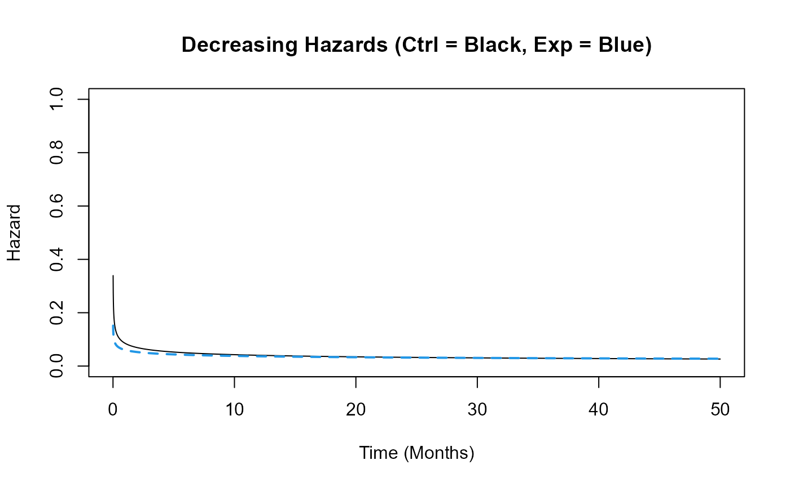
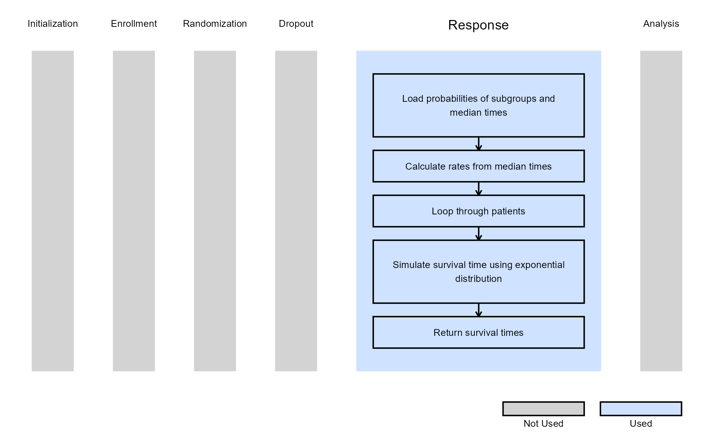

# 2 Arm, Time-To-Event Outcome - Patient Simulation

This example is related to the [**Integration Point: Response -
Time-to-Event
Outcome**](https://Cytel-Inc.github.io/CyneRgy/articles/IntegrationPointResponseTimeToEvent.md).
Click the link for setup instructions, variable details, and additional
information about this integration point.

To try this example, create a new project in East Horizon using the
following configuration:

- **Study objective:** Two Arm Confirmatory
- **Number of endpoints:** Single Endpoint
- **Endpoint type:** Time-to-Event Outcome
- **Task:** Any
- **Stratification turned on**: For Example 3

Important: **ArrivalTime** is a new required parameter. Existing R
scripts must be updated to include this parameter in the function
definition, even if it is not used. See [**Integration Point: Response -
Time-to-Event
Outcome**](https://Cytel-Inc.github.io/CyneRgy/articles/IntegrationPointResponseTimeToEvent.md)
for more information.

## Introduction

The following examples illustrate how to integrate new patient outcome
simulation (*response*) capabilities into East Horizon or East using R
functions in the context of a two-arm trial. In each example, the trial
design includes a standard-of-care control arm and an experimental
treatment arm, with patient outcomes modeled as time-to-event data.

Once CyneRgy is installed, you can load this example in RStudio with the
following commands:

``` r
CyneRgy::RunExample( "2ArmTimeToEventOutcomePatientSimulation" )
```

Running the command above will load the RStudio project in RStudio.

**East Workbook**:
[2ArmTimeToEventOutcomePatientSimulation.cywx](https://github.com/Cytel-Inc/CyneRgy/blob/main/inst/Examples/2ArmTimeToEventOutcomePatientSimulation/2ArmTimeToEventOutcomePatientSimulation.cywx)

**RStudio Project File**:
[2ArmTimeToEventOutcomePatientSimulation.Rproj](https://github.com/Cytel-Inc/CyneRgy/blob/main/inst/Examples/2ArmTimeToEventOutcomePatientSimulation/2ArmTimeToEventOutcomePatientSimulation.Rproj)

In the [R directory of this
example](https://github.com/Cytel-Inc/CyneRgy/tree/main/inst/Examples/2ArmTimeToEventOutcomePatientSimulation/R)
you will find the following R files:

1.  [SimulatePatientSurvivalWeibull.R](https://github.com/Cytel-Inc/CyneRgy/blob/main/inst/Examples/2ArmTimeToEventOutcomePatientSimulation/R/SimulatePatientSurvivalWeibull.R) -
    This file provides an example R function to simulate patient
    time-to-event data from a Weibull distribution.

2.  [HelperFunctionsWeibull.R](https://github.com/Cytel-Inc/CyneRgy/blob/main/inst/Examples/2ArmTimeToEventOutcomePatientSimulation/R/HelperFunctionsWeibull.R) -
    This file contains functions to assist in the computation of Weibull
    parameters.

3.  [SimulatePatientSurvivalMixtureExponentials.R](https://github.com/Cytel-Inc/CyneRgy/blob/main/inst/Examples/2ArmTimeToEventOutcomePatientSimulation/R/SimulatePatientSurvivalMixtureExponentials.R) -
    This file provides an example R function to simulate patient data
    from a mixture of exponential distributions. The mixture is based on
    having any number of patient groups in the study where each group
    has a different exponential distribution for simulating the
    time-to-event from.

4.  [SimulatePatientOutcomeStratification.R](https://github.com/Cytel-Inc/CyneRgy/blob/main/inst/Examples/2ArmTimeToEventOutcomePatientSimulation/R/SimulatePatientOutcomeStratification.R) -
    Contains a function named *SimulatePatientOutcomeStratification*
    that extends the standard TTE response generation to support
    stratification.

## Example 1 - Simulation of Patient Time-To-Event Data from a Weibull Distribution

This example is related to this R file:
[SimulatePatientSurvivalWeibull.R](https://github.com/Cytel-Inc/CyneRgy/blob/main/inst/Examples/2ArmTimeToEventOutcomePatientSimulation/R/SimulatePatientSurvivalWeibull.R)

In this example, the R function *SimulatePatientSurvivalWeibull* is
provided to simulate patient data with hazards and hazard ratios that
change over time, allowing for an exploration of their impact on
expected study power. Refer to the table below for the definitions of
the user-defined parameters used in this example.

| **User parameter** | **Definition** |
|----|----|
| **dShapeCtrl** | Shape parameter of the Weibull distribution for the control arm. |
| **dShapeExp** | Shape parameter of the Weibull distribution for the experimental arm. |
| **dScaleCtrl** | Scale parameter of the Weibull distribution for the control arm. |
| **dScaleExp** | Scale parameter of the Weibull distribution for the experimental arm. |

The figure below illustrates where this example fits within the R
integration points of Cytel products, accompanied by a flowchart
outlining the general steps performed by the R code.


### Example 1.1 – Constant Hazards

Assume that the difference in risk of death for patients in the control
arm compared to the risk of death for patients in the experimental arm
remains the same over time. The time to death or progression of patients
is simulated from a Weibull distribution with the shape and scale for
each arm provided in East Horizon or East and sent to R. Refer to the
table below for the values of the user-defined parameters used in this
example.

| **User parameter** | **Value** |
|--------------------|-----------|
| **dShapeCtrl**     | 1.0       |
| **dShapeExp**      | 1.0       |
| **dScaleCtrl**     | 17.31     |
| **dScaleExp**      | 23.08     |

The scale parameters are calculated based on the median survival time
for each arm. This example demonstrates that using the R function with
these parameters produces the same results as simulating the data
directly in East Horizon or East without an R function.


### Example 1.2 – Increasing Hazards

This function assumes that the hazard of death or disease progression
increases over time in both arms, but at different rates: the control
arm’s hazard increases more slowly than that of the experimental arm.
The time to death or progression is simulated using a Weibull
distribution, with shape and scale parameters specified for each arm in
East Horizon or East and then sent to R. Refer to the table below for
the values of the user-defined parameters used in this example.

| **User parameter** | **Value** |
|--------------------|-----------|
| **dShapeCtrl**     | 3.0       |
| **dShapeExp**      | 4.0       |
| **dScaleCtrl**     | 13.56     |
| **dScaleExp**      | 17.54     |

This example demonstrates how an R function can be used to simulate data
in a way that differs from East Horizon’s or East’s default simulation
approach.


### Example 1.3 – Decreasing Hazards

This example is similar to the previous one, but here the function
assumes that hazards decrease over time in both arms. However, the
control arm’s hazard decreases at a slower rate than that of the
experimental arm. The time to death or progression is simulated using a
Weibull distribution, with shape and scale parameters specified for each
arm in East Horizon or East and then sent to R. Refer to the table below
for the values of the user-defined parameters used in this example.

| **User parameter** | **Value** |
|--------------------|-----------|
| **dShapeCtrl**     | 0.7       |
| **dShapeExp**      | 0.8       |
| **dScaleCtrl**     | 20.26     |
| **dScaleExp**      | 25.30     |

This example demonstrates how an R function can be used to simulate data
differently from East Horizon’s or East’s default simulation approach.



### Notes about the Exponential and Weibull Distributions

In R, the Weibull distribution is defined by a shape parameter
$`\alpha`$ and a scale parameter $`\sigma`$, with a probability density
function (PDF) given by:

``` math

f(x) = \frac{\alpha}{\sigma} \left(\frac{x}{\sigma}\right)^{\alpha-1} e^{-\left(\frac{x}{\sigma}\right)^\alpha}
```

Its corresponding hazard function is:

``` math

h(x) = \frac{\alpha}{\sigma} \left(\frac{x}{\sigma}\right)^{\alpha-1}
```

The Exponential distribution in R is parameterized by a rate parameter
$`\lambda`$, with a PDF given by:

``` math

f(x) = \lambda e^{-\lambda x}
```

Its hazard function remains constant:

``` math

h(x) = \lambda
```

We can see that the Exponential distribution is a special case of the
Weibull distribution, obtained by setting the shape parameter
$`\alpha = 1`$ and the scale parameter $`\sigma = \frac{1}{\lambda}`$.

Functions to assist in the computation of Weibull parameters can be
found in
[HelperFunctionsWeibull.R](https://github.com/Cytel-Inc/CyneRgy/blob/main/inst/Examples/2ArmTimeToEventOutcomePatientSimulation/R/HelperFunctionsWeibull.R).

## Example 2 - Simulation of Patient Time-To-Event Data from a Mixture of Distributions

This example is related to this R file:
[SimulatePatientSurvivalMixtureExponentials.R](https://github.com/Cytel-Inc/CyneRgy/blob/main/inst/Examples/2ArmTimeToEventOutcomePatientSimulation/R/SimulatePatientSurvivalMixtureExponentials.R)

This example simulates patient data using a mixture of exponential
distributions, allowing for multiple patient subgroups within the study.
Each subgroup follows a distinct exponential distribution for modeling
TTE, capturing variability in patient outcomes. Refer to the table below
for the definitions of the user-defined parameters used in this example.

| **User parameter** | **Definition** |
|----|----|
| **QtyOfSubgroups** | Number of patient subgroups. |
| **ProbSubgroup1** | Probability a patient is in subgroup 1. |
| **MedianTTECtrlSubgroup1** | Median time-to-event for a patient in subgroup 1 that receives control treatment. |
| **MedianTTEExpSubgroup1** | Median time-to-event for a patient in subgroup 1 that receives experimental treatment. |
| **ProbSubgroup2** | Probability a patient is in subgroup 2. |
| **MedianTTECtrlSubgroup2** | Median time-to-event for a patient in subgroup 2 that receives control treatment. |
| **MedianTTEExpSubgroup2** | Median time-to-event for a patient in subgroup 2 that receives experimental treatment. |
| *…* | Probabilities and median time-to-event for additional subgroups follow the same format, incrementing the subgroup number (e.g., *ProbSubgroup3*, *MedianTTECtrlSubgroup3*, *MedianTTEExpSubgroup3*, etc.). |
| **ProbSubgroup\<`QtyOfSubgroups`\>** | Probability a patient is in the final subgroup. `QtyOfSubgroups` should be replaced by the number of subgroups. |
| **MedianTTECtrlSubgroup\<`QtyOfSubgroups`\>** | Median time-to-event for a patient in the final subgroup that receives control treatment. `QtyOfSubgroups` should be replaced by the number of subgroups. |
| **MedianTTEExpSubgroup\<`QtyOfSubgroups`\>** | Median time-to-event for a patient in the final subgroup that receives experimental treatment. `QtyOfSubgroups` should be replaced by the number of subgroups. |

The figure below illustrates where this example fits within the R
integration points of Cytel products, accompanied by a flowchart
outlining the general steps performed by the R code.



### Example 2.1 - No Group Difference

We are using two subgroups. Both subgroups have the same Hazard Ratio
(HR), $`HR = \frac{12}{16} = 0.75`$ with same median TTE, i.e., subgroup
has no impact. Refer to the table below for the values of the
user-defined parameters used in this example.

| **User parameter**         | **Value** |
|----------------------------|-----------|
| **QtyOfSubgroups**         | 2         |
| **ProbSubgroup1**          | 0.25      |
| **MedianTTECtrlSubgroup1** | 12        |
| **MedianTTEExpSubgroup1**  | 16        |
| **ProbSubgroup2**          | 0.75      |
| **MedianTTECtrlSubgroup2** | 12        |
| **MedianTTEExpSubgroup2**  | 16        |

### Example 2.2 - HR = 0.75

25% of patients are in subgroup 1, with a median TTE lower than in group
2. Both subgroups have an $`HR = \frac{9}{12} = \frac{12}{16} = 0.75`$.
Refer to the table below for the values of the user-defined parameters
used in this example.

| **User parameter**         | **Value** |
|----------------------------|-----------|
| **QtyOfSubgroups**         | 2         |
| **ProbSubgroup1**          | 0.25      |
| **MedianTTECtrlSubgroup1** | 9         |
| **MedianTTEExpSubgroup1**  | 12        |
| **ProbSubgroup2**          | 0.75      |
| **MedianTTECtrlSubgroup2** | 12        |
| **MedianTTEExpSubgroup2**  | 16        |

### Example 2.3 - Group 1 HR = 0.8 (Prob = 0.25), Group 2 HR = 0.75

25% of patients are in subgroup 1 with an
$`HR = \frac{9}{11.25} = 0.8`$. Subgroup 2 has an
$`HR = \frac{12}{16} = 0.75`$. Refer to the table below for the values
of the user-defined parameters used in this example.

| **User parameter**         | **Value** |
|----------------------------|-----------|
| **QtyOfSubgroups**         | 2         |
| **ProbSubgroup1**          | 0.25      |
| **MedianTTECtrlSubgroup1** | 9         |
| **MedianTTEExpSubgroup1**  | 11.25     |
| **ProbSubgroup2**          | 0.75      |
| **MedianTTECtrlSubgroup2** | 12        |
| **MedianTTEExpSubgroup2**  | 16        |

### Example 2.4 - Group 1 HR = 0.8 (Prob = 0.4), Group 2 HR = 0.75

40% of patients are in subgroup 1 with an
$`HR = \frac{9}{11.25} = 0.8`$. Subgroup 2 has an
$`HR = \frac{12}{16} = 0.75`$. Refer to the table below for the values
of the user-defined parameters used in this example.

| **User parameter**         | **Value** |
|----------------------------|-----------|
| **QtyOfSubgroups**         | 2         |
| **ProbSubgroup1**          | 0.4       |
| **MedianTTECtrlSubgroup1** | 9         |
| **MedianTTEExpSubgroup1**  | 11.25     |
| **ProbSubgroup2**          | 0.75      |
| **MedianTTECtrlSubgroup2** | 12        |
| **MedianTTEExpSubgroup2**  | 16        |

The intent of the example is to illustrate the impact that the patient
subgroup may have on the operating characteristics of the design.

## Example 3 - Response Generation with Stratification

This example is related to this R file:
[SimulatePatientOutcomeStratification.R](https://github.com/Cytel-Inc/CyneRgy/blob/main/inst/Examples/2ArmTimeToEventOutcomePatientSimulation/R/SimulatePatientOutcomeStratification.R)

This example illustrates how to customize the response generation when
turning on `Stratification` in East Horizon. Unlike the previous
examples, where a single set of survival parameters applies to all
patients in an arm, this example allows different survival
characteristics for each stratum, while still supporting two arms.

For each stratum, the survival parameters provided in East Horizon are
converted into arm-specific hazard rates. Patient survival times are
then simulated independently within each stratum using an Exponential
distribution. This approach enables realistic modeling of heterogeneous
patient populations where baseline risk differs across strata.

The behavior of the response simulation depends on the value selected
for Survival Method in East Horizon:

- If `SurvMethod = 1` (*Hazard Rates*), the hazard rates provided for
  each stratum and arm are used directly to simulate patient survival
  times.
- If `SurvMethod = 2` (*Cumulative % Survival*), the cumulative survival
  value at the specified time point is converted into a constant hazard
  rate for each stratum and arm.
- If `SurvMethod = 3` (*Median Survival Times*), the median survival
  time is converted into a hazard rate using
  $`\lambda = \frac{\log(2)}{\text{Median}}`$.

The stratum ID (`StratumID`) input parameter is a vector indicating the
stratum assignment for each subject. Subjects sharing the same value
belong to the same stratum.

The figure below illustrates where this example fits within the R
integration points of Cytel products, accompanied by a flowchart
outlining the general steps performed by the R code.


