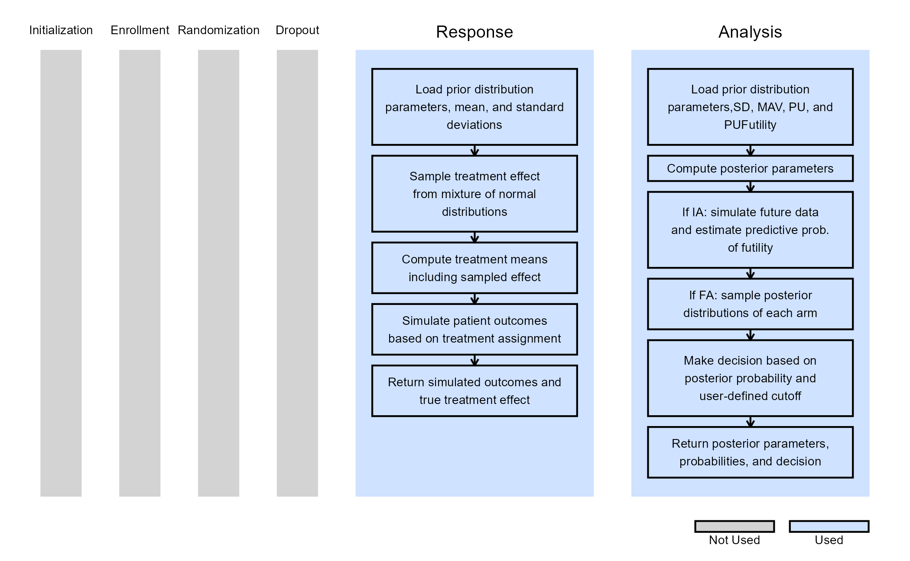

# Bayesian Assurance, Continuous Outcome

This example is related to both the [**Integration Point: Response -
Continuous
Outcome**](https://Cytel-Inc.github.io/CyneRgy/articles/IntegrationPointResponseContinuous.md)
and the [**Integration Point: Analysis - Continuous
Outcome**](https://Cytel-Inc.github.io/CyneRgy/articles/IntegrationPointAnalysisContinuous.md).
Click the links for setup instructions, variable details, and additional
information about the integration points.

To try this example, create a new project in East Horizon using the
following configuration:

- **Study objective:** Two Arm Confirmatory
- **Number of endpoints:** Single Endpoint
- **Endpoint type:** Continuous Outcome
- **Task:** Explore

**Note:** This example is compatible with both Fixed Sample and Group
Sequential statistical designs. The R code automatically detects whether
interim look information (*LookInfo*) is available and adjusts the
analysis parameters accordingly.

## Introduction

The intent of the following examples is to demonstrate the computation
of Bayesian assurance, or probability of success, through the
integration of R with Cytel products. The examples feature a two-arm
trial with normally distributed outcomes, using a **mixture of normal
distributions** prior to compute assurance.

The scenarios covered are as follows:

1.  Fixed sample design using a mixture of normal distributions to
    compute Bayesian assurance.
2.  Group sequential design, expanding on Example 1, with an interim
    analysis for futility based on Bayesian predictive probability.

Once CyneRgy is installed, you can load this example in RStudio with the
following commands:

``` r
CyneRgy::RunExample( "BayesianAssuranceContinuous" )
```

Running the command above will load the RStudio project in RStudio.

In the [R directory of this
example](https://github.com/Cytel-Inc/CyneRgy/tree/main/inst/Examples/BayesianAssuranceContinuous/R)
you will find the R files used in the examples:

1.  [SimulatePatientOutcomeNormalAssurance.R](https://github.com/Cytel-Inc/CyneRgy/blob/main/inst/Examples/BayesianAssuranceContinuous/R/SimulatePatientOutcomeNormalAssurance.R) -
    Functions to simulate patient outcomes under a normal distribution
    informed by mixture priors.
2.  [AnalyzeUsingBayesianNormals.R](https://github.com/Cytel-Inc/CyneRgy/blob/main/inst/Examples/BayesianAssuranceContinuous/R/AnalyzeUsingBayesianNormals.R) -
    Implements Bayesian analysis of simulated outcomes using normal
    priors.

## Example 1 - Fixed Sample Design

This example considers a two-arm fixed sample design with normally
distributed outcomes $`Y`$, with 80 patients per treatment arm. It
demonstrates how to customize the **Response (Patient Simulation)**
element of East Horizon’s simulation to simulate a mixture of normal
distributions, and the **Analysis** element of East Horizon’s simulation
to compute the probability of success.

By integrating an R function into the Analysis integration point, users
can evaluate the frequentist operating characteristics of the Bayesian
design in East Horizon. Additionally, by modifying the Response
integration point, the simulation will incorporate Bayesian assurance.
Specifically, an R function first samples from the assurance prior, then
generates the patient data. The resulting power from this simulation
reflects the Bayesian assurance, assuming the two-component prior.

Often, it is important to examine the posterior distributions of both
the observed and true treatment differences following a Go decision.
These posterior distributions provide valuable insights for planning
subsequent study phases and assessing potential risks. The process of
obtaining these posterior distributions is detailed in the next example.

The figure below illustrates where this example fits within the R
integration points of Cytel products, accompanied by flowcharts
outlining the general steps performed by the R code.


### Response (Patient Simulation) Integration Point

This endpoint is related to this R file:
[SimulatePatientOutcomeNormalAssurance.R](https://github.com/Cytel-Inc/CyneRgy/blob/main/inst/Examples/BayesianAssuranceContinuous/R/SimulatePatientOutcomeNormalAssurance.R)

This function simulates patient-level outcomes within a **Bayesian
assurance framework**, using a **two-component mixture prior** to
reflect uncertainty about the true treatment effect. It allows for
assessing the probability of trial success (assurance) under uncertainty
about the true treatment effect. Information generated from this
simulation will be used later for the [Analysis Integration
Point](#analysis-integration-point).

In this example, the true treatment effect ($`\mu_E - \mu_S`$) is
sampled from a mixture of two normal priors:

- 25% weight on $`\mathcal{N}(0, 0.05^2)`$.
- 75% weight on $`\mathcal{N}(0.7, 0.3^2)`$.

The control mean is fixed, while the experimental mean is computed as
$`d\text{MeanCtrl} + \text{treatment effect}`$. Each patient’s response
is then simulated from a normal distribution corresponding to their
assigned treatment group, with standard deviations defined separately
for each arm.


Refer to the table below for the definitions and values of the
user-defined parameters used in this example.

| **User parameter** | **Definition** | **Value** |
|----|----|----|
| **dWeight1** | Weight of prior component 1. | 0.25 |
| **dWeight2** | Weight of prior component 2. | 0.75 |
| **dMean1** | Mean of prior component 1. | 0 |
| **dMean2** | Mean of prior component 2. | 0.7 |
| **dSD1** | Standard deviation of prior component 1. | 0.05 |
| **dSD2** | Standard deviation of prior component 2. | 0.3 |
| **dMeanCtrl** | Mean of control arm (experimental arm will be sampled). | 0 |
| **dSDCtrl** | Standard deviation for control arm. | 1.9 |
| **dSDExp** | Standard deviation for experimental arm. | 1.9 |

### Analysis Integration Point

This endpoint is related to this R file:
[AnalyzeUsingBayesianNormals.R](https://github.com/Cytel-Inc/CyneRgy/blob/main/inst/Examples/BayesianAssuranceContinuous/R/AnalyzeUsingBayesianNormals.R)

This function evaluates the **posterior probability** that the
experimental treatment arm is better than the control arm by more than a
clinically meaningful threshold, and returns a Go/No-Go decision based
on a cutoff ($`P_U`$). It uses information from the simulation that is
generated by the
[Response](#response-patient-simulation-integration-point) element of
East Horizon’s simulation, explained above.

For patients receiving treatment $`j \in \{\text{S}, \text{E}\}`$ (S =
standard/control, E = experimental), we assume the outcomes
$`Y \sim \mathcal{N}(\mu_j, \sigma^2)`$, where $`\mu_j`$ is an unknown
mean and $`\sigma^2`$ is a known, fixed variance.

We assume *a priori* that:

``` math

\mu_j \sim \mathcal{N}(\theta_j, \tau_j^2 = 1000^2), \quad j \in \{\text{S}, \text{E}\}
```

After observing $`n`$ patients on treatment $`j`$, the posterior
distribution of $`\mu_j`$ becomes:

``` math

\mu_j \mid \bar{y} \sim \mathcal{N}(\theta_j^*, \tau_j^{2*})
```

where:

``` math

\theta_j^* = \frac{\frac{\theta_j}{\tau_j^2} + \frac{n \bar{y}}{\sigma^2}}{\frac{1}{\tau_j^2} + \frac{n}{\sigma^2}}, \quad \text{and} \quad
\frac{1}{\tau_j^{2*}} = \frac{1}{\tau_j^2} + \frac{n}{\sigma^2}
```

At the conclusion of the study, the posterior probability that the
experimental arm exceeds the control arm by more than the minimum
acceptable value (MAV) is calculated as:

``` math

\rho = \Pr(\mu_E > \mu_S + \text{MAV} \mid \text{data})
```

The decision rule is as follows:

- If $`\rho > P_U \rightarrow`$ Go.
- If $`\rho \leq P_U \rightarrow`$ No-Go.

Refer to the table below for the definitions and values of the
user-defined parameters used in this example.

| **User parameter** | **Definition** | **Value** |
|----|----|----|
| **dPriorMeanCtrl** | Prior mean for control arm. | 0 |
| **dPriorStdDevCtrl** | Prior standard deviation for control arm. | 1000 |
| **dPriorMeanExp** | Prior mean for experimental arm. | 0 |
| **dPriorStdDevExp** | Prior standard deviation for experimental arm. | 1000 |
| **dSigma** | Known sampling standard deviation. | 1.9 |
| **dMAV** | Minimum Acceptable Value (clinically meaningful difference). | 0.8 |
| **dPU** | Go threshold (posterior probability cutoff). | 0.8 |
| **dPUFutility** | Threshold probability of futility stopping. If the predictive probability of a No Go decision at the end exceeds this value, the trial is stopped early for futility. | 0.8 |

### Results

The probability of a Go is 15.3% and the probability of a No-Go is
84.7%.


## Example 2 - Group Sequential Design

This example follows the same structure and uses the same code as
Example 1. However, it introduces an interim analysis (IA) for futility
assessment when outcomes are observed for 50% of the enrolled patients.
The futility decision is based on the **Bayesian predictive
probability** of a No-Go decision at the end of the trial. Specifically,
if the predictive probability suggests that a No-Go is likely at the
final analysis, the trial is stopped early for futility. If not, the
trial continues to the final analysis (FA), which uses the same R code.
The in Analysis element of East Horizon’s simulation is thus customized
to handle this case as explained below.

The figure below illustrates where this example fits within the R
integration points of Cytel products, accompanied by flowcharts
outlining the general steps performed by the R code.



### Response (Patient Simulation) Integration Point

This endpoint is related to this R file:
[SimulatePatientOutcomeNormalAssurance.R](https://github.com/Cytel-Inc/CyneRgy/blob/main/inst/Examples/BayesianAssuranceContinuous/R/SimulatePatientOutcomeNormalAssurance.R)

The function for the Response Integration Point is the same as in
[Example 1](#response-patient-simulation-integration-point). Refer to
the table below for the definitions and values of the user-defined
parameters used in this example.

| **User parameter** | **Definition** | **Value** |
|----|----|----|
| **dWeight1** | Weight of prior component 1. | 0.25 |
| **dWeight2** | Weight of prior component 2. | 0.75 |
| **dMean1** | Mean of prior component 1. | 0 |
| **dMean2** | Mean of prior component 2. | 0.7 |
| **dSD1** | Standard deviation of prior component 1. | 0.05 |
| **dSD2** | Standard deviation of prior component 2. | 0.3 |
| **dMeanCtrl** | Mean of control arm (experimental arm will be sampled). | 0 |
| **dSDCtrl** | Standard deviation for control arm. | 1.9 |
| **dSDExp** | Standard deviation for experimental arm. | 1.9 |

### Analysis Integration Point

This endpoint is related to this R file:
[AnalyzeUsingBayesianNormals.R](https://github.com/Cytel-Inc/CyneRgy/blob/main/inst/Examples/BayesianAssuranceContinuous/R/AnalyzeUsingBayesianNormals.R)

The function for the Analysis Integration Point is the same as in
[Example 1](#analysis-integration-point), with the addition of the
*dPUFutility* variable to incorporate the interim analysis.
*dPUFutility* is a user-defined threshold that specifies the minimum
predictive probability of a No-Go decision required to stop the trial
early for futility at the interim analysis.

Let $`X_1`$ represent the data available at the interim analysis and
$`X_2`$ the data for patients enrolled thereafter. If the predictive
probability of a No-Go decision at the end of the study, given $`X_1`$,
exceeds a pre-specified threshold $`PU_{\text{Futility}} = 90\%`$, the
trial is stopped. Formally, the stopping rule is:

``` math
\Pr( \text{No-Go at end of study} \mid X_1 ) > PU_{\text{Futility}} = 90\%
```

This can be expressed as:

``` math
\Pr\left( \left\{ \Pr( \mu_E > \mu_S + MAV \mid X_1, X_2 ) > PU \right\} \Big| X_1 \right) > PU_{\text{Futility}}
```

Refer to the table below for the definitions and values of the
user-defined parameters used in this example.

| **User parameter** | **Definition** | **Value** |
|----|----|----|
| **dPriorMeanCtrl** | Prior mean for control arm. | 0 |
| **dPriorStdDevCtrl** | Prior standard deviation for control arm. | 1000 |
| **dPriorMeanExp** | Prior mean for experimental arm. | 0 |
| **dPriorStdDevExp** | Prior standard deviation for experimental arm. | 1000 |
| **dSigma** | Known sampling standard deviation. | 1.9 |
| **dMAV** | Minimum Acceptable Value (clinically meaningful difference). | 0.8 |
| **dPU** | Go threshold (posterior probability cutoff). | 0.8 |
| **dPUFutility** | Threshold to stop the trial early for futility. | 0.9 |

### Results

The results of the design are as follows:

- The probability of an end of study Go is: 0.1478
- The probability of an end of study No-Go (Stop) is: 0.2656
- The probability of futility at the interim: 0.5866
- The probability of a Go conditional on not stopping at the interim:
  0.357523
- The probability of a No-Go conditional on not stopping at the interim:
  0.642477

The posterior mean of the true delta, $`\mu_E-\mu_S`$, given a Go
decision is: 0.992

The summary of the true delta given a Go decision is:

    ##    Min. 1st Qu.  Median    Mean 3rd Qu.    Max. 
    ##   0.023   0.823   0.990   0.992   1.151   2.009

The scaled posterior distribution of the true delta given a Go decision
is:


## See Also

Other relevant examples include:

- [Bayesian Assurance, Time-to-Event
  Outcome](https://Cytel-Inc.github.io/CyneRgy/articles/BayesianAssuranceTimeToEvent.md)
- [Consecutive Studies, Continuous
  Outcome](https://Cytel-Inc.github.io/CyneRgy/articles/ConsecutiveStudiesContinuous.md)
- [Consecutive Studies, Continuous & Time-to-Event
  Outcomes](https://Cytel-Inc.github.io/CyneRgy/articles/ConsecutiveStudiesContinuousTimeToEvent.md)
- [Consecutive Studies, Binary
  Outcome](https://Cytel-Inc.github.io/CyneRgy/articles/ConsecutiveStudiesBinary.md)
- [Probability of Success, Dual
  Endpoints](https://Cytel-Inc.github.io/CyneRgy/articles/ProbabilitySuccessDualEndpoints.md)
