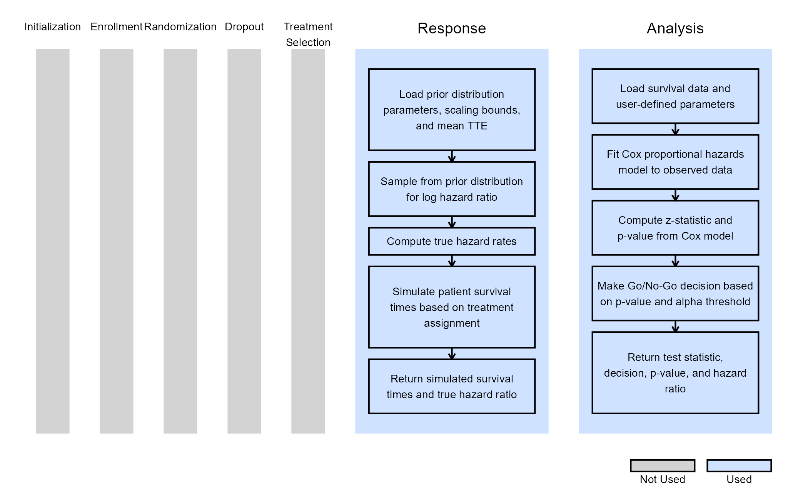
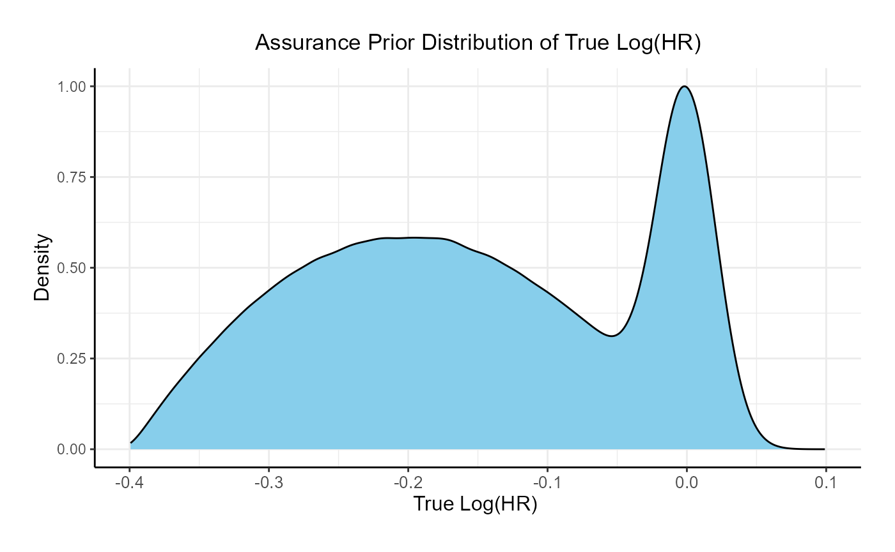
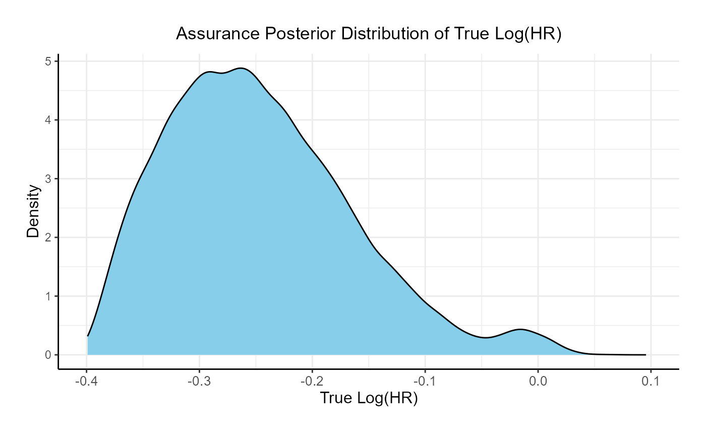
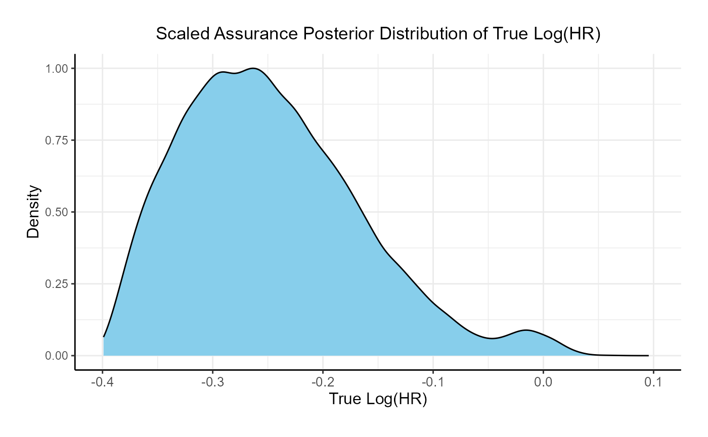

# Bayesian Assurance, Time-to-Event Outcome

This example is related to both the [**Integration Point: Response -
Time-to-Event
Outcome**](https://Cytel-Inc.github.io/CyneRgy/articles/IntegrationPointResponseTimeToEvent.md)
and the [**Integration Point: Analysis - Time-to-Event
Outcome**](https://Cytel-Inc.github.io/CyneRgy/articles/IntegrationPointAnalysisTimeToEvent.md).
Click the links for setup instructions, variable details, and additional
information about the integration points.

To try this example, create a new project in East Horizon using the
following configuration:

- **Study objective:** Two Arm Confirmatory
- **Number of endpoints:** Single Endpoint
- **Endpoint type:** Time-to-Event Outcome
- **Task:** Explore

**Note:** This example is compatible with both Fixed Sample and Group
Sequential statistical designs. The R code automatically detects whether
interim look information (*LookInfo*) is available and adjusts the
analysis parameters accordingly.

## Introduction

The intent of the following examples is to demonstrate the computation
of Bayesian assurance, or probability of success, through the
integration of R with Cytel products. The examples feature a two-arm
trial with time-to-event outcomes, using a **bi-modal distribution**
prior to compute assurance.

The scenarios covered are as follows:

1.  Fixed sample design using a bi-modal distribution and Cox
    proportional hazards model to compute Bayesian assurance.

Once CyneRgy is installed, you can load this example in RStudio with the
following commands:

``` r
CyneRgy::RunExample( "BayesianAssuranceTimeToEvent" )
```

Running the command above will load the RStudio project in RStudio.

In the [R directory of this
example](https://github.com/Cytel-Inc/CyneRgy/tree/main/inst/Examples/BayesianAssuranceContinuous/R)
you will find the R files used in the examples:

1.  [SimulatePatientSurvivalAssurance.R](https://github.com/Cytel-Inc/CyneRgy/blob/main/inst/Examples/BayesianAssuranceTimeToEvent/R/SimulatePatientSurvivalAssurance.R) -
    Functions to simulate patient outcomes under a time-to-event
    distribution informed by a bi-modal prior.
2.  [AnalyzeSurvivalDataUsingCoxPH.R](https://github.com/Cytel-Inc/CyneRgy/blob/main/inst/Examples/BayesianAssuranceTimeToEvent/R/AnalyzeSurvivalDataUsingCoxPH.R) -
    Implements Bayesian analysis of simulated outcomes using Cox
    proportional hazards model.

## Example 1 - Fixed Sample Design

This example considers a two-arm fixed sample design with a
time-to-event endpoint, with 300 patients per arm. It demonstrates how
to customize the the **Response (Patient Simulation)** element of East
Horizon’s simulation to simulate the true hazard ratio from the prior
and then simulate the patient data using the sampled hazard ratio, and
the **Analysis** element of East Horizon’s simulation to perform the
analysis using a Cox model.

The figure below illustrates where this example fits within the R
integration points of Cytel products, accompanied by flowcharts
outlining the general steps performed by the R code.



### Response (Patient Simulation) Integration Point

This endpoint is related to this R file:
[SimulatePatientSurvivalAssurance.R](https://github.com/Cytel-Inc/CyneRgy/blob/main/inst/Examples/BayesianAssuranceTimeToEvent/R/SimulatePatientSurvivalAssurance.R)

This function simulates patient-level outcomes within a **Bayesian
assurance framework**. Information generated from this simulation will
be used later for the [Analysis Integration
Point](#analysis-integration-point). In this example, a **bi-modal
prior** on the $`\log(HR)`$ is used. The components of the prior are:

- 25% weight on $`\mathcal{N}(0, 0.02)`$.
- 75% weight on $`\mathcal{Beta}(2, 2)`$, rescaled between -0.4 and 0.



Refer to the table below for the definitions and values of the
user-defined parameters used in this example.

| **User parameter** | **Definition** | **Value** |
|----|----|----|
| **dWeight1** | Probability of using the normal prior for log(HR). | 0.25 |
| **dPriorMean** | Mean of the normal prior for log(HR). | 0 |
| **dPriorSD** | Standard deviation of the normal prior for log(HR). | 0.02 |
| **dAlpha** | Alpha parameter of the Beta prior for log(HR). | 2 |
| **dBeta** | Beta parameter of the Beta prior for log(HR). | 2 |
| **dUpper** | Upper bound for scaling the Beta prior. | 0 |
| **dLower** | Lower bound for scaling the Beta prior. | -0.4 |
| **dMeanTTEControl** | Mean time-to-event for the control group. | 12 |

### Analysis Integration Point

This endpoint is related to this R file:
[AnalyzeSurvivalDataUsingCoxPH.R](https://github.com/Cytel-Inc/CyneRgy/blob/main/inst/Examples/BayesianAssuranceTimeToEvent/R/AnalyzeSurvivalDataUsingCoxPH.R)

A single analysis is conducted once 50% of patients have experienced the
event of interest. Using the function in the file, the analysis employs
a **Cox proportional hazards model**, with a hazard ratio (HR) less than
1 indicating a benefit in favor of the experimental arm. It uses
information from the simulation that is generated by the
[Response](#response-patient-simulation-integration-point) element of
East Horizon’s simulation, explained above. A Go decision is made if the
resulting p-value is less than or equal to 0.025. Refer to the table
below for the definitions of the user-defined parameters used in this
example.

| **User parameter** | **Definition** |
|----|----|
| **bReturnLogTrueHazard** | If `True`, the function returns the natural logarithm of the true hazard ratio instead of its raw value. |
| **bReturnNAForNoGoTrials** | If `True` and the trial does not meet the Go decision criterion, the function returns `NA` for the hazard ratio. |

### Results

The probability of a Go decision is 33% and the probability of a No-Go
Decision is is 67%. The posterior distribution of the true
$`\log( HR )`$ given a Go decision is:



## See Also

Other relevant examples include:

- [Bayesian Assurance, Continuous
  Outcome](https://Cytel-Inc.github.io/CyneRgy/articles/BayesianAssuranceContinuous.md)
- [Consecutive Studies, Continuous
  Outcome](https://Cytel-Inc.github.io/CyneRgy/articles/ConsecutiveStudiesContinuous.md)
- [Consecutive Studies, Continuous & Time-to-Event
  Outcomes](https://Cytel-Inc.github.io/CyneRgy/articles/ConsecutiveStudiesContinuousTimeToEvent.md)
- [Consecutive Studies, Binary
  Outcome](https://Cytel-Inc.github.io/CyneRgy/articles/ConsecutiveStudiesBinary.md)
- [Probability of Success, Dual
  Endpoints](https://Cytel-Inc.github.io/CyneRgy/articles/ProbabilitySuccessDualEndpoints.md)
