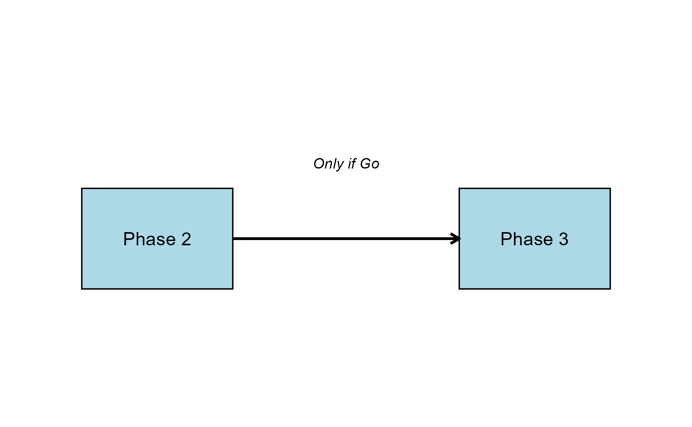
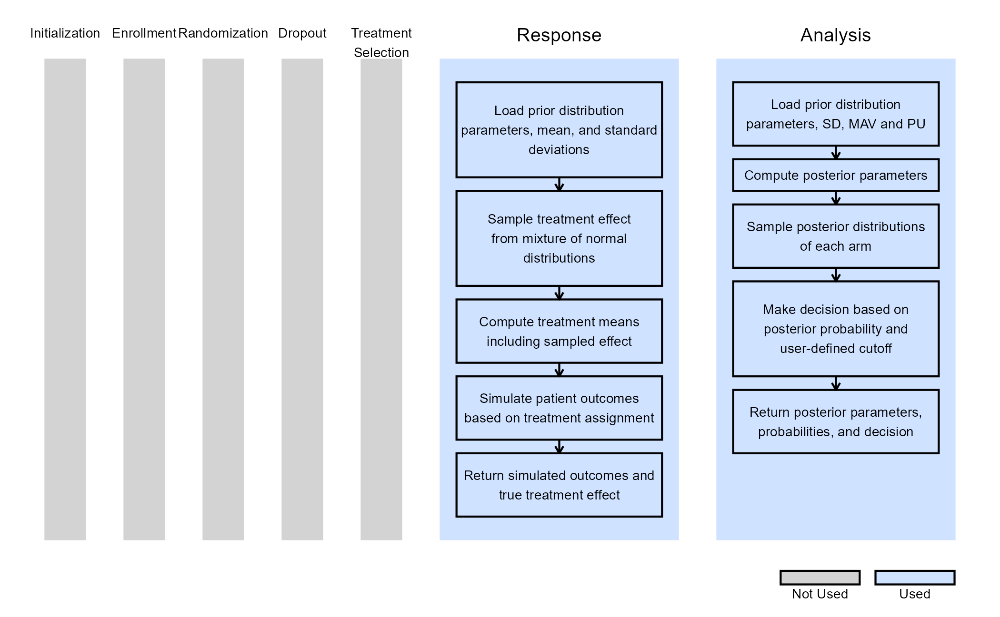
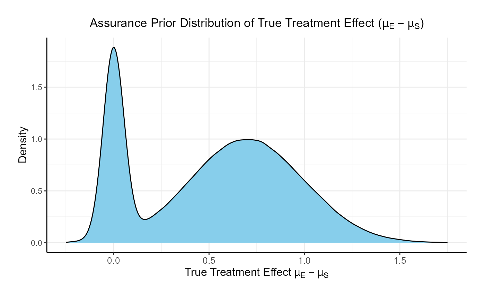
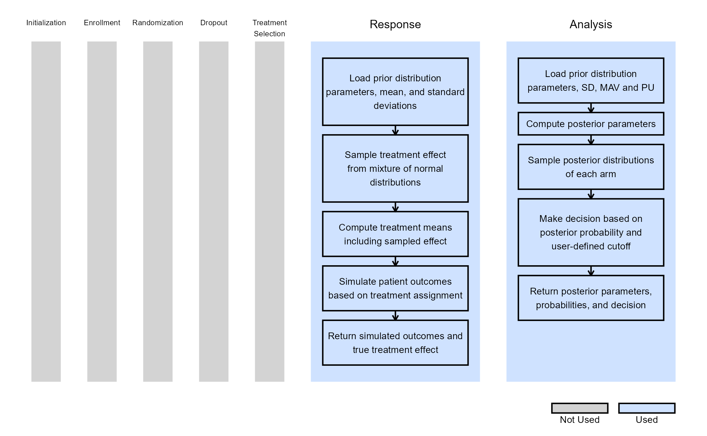
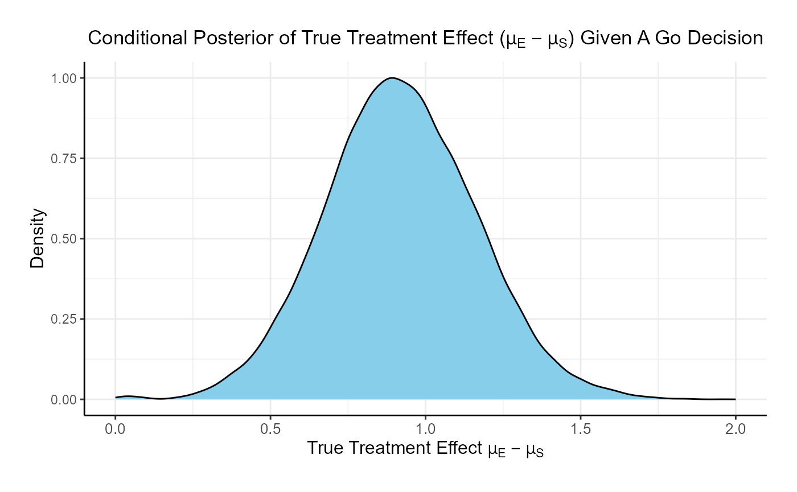
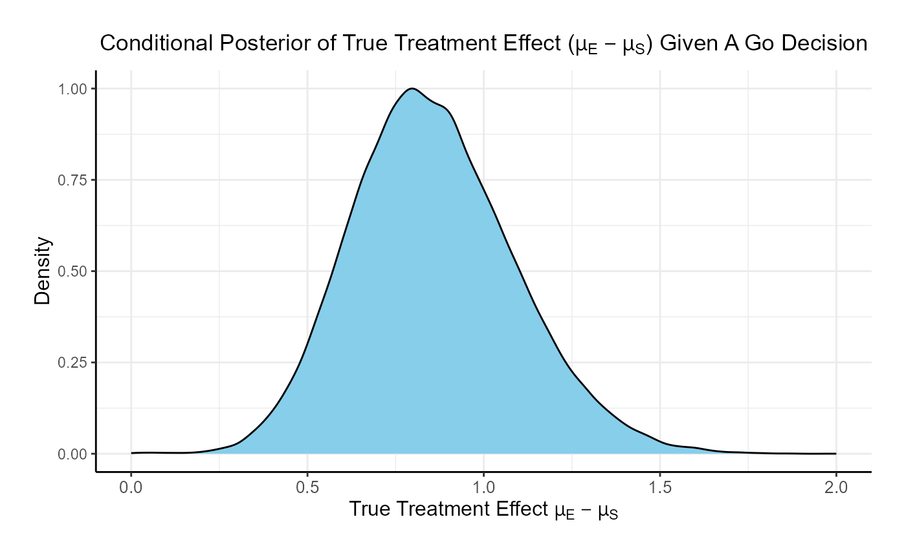
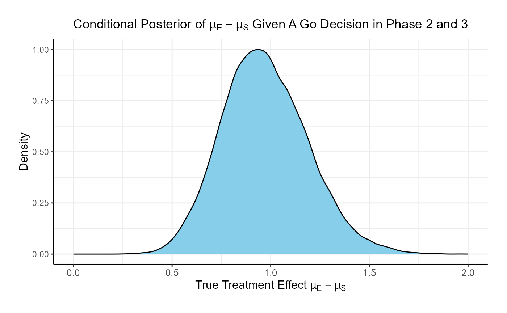

# Consecutive Studies, Continuous Outcome

This example is related to both the [**Integration Point: Response -
Continuous
Outcome**](https://Cytel-Inc.github.io/CyneRgy/articles/IntegrationPointResponseContinuous.md)
and the [**Integration Point: Analysis - Continuous
Outcome**](https://Cytel-Inc.github.io/CyneRgy/articles/IntegrationPointAnalysisContinuous.md).
Click the links for setup instructions, variable details, and additional
information about the integration points.

To try this example, create a new project in East Horizon using the
following configuration:

- **Study objective:** Two Arm Confirmatory
- **Number of endpoints:** Single Endpoint
- **Endpoint type:** Binary Outcome
- **Task:** Explore

**Note:** This example is compatible with both Fixed Sample and Group
Sequential statistical designs. The R code automatically detects whether
interim look information (*LookInfo*) is available and adjusts the
analysis parameters accordingly.

The following example does not show how to load Phase 2 data into a
Phase 3 trial. Please see the [**Consecutive Studies, Binary
Outcome**](https://Cytel-Inc.github.io/CyneRgy/articles/ConsecutiveStudiesBinary.md)
example for more information and step-by-step instructions.

## Introduction

The intent of the following example is to demonstrate the computation of
Bayesian assurance, or probability of success, and conditional assurance
in consecutive studies by using custom R scripts for the **Response
(Patient Simulation)** and the **Analysis** integration points of East
Horizon. It features a sequential design involving a Phase 2 trial
followed by a Phase 3 trial, both with continuous outcomes.

The objective is to understand how conducting a Phase 2 study can reduce
the risk associated with the Phase 3 trial. This **de-risking** is
evaluated by comparing two scenarios: (1) the probability of a No-Go
decision in Phase 3 if Phase 2 is skipped, and (2) the probability of a
No-Go in Phase 3 if a preceding Phase 2 trial is conducted and yields a
Go decision. Specifically, we compute the conditional assurance of Phase
3 given success in Phase 2.

The scenarios covered are as follows:

1.  Two consecutive studies: phase 2 with a normal endpoint followed by
    phase 3, also with a normal endpoint.

Once CyneRgy is installed, you can load this example in RStudio with the
following commands:

``` r
CyneRgy::RunExample( "ConsecutiveStudiesContinuous" )
```

Running the command above will load the RStudio project in RStudio.

In the [R directory of this
example](https://github.com/Cytel-Inc/CyneRgy/tree/main/inst/Examples/ConsecutiveStudiesContinuous/R)
you will find the R files used in the examples:

1.  [SimulatePatientOutcomeNormalAssurance.R](https://github.com/Cytel-Inc/CyneRgy/blob/main/inst/Examples/ConsecutiveStudiesContinuous/R/SimulatePatientOutcomeNormalAssurance.R) -
    Functions to simulate patient outcomes under a normal distribution
    informed by mixture priors.
2.  [AnalyzeUsingBayesianNormals.R](https://github.com/Cytel-Inc/CyneRgy/blob/main/inst/Examples/ConsecutiveStudiesContinuous/R/AnalyzeUsingBayesianNormals.R) -
    Implements Bayesian analysis of simulated outcomes using normal
    priors.

**Note:** This example builds on the [Bayesian Assurance, Continuous
Outcome](https://Cytel-Inc.github.io/CyneRgy/articles/BayesianAssuranceContinuous.md)
example, and utilizes the same R code. Please refer to it for more
information. The difference is that we now have two different studies:
Phase 3 is conducted **only** if Phase 2 results in a Go decision.



## Phase 2 Study

This study considers a two-arm fixed sample design with normally
distributed outcomes $`Y`$, with 80 patients per treatment arm.

The figure below illustrates where this phase fits within the R
integration points of Cytel products, accompanied by flowcharts
outlining the general steps performed by the R code.



### Response (Patient Simulation) Integration Point

This endpoint is related to this R file:
[SimulatePatientOutcomeNormalAssurance.R](https://github.com/Cytel-Inc/CyneRgy/blob/main/inst/Examples/ConsecutiveStudiesContinuous/R/SimulatePatientOutcomeNormalAssurance.R)

This function simulates patient-level outcomes within a **Bayesian
assurance framework**, using a **two-component mixture prior** to
reflect uncertainty about the true treatment effect. It allows for
assessing the probability of trial success (assurance) under uncertainty
about the true treatment effect. Information generated from this
simulation will be used later for the [Analysis Integration
Point](#analysis-integration-point).

In this example, the true treatment effect ($`\mu_E - \mu_S`$) is
sampled from a mixture of two normal priors:

- 25% weight on $`\mathcal{N}(0, 0.05^2)`$.
- 75% weight on $`\mathcal{N}(0.7, 0.3^2)`$.

The control mean is fixed, while the experimental mean is computed as
$`d\text{MeanCtrl} + \text{treatment effect}`$. Each patient’s response
is then simulated from a normal distribution corresponding to their
assigned treatment group, with standard deviations defined separately
for each arm.



Refer to the table below for the definitions and values of the
user-defined parameters used in this example.

| **User parameter** | **Definition** | **Value** |
|----|----|----|
| **dWeight1** | Weight of prior component 1. | 0.25 |
| **dWeight2** | Weight of prior component 2. | 0.75 |
| **dMean1** | Mean of prior component 1. | 0 |
| **dMean2** | Mean of prior component 2. | 0.7 |
| **dSD1** | Standard deviation of prior component 1. | 0.05 |
| **dSD2** | Standard deviation of prior component 2. | 0.3 |
| **dMeanCtrl** | Mean of control arm (experimental arm will be sampled). | 0 |
| **dSDCtrl** | Standard deviation for control arm. | 1.9 |
| **dSDExp** | Standard deviation for experimental arm. | 1.9 |

### Analysis Integration Point

This endpoint is related to this R file:
[AnalyzeUsingBayesianNormals.R](https://github.com/Cytel-Inc/CyneRgy/blob/main/inst/Examples/ConsecutiveStudiesContinuous/R/AnalyzeUsingBayesianNormals.R)

This function evaluates the **posterior probability** that the
experimental treatment arm is better than the control arm by more than a
clinically meaningful threshold, and returns a Go/No-Go decision based
on a cutoff ($`P_U`$). It uses information from the simulation that is
generated by the
[Response](#response-patient-simulation-integration-point) element of
East Horizon’s simulation, explained above.

For patients receiving treatment $`j \in \{\text{S}, \text{E}\}`$ (S =
standard/control, E = experimental), we assume the outcomes
$`Y \sim \mathcal{N}(\mu_j, \sigma^2)`$, where $`\mu_j`$ is an unknown
mean and $`\sigma^2`$ is a known, fixed variance.

We assume *a priori* that:

``` math

\mu_j \sim \mathcal{N}(\theta_j, \tau_j^2 = 1000^2), \quad j \in \{\text{S}, \text{E}\}
```

After observing $`n`$ patients on treatment $`j`$, the posterior
distribution of $`\mu_j`$ becomes:

``` math

\mu_j \mid \bar{y} \sim \mathcal{N}(\theta_j^*, \tau_j^{2*})
```

where:

``` math

\theta_j^* = \frac{\frac{\theta_j}{\tau_j^2} + \frac{n \bar{y}}{\sigma^2}}{\frac{1}{\tau_j^2} + \frac{n}{\sigma^2}}, \quad \text{and} \quad
\frac{1}{\tau_j^{2*}} = \frac{1}{\tau_j^2} + \frac{n}{\sigma^2}
```

At the conclusion of the study, the posterior probability that the
experimental arm exceeds the control arm by more than the minimum
acceptable value (MAV) is calculated as:

``` math

\rho = \Pr(\mu_E > \mu_S + \text{MAV} \mid \text{data})
```

The decision rule is as follows:

- If $`\rho > P_U \rightarrow`$ Go.
- If $`\rho \leq P_U \rightarrow`$ No-Go.

For this study, the *MAV* is set to 0.6 and $`P_U`$ to 0.8. Refer to the
table below for all the definitions and values of the user-defined
parameters used in this example.

| **User parameter** | **Definition** | **Value** |
|----|----|----|
| **dPriorMeanCtrl** | Prior mean for control arm. | 0 |
| **dPriorStdDevCtrl** | Prior standard deviation for control arm. | 1000 |
| **dPriorMeanExp** | Prior mean for experimental arm. | 0 |
| **dPriorStdDevExp** | Prior standard deviation for experimental arm. | 1000 |
| **dSigma** | Known sampling standard deviation. | 1.9 |
| **dMAV** | Minimum Acceptable Value (clinically meaningful difference). | 0.6 |
| **dPU** | Go threshold (posterior probability cutoff). | 0.8 |

## Phase 3 Study

This study considers a two-arm fixed sample design with normally
distributed outcomes $`Y`$, with 200 patients per treatment arm.

The figure below illustrates where this phase fits within the R
integration points of Cytel products, accompanied by flowcharts
outlining the general steps performed by the R code.



### Response (Patient Simulation) Integration Point

This endpoint is related to this R file:
[SimulatePatientOutcomeNormalAssurance.R](https://github.com/Cytel-Inc/CyneRgy/blob/main/inst/Examples/ConsecutiveStudiesContinuous/R/SimulatePatientOutcomeNormalAssurance.R)

The function for the Response Integration Point of the Phase 3 Study is
the same as in [Phase
2](#response-patient-simulation-integration-point). Refer to the table
below for the definitions and values of the user-defined parameters used
in this example.

| **User parameter** | **Definition** | **Value** |
|----|----|----|
| **dWeight1** | Weight of prior component 1. | 0.25 |
| **dWeight2** | Weight of prior component 2. | 0.75 |
| **dMean1** | Mean of prior component 1. | 0 |
| **dMean2** | Mean of prior component 2. | 0.7 |
| **dSD1** | Standard deviation of prior component 1. | 0.05 |
| **dSD2** | Standard deviation of prior component 2. | 0.3 |
| **dMeanCtrl** | Mean of control arm (experimental arm will be sampled). | 0 |
| **dSDCtrl** | Standard deviation for control arm. | 1.9 |
| **dSDExp** | Standard deviation for experimental arm. | 1.9 |

### Analysis Integration Point

This endpoint is related to this R file:
[AnalyzeUsingBayesianNormals.R](https://github.com/Cytel-Inc/CyneRgy/blob/main/inst/Examples/ConsecutiveStudiesContinuous/R/AnalyzeUsingBayesianNormals.R)

The function for the Analysis Integration Point of the Phase 3 Study is
the same as in [Phase 2](#analysis-integration-point).

However, for this study, the *MAV* is set to 0.6 and $`P_U`$ to 0.5.
This design is equivalent to a t-test because the critical value would
be 0.6 and having a posterior probability greater than 0.5 would
indicate that the estimated treatment difference is above the critical
value.

Refer to the table below for all the definitions and values of the
user-defined parameters used in this example.

| **User parameter** | **Definition** | **Value** |
|----|----|----|
| **dPriorMeanCtrl** | Prior mean for control arm. | 0 |
| **dPriorStdDevCtrl** | Prior standard deviation for control arm. | 1000 |
| **dPriorMeanExp** | Prior mean for experimental arm. | 0 |
| **dPriorStdDevExp** | Prior standard deviation for experimental arm. | 1000 |
| **dSigma** | Known sampling standard deviation. | 1.9 |
| **dMAV** | Minimum Acceptable Value (clinically meaningful difference). | 0.6 |
| **dPU** | Go threshold (posterior probability cutoff). | 0.5 |

## Results

For the phase 2 study independently, the probability of a Go is 26.7%
and the probability of a No-Go is 73.3%.



For the phase 3 study independently, the probability of a Go is 46% and
the probability of a No-Go is 54%.



If the two studies are run sequentially, conducting Phase 3 only if
Phase 2 results in a Go decision, the probability of a Go in Phase 3 is
84.8% and the probability of a No-Go is 15.2%.



Comparing the option of running only a Phase 3 versus a Phase 2 followed
by a Phase 3 if Phase 2 is successful, the probability of Go in phase 3
increases from **46%** to **84.8%** and the probability of a No-Go in
Phase 3 decreases from **54%** to **15.2%**.

## See Also

Other relevant examples include:

- [Bayesian Assurance, Continuous
  Outcome](https://Cytel-Inc.github.io/CyneRgy/articles/BayesianAssuranceContinuous.md)
- [Bayesian Assurance, Time-to-Event
  Outcome](https://Cytel-Inc.github.io/CyneRgy/articles/BayesianAssuranceTimeToEvent.md)
- [Consecutive Studies, Continuous & Time-to-Event
  Outcomes](https://Cytel-Inc.github.io/CyneRgy/articles/ConsecutiveStudiesContinuousTimeToEvent.md)
- [Consecutive Studies, Binary
  Outcome](https://Cytel-Inc.github.io/CyneRgy/articles/ConsecutiveStudiesBinary.md)
- [Probability of Success, Dual
  Endpoints](https://Cytel-Inc.github.io/CyneRgy/articles/ProbabilitySuccessDualEndpoints.md)
