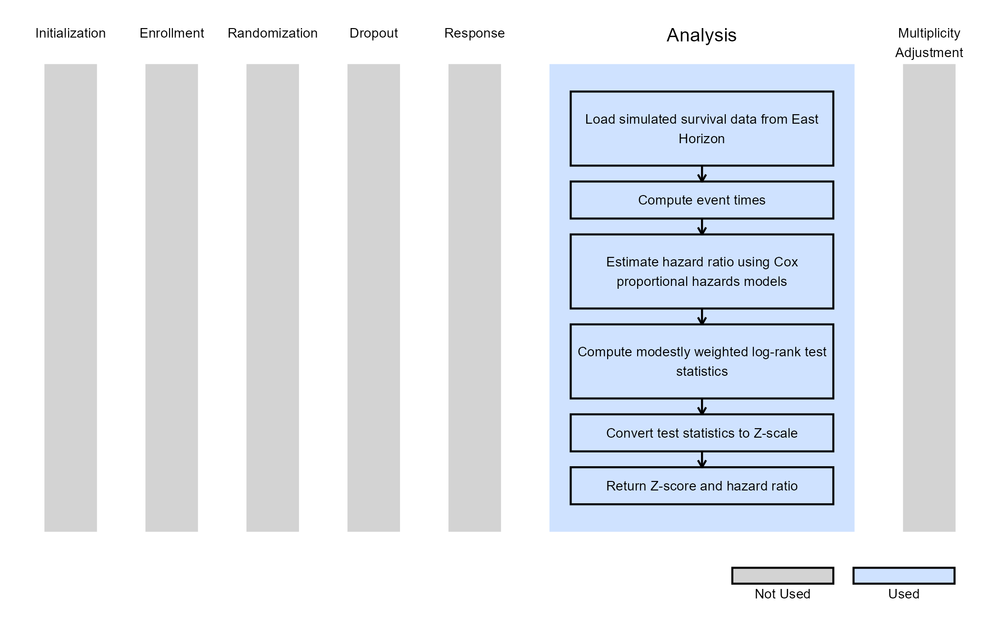
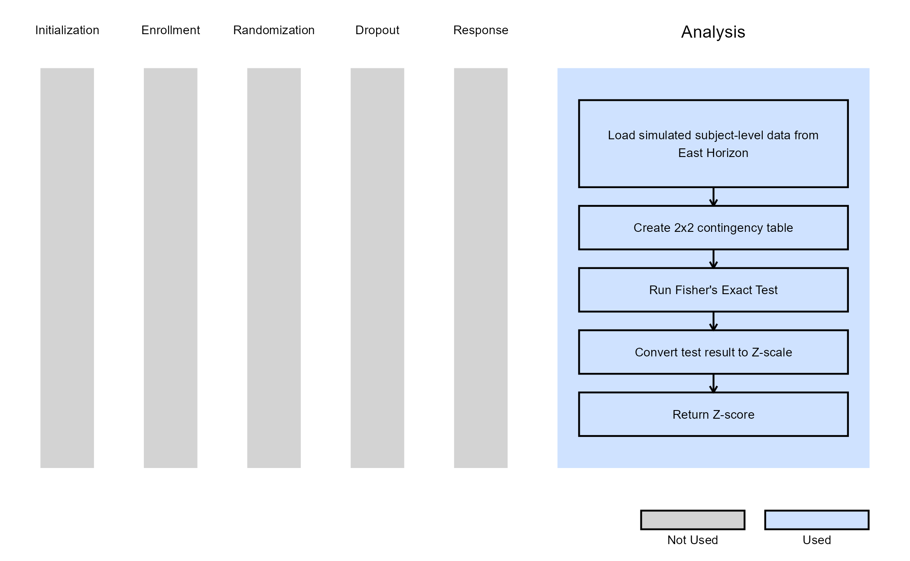

# Dual Endpoints - Analysis

This example is related to the [**Integration Point: Analysis - Dual
Endpoints**](https://Cytel-Inc.github.io/CyneRgy/articles/IntegrationPointAnalysisDual.md).
Click the link for setup instructions, variable details, and additional
information about this integration point.

To try this example, create a new project in East Horizon using the
following configuration:

- **Study objective:** Two Arm Confirmatory
- **Number of endpoints:** Dual Endpoints
- **Endpoint type:**
  - Time-to-Event for Example 1 (from dual *Time-to-Event -
    Time-to-Event* or *Time-to-Event - Binary* design)
  - Binary for Example 2 (from dual *Time-to-Event - Binary* design)
- **Task:** Explore

**Note:** This example is compatible with both Fixed Sample and Group
Sequential statistical designs. The R code automatically detects whether
interim look information (*LookInfo*) is available and adjusts the
analysis parameters accordingly.

## Introduction

The following examples illustrate how to integrate new *analysis*
capabilities into East Horizon using R functions in the context of 2-arm
clinical trials with dual endpoints. These functions can be customized
to support complex evaluation rules, correlated outcomes, and flexible
statistical designs.

**Note:** Each script in this example is designed to be applied to an
**individual endpoint** within a Dual Endpoint (DEP) design, rather than
to both endpoints simultaneously.

The first example illustrates how to perform a **modestly weighted
log-rank test** on a **time-to-event (TTE)** endpoint, while the second
example demonstrates how to perform a **Fisher’s Exact Test** on a
**binary endpoint**. Together, they show how to independently analyze
different endpoint types within East Horizon’s dual-endpoint analytical
framework.

In the [R directory of this
example](https://github.com/Cytel-Inc/CyneRgy/tree/main/inst/Examples/DEPOutcomeAnalysis/R)
you will find the following R files:

1.  [AnalyzeDEPUsingModWtLogRank.R](https://github.com/Cytel-Inc/CyneRgy/blob/main/inst/Examples/DEPAnalysis/R/AnalyzeDEPUsingModWtLogRank.R) -
    Performs a modestly weighted log-rank test on a time-to-event
    endpoint.

2.  [AnalyzeDEPUsingFisherExact.R](https://github.com/Cytel-Inc/CyneRgy/blob/main/inst/Examples/DEPAnalysis/R/AnalyzeDEPUsingFisherExact.R) -
    Performs a Fisher’s Exact Test on a binary endpoint.

## Example 1 - Modestly Weighted Log-Rank Test for TTE Endpoint

This example is related to this R file:
[AnalyzeDEPUsingModWtLogRank.R](https://github.com/Cytel-Inc/CyneRgy/blob/main/inst/Examples/DEPAnalysis/R/AnalyzeDEPUsingModWtLogRank.R)

The function *AnalyzeDEPUsingModWtLogRank* demonstrates how to compute a
**modestly weighted log-rank test statistic** for a time-to-event
endpoint within a DEP design.

The function reads subject-level simulated data, filters observations up
to the current analysis time, and computes observed times and event
indicators based on censoring and response times. A Cox proportional
hazards model is used to estimate the hazard ratio between treatment and
control arms, which provides an interpretable measure of treatment
effect.

The modestly weighted log-rank test (Magirr, 2019) gives lower weights
to early events and increases sensitivity to late ones, making it
particularly useful when delayed manifestation of treatment effects is
expected. The weighting scheme is based on the delay periods defined in
East Horizon, which represent the expected onset times of the treatment
effect.

This approach is flexible and handle both fixed sample and group
sequential designs with multiple interim analyses.

The figure below illustrates where this example fits within the R
integration points of Cytel products, accompanied by a flowchart
outlining the general steps performed by the R code.

## Example 2 - Fisher’s Exact Test for Binary Endpoint

This example is related to this R file:
[AnalyzeDEPUsingFisherExact.R](https://github.com/Cytel-Inc/CyneRgy/blob/main/inst/Examples/DEPAnalysis/R/AnalyzeDEPUsingFisherExact.R)

The *AnalyzeDEPUsingFisherExact* function performs analysis for a binary
endpoint within a DEP design using a Fisher’s Exact Test, which compares
the proportion of responders between treatment arms without relying on
asymptotic assumptions. This is especially useful for smaller studies or
endpoints with low event rates.

The function extracts the relevant response and treatment information
from simulated patient data, constructs a 2×2 contingency table, and
computes both the test statistic and the associated *p-value*. The
results are then expressed on the Z-scale for integration into East
Horizon’s simulation engine.

The figure below illustrates where this example fits within the R
integration points of Cytel products, accompanied by a flowchart
outlining the general steps performed by the R code.

