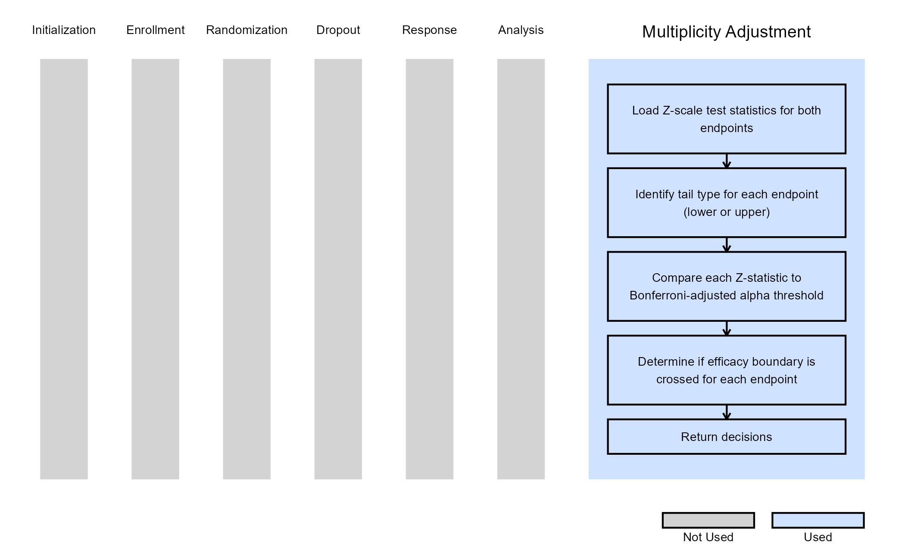

# Dual Endpoints - Multiplicity Adjustment

This example is related to the [**Integration Point: Multiplicity
Adjustment**](https://Cytel-Inc.github.io/CyneRgy/articles/IntegrationPointMultiplicityAdjustment.md).
Click the link for setup instructions, variable details, and additional
information about this integration point.

To try this example, create a new project in East Horizon using the
following configuration:

- **Study objective:** Two Arm Confirmatory
- **Number of endpoints:** Dual Endpoints
- **Endpoint type:** TTE-TTE or TTE-Binary
- **Task:** Explore
- **Statistical Design:** Fixed Sample

## Introduction

The following examples illustrate how to integrate new *multiplicity
adjustment* capabilities into East Horizon using R functions in the
context of 2-arm clinical trials with dual endpoints.

In the [R directory of this
example](https://github.com/Cytel-Inc/CyneRgy/tree/main/inst/Examples/DEPDecisionsUsingMCP/R)
you will find the following R file:

1.  [GetDEPDecisionsFSD.R](https://github.com/Cytel-Inc/CyneRgy/blob/main/inst/Examples/DEPDecisionsUsingMCP/R/GetDEPDecisionsFSD.R) -
    Performs multiplicity-adjusted decision-making for dual endpoints
    using Z-scale test statistics.

## Example 1 - Fixed Sample Dual Endpoints Multiplicity Adjustment

This example is related to this R file:
[GetDEPDecisionsFSD.R](https://github.com/Cytel-Inc/CyneRgy/blob/main/inst/Examples/DEPDecisionsUsingMCP/R/GetDEPDecisionsFSD.R)

The *GetDEPDecisionsFSD* function computes decisions for a dual-endpoint
fixed sample clinical trial using the Bonferroni adjustment for multiple
testing.

It evaluates the test statistics for each endpoint and determines
whether the efficacy boundary has been crossed. For lower-tail tests, it
compares the cumulative probability of the test statistic to half of the
total alpha, and for upper-tail tests, it uses the upper-tail
probability. If the probability is below the threshold, the endpoint is
marked as having crossed the efficacy boundary; otherwise, no boundary
is considered crossed. The function returns a list containing the
endpoint decisions. This implementation assumes a single-look, fixed
sample design with no dropouts.

The figure below illustrates where this example fits within the R
integration points of Cytel products, accompanied by a flowchart
outlining the general steps performed by the R code.

