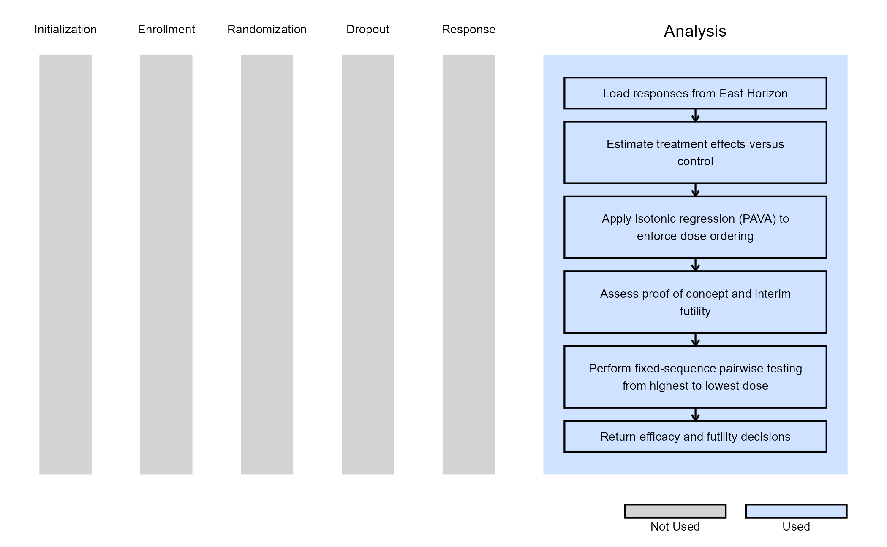

# Dose Finding, Analysis

## Opening this example

To inspect the example in the active supported IDE, run:

``` r
CyneRgy::RunExample( "DoseFindingAnalysis" )
```

With an installed package, this creates or reuses a writable copy under
`~/CyneRgyExamples`; files in the R package library are not opened. With
a development checkout loaded by
[`pkgload::load_all()`](https://pkgload.r-lib.org/reference/load_all.html),
the repository example is opened directly.

To choose another copy location, provide an existing destination
directory:

``` r
CyneRgy::RunExample( "DoseFindingAnalysis", strDirectory = getwd() )
```

[`RunExample()`](https://Cytel-Inc.github.io/CyneRgy/reference/RunExample.md)
opens `DoseFindingAnalysis.Rproj` in RStudio. In VS Code it opens the
example folder, `Description.Rmd`, and every R script under `R/`. The R
scripts do not require an RStudio project.

This example is related to the [**Integration Point:
Analysis**](https://Cytel-Inc.github.io/CyneRgy/articles/IntegrationPointAnalysis.md).
Click the link for setup instructions, variable details, and additional
information about this integration point.

To try this example, create a new project in East Horizon using the
following configuration:

- **Study objective:** Dose Finding
- **Number of endpoints:** Single Endpoint
- **Endpoint type:** Continuous
- **Task:** Explore

## Introduction

The following examples illustrate how to integrate new **analysis**
capabilities into East Horizon using R functions in the context of a
dose finding clinical trial with a continuous endpoint.

In the [R directory of this
example](https://github.com/Cytel-Inc/CyneRgy/tree/main/inst/Examples/DoseFindingAnalysis/R)
you will find the following R file:

1.  [AnalyzeDoseFindingContinuousUsingPairwiseTTest.R](https://github.com/Cytel-Inc/CyneRgy/blob/main/inst/Examples/DoseFindingAnalysis/R/AnalyzeDoseFindingContinuousUsingPairwiseTTest.R) -
    Performs fixed-sequence pairwise comparisons between treatment doses
    and control using t-tests. Supports interim futility assessment,
    isotonic dose-response estimation, and proof-of-concept evaluation.

## Example 1 - Fixed Sequence Pairwise Testing with Isotonic Dose-Response Estimation (Continuous Outcome)

This example is related to this R file:
[AnalyzeDoseFindingContinuousUsingPairwiseTTest.R](https://github.com/Cytel-Inc/CyneRgy/blob/main/inst/Examples/DoseFindingAnalysis/R/AnalyzeDoseFindingContinuousUsingPairwiseTTest.R)

This example demonstrates a dose-finding analysis for continuous
endpoints using a **Fixed Sequence Pairwise testing procedure**,
including the evaluation of **Proof of Concept (PoC)**, **futility**,
and **efficacy** decisions. Efficacy is assessed only at the final
analysis using pairwise comparisons between each active treatment dose
and the control group. Depending on the study design, either
pooled-variance (equal variance) or Welch (unequal variance) t-tests are
used.

To accommodate the ordered nature of dose-response relationships, the
analysis first applies **isotonic regression** using the **Pool Adjacent
Violators Algorithm (PAVA)** to enforce monotonicity across estimated
treatment effects. The resulting isotonic treatment effect estimates are
used for proof-of-concept assessment, interim futility monitoring, and
final efficacy testing.

At interim looks, active treatment arms may be stopped for futility if
their isotonic treatment effect estimate does not satisfy the predefined
futility criterion. Proof of Concept is evaluated using the isotonic
treatment effect estimates and can be assessed both at the individual
arm level and overall across the study.

At the final analysis, efficacy testing is performed using a
fixed-sequence gatekeeping procedure. Hypotheses are evaluated
sequentially from the highest dose to the lowest dose, and lower-dose
hypotheses can only be declared significant if all higher-dose
hypotheses have already met the significance criterion. This approach
provides strong control of the family-wise Type I error rate without
requiring multiplicity-adjusted significance thresholds.

The analysis also supports:

- Continuous endpoints with either left- or right-tailed hypotheses.
- Equal-variance (pooled) or unequal-variance (Welch) t-tests.
- Isotonic dose-response estimation using PAVA.
- Interim analyses with futility monitoring.
- Per-arm and overall Proof of Concept (PoC) assessments.
- Fixed and group-sequential dose-finding designs.

The figure below illustrates where this example fits within the R
integration points of Cytel products, accompanied by a flowchart
outlining the general steps performed by the R code.


