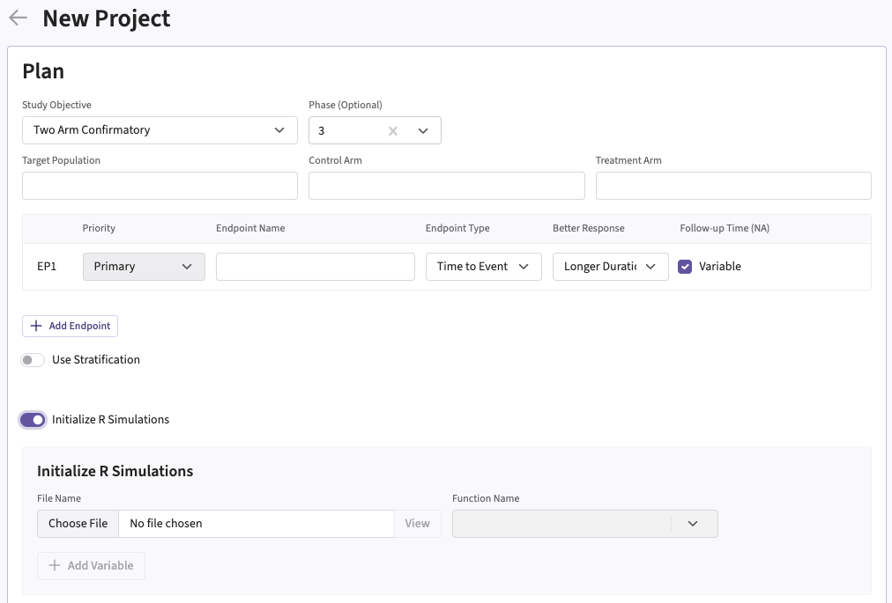
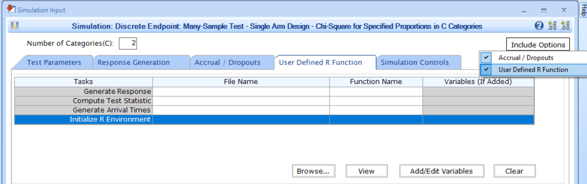
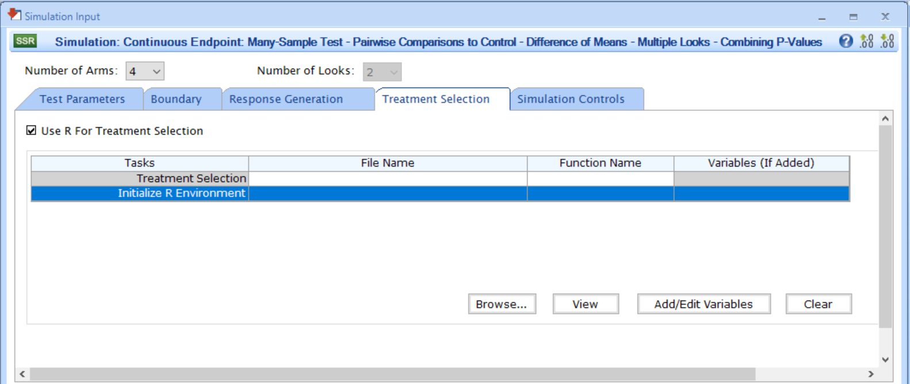

# Integration Point: Initialization

[$`\leftarrow`$ Go back to the *Getting Started: Overview*
page](https://Cytel-Inc.github.io/CyneRgy/articles/Overview.md)

## Description

The Initialization integration point allows you to specify an optional
function that will run before any other user-defined functions during
simulations. This function can serve various purposes, such as:

- Setting a seed for reproducibility in the R environment.
- Loading required R packages or libraries.
- Setting global variables.
- Setting the working directory.
- Sourcing an additional file.
- Performing other initial setup tasks.

## Availability

### East Horizon (Explore and Design)

This integration point is available in East Horizon for the following
study objectives and endpoint types:

|  | Time to Event | Time to Event with Stratification | Binary | Continuous | Continuous with Repeated Measures | Count | Composite | Categorical | Dual TTE-TTE | Dual TTE-Binary |  |
|----|----|----|----|----|----|----|----|----|----|----|----|
| Dose Escalation | \- | \- | ❌ | \- | \- | \- | \- | \- | \- | \- |  |
| Dose Finding | \- | \- | ❌ | ❌ | \- | \- | \- | \- | \- | \- |  |
| Multiple Arm Confirmatory | ❌ | \- | ✅ | ✅ | \- | \- | \- | \- | \- | \- |  |
| One Arm Exploratory / Confirmatory | ❌ | \- | ❌ | ❌ | \- | ❌ | \- | ❌ | \- | \- |  |
| Two Arm Confirmatory | ✅ | ✅ | ✅ | ✅ | ✅ | ❌ | ❌ | \- | ✅ | ✅ |  |
| Two Arm Confirmatory - Multiple Endpoints | ❌ | \- | ❌ | ❌ | \- | \- | \- | \- | \- | \- |  |

### East

This integration point is available in East for the following tests
(click to expand/collapse):

| Test | Number of Samples | Endpoint | Availability |
|----|----|----|----|
| Difference of Means (Parallel Design) | Two Samples | Continuous | ✅ |
| Difference of Proportions (Parallel Design) | Two Samples | Discrete | ✅ |
| Ratio of Proportions (Parallel Design) | Two Samples | Discrete | ✅ |
| Odds Ratio of Proportions (Parallel Design) | Two Samples | Discrete | ✅ |
| Logrank Test Given Accrual Duration and Accrual Rates (Parallel Design) | Two Samples | Survival | ✅ |
| Logrank Test Given Accrual Duration and Study Duration (Parallel Design) | Two Samples | Survival | ✅ |
| Chi-Square for Specified Proportions in C Categories (Single Arm Design) | Many Samples | Discrete | ✅ |
| Two Group Chi-Square for Proportions in C Categories (Parallel Design) | Many Samples | Discrete | ✅ |
| Multiple Looks - Combining P-Values (Pairwise Comparisons to Control - Difference of Means) | Many Samples | Continuous | ✅ |
| Multiple Looks - Combining P-Values (Multiple Pairwise Comparisons to Control - Difference of Proportions) | Many Samples | Discrete | ✅ |
| Multiple Looks - Combining P-Values (Pairwise Comparisons to Control - Logrank Test) | Many Samples | Survival | ✅ |

## Instructions

### In East Horizon (Explore and Design)

You can set up an initialization function when **creating a new
project** by navigating to the **Initialize R Simulations** option under
the **Plan** section.

Follow these steps (click to expand/collapse):

1.  Choose **Initialize R Simulations** in the **Plan** section when
    setting up a **new Project**.
2.  Turn on the switch to enable the feature.
3.  Browse and select the appropriate R file (`filename.r`) from your
    computer. This file should contain function(s) written to perform
    various tasks to be used throughout your Project.
4.  Specify the function name you want to initialize. If the expected
    function is not displaying, then check your R code for errors.
5.  Set any required user parameters (variables) as needed for your
    function using **+ Add Variables**.
6.  Continue creating your project.

For a visual guide of where to find the option, refer to the screenshot
below:

### In East

You can set up an initialization function by navigating to the
**Initialize R Environment** task of the **User Defined R Function** tab
of a **Simulation Input** window, after including the option. For some
tests, the option will be available in the **Treatment Selection** tab.

Follow these steps (click to expand/collapse):

1.  Choose the appropriate test in the **Design** tab.
2.  If you see the **Design Input** window, compute the scenario using
    the **Compute** button, save the design using the **Save in
    Workbook** button, then navigate to the **Simulation Input** window
    by clicking on the **Simulate Design** button under **Library**.
3.  Click on the **Include Options** button on the top right corner of
    the **Simulation Input** window and select both **Accrual /
    Dropouts** and **User Defined R Function**.
4.  In the tab **User Defined R Function**, a list of tasks will appear.
    Place your cursor in the **File Name** field for the task
    **Initialize R Environment**.
5.  Click on the button **Browse…** to select the appropriate R file
    (`filename.r`) from your computer. This file should contain
    function(s) written to perform various tasks to be used throughout
    your Project.
6.  Specify the function name you want to initialize. To copy the
    function’s name from the R script, click on the button **View**.
7.  Set any required user parameters (variables) as needed for your
    function using the button **Add/Edit Variables**.
8.  Continue setting up your project.

For a visual guide of where to find the option, refer to the screenshot
below:

For the **Multiple Looks - Combining P-Values (MAMS)** tests, the option
will be available when checking the box **Use R for Treatment
Selection** in the **Treatment Selection** tab of the **Simulation
Input** window. Refer to the screenshot below:

## Input Variables

When creating a custom R script, you can optionally use certain
variables provided by East Horizon’s or East’s engine itself. These
variables are automatically available and do not need to be set by the
user, except for the `UserParam` variable. Refer to the table below for
the variable that is available for this integration point.

| **Variable** | **Type** | **Description** |
|----|----|----|
| **Seed** | Integer | Randomization seed set by the engine. |
| **UserParam** | List | Contains all user-defined parameters specified in East Horizon’s or East’s interface (refer to the [Instructions](#instructions) section). To access these parameters in your R code, use the syntax: `UserParam$NameOfTheVariable`, replacing `NameOfTheVariable` with the appropriate parameter name. |

## Expected Output Variable

East Horizon expects an output of a specific type. Refer to the table
below for the expected output for this integration point:

[TABLE]

## Minimal Template

Your R script could contain a function such as this one, with a name of
your choice. All input variables must be declared, even if they are not
used in the script. We recommend always declaring `UserParam` as a
default `NULL` value in the function arguments, as this will ensure that
the same function will work regardless of whether the user has specified
any custom parameters in the interface.

A detailed template with step-by-step explanations is available here:
[Initialize.R](https://github.com/Cytel-Inc/CyneRgy/blob/main/inst/Templates/Initialize.R)

    Init <- function( Seed = NULL, UserParam = NULL )
    {
      # Do something, for example set the seed
      set.seed( 42 )
      # If you want the user to set the seed using East Horizon's or East's interface, you could use set.seed( UserParam$seed ) 
      
      # Error handling (no error)
      nError <- 0

      return( as.integer( nError ) )
    }

## Examples

Used to load libraries in the following examples:

1.  [**2-Arm, Normal Outcome, Repeated Measures - Patient
    Simulation**](https://Cytel-Inc.github.io/CyneRgy/articles/2ArmNormalRepeatedMeasuresResponseGeneration.md)
    - [LibraryMASS.R](https://github.com/Cytel-Inc/CyneRgy/blob/main/inst/Examples/2ArmNormalRepeatedMeasuresResponseGeneration/R/LibraryMASS.R)
    - [LibraryNlme.R](https://github.com/Cytel-Inc/CyneRgy/blob/main/inst/Examples/2ArmNormalRepeatedMeasuresResponseGeneration/R/LibraryNlme.R)
2.  [**2-Arm, Normal Outcome, Repeated Measures -
    Analysis**](https://Cytel-Inc.github.io/CyneRgy/articles/2ArmNormalRepeatedMeasuresAnalysis.md)
    - [LibraryRM.R](https://github.com/Cytel-Inc/CyneRgy/blob/main/inst/Examples/2ArmNormalRepeatedMeasuresAnalysis/R/LibraryRM.R)
3.  [**2-Arm, Time-To-Event Outcome -
    Analysis**](https://Cytel-Inc.github.io/CyneRgy/articles/2ArmTimeToEventOutcomeAnalysis.md)
    - [Librarysurvival.R](https://github.com/Cytel-Inc/CyneRgy/blob/main/inst/Examples/2ArmTimeToEventOutcomeAnalysis/R/Librarysurvival.R)
4.  [**Generate Patient Arrival Times with Poisson
    Process**](https://Cytel-Inc.github.io/CyneRgy/articles/GeneratePoissonArrival.md)
    - [Initialize.R](https://github.com/Cytel-Inc/CyneRgy/blob/main/inst/Examples/GeneratePoissonArrival/R/Initialize.R)
5.  [**2-Arm - Randomization of
    Subjects**](https://Cytel-Inc.github.io/CyneRgy/articles/RandomizeSubjects.md)
    - [LoadRandomizeR.R](https://github.com/Cytel-Inc/CyneRgy/blob/main/inst/Examples/RandomizeSubjects/R/LoadRandomizeR.R)
