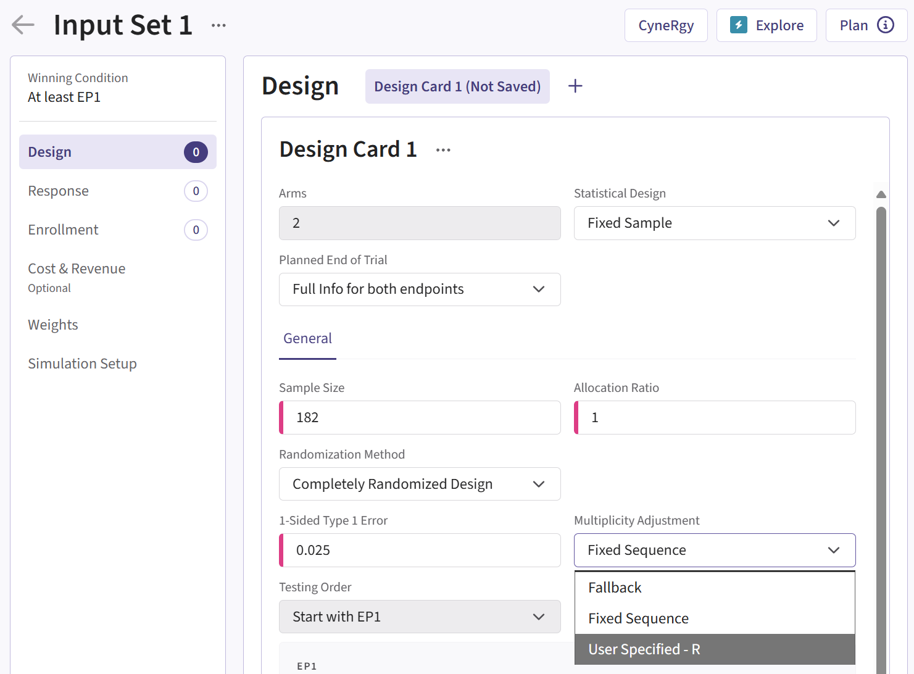

# Integration Point: Multiplicity Adjustment

[$`\leftarrow`$ Go back to the *Getting Started: Overview*
page](https://Cytel-Inc.github.io/CyneRgy/articles/Overview.md)

## Description

The Multiplicity Adjustment integration point allows you to customize
how multiple hypotheses are adjusted for Type I error control, instead
of relying on East Horizon’s default Fixed Sequence or Fallback methods.
For example, you could implement alternative strategies such as
Bonferroni, Holm, Hochberg, or graphical approaches.

## Availability

### East Horizon Explore

This integration point is available in East Horizon Explore for the
following study objectives and endpoint types:

|  | Time to Event | Binary | Continuous | Continuous with repeated measures | Count | Composite | Dual TTE-TTE | Dual TTE-Binary |
|----|----|----|----|----|----|----|----|----|
| Two Arm Confirmatory | ❌ | ❌ | ❌ | ❌ | ❌ | ❌ | ✅ | ✅ |
| Multiple Arm Confirmatory | ❌ | ❌ | ❌ | \- | \- | \- | \- | \- |
| Dose Finding | \- | \- | ❌ | \- | \- | \- | \- | \- |

**Legend**

| Icon | Meaning       |
|------|---------------|
| ✅   | Available     |
| ❌   | Not available |
| 🔜   | Coming soon   |

### East Horizon Design

Click to expand/collapse

This integration point is available in East Horizon Design for the
following study objectives and endpoint types:

|  | Time to Event | Binary | Continuous | Continuous with repeated measures | Count | Composite | Dual TTE-TTE | Dual TTE-Binary |
|----|----|----|----|----|----|----|----|----|
| Two Arm Confirmatory | ❌ | ❌ | ❌ | ❌ | ❌ | ❌ | 🔜 | 🔜 |
| Two Arm Confirmatory - Multiple Endpoints | ❌\* | ❌\* | ❌\* | \- | \- | \- | \- | \- |
| Multiple Arm Confirmatory | ❌ | ❌ | ❌ | \- | \- | \- | \- | \- |
| Dose Finding | \- | \- | ❌ | \- | \- | \- | \- | \- |

\*For Multiple Endpoints, you can use the [Integration Point:
Design](https://Cytel-Inc.github.io/CyneRgy/articles/IntegrationPointDesign.md)
to implement your own multiplicity method.

This integration point is available in East Horizon Design for the
following tests:

| Test | Study Objective | Endpoint | Availability |
|----|----|----|----|
| Single Mean (One Arm Design) | One Arm Exploratory/Confirmatory | Continuous | ❌ |
| Mean of Paired Differences (Paired Design) | One Arm Exploratory/Confirmatory | Continuous | ❌ |
| Mean of paired Ratios (Paired Design) | One Arm Exploratory/Confirmatory | Continuous | ❌ |
| Single Proportion (One Arm Design) | One Arm Exploratory/Confirmatory | Binary | ❌ |
| Simon’s Two Stage (One Arm Design) | One Arm Exploratory/Confirmatory | Binary | ❌ |
| Logrank Weibull Distribution (One Arm Design) | One Arm Exploratory/Confirmatory | Time to Event | ❌ |
| Parametric Weibull Distribution (One Arm Design) | One Arm Exploratory/Confirmatory | Time to Event | ❌ |
| Logrank Exponential Distribution (One Arm Design) | One Arm Exploratory/Confirmatory | Time to Event | ❌ |
| Single Poisson Rate (One Arm Design) | One Arm Exploratory/Confirmatory | Count | ❌ |
| Difference of Means (Parallel Design) | Two Arm Confirmatory | Continuous | ❌ |
| Ratio of Means (Parallel Design) | Two Arm Confirmatory | Continuous | ❌ |
| Difference of Means (Crossover Design) | Two Arm Confirmatory | Continuous | ❌ |
| Ratio of Means (Crossover Design) | Two Arm Confirmatory | Continuous | ❌ |
| Difference of Proportions (Parallel Design) | Two Arm Confirmatory | Binary | ❌ |
| Ratio of Proportions (Parallel Design) | Two Arm Confirmatory | Binary | ❌ |
| Odds Ratio of Proportions (Parallel Design) | Two Arm Confirmatory | Binary | ❌ |
| Fisher’s Exact (Parallel Design) | Two Arm Confirmatory | Binary | ❌ |
| Logrank Test Given Accrual Duration and Accrual Rates (Parallel Design) | Two Arm Confirmatory | Time to Event | ❌ |
| Logrank Test Given Accrual Duration and Study Duration (Parallel Design) | Two Arm Confirmatory | Time to Event | ❌ |
| Logrank Test Given Accrual Duration and Accrual Rates (Population Enrichment) | Two Arm Confirmatory | Time to Event | ❌ |
| Ratio of Poisson Rates (Parallel Design) | Two Arm Confirmatory | Count | ❌ |
| Ratio of Negative Binomial Rates (Parallel Design) | Two Arm Confirmatory | Count | ❌ |
| Win Ratio (Parallel Design) | Two Arm Confirmatory | Composite | ❌ |
| MAMS Difference of Means (Pairwise Comparisons to Control) | Multiple Arm Confirmatory | Continuous | ❌ |
| MAMS Difference of Means: Combining P-Values (Pairwise Comparisons to Control) | Multiple Arm Confirmatory | Continuous | ❌ |
| MAMS Difference of Proportions (Pairwise Comparisons to Control) | Multiple Arm Confirmatory | Binary | ❌ |
| MAMS Difference of Proportions: Combining P-Values (Pairwise Comparisons to Control) | Multiple Arm Confirmatory | Binary | ❌ |
| MAMS Logrank (Pairwise Comparisons to Control) | Multiple Arm Confirmatory | Time to Event | ❌ |
| MAMS Logrank: Combining P-Values (Pairwise Comparisons to Control) | Multiple Arm Confirmatory | Time to Event | ❌ |

## Instructions

### In East Horizon Explore

You can set up a multiplicity adjustment function under **Multiplicity
Adjustment** in a **Design Card** while creating or editing an **Input
Set**.

Follow these steps (click to expand/collapse):

1.  Select **User Specified-R** from the dropdown in the **Multiplicity
    Adjustment** field in the **Design Card**.
2.  Browse and select the appropriate R file (`filename.r`) from your
    computer, or use the built-in **R Code Assistant** to create one.
    This file should contain function(s) written to perform various
    tasks to be used throughout your Project.
3.  Choose the appropriate function name. If the expected function is
    not displaying, then check your R code for errors.
4.  Set any required user parameters (variables) as needed for your
    function using **+ Add Variables**.
5.  Continue creating your project by specifying scenarios for patient
    Response, Enrollments, etc.

For a visual guide of where to find the option, refer to the screenshot
below:

## Input Variables

When creating a custom R script, you can optionally use specific
variables provided by East Horizon’s engine itself. These variables are
automatically available and do not need to be set by the user, except
for the `UserParam` variable. Refer to the table below for the variables
that are available for this integration point, outcome, and study
objective.

| **Variable** | **Type** | **Description** |
|----|----|----|
| **SimData** | Data Frame | Subject data generated in current simulation, one row per subject. To access these variables in your R code, use the syntax: `SimData$NameOfTheVariable`, replacing `NameOfTheVariable` with the appropriate variable name. See below for more information. |
| **DesignParam** | List | Input parameters which may be needed to compute test statistics and perform tests. To access these variables in your R code, use the syntax: `DesignParam$NameOfTheVariable`, replacing `NameOfTheVariable` with the appropriate variable name. See below for more information. |
| **LookInfo** | List | Input parameters related to multiple looks. Empty when `Statistical Design = Fixed Sample`, but still mandatory in the functions [`CyneRgy::GetDecisionString`](https://Cytel-Inc.github.io/CyneRgy/reference/GetDecisionString.md) and [`CyneRgy::GetDecision`](https://Cytel-Inc.github.io/CyneRgy/reference/GetDecision.md). See below for more information. |
| **TestStat** | Named List of Numeric | Named List of length equal to the number of endpoints, indicating the value of the test statistic on Wald ﴾Z﴿ scale for each endpoint. For example, `TestStat[“Endpoint 1”]` is the test statistic for Endpoint 1. This is returned by the Analysis part. |
| **OutList** | List | List of outputs that was returned in the previous look. Only relevant for `Statistical Design = Group Sequential`. Set to `NULL` for the first look. See below in the Output Variable. |
| **UserParam** | List | Contains all user-defined parameters specified in the East Horizon interface (refer to the [Instructions](https://Cytel-Inc.github.io/CyneRgy/articles/IntegrationPointAnalysis.html#instructions) section). To access these parameters in your R code, use the syntax: `UserParam$NameOfTheVariable`, replacing `NameOfTheVariable` with the appropriate parameter name. |

**Note:** “Endpoint 1” is used as a sample endpoint name. It will be the
actual endpoint name as specified by the user.

### Variables of SimData

[Click here to explore the variables of
SimData.](https://Cytel-Inc.github.io/CyneRgy/articles/VariablesOfSimData.md)

### Variables of DesignParam

[Click here to explore the variables of
DesignParam.](https://Cytel-Inc.github.io/CyneRgy/articles/VariablesOfDesignParam.md)

### Variables of LookInfo

[Click here to explore the variables of
LookInfo.](https://Cytel-Inc.github.io/CyneRgy/articles/VariablesOfLookInfo.md)

## Expected Output Variable

East Horizon expects an output of a specific type. Refer to the table
below for the expected output for this integration point:

[TABLE]

## Minimal Template

Your R script could contain a function such as this one, with a name of
your choice. All input variables must be declared, even if they are not
used in the script. We recommend always declaring `UserParam` and
`OutList` as a default `NULL` value in the function arguments, as this
will ensure that the same function will work regardless of whether the
user has specified any custom parameters in the interface and whether or
not `OutList` is used.

A detailed template with step-by-step explanations is available here:
[Decision.DEP.R](https://github.com/Cytel-Inc/CyneRgy/blob/main/inst/Templates/Decision.DEP.R)

### For `Statistical Design = Fixed Sample`

    PerformMultAdj <- function( SimData, DesignParam, TestStat, OutList = NULL, UserParam = NULL )
    {
        nError  = 0 # Error handling (no error)
        
        Decision = list()
        Decision[ EndpointName[[ 1 ]]] = 0 # Initialize decision for endpoint 1
        Decision[ EndpointName[[ 2 ]]] = 0 # Initialize decision for endpoint 2
        
        # Write the actual code here.
        
        return( list( Decision = as.list( Decision ), ErrorCode = as.integer( nError )))
    }

### For `Statistical Design = Group Sequential`

    PerformMultAdj <- function( SimData, DesignParam, LookInfo, TestStat, OutList = NULL, UserParam = NULL )
    {
        nError  = 0 # Error handling (no error)
        
        Decision = list()
        Decision[ EndpointName[[ 1 ]]] = 0 # Initialize decision for endpoint 1
        Decision[ EndpointName[[ 2 ]]] = 0 # Initialize decision for endpoint 2
        
        OutList = list()
        OutList$OutVal = 0 # This value will be passed to the next look
        
        # Write the actual code here.
        
        return( list( Decision = as.list( Decision ), OutList = as.list( OutList ), ErrorCode = as.integer( nError )))
    }

## Examples

Explore the following examples for more context:

1.  [**Dual Endpoints - Multiplicity
    Adjustment**](https://Cytel-Inc.github.io/CyneRgy/articles/DEPDecisionsUsingMCP.md)
    - [GetDEPDecisions.R](https://github.com/Cytel-Inc/CyneRgy/blob/main/inst/Examples/DEPDecisionsUsingMCP/R/GetDEPDecisionsFSD.R)
