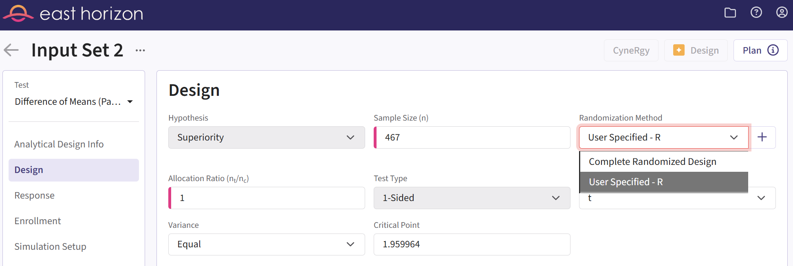
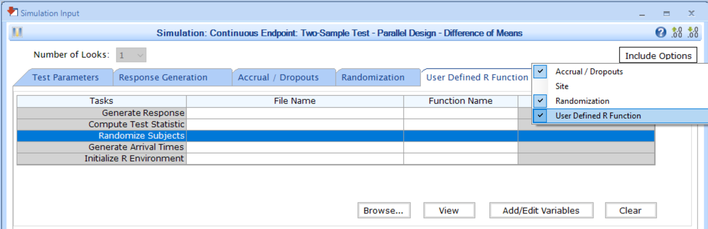

# Integration Point: Randomization

[$`\leftarrow`$ Go back to the *Getting Started: Overview*
page](https://Cytel-Inc.github.io/CyneRgy/articles/Overview.md)

## Description

The Randomization integration point allows you to incorporate custom
randomization methods into Cytel products. By specifying a function, you
can control how subjects are assigned to designated arms based on your
specific requirements, replacing the default complete randomization
approach. For example, you can implement advanced randomization
techniques such as block randomization, stratified randomization, or
cluster randomization.

## Availability

### East Horizon Explore

This integration point is available in East Horizon Explore for the
following study objective and endpoint type combinations:

|  | Time to Event | Binary | Continuous | Continuous with repeated measures | Count | Composite | Dual TTE-TTE | Dual TTE-Binary |
|----|----|----|----|----|----|----|----|----|
| Two Arm Confirmatory | ✅ | ✅ | ✅ | ✅ | ❌ | ❌ | ✅ | ✅ |
| Multiple Arm Confirmatory | 🔜 | ✅ | ✅ | \- | \- | \- | \- | \- |
| Dose Finding | \- | \- | ❌ | \- | \- | \- | \- | \- |

**Legend**

| Icon | Meaning                    |
|------|----------------------------|
| ✅   | Available                  |
| ❌   | Not available              |
| 🔜   | Coming soon                |
| \-   | Combination does not exist |

### East Horizon Design

This integration point is available in East Horizon Design for the
following tests (click to expand/collapse):

This integration point is available in East Horizon Design for the
following study objective and endpoint type combinations:

|  | Time to Event | Binary | Continuous | Continuous with repeated measures | Count | Composite | Dual TTE-TTE | Dual TTE-Binary |
|----|----|----|----|----|----|----|----|----|
| Two Arm Confirmatory | ✅ | ✅ | ✅ | ✅ | ❌ | ❌ | 🔜 | 🔜 |
| Two Arm Confirmatory - Multiple Endpoints | ❌ | ❌ | ❌ | \- | \- | \- | \- | \- |
| Multiple Arm Confirmatory | 🔜 | 🔜 | 🔜 | \- | \- | \- | \- | \- |
| Dose Finding | \- | \- | ❌ | \- | \- | \- | \- | \- |

This integration point is available in East Horizon Design for the
following tests:

| Test | Study Objective | Endpoint | Availability |
|----|----|----|----|
| Single Mean (One Arm Design) | One Arm Exploratory/Confirmatory | Continuous | ❌ |
| Mean of Paired Differences (Paired Design) | One Arm Exploratory/Confirmatory | Continuous | ❌ |
| Mean of paired Ratios (Paired Design) | One Arm Exploratory/Confirmatory | Continuous | ❌ |
| Single Proportion (One Arm Design) | One Arm Exploratory/Confirmatory | Binary | ❌ |
| Simon’s Two Stage (One Arm Design) | One Arm Exploratory/Confirmatory | Binary | ❌ |
| Logrank Weibull Distribution (One Arm Design) | One Arm Exploratory/Confirmatory | Time to Event | ❌ |
| Parametric Weibull Distribution (One Arm Design) | One Arm Exploratory/Confirmatory | Time to Event | ❌ |
| Logrank Exponential Distribution (One Arm Design) | One Arm Exploratory/Confirmatory | Time to Event | ❌ |
| Single Poisson Rate (One Arm Design) | One Arm Exploratory/Confirmatory | Count | ❌ |
| Difference of Means (Parallel Design) | Two Arm Confirmatory | Continuous | ✅ |
| Ratio of Means (Parallel Design) | Two Arm Confirmatory | Continuous | ❌ |
| Difference of Means (Crossover Design) | Two Arm Confirmatory | Continuous | ❌ |
| Ratio of Means (Crossover Design) | Two Arm Confirmatory | Continuous | ❌ |
| Difference of Proportions (Parallel Design) | Two Arm Confirmatory | Binary | ✅ |
| Ratio of Proportions (Parallel Design) | Two Arm Confirmatory | Binary | ✅ |
| Odds Ratio of Proportions (Parallel Design) | Two Arm Confirmatory | Binary | ✅ |
| Fisher’s Exact (Parallel Design) | Two Arm Confirmatory | Binary | ❌ |
| Logrank Test Given Accrual Duration and Accrual Rates (Parallel Design) | Two Arm Confirmatory | Time to Event | ✅ |
| Logrank Test Given Accrual Duration and Study Duration (Parallel Design) | Two Arm Confirmatory | Time to Event | ✅ |
| Logrank Test Given Accrual Duration and Accrual Rates (Population Enrichment) | Two Arm Confirmatory | Time to Event | ❌ |
| Ratio of Poisson Rates (Parallel Design) | Two Arm Confirmatory | Count | ❌ |
| Ratio of Negative Binomial Rates (Parallel Design) | Two Arm Confirmatory | Count | ❌ |
| Win Ratio (Parallel Design) | Two Arm Confirmatory | Composite | ❌ |
| MAMS Difference of Means (Pairwise Comparisons to Control) | Multiple Arm Confirmatory | Continuous | 🔜 |
| MAMS Difference of Means: Combining P-Values (Pairwise Comparisons to Control) | Multiple Arm Confirmatory | Continuous | 🔜 |
| MAMS Difference of Proportions (Pairwise Comparisons to Control) | Multiple Arm Confirmatory | Binary | 🔜 |
| MAMS Difference of Proportions: Combining P-Values (Pairwise Comparisons to Control) | Multiple Arm Confirmatory | Binary | 🔜 |
| MAMS Logrank (Pairwise Comparisons to Control) | Multiple Arm Confirmatory | Time to Event | 🔜 |
| MAMS Logrank: Combining P-Values (Pairwise Comparisons to Control) | Multiple Arm Confirmatory | Time to Event | 🔜 |

### East

This integration point is available in East for the following tests
(click to expand/collapse):

| Test | Number of Samples | Endpoint | Availability |
|----|----|----|----|
| Difference of Means (Parallel Design) | Two Samples | Continuous | ✅ |
| Difference of Proportions (Parallel Design) | Two Samples | Discrete | ✅ |
| Ratio of Proportions (Parallel Design) | Two Samples | Discrete | ✅ |
| Odds Ratio of Proportions (Parallel Design) | Two Samples | Discrete | ✅ |
| Logrank Test Given Accrual Duration and Accrual Rates (Parallel Design) | Two Samples | Survival | ✅ |
| Logrank Test Given Accrual Duration and Study Duration (Parallel Design) | Two Samples | Survival | ✅ |
| Chi-Square for Specified Proportions in C Categories (Single Arm Design) | Many Samples | Discrete | ❌ |
| Two Group Chi-Square for Proportions in C Categories (Parallel Design) | Many Samples | Discrete | ❌ |
| Multiple Looks - Combining P-Values (Pairwise Comparisons to Control - Difference of Means) | Many Samples | Continuous | ❌ |
| Multiple Looks - Combining P-Values (Multiple Pairwise Comparisons to Control - Difference of Proportions) | Many Samples | Discrete | ❌ |
| Multiple Looks - Combining P-Values (Pairwise Comparisons to Control - Logrank Test) | Many Samples | Survival | ❌ |

## Instructions

### In East Horizon Explore

You can set up a randomization function under **Randomization Method**
in a **Design Card** while creating or editing an **Input Set**.

Follow these steps (click to expand/collapse):

1.  Select **User Specified-R** from the dropdown in the **Randomization
    Method** field in the **Design Card**.
2.  Browse and select the appropriate R file (`filename.r`) from your
    computer, or use the built-in **R Code Assistant** to create one.
    This file should contain function(s) written to perform various
    tasks to be used throughout your Project.
3.  Choose the appropriate function name. If the expected function is
    not displaying, then check your R code for errors.
4.  Set any required user parameters (variables) as needed for your
    function using **+ Add Variables**.
5.  Continue creating your project by specifying scenarios for patient
    Response, Enrollments, etc.

For a visual guide of where to find the option, refer to the screenshot
below:

### In East Horizon Design

You can set up a randomization function under **Randomization Method**
in the **Design** section of an **Input Set** created by simulation.

Follow these steps (click to expand/collapse):

1.  Create and compute a first **analytical design input set**.
2.  Navigate to the Results section and **simulate** the analytical
    design.
3.  Navigate to the new **simulation input set** that was created.
4.  Select **User Specified-R** from the dropdown in the **Randomization
    Method** field in the **Design** tab.
5.  Browse and select the appropriate R file (`filename.r`) from your
    computer, or use the built-in **R Code Assistant** to create one.
    This file should contain function(s) written to perform various
    tasks to be used throughout your Project.
6.  Choose the appropriate function name. If the expected function is
    not displaying, then check your R code for errors.
7.  Set any required user parameters (variables) as needed for your
    function using **+ Add Variables**.
8.  Continue creating your project.

For a visual guide of where to find the option, refer to the screenshot
below:

### In East

You can set up a randomization function in East by navigating to the
**Randomize Subjects** task of the **User Defined R Function** tab of a
**Simulation Input** window, after including the option.

Follow these steps (click to expand/collapse):

1.  Choose the appropriate test in the **Design** tab.
2.  If you see the **Design Input** window, compute the scenario using
    the **Compute** button, save the design using the **Save in
    Workbook** button, then navigate to the **Simulation Input** window
    by clicking on the **Simulate Design** button under **Library**.
3.  Click on the **Include Options** button on the top right corner of
    the **Simulation Input** window and select both **Accrual /
    Dropouts** and **User Defined R Function**.
4.  In the tab **User Defined R Function**, a list of tasks will appear.
    Place your cursor in the **File Name** field for the task
    **Randomize Subjects**.
5.  Click on the button **Browse…** to select the appropriate R file
    (`filename.r`) from your computer. This file should contain
    function(s) written to perform various tasks to be used throughout
    your Project.
6.  Specify the function name you want to initialize. To copy the
    function’s name from the R script, click on the button **View**.
7.  Set any required user parameters (variables) as needed for your
    function using the button **Add/Edit Variables**.
8.  Continue setting up your project.

For a visual guide of where to find the option, refer to the screenshot
below:

## Input Variables

When creating a custom R script, you can optionally use certain
variables provided by East Horizon’s or East’s engine itself. These
variables are automatically available and do not need to be set by the
user, except for the `UserParam` variable. Refer to the table below for
the variable that is available for this integration point.

| **Variable** | **Type** | **Description** |
|----|----|----|
| **NumSub** | Integer | Number of subjects in the trial. |
| **NumArms** | Integer | Number of arms in the trial ﴾including placebo/control, and experimental﴿. |
| **AllocRatio** | Vector of Numeric | Vector of length `NumArm - 1`, indicating the expected allocation ratios for each treatment arm relative to the control arm ($`n_{t_i}/n_c`$). |
| **UserParam** | List | Contains all user-defined parameters specified in East Horizon’s or East’s interface (refer to the [Instructions](#instructions) section). To access these parameters in your R code, use the syntax: `UserParam$NameOfTheVariable`, replacing `NameOfTheVariable` with the appropriate parameter name. |

## Expected Output Variable

East Horizon expects an output of a specific type. Refer to the table
below for the expected output for this integration point:

| **Type** | **Description**                                        |
|----------|--------------------------------------------------------|
| List     | A named list containing `TreatmentID` and `ErrorCode`. |

### Expected Members of the Output List

[TABLE]

Note: Additional custom variables can be included as members of the
output list. All outputs will automatically be available as input
variables for analysis or treatment selection endpoints in the `SimData`
variable as described here: [Variables of
SimData](https://Cytel-Inc.github.io/CyneRgy/articles/VariablesOfSimData.md).

## Minimal Template

Your R script could contain a function such as this one, with a name of
your choice. All input variables must be declared, even if they are not
used in the script. We recommend always declaring `UserParam` as a
default `NULL` value in the function arguments, as this will ensure that
the same function will work regardless of whether the user has specified
any custom parameters in the interface.

A detailed template with step-by-step explanations is available here:
[Randomization.R](https://github.com/Cytel-Inc/CyneRgy/blob/main/inst/Templates/Randomization.R)

    Randomize <- function( NumSub, NumArms, AllocRatio, UserParam = NULL )
    {
      nError                <- 0 # Error handling (no error)
      vTreatmentArmIndex    <- rep( 0, NumSub ) # Initializing response array to 0: in that case all patients are in the control group
      
      # Write the actual code here.
      # Store the generated allocation indices in a vector called vTreatmentArmIndex.

      return( list( TreatmentID = as.Integer( vTreatmentArmIndex ), ErrorCode = as.integer( nError ) ) )
    }

## Examples

Explore the following examples for more context:

1.  [**Randomization of
    Subjects**](https://Cytel-Inc.github.io/CyneRgy/articles/RandomizeSubjects.md)
    - [RandomizationSubjectsUsingUniformDistribution.R](https://github.com/Cytel-Inc/CyneRgy/blob/main/inst/Examples/RandomizeSubjects/R/RandomizationSubjectsUsingUniformDistribution.R)
    - [RandomizationSubjectsUsingSampleFunctionInR.R](https://github.com/Cytel-Inc/CyneRgy/blob/main/inst/Examples/RandomizeSubjects/R/RandomizationSubjectsUsingSampleFunctionInR.R)
    - [BlockRandomizationSubjectsUsingRPackage.R](https://github.com/Cytel-Inc/CyneRgy/blob/main/inst/Examples/RandomizeSubjects/R/BlockRandomizationSubjectsUsingRPackage.R)
    - [RandomizeSubjectsAcrossMultipleArms.R](https://github.com/Cytel-Inc/CyneRgy/blob/main/inst/Examples/RandomizeSubjects/R/RandomizeSubjectsAcrossMultipleArms.R)
