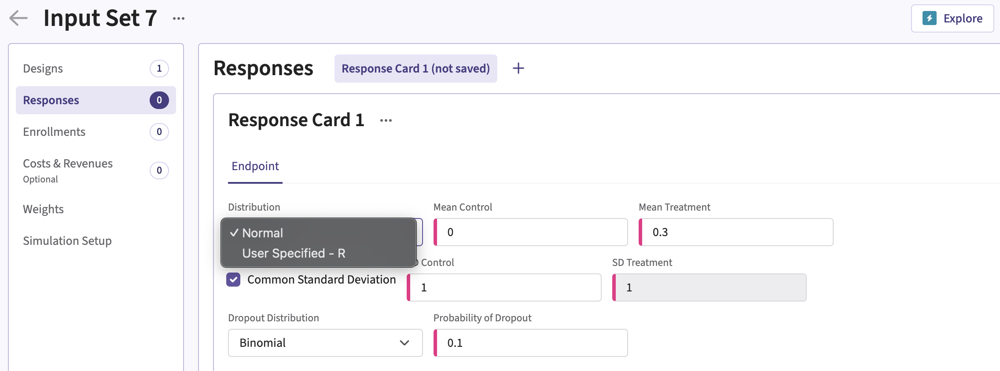
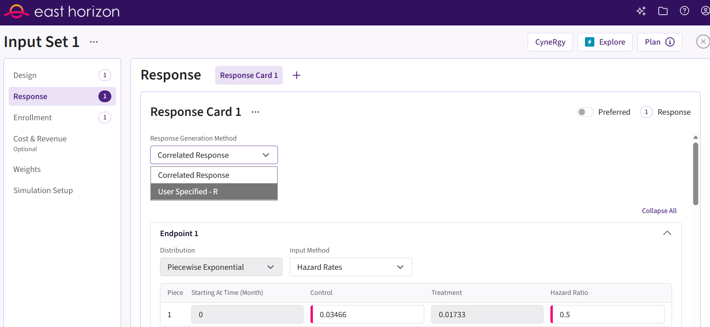
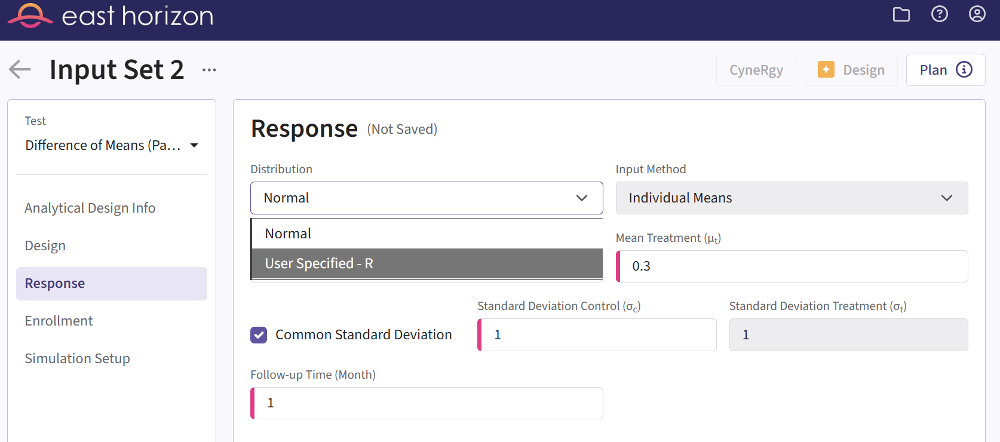
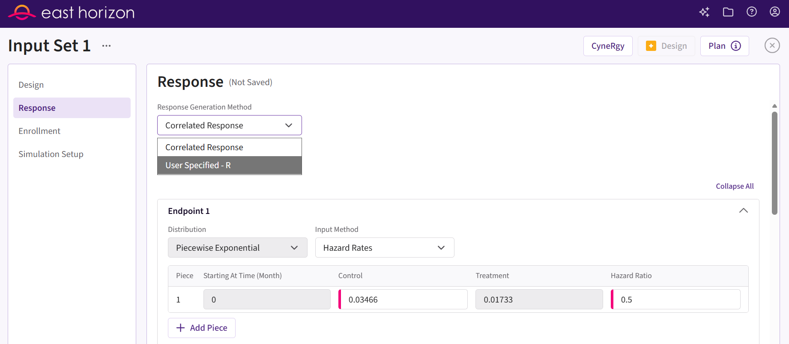
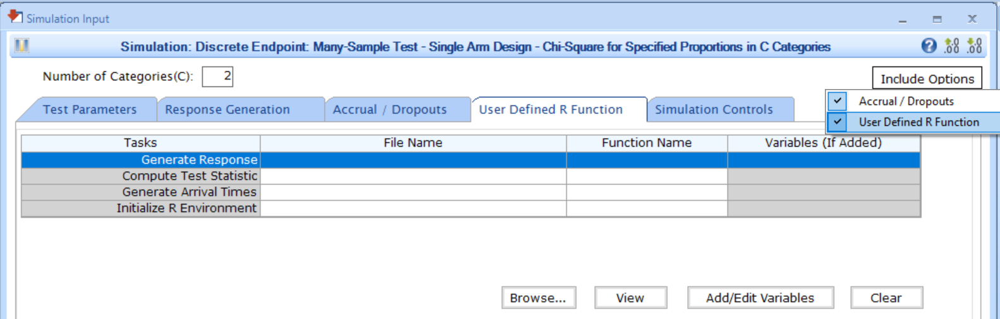

# Integration Point: Response

[$`\leftarrow`$ Go back to the *Getting Started: Overview*
page](https://Cytel-Inc.github.io/CyneRgy/articles/Overview.md)

## Description

The Response integration point allows you to incorporate custom patient
outcome simulation capabilities into East Horizon. By specifying a
function, you can simulate patient outcomes according to your
requirements, replacing the native generation method for patient
response. For example, you can:

- Simulate patient data using a mixture distribution where a proportion
  of patients do not respond to treatment.
- Simulate patient data from a statistical distribution not natively
  supported by East Horizon, such as:
  - Gamma distribution for continuous outcomes,
  - Beta distribution for binary outcomes,
  - Weibull distribution for time-to-event outcomes.

## Availability

Note: This integration point is compatible with Sample Size
Re-Estimation (standard templates and examples are compatible) and
Stratification/Subpopulations (distinct templates and examples were
created for Stratification and are compatible with Subpopulations).

### East Horizon Explore

This integration point is available in East Horizon Explore for the
following study objectives and endpoint types:

|  | Time to Event | Time to Event with Stratification | Binary | Continuous | Continuous with Repeated Measures | Count | Composite | Categorical | Dual TTE-TTE | Dual TTE-Binary |  |
|----|----|----|----|----|----|----|----|----|----|----|----|
| Dose Escalation | \- | \- | \- | \- | \- | \- | \- | \- | \- | \- |  |
| Dose Finding | \- | \- | \- | ❌ | \- | \- | \- | \- | \- | \- |  |
| Multiple Arm Confirmatory | ❌ | \- | ✅ | ✅ | \- | \- | \- | \- | \- | \- |  |
| One Arm Exploratory / Confirmatory | \- | \- | \- | \- | \- | \- | \- | \- | \- | \- |  |
| Two Arm Confirmatory | ✅ | ✅ | ✅ | ✅ | ✅ | ❌ | \- | \- | ✅ | ✅ |  |
| Two Arm Confirmatory - Multiple Endpoints | ✅ | \- | ✅ | ✅ | \- | \- | \- | \- | \- | \- |  |

### East Horizon Design

This integration point is available in East Horizon Design for the
following study objectives and endpoint types (click to
expand/collapse):

|  | Time to Event | Time to Event with Stratification | Binary | Continuous | Continuous with repeated measures | Count | Composite | Categorical | Dual TTE-TTE | Dual TTE-Binary |
|----|----|----|----|----|----|----|----|----|----|----|
| Dose Escalation | \- | \- | ❌ | \- | \- | \- | \- | \- | \- | \- |
| Dose Finding | \- | \- | ❌ | ❌ | \- | \- | \- | \- | \- | \- |
| Multiple Arm Confirmatory | ✅† | \- | ✅† | ✅† | \- | \- | \- | \- | \- | \- |
| One Arm Exploratory / Confirmatory | ❌ | \- | ❌ | ❌ | \- | ❌ | \- | ❌ | \- | \- |
| Two Arm Confirmatory | ✅† | ✅† | ✅† | ✅† | \- | ❌ | ❌ | \- | ❌ | ❌ |
| Two Arm Confirmatory - Multiple Endpoints | ✅ | \- | ✅ | ✅ | \- | \- | \- | \- | \- |  |

†Not every test will be available for this study objective and endpoint
type. The availability will depend on the specific test you choose:

| Test | Study Objective | Endpoint | Availability |
|----|----|----|----|
| Logrank Test Given Accrual Duration and Accrual Rates (Parallel Design) | Two Arm Confirmatory | Time to Event | ✅ |
| Logrank Test Given Accrual Duration and Study Duration (Parallel Design) | Two Arm Confirmatory | Time to Event | ✅ |
| Logrank Test Given Accrual Duration and Accrual Rates (Population Enrichment) | Two Arm Confirmatory | Time to Event | ❌ |
| Difference of Proportions (Parallel Design) | Two Arm Confirmatory | Binary | ✅ |
| Ratio of Proportions (Parallel Design) | Two Arm Confirmatory | Binary | ✅ |
| Odds Ratio of Proportions (Parallel Design) | Two Arm Confirmatory | Binary | ✅ |
| Fisher’s Exact (Parallel Design) | Two Arm Confirmatory | Binary | ❌ |
| Difference of Means (Parallel Design) | Two Arm Confirmatory | Continuous | ✅ |
| Ratio of Means (Parallel Design) | Two Arm Confirmatory | Continuous | ❌ |
| Difference of Means (Crossover Design) | Two Arm Confirmatory | Continuous | ❌ |
| Ratio of Means (Crossover Design) | Two Arm Confirmatory | Continuous | ❌ |
| MAMS Logrank: Combining P-Values (Pairwise Comparisons to Control) | Multiple Arm Confirmatory | Time to Event | ✅ |
| MAMS Difference of Proportions (Pairwise Comparisons to Control) | Multiple Arm Confirmatory | Binary | ❌ |
| MAMS Difference of Proportions: Combining P-Values (Pairwise Comparisons to Control) | Multiple Arm Confirmatory | Binary | ✅ |
| MAMS Difference of Means (Pairwise Comparisons to Control) | Multiple Arm Confirmatory | Continuous | ❌ |
| MAMS Difference of Means: Combining P-Values (Pairwise Comparisons to Control) | Multiple Arm Confirmatory | Continuous | ✅ |

Important: for some tests, you may need to compute the analytical design
input set before simulating the design to see the option.

### East

This integration point is available in East for the following tests
(click to expand/collapse):

| Test | Number of Samples | Endpoint | Availability |
|----|----|----|----|
| Difference of Means (Parallel Design) | Two Samples | Continuous | ✅ |
| Difference of Proportions (Parallel Design) | Two Samples | Discrete | ✅ |
| Ratio of Proportions (Parallel Design) | Two Samples | Discrete | ✅ |
| Odds Ratio of Proportions (Parallel Design) | Two Samples | Discrete | ✅ |
| Logrank Test Given Accrual Duration and Accrual Rates (Parallel Design) | Two Samples | Survival | ✅ |
| Logrank Test Given Accrual Duration and Study Duration (Parallel Design) | Two Samples | Survival | ✅ |
| Chi-Square for Specified Proportions in C Categories (Single Arm Design) | Many Samples | Discrete | ✅ |
| Two Group Chi-Square for Proportions in C Categories (Parallel Design) | Many Samples | Discrete | ✅ |
| Multiple Looks - Combining P-Values (Pairwise Comparisons to Control - Difference of Means) | Many Samples | Continuous | ❌ |
| Multiple Looks - Combining P-Values (Multiple Pairwise Comparisons to Control - Difference of Proportions) | Many Samples | Discrete | ❌ |
| Multiple Looks - Combining P-Values (Pairwise Comparisons to Control - Logrank Test) | Many Samples | Survival | ❌ |

## Instructions

### In East Horizon Explore

You can set up a response function under **Distribution** in a
**Response Card** while creating or editing an **Input Set**.

Follow these steps (click to expand/collapse):

1.  Select **User Specified-R** from the dropdown in the
    **Distribution** field in the **Response Card**. For Dual Endpoints,
    it will be under **Response Generation Method**.
2.  Browse and select the appropriate R file (`filename.r`) from your
    computer, or use the built-in **R Code Assistant** to create one.
    This file should contain function(s) written to perform various
    tasks to be used throughout your Project.
3.  Choose the appropriate function name. If the expected function is
    not displaying, then check your R code for errors.
4.  Set any required user parameters (variables) as needed for your
    function using **+ Add Variables**.
5.  Continue creating your project.

For a visual guide of where to find the option, refer to the screenshot
below:

For Multiple Endpoints, the option is available under **Response
Generation Method**.

### In East Horizon Design

You can set up a response function under **Distribution** in the
**Response** section of an **Input Set** created by simulation.

Follow these steps (click to expand/collapse):

1.  Create an **simulation input set**. For some tests, you may need to
    create an **analytical design input set** first. If so, follow the
    steps 2 and 3. If not, skip to step 4.
2.  Navigate to the Results section and **simulate** the analytical
    design.
3.  Navigate to the new **simulation input set** that was created.
4.  Select **User Specified-R** from the dropdown in the
    **Distribution** (or **Response Generation Method**) field in the
    **Response** tab.
5.  Browse and select the appropriate R file (`filename.r`) from your
    computer, or use the built-in **R Code Assistant** to create one.
    This file should contain function(s) written to perform various
    tasks to be used throughout your Project.
6.  Choose the appropriate function name. If the expected function is
    not displaying, then check your R code for errors.
7.  Set any required user parameters (variables) as needed for your
    function using **+ Add Variables**.
8.  Continue creating your project.

For a visual guide of where to find the option, refer to the screenshot
below:

For Multiple Endpoints, the option is available under **Response
Generation Method**.

### In East

You can set up a response function by navigating to the **Generate
Response** task of the **User Defined R Function** tab of a **Simulation
Input** window, after including the option.

Follow these steps (click to expand/collapse):

1.  Choose the appropriate test in the **Design** tab.
2.  If you see the **Design Input** window, compute the scenario using
    the **Compute** button, save the design using the **Save in
    Workbook** button, then navigate to the **Simulation Input** window
    by clicking on the **Simulate Design** button under **Library**.
3.  Click on the **Include Options** button on the top right corner of
    the **Simulation Input** window and select both **Accrual /
    Dropouts** and **User Defined R Function**.
4.  In the tab **User Defined R Function**, a list of tasks will appear.
    Place your cursor in the **File Name** field for the task **Generate
    Response**.
5.  Click on the button **Browse…** to select the appropriate R file
    (`filename.r`) from your computer. This file should contain
    function(s) written to perform various tasks to be used throughout
    your Project.
6.  Specify the function name you want to initialize. To copy the
    function’s name from the R script, click on the button **View**.
7.  Set any required user parameters (variables) as needed for your
    function using the button **Add/Edit Variables**.
8.  Continue setting up your project.

For a visual guide of where to find the option, refer to the screenshot
below:

## Endpoint Types

The input variables, expected output variables, examples, and templates
for this integration point depend on the endpoint type (or outcome) you
are using. Refer to the relevant pages below:

[ Continuous (Normal)
Outcome](https://Cytel-Inc.github.io/CyneRgy/articles/IntegrationPointResponseContinuous.md)

[ Time-to-Event (Survival)
Outcome](https://Cytel-Inc.github.io/CyneRgy/articles/IntegrationPointResponseTimeToEvent.md)

[ Continuous (Normal) Outcome with Repeated
Measures](https://Cytel-Inc.github.io/CyneRgy/articles/IntegrationPointResponseRepeatedMeasures.md)

[ Binary
Outcome](https://Cytel-Inc.github.io/CyneRgy/articles/IntegrationPointResponseBinary.md)

[ Dual Endpoints (TTE-TTE or
TTE-Binary)](https://Cytel-Inc.github.io/CyneRgy/articles/IntegrationPointResponseDual.md)

[ Multiple
Endpoints](https://Cytel-Inc.github.io/CyneRgy/articles/IntegrationPointResponseMulti.md)
