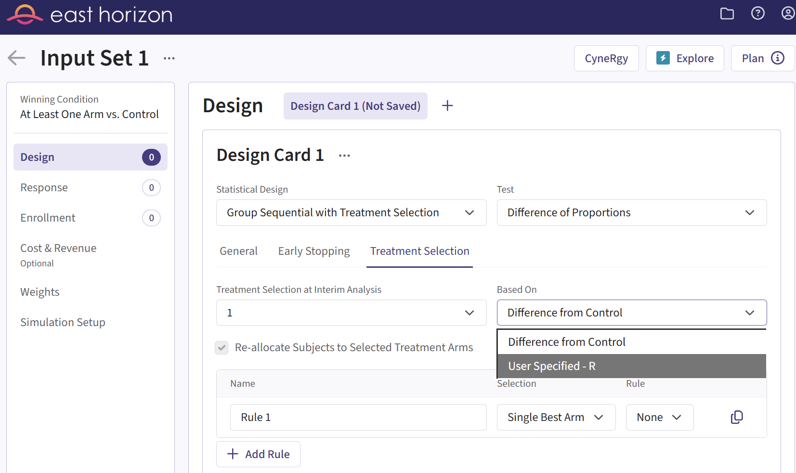
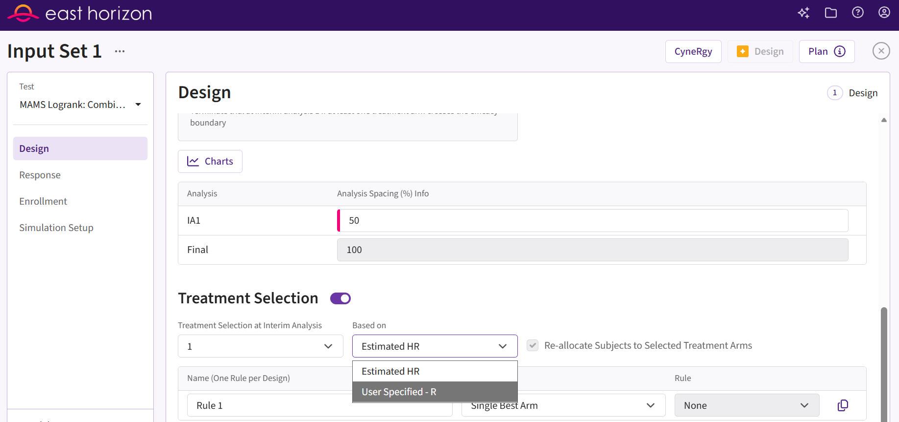
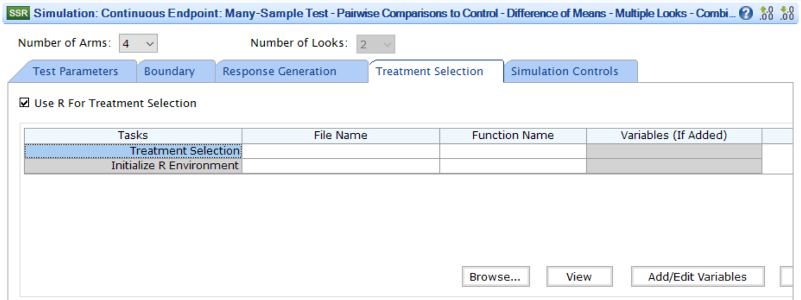

# Integration Point: Treatment Selection

[$`\leftarrow`$ Go back to the *Getting Started: Overview*
page](https://Cytel-Inc.github.io/CyneRgy/articles/Overview.md)

## Description

The Treatment Selection integration point allows you to customize the
selection of arms to carry forward after an interim analysis using a
custom R script. Instead of relying on the limited settings (rules) of
East or East Horizon, such as selecting a fixed number of top treatments
or applying a threshold, you can implement entirely alternative methods
to better suit your trial’s requirements. For example, you could use
Bayesian rules.

## Availability

### East Horizon Explore

This integration point is available in East Horizon Explore for the
following study objectives and endpoint types:

|                           | Time to Event | Binary | Continuous |
|---------------------------|---------------|--------|------------|
| Dose Finding              | \-            | \-     | ❌         |
| Multiple Arm Confirmatory | ❌            | ✅     | ✅         |

*This integration point is not applicable to other study objectives.*

### East Horizon Design

This integration point is available in East Horizon Design for the
following study objectives and endpoint types (click to
expand/collapse):

|                           | Time to Event | Binary | Continuous |
|---------------------------|---------------|--------|------------|
| Dose Finding              | \-            | ❌     | ❌         |
| Multiple Arm Confirmatory | ✅†           | ✅†    | ✅†        |

*This integration point is not applicable to other study objectives.*

†Not every test will be available for this study objective and endpoint
type. The availability will depend on the specific test you choose:

| Test | Study Objective | Endpoint | Availability |
|----|----|----|----|
| Logrank Test Given Accrual Duration and Accrual Rates (Parallel Design) | Two Arm Confirmatory | Time to Event | ❌ |
| Logrank Test Given Accrual Duration and Study Duration (Parallel Design) | Two Arm Confirmatory | Time to Event | ❌ |
| Logrank Test Given Accrual Duration and Accrual Rates (Population Enrichment) | Two Arm Confirmatory | Time to Event | ❌ |
| Difference of Proportions (Parallel Design) | Two Arm Confirmatory | Binary | ❌ |
| Ratio of Proportions (Parallel Design) | Two Arm Confirmatory | Binary | ❌ |
| Odds Ratio of Proportions (Parallel Design) | Two Arm Confirmatory | Binary | ❌ |
| Fisher’s Exact (Parallel Design) | Two Arm Confirmatory | Binary | ❌ |
| Difference of Means (Parallel Design) | Two Arm Confirmatory | Continuous | ❌ |
| Ratio of Means (Parallel Design) | Two Arm Confirmatory | Continuous | ❌ |
| Difference of Means (Crossover Design) | Two Arm Confirmatory | Continuous | ❌ |
| Ratio of Means (Crossover Design) | Two Arm Confirmatory | Continuous | ❌ |
| MAMS Logrank: Combining P-Values (Pairwise Comparisons to Control) | Multiple Arm Confirmatory | Time to Event | ✅ |
| MAMS Difference of Proportions (Pairwise Comparisons to Control) | Multiple Arm Confirmatory | Binary | ❌ |
| MAMS Difference of Proportions: Combining P-Values (Pairwise Comparisons to Control) | Multiple Arm Confirmatory | Binary | ✅ |
| MAMS Difference of Means (Pairwise Comparisons to Control) | Multiple Arm Confirmatory | Continuous | ❌ |
| MAMS Difference of Means: Combining P-Values (Pairwise Comparisons to Control) | Multiple Arm Confirmatory | Continuous | ✅ |

Important: for some tests, you may need to compute the analytical design
input set before simulating the design to see the option.

### East

This integration point is available in East for the following tests
(click to expand/collapse):

| Test | Number of Samples | Endpoint | Availability |
|----|----|----|----|
| Difference of Means (Parallel Design) | Two Samples | Continuous | ❌ |
| Difference of Proportions (Parallel Design) | Two Samples | Discrete | ❌ |
| Ratio of Proportions (Parallel Design) | Two Samples | Discrete | ❌ |
| Odds Ratio of Proportions (Parallel Design) | Two Samples | Discrete | ❌ |
| Logrank Test Given Accrual Duration and Accrual Rates (Parallel Design) | Two Samples | Survival | ❌ |
| Logrank Test Given Accrual Duration and Study Duration (Parallel Design) | Two Samples | Survival | ❌ |
| Chi-Square for Specified Proportions in C Categories (Single Arm Design) | Many Samples | Discrete | ❌ |
| Two Group Chi-Square for Proportions in C Categories (Parallel Design) | Many Samples | Discrete | ❌ |
| Multiple Looks - Combining P-Values (Pairwise Comparisons to Control - Difference of Means) | Many Samples | Continuous | ✅ |
| Multiple Looks - Combining P-Values (Multiple Pairwise Comparisons to Control - Difference of Proportions) | Many Samples | Discrete | ✅ |
| Multiple Looks - Combining P-Values (Pairwise Comparisons to Control - Logrank Test) | Many Samples | Survival | ✅ |

## Instructions

### In East Horizon Explore

You can set up a treatment selection function under **Based On** in the
**Treatment Selection** tab of a **Design Card** while creating or
editing an **Input Set**. The statistical design must be **Group
Sequential with Treatment Selection**.

Follow these steps (click to expand/collapse):

1.  In the **Design Card**, select **Group Sequential with Treatment
    Selection** under **Statistical Design**.
2.  Navigate to the **Treatment Selection** tab.
3.  Select **User Specified-R** from the dropdown in the **Based On**
    field.
4.  Browse and select the appropriate R file (`filename.r`) from your
    computer, or use the built-in **R Code Assistant** to create one.
    This file should contain function(s) written to perform various
    tasks to be used throughout your Project.
5.  Choose the appropriate function name. If the expected function is
    not displaying, then check your R code for errors.
6.  Set any required user parameters (variables) as needed for your
    function using **+ Add Variables**.
7.  Continue creating your project.

For a visual guide of where to find the option, refer to the screenshot
below:

### In East Horizon Design

You can set up a treatment selection function under **Based On** in the
**Treatment Selection** section of a **Design Card** while creating or
editing an **Input Set**. Early stopping and treatment selection must be
enabled.

Follow these steps (click to expand/collapse):

1.  In the **Design Card**, enable Early Stopping by choosing an
    efficacy or futility boundary family under **Early Stopping**.
2.  Enable Treatment Selection under **Treatment Selection**.
3.  Select **User Specified-R** from the dropdown in the **Based On**
    field.
4.  Browse and select the appropriate R file (`filename.r`) from your
    computer, or use the built-in **R Code Assistant** to create one.
    This file should contain function(s) written to perform various
    tasks to be used throughout your Project.
5.  Choose the appropriate function name. If the expected function is
    not displaying, then check your R code for errors.
6.  Set any required user parameters (variables) as needed for your
    function using **+ Add Variables**.
7.  Continue creating your project.

For a visual guide of where to find the option, refer to the screenshot
below:

### In East

You can set up a treatment selection function in East by navigating to
the **Use R For Treatment Selection** setting of the **Treatment
Selection** tab of a **Simulation Input** window.

Follow these steps (click to expand/collapse):

1.  Choose the appropriate test in the **Design** tab.
2.  In the **Simulation Input** window, navigate to the tab **Treatment
    Selection** and select **Use R For Treatment Selection**.
3.  A list of tasks will appear. Place your cursor in the **File Name**
    field for the task **Treatment Selection**.
4.  Click on the button **Browse…** to select the appropriate R file
    (`filename.r`) from your computer. This file should contain
    function(s) written to perform various tasks to be used throughout
    your Project.
5.  Specify the function name you want to initialize. To copy the
    function’s name from the R script, click on the button **View**.
6.  Set any required user parameters (variables) as needed for your
    function using the button **Add/Edit Variables**.
7.  Continue setting up your project.

For a visual guide of where to find the option, refer to the screenshot
below:

## Input Variables

When creating a custom R script, you can optionally use specific
variables provided by East Horizon’s engine itself. These variables are
automatically available and do not need to be set by the user, except
for the `UserParam` variable. Refer to the table below for the variables
that are available for this integration point, outcome, and study
objective.

| **Variable** | **Type** | **Description** |
|----|----|----|
| **SimData** | Data Frame | Subject data generated in current simulation, one row per subject. To access these variables in your R code, use the syntax: `SimData$NameOfTheVariable`, replacing `NameOfTheVariable` with the appropriate variable name. Refer to the table below for more information. |
| **DesignParam** | List | Input parameters which may be needed to compute test statistic and perform test. To access these variables in your R code, use the syntax: `DesignParam$NameOfTheVariable`, replacing `NameOfTheVariable` with the appropriate variable name. Refer to the table below for more information. |
| **LookInfo** | List | Input parameters related to multiple looks which may be needed to compute test statistic and perform test. To access these variables in your R code, use the syntax: `LookInfo$NameOfTheVariable`, replacing `NameOfTheVariable` with the appropriate variable name. Refer to the table below for more information. |
| **UserParam** | List | Contains all user-defined parameters specified in the East Horizon interface (refer to the [Instructions](#instructions) section). To access these parameters in your R code, use the syntax: `UserParam$NameOfTheVariable`, replacing `NameOfTheVariable` with the appropriate parameter name. |

### Variables of SimData

[Click here to explore the variables of
SimData.](https://Cytel-Inc.github.io/CyneRgy/articles/VariablesOfSimData.md)

### Variables of DesignParam

[Click here to explore the variables of
DesignParam.](https://Cytel-Inc.github.io/CyneRgy/articles/VariablesOfDesignParam.md)

### Variables of LookInfo

[Click here to explore the variables of
LookInfo.](https://Cytel-Inc.github.io/CyneRgy/articles/VariablesOfLookInfo.md)

## Expected Output Variable

East Horizon expects an output of a specific type. Refer to the table
below for the expected output for this integration point:

| **Type** | **Description** |
|----|----|
| List | A named list containing `TreatmentID`, `AllocRatio`, and `ErrorCode`. |

### Expected Members of the Output List

[TABLE]

## Minimal Template

Your R script could contain a function such as this one, with a name of
your choice. All input variables must be declared, even if they are not
used in the script. We recommend always declaring `UserParam` as a
default `NULL` value in the function arguments, as this will ensure that
the same function will work regardless of whether the user has specified
any custom parameters in the interface.

A detailed template with step-by-step explanations is available here:
[TreatmentSelection.R](https://github.com/Cytel-Inc/CyneRgy/blob/main/inst/Templates/TreatmentSelection.R)

    SelectTreatment <- function( SimData, DesignParam, LookInfo = NULL, UserParam = NULL )
    {
      nError                <- 0 # Error handling (no error)
      
      # Example
      vSelectedTreatments   <- c( 1, 2 )  # Experimental 1 and 2 are carried forward
      vAllocationRatio      <- c( 1, 2 )  # Experimental 2 will receive twice as many as exp 1 or control
      
      # Write the actual code here.
      # Store the selected treatments in a vector called vSelectedTreatments.
      # Store the allocation ratios in a vector called vAllocationRatio.

      return( list( TreatmentID = as.integer( vSelectedTreatments ),
                    AllocRatio = as.double( vAllocationRatio ),
                    ErrorCode = as.integer( nError ) ) )
    }

## Examples

Explore the following examples for more context:

1.  [**Multiple Arm, Binary Outcome - Treatment
    Selection**](https://Cytel-Inc.github.io/CyneRgy/articles/TreatmentSelection.md)
    - [SelectExpThatAreBetterThanCtrl.R](https://github.com/Cytel-Inc/CyneRgy/blob/main/inst/Examples/TreatmentSelection/R/SelectExpThatAreBetterThanCtrl.R)
    - [SelectExpUsingBayesianRule.R](https://github.com/Cytel-Inc/CyneRgy/blob/main/inst/Examples/TreatmentSelection/R/SelectExpUsingBayesianRule.R)
    - [SelectExpWithPValueLessThanSpecified.R](https://github.com/Cytel-Inc/CyneRgy/blob/main/inst/Examples/TreatmentSelection/R/SelectExpWithPValueLessThanSpecified.R)
    - [SelectSpecifiedNumberOfExpWithHighestResponses.R](https://github.com/Cytel-Inc/CyneRgy/blob/main/inst/Examples/TreatmentSelection/R/SelectSpecifiedNumberOfExpWithHighestResponses.R)
