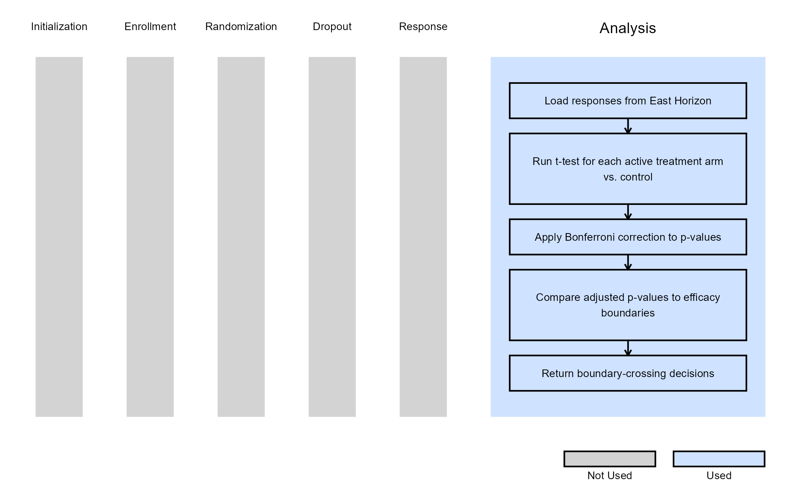
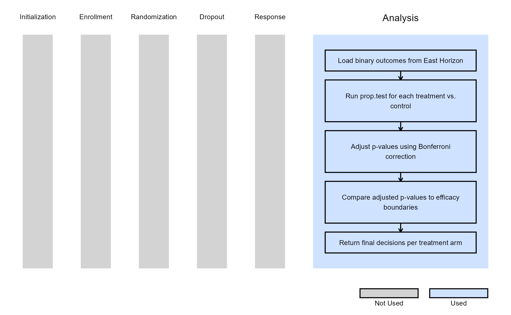

# Multiple Arm, Analysis

This example is related to the [**Integration Point:
Analysis**](https://Cytel-Inc.github.io/CyneRgy/articles/IntegrationPointAnalysis.md).
Click the link for setup instructions, variable details, and additional
information about this integration point.

To try this example, create a new project in East Horizon using the
following configuration:

- **Study objective:** Multiple Arm Confirmatory
- **Number of endpoints:** Single Endpoint
- **Endpoint type:**
  - Continuous Outcome for Example 1
  - Binary Outcome for Example 2
- **Task:** Explore

**Note:** This example is compatible with both Fixed Sample and Group
Sequential statistical designs. The R code automatically detects whether
interim look information (*LookInfo*) is available and adjusts the
analysis parameters accordingly.

## Introduction

The following examples illustrate how to integrate new **analysis**
capabilities into East Horizon using R functions in the context of
multi-arm clinical trials. Each example demonstrates a different type of
statistical endpoint (continuous, time-to-event, and binary), using
standard R functions and a Bonferroni adjustment to handle multiple
comparisons.

In the [R directory of this
example](https://github.com/Cytel-Inc/CyneRgy/tree/main/inst/Examples/MultiArmAnalysis/R)
you will find the following R files:

1.  [AnalyzeMultiArmUsingTTestBonferroni.R](https://github.com/Cytel-Inc/CyneRgy/blob/main/inst/Examples/MultiArmAnalysis/R/AnalyzeMultiArmUsingTTestBonferroni.R) -
    Performs pairwise t-tests for continuous endpoints with Bonferroni
    adjustment.

2.  [AnalyzeMultiArmUsingPropTestBonferroni.R](https://github.com/Cytel-Inc/CyneRgy/blob/main/inst/Examples/MultiArmAnalysis/R/AnalyzeMultiArmUsingPropTestBonferroni.R) -
    Performs proportion tests for binary endpoints with Bonferroni
    adjustment.

## Example 1 - Using the `t.test()` Function with Bonferroni Adjustment (Continuous Outcome)

This example is related to this R file:
[AnalyzeMultiArmUsingTTestBonferroni.R](https://github.com/Cytel-Inc/CyneRgy/blob/main/inst/Examples/MultiArmAnalysis/R/AnalyzeMultiArmUsingTTestBonferroni.R)

This example uses R’s built-in
[`t.test()`](https://rdrr.io/r/stats/t.test.html) function to compare
continuous outcomes between each treatment arm and the control arm. The
function computes individual p-values for each comparison, applies a
Bonferroni adjustment to control the family-wise error rate, and then
checks whether any adjusted p-values cross the efficacy boundaries
defined by East Horizon.

At each interim or final analysis, only active arms are tested (based on
`IsArmPresent`). The analysis is compatible with both fixed and group
sequential designs.

The figure below illustrates where this example fits within the R
integration points of Cytel products, accompanied by a flowchart
outlining the general steps performed by the R code.

## Example 2 - Using the `prop.test()` Function with Bonferroni Adjustment (Binary Outcome)

This example is related to this R file:
[AnalyzeMultiArmUsingPropTestBonferroni.R](https://github.com/Cytel-Inc/CyneRgy/blob/main/inst/Examples/MultiArmAnalysis/R/AnalyzeMultiArmUsingPropTestBonferroni.R)

This example analyzes binary outcomes using R’s base
[`prop.test()`](https://rdrr.io/r/stats/prop.test.html) function. The
test compares the proportion of responders in each treatment arm against
the control arm, computes p-values for each test, and applies Bonferroni
correction to account for multiple arms. Adjusted p-values are compared
against efficacy boundaries to decide whether any arm demonstrates a
statistically significant treatment effect.

The analysis dynamically accounts for dropped arms and adapts to both
fixed and group sequential designs.

The figure below illustrates where this example fits within the R
integration points of Cytel products, accompanied by a flowchart
outlining the general steps performed by the R code.

