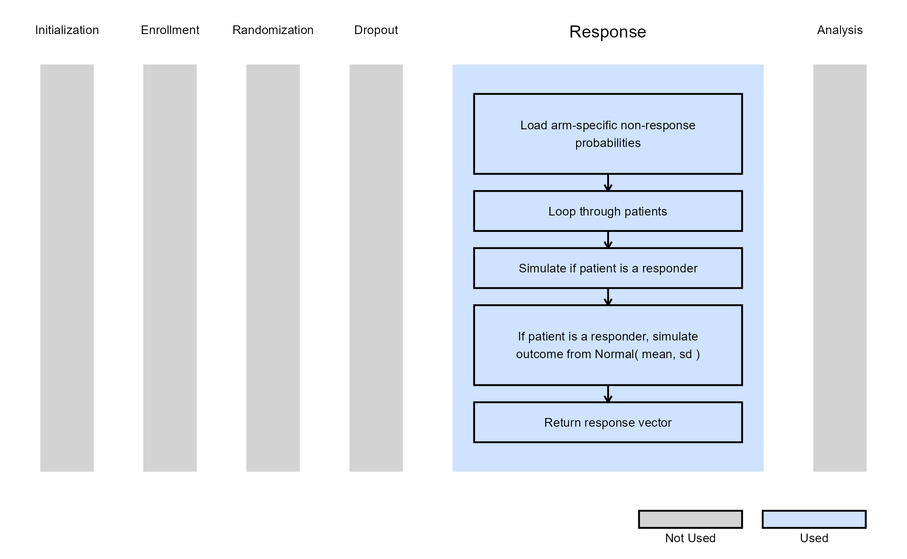
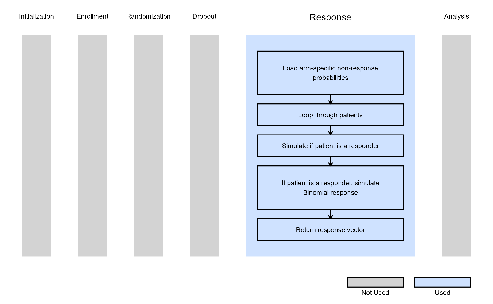

# Multiple Arm, Patient Simulation

This example is related to the [**Integration Point:
Response**](https://Cytel-Inc.github.io/CyneRgy/articles/IntegrationPointResponse.md).
Click the link for setup instructions, variable details, and additional
information about this integration point.

To try this example, create a new project in East Horizon using the
following configuration:

- **Study objective:** Multiple Arm Confirmatory, 3 Arms
- **Number of endpoints:** Single Endpoint
- **Endpoint type:**
  - Continuous Outcome for Example 1
  - Binary Outcome for Example 2
- **Task:** Explore

## Introduction

The following examples illustrate how to integrate new patient outcome
simulation (*response*) capabilities into East Horizon using R functions
in the context of a multi-arm clinical trials. Each example demonstrates
a different type of statistical endpoint (continuous, time-to-event, and
binary).

In the [R directory of this
example](https://github.com/Cytel-Inc/CyneRgy/tree/main/inst/Examples/MultiArmPatientSimulation/R)
you will find the following R files:

1.  [SimulatePatientOutcomeMultiArmPercentAtZero.R](https://github.com/Cytel-Inc/CyneRgy/blob/main/inst/Examples/MultiArmPatientSimulation/R/SimulatePatientOutcomeMultiArmPercentAtZero.R) -
    Simulates continuous outcomes from a mixture distribution where a
    proportion of patients have no response.

2.  [SimulatePatientOutcomeMultiArmPercentAtZero.Binary.R](https://github.com/Cytel-Inc/CyneRgy/blob/main/inst/Examples/MultiArmPatientSimulation/R/SimulatePatientOutcomeMultiArmPercentAtZero.Binary.R) -
    Simulates binary outcomes from a mixture distribution where a
    proportion of patients have no response.

## Example 1 - Simulation of Continuous Outcomes with Non-Responders

This example is related to this R file:
[SimulatePatientOutcomeMultiArmPercentAtZero.R](https://github.com/Cytel-Inc/CyneRgy/blob/main/inst/Examples/MultiArmPatientSimulation/R/SimulatePatientOutcomeMultiArmPercentAtZero.R)

In this example, each patient’s outcome represents a change from
baseline. However, some patients are expected to show no improvement
(non-responders), leading to an outcome of zero. The proportion of such
patients can vary across treatment arms (e.g., between 20% and 40% based
on prior data).

The function *SimulatePatientOutcomeMultiArmPercentAtZero* extends the
two-arm approach to three arms (two treatment arms), simulating each
patient’s outcome according to their assigned treatment. For each arm,
the function uses the probability of a zero outcome to determine whether
a patient is a non-responder; responders then have their outcome
simulated from a normal distribution with arm-specific mean and standard
deviation.

**Note**: This example could be extended to any number of treatment arms
by adding more user parameters such as `dProbOfZeroOutcomeExp3`,
`dProbOfZeroOutcomeExp4`, etc.

Refer to the table below for the definitions of the user-defined
parameters used in this example.

| **User parameter** | **Definition** |
|----|----|
| **dProbOfZeroOutcomeCtrl** | Value between 0 and 1 representing the probability a patient is a non-responder in the control arm. |
| **dProbOfZeroOutcomeExp1** | Value between 0 and 1 representing the probability a patient is a non-responder in the first experimental arm. |
| **dProbOfZeroOutcomeExp2** | Value between 0 and 1 representing the probability a patient is a non-responder in the second experimental arm. |

The figure below illustrates where this example fits within the R
integration points of Cytel products, accompanied by a flowchart
outlining the general steps performed by the R code.

## Example 2 - Simulation of Binary Outcomes with Treatment Resistance

This example is related to this R file:
[SimulatePatientOutcomeMultiArmPercentAtZero.Binary.R](https://github.com/Cytel-Inc/CyneRgy/blob/main/inst/Examples/MultiArmPatientSimulation/R/SimulatePatientOutcomeMultiArmPercentAtZero.Binary.R)

In this example, patient outcomes are binary, where `0` represents
treatment failure (non-response), and `1` indicates a successful
treatment and response. Some patients, however, are treatment-resistant,
meaning they will not respond to any treatment and thus always yield an
outcome of `0`. The proportion of resistant patients can differ between
treatment arms.

The R function *SimulatePatientOutcomeMultiArmPercentAtZero.Binary*
extends the two-arm approach to three arms (two treatment arms), where
each arm has its own probability of treatment resistance. For each
simulated patient, the function first determines whether they are
treatment-resistant and, if not, simulates their binary response using
the arm-specific probability of success.

**Note**: This example could be extended to any number of treatment arms
by adding more user parameters such as `dProbOfTreatmentResistantExp3`,
`dProbOfTreatmentResistantExp4`, etc.

Refer to the table below for the definitions of the user-defined
parameters used in this example.

| **User parameter** | **Definition** |
|----|----|
| **dProbOfTreatmentResistantCtrl** | Value between 0 and 1 representing the probability a patient is treatment-resistant in the control arm. |
| **dProbOfTreatmentResistantExp1** | Value between 0 and 1 representing the probability a patient is treatment-resistant in the first experimental arm. |
| **dProbOfTreatmentResistantExp2** | Value between 0 and 1 representing the probability a patient is treatment-resistant in the second experimental arm. |

The figure below illustrates where this example fits within the R
integration points of Cytel products, accompanied by a flowchart
outlining the general steps performed by the R code.

