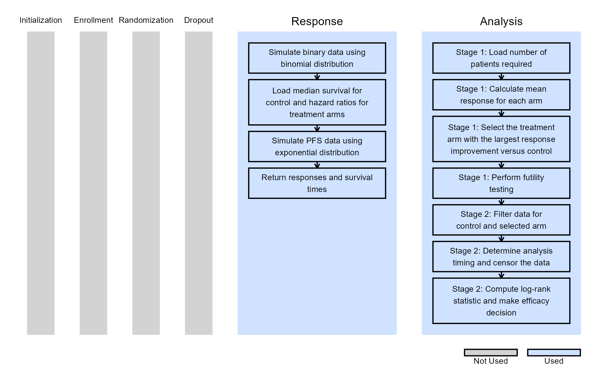

# Multiple-Arm Two-Stage Design with Dual Endpoints for a Seamless Phase II/III Trial

This example is related to both the [**Integration Point:
Response**](https://Cytel-Inc.github.io/CyneRgy/articles/IntegrationPointResponse.md)
and the [**Integration Point:
Analysis**](https://Cytel-Inc.github.io/CyneRgy/articles/IntegrationPointAnalysis.md).
Click the links for setup instructions, variable details, and additional
information about the integration points.

To try this example, create a new project in East Horizon using the
following configuration:

- **Study objective:** Multiple Arm Confirmatory
- **Number of endpoints:** Single Endpoint
- **Endpoint type:** Binary Outcome
- **Arms:** Control + 2 Treatment arms
- **Task:** Explore

**Note:** This example is compatible only with Fixed Sample statistical
design. The R code automatically detects whether interim look
information (*LookInfo*) is available and stops the simulation.

**Important note:** This example uses East Horizon’s built-in
single-endpoint framework because dual-endpoint functionality is not yet
available. It also does not use the time-to-event endpoint configured in
Project Settings, as R integration for this endpoint type is not yet
supported.

## Introduction

This example demonstrates how to compute probability of success for a
multi-arm clinical trial with two endpoints. This is achieved by
extending East Horizon’s single-endpoint framework to support dual
endpoints through custom R scripts implemented at the **Response
(Patient Simulation)** and **Analysis** integration points.

The example considers an *inferentially seamless two-stage Phase II/III
clinical trial design*. The design includes a concurrent control arm in
both phases and uses a short-term *binary endpoint* in Phase II to
select the optimal dose for further evaluation. In Phase III, treatment
efficacy is evaluated using a long-term time-to-event (TTE) endpoint,
specifically *Progression-Free Survival (PFS)*.

Seamless Phase II/III designs are increasingly used to integrate
dose-selection and confirmatory objectives within a single study setup,
potentially shortening drug development in areas with high unmet medical
needs. This approach is particularly useful when the primary Phase III
endpoint requires long follow-up periods to mature. In such settings, an
earlier surrogate efficacy endpoint can be used during the Phase II to
guide treatment/dose selection while continuing patient follow-up for
the time-to-event endpoint used in the final confirmatory analysis.

### Why R Integration is Required

To support both binary and time-to-event endpoints in a multi-arm trial
setup, we require an ability of using dual endpoints - this is something
that East Horizon cannot handle yet with its current response generation
algorithms for multi-arm study objectives. Therefore, we must integrate
a custom R file for the simulation to do so. In addition, the way that
the endpoint data is analyzed to first select the treatment arm based on
the binary dataset and then only use control data vs the selected
treatment arm to run the efficacy analysis on PFS also requires a custom
R code, as this type of analysis is not yet natively supported.

### R Functions Used in the Example

Once CyneRgy is installed, you can load this example with the following
command:

\
`CyneRgy``::`[`RunExample`](https://Cytel-Inc.github.io/CyneRgy/reference/RunExample.md)`(`` ``"MultiArmTwoEndpointTwoStageTrial"`` ``)`

Running the command opens `Description.Rmd` and all R scripts in the
active supported IDE.

**RStudio Project File**:
[MultiArmTwoEndpointTwoStageTrial.Rproj](https://github.com/Cytel-Inc/CyneRgy/blob/main/inst/Examples/MultiArmTwoEndpointTwoStageTrial/MultiArmTwoEndpointTwoStageTrial.Rproj)

In the [R directory of this
example](https://github.com/Cytel-Inc/CyneRgy/tree/main/inst/Examples/MultiArmTwoEndpointTwoStageTrial/R)
you will find the following R files:

1.  [SimulateBinaryAndPFS.R](https://github.com/Cytel-Inc/CyneRgy/blob/main/inst/Examples/MultiArmTwoEndpointTwoStageTrial/R/SimulateBinaryAndPFS.R) -
    This function is responsible for generating the patient-level
    response data used in each simulated trial. It generates the
    short-term binary endpoint for all treatment and control arms and
    generates PFS outcomes for the same patients. The binary response is
    simulated using a binomial distribution based on the
    treatment-specific response probabilities specified in the East
    Horizon inputs. PFS data are generated using an exponential
    distribution, with the control-arm median survival and
    treatment-specific hazard ratios supplied through the `UserParam`
    input. The function returns both the binary responses and PFS
    survival times so that the two endpoints can subsequently be used by
    the analysis function. The current implementation assumes
    independence between the binary and PFS endpoints. This assumption
    can be modified in the R code if a correlation between short-term
    response and long-term PFS is required for a particular trial
    design.

2.  [SelectArmAndAnalyzePFSTwoStages.R](https://github.com/Cytel-Inc/CyneRgy/blob/main/inst/Examples/MultiArmTwoEndpointTwoStageTrial/R/SelectArmAndAnalyzePFSTwoStages.R) -
    This function implements the two-stage adaptive analysis. First, it
    identifies the patients available for the Phase II analysis and
    calculates the observed binary response rate for each treatment arm
    and the control arm. The treatment arm with the largest observed
    improvement over control is selected for further evaluation. A
    futility criterion is then applied to determine whether the selected
    treatment provides sufficient evidence to proceed. If the trial
    proceeds to Phase III, the function retains only the selected
    treatment arm and the concurrent control arm for the final efficacy
    analysis. It determines the appropriate analysis timing based on the
    target number of PFS events, applies censoring where necessary, and
    performs a log-rank test using the available PFS data. Importantly,
    PFS information collected during both phases is retained for the
    selected treatment and control arms and contributes to the final
    analysis.

### Workflow Overview

The figure below illustrates where this example fits within the R
integration points of East Horizon, accompanied by flowcharts outlining
the general steps performed by the R code.

By combining the above R functions with the East Horizon native inputs,
users are able to simulate and use aggregated data from each simulated
trial to compute the expected probability of success of their trial
design. Users will also continue to benefit from East Horizon’s output
visualizations – with the caveat that the Probability of Success metric
will be labeled as “Power” in the native outputs of East Horizon.

### Statistical Assumptions

1.  Binary responses are generated using binomial distribution
2.  Time-to-event (PFS) data is generated using exponential distribution
3.  Binary and PFS endpoints are assumed independent
4.  Treatment selection is based on observed response rates
5.  Final efficacy analysis uses a log-rank test

------------------------------------------------------------------------

## Configuring Setup in East Horizon

Before starting, make sure you have the required tools and files.

1.  [East Horizon](https://platform.cytel.com)
2.  Download R Files from our public Github repo:
    [SimulateBinaryAndPFS.R](https://github.com/Cytel-Inc/CyneRgy/blob/main/inst/Examples/MultiArmTwoEndpointTwoStageTrial/R/SimulateBinaryAndPFS.R)
    and
    [SelectArmAndAnalyzePFSTwoStages.R](https://github.com/Cytel-Inc/CyneRgy/blob/main/inst/Examples/MultiArmTwoEndpointTwoStageTrial/R/SelectArmAndAnalyzePFSTwoStages.R).

### New Project

1.  On East Horizon, create a new project with a binary endpoint.

### New Input Set

2.  Navigate to the Inputs tab, and create a new input set using the
    Explore task.

### Design

3.  Click on the input set you just created, and ensure “Fixed Sample”
    is selected in the Statistical Design. This option is intentionally
    used because the treatment selection and two-stage logic are fully
    implemented within the custom R analysis function.

4.  Set sample size to 600.

5.  Select “User Specified – R” in the Test field.

6.  Click the “+” icon to open the R Integration pop-up window.

7.  Click on “Select File” and then on “Continue”.

8.  Click “Upload”, select the file “SelectArmAndAnalyzePFSTwoStages.R”
    and click on “Open”.

9.  Select the file again, now within the East Horizon files list, and
    click on “Insert File”.

10. Check that the correct file has been imported and the correct
    Function Name has been specified by the system. Note that the User
    Parameter variables have been automatically pulled from the R
    function that was imported. Specify the values for each of these
    variables. Refer to the table below for the values of the
    user-defined parameters used in this example.

| **User parameter** | **Definition** | **Value** |
|----|----|----|
| **Stage1NumCompleters** | Number of completers required for Stage 1 analysis | 300 |
| **Stage1FutThreshold** | Futility threshold for Stage 1 | 0.05 |
| **TargetNumPFSEvents** | Target number of PFS events | 300 |
| **SwitchSign** | Adjusts the sign of the critical value used in the final PFS analysis to account for endpoint-direction differences between the binary project setup and the time-to-event analysis | yes |
| **DropoutProportion** | Proportion of patients who drop out during PFS follow-up | 0 |

**Why is the `SwitchSign` parameter needed?**

East Horizon determines the direction of the critical value based on the
endpoint type specified in the project configuration. In this example,
the project uses a binary endpoint because multiple arm projects with
time-to-event endpoint do not currently support R integration.

For binary endpoint, treatment benefit is assumed to be associated with
larger response values, whereas the final efficacy analysis uses a PFS
log-rank test where treatment benefit corresponds to longer survival,
and therefore a smaller response value. Depending on the direction of
the log-rank statistic, the sign associated with treatment benefit may
therefore differ from the binary endpoint setup.

11. Click on the “Save” button to exit the R Integration details window.

### Response

12. Navigate to the Response page, and then select “User Specified – R”
    in the Distribution field.

13. Click on the “+” icon to open the R Integration pop-up window.

14. Click on “Select File” and then on “Continue”.

15. Click “Upload”, select the file “SimulateBinaryAndPFS.R” and click
    on “Open”.

16. Select the file again, now within the East Horizon files list, and
    click on “Insert File”.

17. Check that the correct file has been imported and the correct
    Function Name has been specified by the system. Note that only one
    User Parameter variable (`MedianSurvCtrl`) has been automatically
    pulled from the R function that was imported. The user also needs to
    specify ‘HR\[x\]’ values for each treatment arm. Refer to the table
    below for the values of the user-defined parameters used in this
    example.

| **User parameter** | **Definition** | **Value** |
|----|----|----|
| **MedianSurvCtrl** | Median survival time for control arm | 20 |
| **HR1** | Hazard ratio for treatment arm 1 relative to control arm | 0.7 |
| **HR2** | Hazard ratio for treatment arm 2 relative to control arm | 0.8 |

18. Click on the “Save” button to exit the R Integration details window.

### Enrollment

19. Navigate to the Enrollment page, and specify the average number of
    subjects enrolled per time unit (i.e. the time unit that was
    specified when creating the Project, e.g. “per month”).

### Simulation Setup

20. Specify the number of simulation runs as needed.

21. Check the checkbox to save the simulation data for all simulated
    models.

22. Click the “Save & Simulate” button.

23. Confirm by clicking on “Simulate” in the pop-up window, and wait for
    the simulation runs to finish.

## Interpreting the Results

After the simulation is complete, simulation-level results can be
downloaded from East Horizon. These results can be used to determine the
number of Phase II and Phase III completers, assess how frequently each
treatment arm was selected at Stage 1, as well as calculate the PoS -
the proportion of simulations that meet the prespecified final efficacy
criterion.

The results should be interpreted in the context of the simulation
assumptions, including independent binary and PFS endpoints, exponential
PFS distributions, and treatment selection based on observed binary
response rates. Users can vary these assumptions and other design
parameters, such as treatment effects, sample size, futility threshold,
and target number of PFS events, to evaluate how they affect the
operating characteristics of the design.

## Possible Extensions

While this example demonstrates one specific inferentially seamless
Phase II/III design, the R integration framework is flexible and can be
extended to support a variety of alternative design features and
analysis strategies. The current implementation provides a foundation
for exploring more complex inferentially seamless designs and for
evaluating their operating characteristics through simulation.

Possible extensions include:

1.  *Modelling dependence between endpoints:* The current example
    assumes independence between the binary and PFS endpoints. The
    response-generation function could be extended to simulate
    correlated binary and PFS outcomes, allowing the relationship
    between the short-term and long-term endpoints to be incorporated
    into the trial simulation.

2.  *Alternative response-generation mechanisms:* Alternative
    distributions or patient-level models could be implemented for both
    the binary and PFS endpoints to reflect different assumptions about
    treatment effects, survival distributions, or patient heterogeneity.

3.  *Multiple interim analyses:* The design could be extended to include
    additional interim analyses for efficacy, futility, or treatment
    selection, allowing more flexible adaptation of the trial based on
    accumulating data.

4.  *Alternative treatment-selection strategies:* Instead of selecting
    the treatment arm solely according to the observed binary response
    rate, alternative selection criteria could be evaluated.

5.  *Multiplicity and Type I error control:* Because dose selection
    favors treatment arms with more positive observed effects, the final
    confirmatory analysis requires appropriate adjustment to maintain
    control of the family-wise error rate. To control the FWER,
    different approached can be implemented such as p-value combination
    methods, closed testing procedures, Dunnett-type adjustment.

6.  *Alternative efficacy-testing methods:* The final PFS analysis
    currently uses a log-rank test. The framework could be extended to
    support alternative time-to-event analyses, including different test
    statistics or modeling approaches, depending on the assumptions and
    objectives of the clinical trial.

7.  *Alternative enrollment and follow-up assumptions:* The simulation
    could incorporate more realistic enrollment patterns, staggered
    recruitment, alternative dropout and censoring mechanisms during PFS
    follow-up.

These extensions illustrate how R integration can be used to move beyond
the currently supported native East Horizon functionality and evaluate a
broader range of seamless Phase II/III designs. By implementing
design-specific response generation and analysis logic in R, users can
investigate important operating characteristics of adaptive strategies,
including power, the probability of selecting the optimal treatment, and
Type I error control. This provides a flexible framework for exploring
complex designs that combine treatment selection with confirmatory
efficacy assessment across different endpoints and stages.
