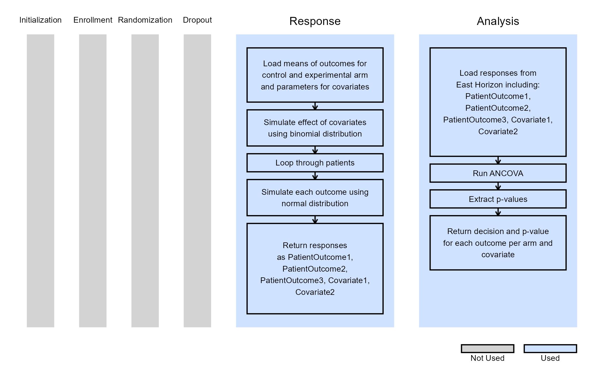

# Multiple Endpoints With Covariates and Stratified Randomization

This example is related to both the [**Integration Point: Response -
Continuous
Outcome**](https://Cytel-Inc.github.io/CyneRgy/articles/IntegrationPointResponseContinuous.md)
and the [**Integration Point: Analysis - Continuous
Outcome**](https://Cytel-Inc.github.io/CyneRgy/articles/IntegrationPointAnalysisContinuous.md).
Click the links for setup instructions, variable details, and additional
information about the integration points.

To try this example, create a new project in East Horizon using the
following configuration:

- **Study objective:** Two Arm Confirmatory
- **Number of endpoints:** Single Endpoint
- **Endpoint type:** Continuous Outcome (other outcomes also compatible)
- **Task:** Explore
- **Statistical Design:** Fixed Sample

**Important note:** This example does not use East Horizon’s built-in
multiple endpoint framework.

## Introduction

The following examples illustrate how to incorporate new patient outcome
simulation (*Response*) and analysis (*Design*) capabilities into East
Horizon using R functions in the context of a two-arm trial. Each
example features a trial design consisting of a standard-of-care control
arm and an experimental treatment arm, with three independent patient
outcomes modeled as continuous data.

Two of the examples include two binary covariates, and one of these also
applies stratified randomization based on the covariates. All designs
include a single final analysis. In the example without covariates, the
response data is analyzed using a t-test. In contrast, the other two
examples employ Analysis of covariance (ANCOVA) to account for covariate
effects.

Once CyneRgy is installed, you can load this example in RStudio with the
following command:

``` r
CyneRgy::RunExample( "MultipleEndpointsWithCovariates" )
```

This will open the corresponding RStudio project.

**RStudio Project File**:
[MultipleEndpointsWithCovariates.Rproj](https://github.com/Cytel-Inc/CyneRgy/blob/main/inst/Examples/MultipleEndpointsWithCovariates/MultipleEndpointsWithCovariates.Rproj)

In the [R directory of this
example](https://github.com/Cytel-Inc/CyneRgy/tree/main/inst/Examples/MultipleEndpointsWithCovariates/R),
you will find the following R files:

1.  [SimulateMultipleOutcomes.R](https://github.com/Cytel-Inc/CyneRgy/blob/main/inst/Examples/MultipleEndpointsWithCovariates/R/SimulateMultipleOutcomes.R) -
    Provides an example R function to simulate three independent
    normally distributed outcomes for a given number of subject. Note
    that this example can be extended to any number of endpoints.

2.  [SimulateMultipleOutcomesCovariates.R](https://github.com/Cytel-Inc/CyneRgy/blob/main/inst/Examples/MultipleEndpointsWithCovariates/R/SimulateMultipleOutcomesCovariates.R) -
    This R function simulates three independent normally distributed
    outcomes with two binary covariates. This function is extensible to
    any number of endpoints and covariates.

3.  [SimulateMultipleOutcomesCovariatesStratRandomization.R](https://github.com/Cytel-Inc/CyneRgy/blob/main/inst/Examples/MultipleEndpointsWithCovariates/R/SimulateMultipleOutcomesCovariatesStratRandomization.R) -
    Similar to the previous function, this version explicitly
    incorporates stratified randomization based on two binary
    covariates.

4.  [AnalyzeMultipleOutcomes.R](https://github.com/Cytel-Inc/CyneRgy/blob/main/inst/Examples/MultipleEndpointsWithCovariates/R/AnalyzeMultipleOutcomes.R) -
    This files provides an example R function to perform endpoint-wise
    one-sided t-tests on simulated patient data with three normally
    distributed outcomes.

5.  [AnalyzeMultipleOutcomesCovariates.R](https://github.com/Cytel-Inc/CyneRgy/blob/main/inst/Examples/MultipleEndpointsWithCovariates/R/AnalyzeMultipleOutcomesCovariates.R) -
    This files provides and example R function to perform statistical
    analysis on simulated patient-level data with three continuous
    endpoints and binary covariates. For each endpoint, an ANCOVA model
    is fitted to assess the treatment effect while adjusting for
    covariates.

6.  [AnalyzeMultipleOutcomesCovariatesStratRandomization.R](https://github.com/Cytel-Inc/CyneRgy/blob/main/inst/Examples/MultipleEndpointsWithCovariates/R/SimulateMultipleOutcomesCovariatesStratRandomization.R) -
    Extends the previous analysis to include stratified randomization.
    Each endpoint is analyzed using ANCOVA, adjusting for covariates.

### Example 1 - Simulate and Analyze Multiple Endpoint Data

This endpoint is related to the following R files:
[SimulateMultipleOutcomes.R](https://github.com/Cytel-Inc/CyneRgy/blob/main/inst/Examples/MultipleEndpointsWithCovariates/R/SimulateMultipleOutcomes.R)
and
[AnalyzeMultipleOutcomes.R](https://github.com/Cytel-Inc/CyneRgy/blob/main/inst/Examples/MultipleEndpointsWithCovariates/R/AnalyzeMultipleOutcomes.R).

In this example, patient outcomes are modeled as independent, continuous
variables generated from a normal distribution. Each outcome has a
treatment-specific mean, while the standard deviation is assumed to be
the same across all outcomes.

The table below defines the user-specified parameters used to simulate
patient data:

| **User parameter** | **Definition** |
|----|----|
| **MeanOutcome`X`Ctrl** | Mean of outcome X for the control arm, where X = 1, 2 or 3. |
| **MeanOutcome`X`Trt** | Mean of outcome X for the experimental arm, where X = 1, 2 or 3. |

The simulated data is analyzed using a one-sided t-test to compare the
treatment and control groups, assuming equal variances. No additional
user-defined parameters are required for the analysis in this example.

The figure below illustrates where this example fits within the R
integration points of East Horizon, along with a flowchart outlining the
key steps performed by the R code.


### Example 2 - Simulate and Analyze Multiple Endpoint Data with Two Binary Covariates

This endpoint is related to the following R files:
[SimulateMultipleOutcomesCovariates.R](https://github.com/Cytel-Inc/CyneRgy/blob/main/inst/Examples/MultipleEndpointsWithCovariates/R/SimulateMultipleOutcomesCovariates.R)
and
[AnalyzeMultipleOutcomesCovariates.R](https://github.com/Cytel-Inc/CyneRgy/blob/main/inst/Examples/MultipleEndpointsWithCovariates/R/AnalyzeMultipleOutcomesCovariates.R).

Just like in Example 1, patient outcomes are modeled as independent,
continuous variables generated from a normal distribution. Additionally,
two binary covariates are included, each with user-specified
probabilities and effect sizes.

The table below outlines the user-specified parameters used to simulate
patient data:

| **User parameter** | **Definition** |
|----|----|
| **MeanOutcome`X`Ctrl** | Mean of outcome X for the control arm, where X = 1, 2 or 3. |
| **MeanOutcome`X`Trt** | Mean of outcome X for the experimental arm, where X = 1, 2 or 3. |
| **Beta`Y`** | Effect size of binary covariate Y, where Y = 1 or 2. |
| **Cov`Y`Prob** | Probability that covariate Y takes value 1, where Y = 1 or 2. |

The simulated data is analyzed ANCOVA model to estimate the treatment
effect while adjusting for covariates. No additional user-defined
parameters are required for the analysis in this example.

The figure below shows how this example integrates with the R components
of East Horizon, along with a flowchart summarizing the key steps
executed by the R code.



### Example 3 - Simulate and Analyze Multiple Endpoint Data with Two Binary Covariates and Stratified Randomization

This endpoint is related to the following R files:
[SimulateMultipleOutcomesCovariatesStratRandomization.R](https://github.com/Cytel-Inc/CyneRgy/blob/main/inst/Examples/MultipleEndpointsWithCovariates/R/SimulateMultipleOutcomesCovariatesStratRandomization.R)
and
[AnalyzeMultipleOutcomesCovariatesStratRandomization.R](https://github.com/Cytel-Inc/CyneRgy/blob/main/inst/Examples/MultipleEndpointsWithCovariates/R/AnalyzeMultipleOutcomesCovariatesStratRandomization.R).

Example 3 introduces stratified randomization, replacing East Horizon’s
native patient allocation feature. As in Examples 1 and 2, patient
outcomes are modeled as independent, continuous variables from a normal
distribution. Two binary covariates are again included, with their
probabilities and effect sizes specified as in Example 2. Stratified
randomization is performed based on these covariates.

The table below defines the user-specified parameters used to simulate
patient data:

| **User parameter** | **Definition** |
|----|----|
| **MeanOutcome`X`Ctrl** | Mean of outcome X for the control arm, where X = 1, 2 or 3. |
| **MeanOutcome`X`Trt** | Mean of outcome X for the experimental arm, where X = 1, 2 or 3. |
| **Beta`Y`** | Effect size of binary covariate Y, where Y = 1 or 2. |
| **Cov`Y`Prob** | Probability that covariate Y takes the value 1, where Y = 1 or 2. |
| **AllocRatio** | Ratio of treatment to control allocation. |

As before, the simulated data is analyzed using an ANCOVA model to
assess the treatment effect while adjusting for covariates. In this
example, the treatment assignments generated during the response
simulation are directly used in the analysis. No additional user-defined
parameters are needed for the analysis.

The figure below illustrates how this example fits into the R
integration points of East Horizon, accompanied by a flowchart detailing
the main steps performed by the R code.


