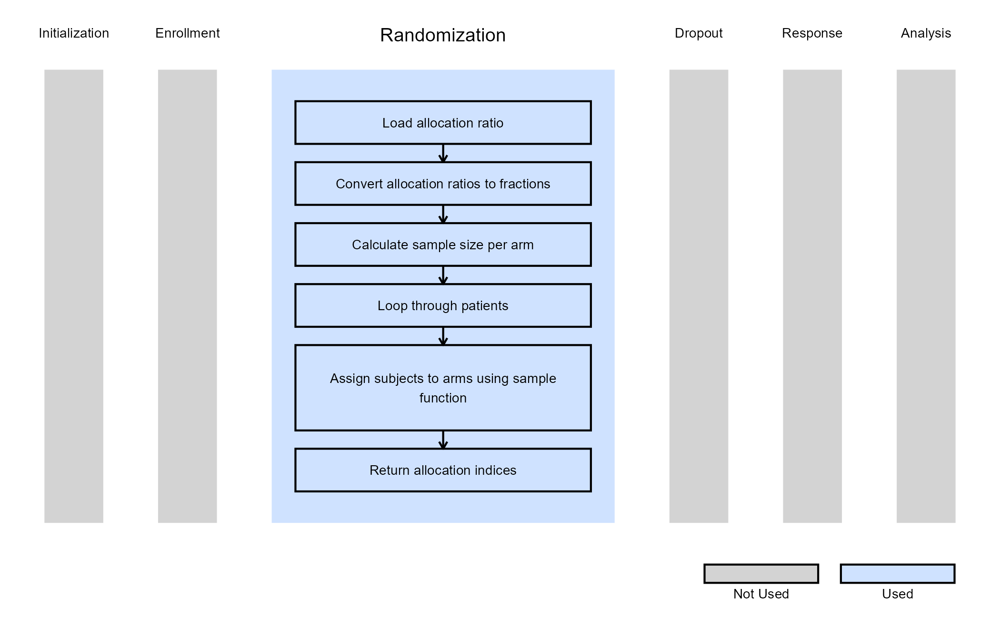
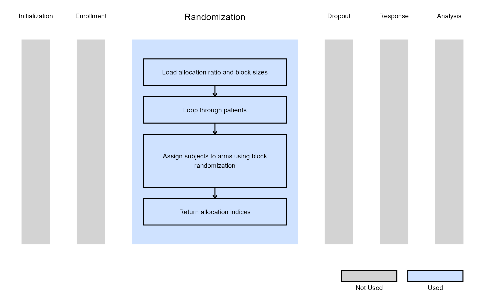

# Randomization of Subjects

This example is related to the [**Integration Point:
Randomization**](https://Cytel-Inc.github.io/CyneRgy/articles/IntegrationPointRandomization.md).
Click the link for setup instructions, variable details, and additional
information about this integration point.

To try this example, create a new project in East Horizon using the
following configuration:

- **Study objective:**
  - Two Arm Confirmatory for Examples 1, 2, 3
  - Multiple Arm Confirmatory for Example 4
- **Number of endpoints:** Any
- **Endpoint type:** Any
- **Task:** Any

## Introduction

The following examples illustrate how to integrate new custom
randomization methods and control how subjects are assigned to
designated arms into East Horizon or East using R functions in the
context of a two-arm trial.

Once CyneRgy is installed, you can load this example in RStudio with the
following commands

``` r
CyneRgy::RunExample( "RandomizeSubjects" )
```

Running the command above will load the RStudio project in RStudio.

**RStudio Project File**:
[RandomizeSubjects.Rproj](https://github.com/Cytel-Inc/CyneRgy/blob/main/inst/Examples/RandomizeSubjects/RandomizeSubjects.Rproj)

In the [R directory of this
example](https://github.com/Cytel-Inc/CyneRgy/tree/main/inst/Examples/RandomizeSubjects/R)
you will find the following R files:

1.  [RandomizationSubjectsUsingUniformDistribution.R](https://github.com/Cytel-Inc/CyneRgy/blob/main/inst/Examples/RandomizeSubjects/R/RandomizationSubjectsUsingUniformDistribution.R) -
    Contains a function named
    *RandomizationSubjectsUsingUniformDistribution* to demonstrate the R
    code necessary for Example 1 as described below.

2.  [RandomizationSubjectsUsingSampleFunctionInR.R](https://github.com/Cytel-Inc/CyneRgy/blob/main/inst/Examples/RandomizeSubjects/R/RandomizationSubjectsUsingSampleFunctionInR.R) -
    Contains a function named
    *RandomizationSubjectsUsingSampleFunctionInR* to demonstrate the R
    code necessary for Example 2 as described below.

3.  [BlockRandomizationSubjectsUsingRPackage.R](https://github.com/Cytel-Inc/CyneRgy/blob/main/inst/Examples/RandomizeSubjects/R/BlockRandomizationSubjectsUsingRPackage.R) -
    Contains a function named *BlockRandomizationSubjectsUsingRPackage*
    to demonstrate the R code necessary for Example 3 as described
    below.

4.  [LoadrandomizeR.R](https://github.com/Cytel-Inc/CyneRgy/blob/main/inst/Examples/RandomizeSubjects/R/LoadRandomizeR.R) -
    This file is used to install the *randomizeR* package for execution
    of Block Randomization in R.

5.  [RandomizeSubjectsAcrossMultipleArms.R](https://github.com/Cytel-Inc/CyneRgy/blob/main/inst/Examples/RandomizeSubjects/R/RandomizeSubjectsAcrossMultipleArms.R) -
    Contains a function named *RandomizeSubjectsAcrossMultipleArms* to
    demonstrate the R code necessary for Example 4 as described below.

## Example 1 - Randomize Subjects Usings Uniform Distribution

This example is related to this R file:
[RandomizationSubjectsUsingUniformDistribution.R](https://github.com/Cytel-Inc/CyneRgy/blob/main/inst/Examples/RandomizeSubjects/R/RandomizationSubjectsUsingUniformDistribution.R)

The R function *RandomizationSubjectsUsingUniformDistribution* randomly
assigns subjects to one of two arms using a uniform distribution.

This function does not use any user-defined parameters, but uses
parameters specified in East Horizon. Refer to the table below for more
information.

| **Name of the parameter in East Horizon** | **Where to find the parameter in East Horizon** | **Name of the variable in the R script** |
|----|----|----|
| Allocation Ratio | Design Card | $`AllocRatio`$ |

Steps:

1.  Generate a random number $`u`$ from a $`Uniform(0,1)`$ distribution.
2.  Define $`p`$ as the allocation fraction for the control arm, with
    $`1 - p`$ as the allocation fraction for the treatment arm.
3.  If $`u \leq p`$, assign the subject to the control arm; otherwise,
    assign them to the treatment arm.
4.  Ensure that the total sample size equals the sum of subjects in the
    control and treatment arms.

The figure below illustrates where this example fits within the R
integration points of Cytel products, accompanied by a flowchart
outlining the general steps performed by the R code.


## Example 2 - Randomize Subjects Using Sample Function

This example is related to this R file:
[RandomizationSubjectsUsingSampleFunctionInR.R](https://github.com/Cytel-Inc/CyneRgy/blob/main/inst/Examples/RandomizeSubjects/R/RandomizationSubjectsUsingSampleFunctionInR.R)

The R function *RandomizationSubjectsUsingSampleFunctionInR* uses the
[`sample()`](https://rdrr.io/r/base/sample.html) function in R to
randomly assign patients to the control and treatment arms.

This function does not use any user-defined parameters, but uses
parameters specified in East Horizon. Refer to the table below for more
information.

| **Name of the parameter in East Horizon** | **Where to find the parameter in East Horizon** | **Name of the variable in the R script** |
|----|----|----|
| Allocation Ratio | Design Card | $`AllocRatio`$ |

Steps:

1.  Let $`p`$ be the allocation fraction for the control arm, with
    $`1 - p`$ as the allocation fraction for the treatment arm.
2.  Compute the expected sample sizes (rounded) for both arms using the
    allocation fraction and total sample size.
3.  Randomly assign subject indices to the control and treatment arms
    using the [`sample()`](https://rdrr.io/r/base/sample.html) function
    in R.
4.  Create a vector of zeros with size equal to the total number of
    subjects ($`NumSub`$), then replace the zeros with ones for indices
    corresponding to the treatment arm.

The figure below illustrates where this example fits within the R
integration points of Cytel products, accompanied by a flowchart
outlining the general steps performed by the R code.



## Example 3 - Randomize Subjects Using randomizeR Package

This example is related to this R file:
[BlockRandomizationSubjectsUsingRPackage.R](https://github.com/Cytel-Inc/CyneRgy/blob/main/inst/Examples/RandomizeSubjects/R/BlockRandomizationSubjectsUsingRPackage.R)

The function *BlockRandomizationSubjectsUsingRPackage.R* uses the
`randomizeR::pbrPar()` function from the **randomizeR** package to
perform block randomization.

In small-sample studies, imbalances between groups can be minimized by
using restricted randomization. This approach ensures that treatment
groups are allocated in the desired proportions while maintaining
randomness.

The **permuted block randomization** technique divides study
participants into blocks, within which subjects are randomly assigned to
treatment groups. This method ensures that the desired allocation
proportions are exactly maintained within each block while keeping the
order of assignments random.

Refer to the table below for the definitions of the user-defined
parameters used in this example.

| **User parameter** | **Definition** |
|----|----|
| **BlockSize1** | Size of the first block for the randomization process. |
| **BlockSize2** | Size of the second block for the randomization process. |
| *…* | Block sizes for additional blocks follow the same format, incrementing the block number (e.g., BlockSize3, BlockSize4, etc.). |

This function also uses parameters specified in East Horizon. Refer to
the tables below for more information.

| **Name of the parameter in East Horizon** | **Where to find the parameter in East Horizon** | **Name of the variable in the R script** |
|----|----|----|
| Allocation Ratio | Design Card | $`AllocRatio`$ |

The figure below illustrates where this example fits within the R
integration points of Cytel products, accompanied by a flowchart
outlining the general steps performed by the R code.



## Example 4 - Randomize Subjects Across Multiple Arms

This example is related to this R file:
[RandomizeSubjectsAcrossMultipleArms.R](https://github.com/Cytel-Inc/CyneRgy/blob/main/inst/Examples/RandomizeSubjects/R/RandomizeSubjectsAcrossMultipleArms.R)

The function *RandomizeSubjectsAcrossMultipleArms* demonstrates how to
perform randomization when a clinical trial involves more than two arms,
such as a control group and multiple experimental treatment groups.

This function dynamically handles any number of arms and allocates
subjects according to specified allocation ratios. It extends the logic
of the two-arm randomization examples to generalize across an arbitrary
number of treatment arms.

The function first converts allocation ratios into fractions summing to
one, then determines the number of subjects per arm according to these
proportions. Any remaining subjects (due to rounding) are distributed to
the arms with the largest fractional parts to ensure that the total
sample size is preserved. A treatment ID vector is then created (0 for
control, 1…N for treatment arms), randomly shuffled, and returned.

This function does not use any user-defined parameters, but uses
parameters specified in East Horizon. Refer to the table below for more
information.

| **Name of the parameter in East Horizon** | **Where to find the parameter in East Horizon** | **Name of the variable in the R script** |
|----|----|----|
| Allocation Ratio for Control Arm | Design Card | $`AllocRatio[ 1 ]`$ |
| Allocation Ratio for Arm 1 | Design Card | $`AllocRatio[ 2 ]`$ |
| Allocation Ratio for Arm 2 | Design Card | $`AllocRatio[ 3 ]`$ |
| … |  |  |

The figure below illustrates where this example fits within the R
integration points of Cytel products, accompanied by a flowchart
outlining the general steps performed by the R code.


