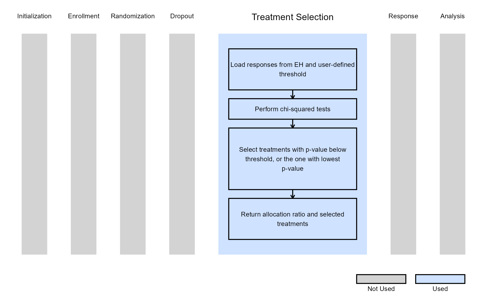

# Multiarm, Binary Outcome - Treatment Selection

This example is related to the [**Integration Point: Treatment
Selection**](https://Cytel-Inc.github.io/CyneRgy/articles/IntegrationPointTreatmentSelection.md).
Click the link for setup instructions, variable details, and additional
information about this integration point.

To try this example, create a new project in East Horizon using the
following configuration:

- **Study objective:** Multiple Arm Confirmatory, 4-Arm
- **Number of endpoints:** Single Endpoint
- **Endpoint type:** Binary Outcome
- **Task:** Explore
- **Statistical Design**: Group Sequential, 1 IA

## Introduction

The following examples illustrate how to integrate new treatment
selection capabilities into East Horizon or East using R functions in
the context of a multi-arm trial. In each example, the trial design
includes a standard-of-care control arm and three experimental treatment
arms. The design includes one interim analysis (IA) and one final
analysis (FA).

At the IA, one or more experimental treatments are selected to continue
into stage 2 of the trial. If the trial is not stopped early for
efficacy or futility, the control arm and the selected treatments
proceed to the final stage. These examples showcase different approaches
for selecting treatments to carry forward into stage 2.

Once CyneRgy is installed, you can load this example in R Studio with
the following commands:

``` r
CyneRgy::RunExample("TreatmentSelection")
```

Running the command above will load the RStudio project in RStudio.

**East Workbook**:
[TreatmentSelection.cywx](https://github.com/Cytel-Inc/CyneRgy/blob/main/inst/Examples/TreatmentSelection/TreatmentSelection.cywx)

**RStudio Project File**:
[TreatmentSelection.Rproj](https://github.com/Cytel-Inc/CyneRgy/blob/main/inst/Examples/TreatmentSelection/TreatmentSelection.Rproj)

In the [R directory of this
example](https://github.com/Cytel-Inc/CyneRgy/tree/main/inst/Examples/TreatmentSelection/R)
you will find the following R files:

1.  [SelectExpThatAreBetterThanCtrl.R](https://github.com/Cytel-Inc/CyneRgy/blob/main/inst/Examples/TreatmentSelection/R/SelectExpThatAreBetterThanCtrl.R) -
    Contains a function named *SelectExpThatAreBetterThanCtrl* to
    demonstrate the R code necessary for Example 1 as described below.

2.  [SelectExpWithPValueLessThanSpecified.R](https://github.com/Cytel-Inc/CyneRgy/blob/main/inst/Examples/TreatmentSelection/R/SelectExpWithPValueLessThanSpecified.R) -
    Contains a function named *SelectExpWithPValueLessThanSpecified* to
    demonstrate the R code necessary for Example 2 as described below.

3.  [SelectSpecifiedNumberOfExpWithHighestResponses.R](https://github.com/Cytel-Inc/CyneRgy/blob/main/inst/Examples/TreatmentSelection/R/SelectSpecifiedNumberOfExpWithHighestResponses.R) -
    Contains a function named
    *SelectSpecifiedNumberOfExpWithHighestResponses* to demonstrate the
    R code necessary for Example 3 as described below.

4.  [SelectExpUsingBayesianRule.R](https://github.com/Cytel-Inc/CyneRgy/blob/main/inst/Examples/TreatmentSelection/R/SelectExpUsingBayesianRule.R) -
    Contains a function named *SelectExpUsingBayesianRule* to
    demonstrate the R code necessary for Example 4 as described below.

In addition, if you would like to experiment with these examples and
would like code to help you get started we have provided
fill-in-the-blank type code files in the [FillInTheBlankR
directory](https://github.com/Cytel-Inc/CyneRgy/tree/main/inst/Examples/TreatmentSelection/FillInTheBlankR).

## Example 1 - Selection Based on Response Rates Above Control

This example is related to this R file:
[SelectExpThatAreBetterThanCtrl.R](https://github.com/Cytel-Inc/CyneRgy/blob/main/inst/Examples/TreatmentSelection/R/SelectExpThatAreBetterThanCtrl.R)

In this example, at the interim analysis:

- Any experimental treatment with a response rate higher than that of
  the control arm is selected for stage 2.
- If no experimental treatment exceeds the control response rate, the
  treatment with the highest estimated probability of response is
  selected instead.

In stage 2, a **1:1** randomization ratio (experimental:control) will be
used.

The figure below illustrates where this example fits within the R
integration points of Cytel products, accompanied by a flowchart
outlining the general steps performed by the R code.


## Example 2 - Selection Based on P-Value Less Than Specified

This example is related to this R file:
[SelectExpWithPValueLessThanSpecified.R](https://github.com/Cytel-Inc/CyneRgy/blob/main/inst/Examples/TreatmentSelection/R/SelectExpWithPValueLessThanSpecified.R)

In this example, at the interim analysis:

- Each experimental treatment is compared to the control arm using a
  chi-squared test.
- Any treatment with a p-value less than a user-specified threshold
  (*dMaxPValue*) is selected for stage 2.
- If no treatment meets this criterion, the experimental arm with the
  smallest p-value is selected.

In stage 2, a **1:1** randomization ratio (experimental:control) will be
used.

Refer to the table below for the definitions of the user-defined
parameters used in this example.

| **User parameter** | **Definition** |
|----|----|
| **dMaxPValue** | Threshold used in the chi-squared test to evaluate treatment efficacy (between 0 and 1). Any experimental treatment with a p-value less than this threshold at the interim analysis will be selected to advance to stage 2. |

The figure below illustrates where this example fits within the R
integration points of Cytel products, accompanied by a flowchart
outlining the general steps performed by the R code.



## Example 3 - Select Treatments With Highest Number of Responses

This example is related to this R file:
[SelectSpecifiedNumberOfExpWithHighestResponses.R](https://github.com/Cytel-Inc/CyneRgy/blob/main/inst/Examples/TreatmentSelection/R/SelectSpecifiedNumberOfExpWithHighestResponses.R)

In this example, at the interim analysis:

- A user-specified number of experimental treatments
  (*QtyOfArmsToSelect*) with the highest observed number of responses
  are selected for stage 2.

Following the IA, if two treatment arms are chosen to advance,
randomization proceeds according to user-specified allocation ratios
**1:Rank1AllocationRatio:Rank2AllocationRatio**, where:

- 1 corresponds to the control arm,
- *Rank1AllocationRatio* corresponds to the treatment with the most
  responses,
- *Rank2AllocationRatio* corresponds to the treatment with the
  second-most responses.

Refer to the table below for the definitions of the user-defined
parameters used in this example.

| **User parameter** | **Definition** |
|----|----|
| **QtyOfArmsToSelect** | Number of experimental treatment arms to be selected for stage 2. This number must match the number of user-specified allocation ratios. If not specified, the default is 2. |
| **Rank1AllocationRatio** | Allocation ratio for the treatment arm with the highest number of responses at interim analysis. Default is 2 if not specified. |
| **Rank2AllocationRatio** | Allocation ratio for the treatment arm with the second highest number of responses. Default is 1 if not specified. |
| **…** | Allocation ratios for additional selected treatment arms follow the same format, incrementing the rank number (e.g., `Rank3AllocationRatio`, `Rank4AllocationRatio`, etc.). |
| **Rank\<`QtyOfArmsToSelect`\>AllocationRatio** | Allocation ratio for the treatment arm ranked QtyOfArmsToSelect-th based on the number of responses. |

The figure below illustrates where this example fits within the R
integration points of Cytel products, accompanied by a flowchart
outlining the general steps performed by the R code.


## Example 4 - Selection Based on Bayesian Posterior Probabilities

This example is related to this R file:
[SelectExpUsingBayesianRule.R](https://github.com/Cytel-Inc/CyneRgy/blob/main/inst/Examples/TreatmentSelection/R/SelectExpUsingBayesianRule.R)

In this example, at the interim analysis:

- A Bayesian model is used to evaluate each experimental treatment.
- We let $`p_j`$ denote the probability of response for treatment $`j`$,
  where $`j = 1, 2, 3`$.
- The prior distribution is defined as
  $`p_j \sim \text{Beta}( \text{dPriorAlpha}, \text{dPriorBeta} )`$.
- We select any treatment $`j`$ that has at least a user-specified
  probability (*dMinPosteriorProbability*) of being greater than the
  user-specified historical response rate (*dHistoricResponseRate*).
  Specifically, if it meets the criterion:
  $`\Pr( p_j > \text{dHistoricResponseRate} \mid \text{data} ) > \text{dMinPosteriorProbability}`$.
- If no treatment meets this threshold, we select the treatment with the
  highest posterior probability of exceeding the historical response
  rate.

In stage 2, a **2:1** randomization ratio (experimental:control) will be
applied for each selected treatment.

Refer to the table below for the definitions of the user-defined
parameters used in this example.

| **User parameter** | **Definition** |
|----|----|
| **dPriorAlpha** | Alpha parameter of the Beta prior distribution (between 0 and 1). Default is 0.2 if not specified. |
| **dPriorBeta** | Beta parameter of the Beta prior distribution (between 0 and 1). Default is 0.8 if not specified. |
| **dHistoricResponseRate** | Historical response rate used as a reference for comparison (between 0 and 1). Default is 0.2 if not specified. |
| **dMinPosteriorProbability** | Minimum posterior probability required for an experimental treatment to be considered superior to the historical response rate (between 0 and 1). Default is 0.5 if not specified. |

The figure below illustrates where this example fits within the R
integration points of Cytel products, accompanied by a flowchart
outlining the general steps performed by the R code.


