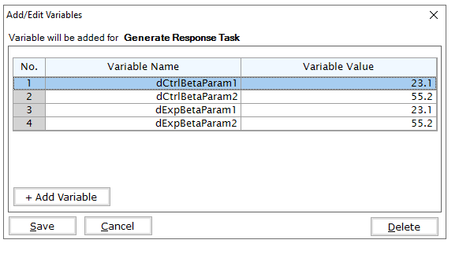

# Two Arm, Normal Outcome - Patient Outcome Simulation Examples

The following examples demonstrate how to add new patient outcome simulation capabilities into East using an R function in the context of a two-arm trial with a normally distributed patient outcome. For all examples, we assume the trial design consists of standard of care and an experimental treatment and the trial design assumes patient outcomes are normally distributed.      

**East Workbook**: 2ArmTimeNormalOcomePatientSimulation.cywx

**R Studio Project File**: 2ArmNormalOutcomePatientSimulation.Rproj.

In the RCode directory of this example you will find the following R files:

1.  SimulatePatientOutcomePercentAtZero.R - This file provides an example R function to simulate patient data from a mixture distribution where a proportion of patients have a null response. The code in Example 1 can be used when the proportion of patients with null response is a fixed value.   

1.  SimulatePatientOutcomePercentAtZeroBetaDist.R - This file provides an example R function to simulate patient data from a mixture distribution where a proportion of patients have a null response. This approach assumes that the probability of null response is unknown and must first be drawn from a Beta distribution.    

1. SimulatePatientOutcomeTemplate.R - This file provides a template that may be used as a starting point for adding a new patient simulator. 

1. TestingAndExploration.R - This file provides an example of loading East output and calling the R functions in in Example 1 from within R. The intent of this file is to help users call and test the the function in Example 1.

In addition, if you would like to experiment with these examples without looking at the complete solution, you can find fill-in-the-blank-type code files in the FillInTheBlankRCode directory.  

## Example 1 - Simulation of Patient Normal Data from a Mixture Distribution 

In this example, the patient outcome is change from baseline. However, there is an unknown proportion of patients that will not respond to treatment, and thus, have a change from baseline of 0, a non-responder.  Using historical data, it is estimated that the proportion of patients that will not respond to treatment is between 20% and 40%. In this example, an R function is provided to help explore the proportion of patients that do not respond and the impact on expected study power. The function used for this example is SimulatePatientOutcomePercentAtZero and can be found in RCode/SimulatePatientOutcomePercentAtZero.R. The required User Specified parameters are the probability a patient is a non-responder for each arm, specifically, dProbOfZeroOutcomeCtrl and dProbOfZeroOutcomeExp.

1. Example 1.1 - Assume that all patients will respond to treatment. A binomial distribution is utilized to simulate if the patient is a non-responder or a responder. If the patient is a responder, then their outcome is simulated from a normal distribution with the mean and standard deviation provided in East and sent to R. For this example, the required parameters are the probability a patient is a non-responder for each arm, specifically, dProbOfZeroOutcomeCtrl = 0.0 and dProbOfZeroOutcomeExp = 0.0.  This example is included to demonstrate using an R function if the data is simulated as it is in East without the use of an R function. 

1. Example 1.2 - This function assumes that 20% of patients, on average, will not respond to treatment. A binomial distribution is utilized to simulate if the patient is a non-responder. If the patient is a responder, then their outcome is simulated from a normal distribution with the mean and standard deviation provided in East and sent to R. For this example, the required parameters are the probability a patient is a non-responder for each arm, specifically, dProbOfZeroOutcomeCtrl = 0.2 and dProbOfZeroOutcomeExp = 0.2.

1.  Example 1.3 - This example is similar to the previous example, however, this function assumes that 40% of patients, on average, will not respond to treatment. For this example, the required parameters, the required parameters are the probability a patient is a non-responder for each arm, specifically, dProbOfZeroOutcomeCtrl = 0.4 and dProbOfZeroOutcomeExp = 0.4. 

## Example 2 - Simulation of Patient Normal Data from a Mixture Distribution with Mixture Percent Sampled from a Beta Distribution

This function assumes that the probability that a patient is a non-responder is random and follows a Beta distribution. The intent of this option is to incorporate the variability in the unknown probability of null response. In addition, the provided function allows for a different Beta distribution for each treatment, which may be used to understand how a treatment that reduces the likelihood of a null response would perform in the trial. The function used for this example is SimulatePatientOutcomePercentAtZeroBetaDist and can be found in RCode/SimulatePatientOutcomePercentAtZeroBetaDist.R. The required user Specified parameters are the prior parameters for each treatment, specifically, 1) dCtrlBetaParam1, 2) dCtrlBetaParam2, 3) dExpBetaParam1, 4) dExpBetaParam2.

1. Example 2.1 For this example, independent Beta( 23.1, 55.2 ) are utilized, which have a 95% credible interval of (0.2, 0.4).  This function first simulates the probability of no response from the Beta distribution for control and experimental arms, then uses the simulated probability to simulate the proportion of patients with a null response.  In this example, it is assumed that the two probabilities are sampled from the same distribution but are not identical in a given simulation.  The R code could easily be adapted to accomplish this.  In East, you will need to add variables that are sent to R. For this example, the variable input screen in East would look like 

2. Example 2.2 - For this example, the treatment reduces the probability of null response by 10%, on average, when compared to control. In particular, assume the probability of null response follows a Beta( 23.1, 55.2 ) which has a 95% credible interval of (0.2, 0.4). For experimental treatment assume the probability of no response follows a Beta ( 10.8, 46.3 ) which has a 95% credible interval of (0.1, 0.3). In East, you will need to add variables that are sent to R. For this example, the variable input screen in East would look like 

