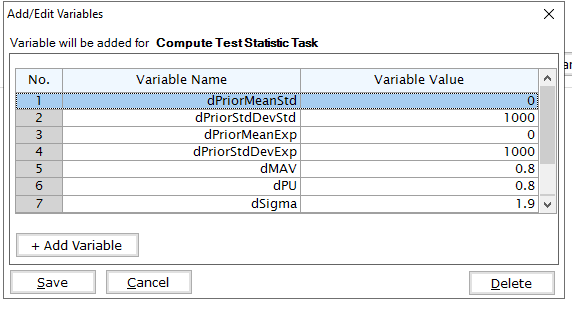
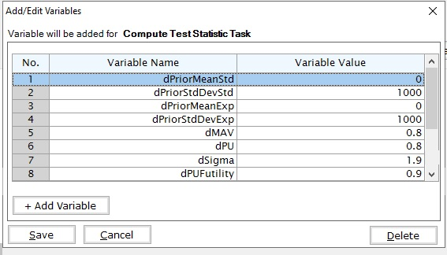

```{r setup, include=FALSE}
knitr::opts_chunk$set(echo = TRUE)
library( ggplot2 )
library( readxl )
library( readr )

library( dplyr )
```

# Introduction
The intent of this example is to demonstrate the computation of Bayesian assurance, or probability of success, through the integration of East and R using a series of examples.  These examples begin with a 2-arm, normal outcome, fixed sample trial assuming a non-standard prior for computation of assurance.  The examples progress to a more complex setting of computing assurance for a sequence of a phase 2 trial with normal outcomes followed by a phase 3 trial where the outcome is time-to-event.

The examples will all contain two treatments, Standard of Care (S) and Experimental (E) and are follows: 

1. Fixed sample design using a mixture of normal distributions for computation of assurance
1. Expand example 1 to a group sequential design with an interim for futility based on a Bayesian predictive probability
1. Fixed design with a time-event-event outcome, this example provides the basis and a comparison for the phase 2 followed by a phase 3 example considered last
1. Two consecutive studies, phase 2 with a normal endpoint followed by a phase 3 with a normal endpoint
1. Two consecutive studies, phase 2 with a normal endpoint followed by a phase 3 with a time-to-event outcome


# Example 1
## Study Design
Fixed sample, with normally distributed outcomes Y. 

  * Sample size: 80 patients per arm
  * Assume standard deviation is known: $\sigma = 1.9$
 
Denote the minimum acceptable value by MAV.  For patients receiving treatment $j$ = S or E, we assume the outcomes Y $\sim N( \mu_j, \sigma^2)$ where, for simplicity,  $\mu_j$ is unknown and $\sigma$ is the known, fixed quantity. We assume *a priori* $\mu_j \sim$ Normal( $\theta_j, \tau_j^2= 1000 $), for $j=$ S or E.  At the end of the study the following is computed:

$$
    \rho = Pr( \mu_E > \mu_S + MAV | data ) \text{ and}
$$
$$  
    \text{If } \rho > P_U \implies \text{ Go }\\
    \text{ If } \rho \leq P_U \implies \text{ No Go }
$$
For decision making we assume $P_U = 0.8$. For assurance, a mixture of normal distributions is assumed.  The assurance prior is specified in terms of the prior weight, mean, and variance for each component of the mixture.   For simplicity, we assume mixture of two normal distributions as follows:

  * Weight: 25% on $N( 0, 0.05 )$
  * Weight: 75% on $N( 0.7, 0.3^2)$
  
```{r echo=FALSE,  warning=FALSE}

######################################################################################################################## .
# Plot the assurance prior ####
######################################################################################################################## .
vMean1 <- rnorm(250000, mean = 0,   sd = 0.05)
vMean2 <- rnorm(750000, mean = 0.7, sd = 0.3)


vMean    <- c( vMean1, vMean2 )
dfSample <- data.frame( SampleMean = vMean )


# Assuming dfSample is your data frame
# Adjusted ggplot code
ggplot(dfSample, aes(SampleMean)) +
    geom_density(fill = "skyblue", color = "black") +
    labs(title = expression("Assurance Prior Distribution of True Treatment Effect (" * mu[E] - mu[S] * ")" ), 
             x = expression( "True Treatment Effect " * mu[E] - mu[S]  ), y ="Density") +
    theme_bw() +
    theme(
        plot.title = element_text(hjust = 0.5),  # Center the title
        axis.text.x = element_text(size = 10),    # Adjust x-axis text size
        axis.title.x = element_text(size = 12),   # Adjust x-axis title size
        axis.title.y = element_text(size = 12),   # Adjust y-axis title size
        plot.margin = margin(20, 20, 20, 20),      # Adjust plot margins
        #panel.grid.major = element_blank(),        # Remove major grid lines
        #panel.grid.minor = element_blank(),        # Remove minor grid lines
        panel.border = element_blank(),            # Remove panel border
        axis.line = element_line(color = "black")  # Add black axis line
    ) +
    xlim(-0.25, 1.75)  # Set x-axis range from 0 to 1
```

## East-R Integration
In order to evaluate the design above, one can develop an R function for analysis that can be called from East during simulation.  By replacing only the analysis function with an R function, one can obtain the frequentist operating characteristics of the Bayesian design using East.  In addition, by replacing how the patient data is simulated one can obtain the Bayesian assurance.  Specifically, in the simulation when the patient data is simulated an R function will first sample the assurance prior then sample the patient data.   The resulting power of this simulation will be the Bayesian assurance assuming the 2 component prior given above.  

There is often a need for examination of posterior distribution of both observed and true treatment differences given a Go decision.   These posterior distributions can be useful for planning the next phase of study and understanding potential risks.  Obtaining the posterior distributions is described in the next section and they are applied to the phase 2 followed by phase 3 in later sections.  

### Required R Functions

The two functions that are needed to evaluate this design and obtain the Bayesian assurance are the analysis function, AnayzeUsingBayesianNormals, and patient simulation function, SimulatePatientOutcomeNormalAssurance.  

To help understand the AnayzeUsingBayesianNormals one must first derive the posterior distributions.  

After observing $n$ patients on treatment $j =$ S or E, the posterior distribution of $\mu_j$ is: 

$$
\mu_j | \bar{y} \sim N( \theta_j^*, \tau_j^{2*} )
$$
where 
$$
\theta_j^* = \frac{\frac{\theta_j}{\tau_j^2} + \frac{n}{\sigma^2}\bar{y}}{\frac{1}{\tau_j^2}+ \frac{1}{\sigma^2}} \text{ and }
\frac{1}{\tau_j^{2*}} = \frac{1}{\tau_j^2} +\frac{n}{\sigma^2}
$$

### East Workbook

Using the East workbook named Assurance.cywx with East version $>=$ 6.5.4 the Example 1 simulation can be used to obtain the results found in the next section.   After editing the simulation, on the User Define R Functions the Generate Response and Compute Test Statistic are both replaced with R code.   The Generate Response utilizes the SimulatePatientOutcomeNormalAssurance found in the file named R/SimulatePatientOutcomeNormalAssurance.R and has variables as shown below. For the Compute Test Statistic the function name AnalyzeUsingBayesianNormals found in RCode/AnalyzeUsingBayesianNormals.R with input shown below. 





## Results

```{r echo=FALSE,  warning=FALSE, include = FALSE}

######################################################################################################################## .
# Read in the output from East and compute the assurance and probability of a stop ####
######################################################################################################################## .

dfEastResults <- read_csv("EastOutput/Example1/Example1.csv")

# Compute the assurance - Probability of a Go - The BdryStopCode == 2
dProbGo <- round(mean( ifelse( dfEastResults$BdryStopCode==2,1,0) ) * 100, 1) # want it as a percent

# Probability of a stop, BdryStopCode = 3 is a No Go
dProbNoGo <- mean( ifelse( dfEastResults$BdryStopCode==3,1,0) )

# Get trials that are successful so we can build posterior of true delta when a Go decision is made
dfSuccess <- dfEastResults[ dfEastResults$BdryStopCode==2, ]
dMeanTrueDetalGivenGo <- mean( dfSuccess$dTrueDelta )

# Could compute summary stats if needed
#summary( dfSuccess$dTrueDelta )
#quantile( dfSuccess$dTrueDelta, probs = c( 0.025, 0.05,0.1, 0.25, 0.5 ,0.75, 0.9, 0.95, 0.975))

# Approach using density to get the conditonal density of true delta given a go
# dfDen <- density( dfSuccess$dTrueDelta)
# 
# dfDen2 <- data.frame( x = dfDen$x, y =dfDen$y, y2= dfDen$y/max(dfDen$y))
# gPostTrueDeltaGivenGo <- ggplot( dfDen2, aes( x = x, y = y2 )) +
#                             geom_line( color="red")


```

The probability of a Go is `r dProbGo`% and the probability of a No Go is `r 100-dProbGo`%.  

```{r echo = FALSE, warning = FALSE}

ggplot( data = dfSuccess, aes( x = dTrueDelta ) ) + 
    geom_density( aes(y = ..scaled..), fill = "skyblue", color = "black" ) +
    
    labs(title = expression("Conditional Posterior of True Treatment Effect (" * mu[E] - mu[S] * ") Given A Go Decision"), 
             x = expression( "True Treatment Effect " * mu[E] - mu[S]  ), y ="Density") +
    theme_bw() +
    theme(
        plot.title = element_text(hjust = 0.5),  # Center the title
        axis.text.x = element_text(size = 10),    # Adjust x-axis text size
        axis.title.x = element_text(size = 12),   # Adjust x-axis title size
        axis.title.y = element_text(size = 12),   # Adjust y-axis title size
        plot.margin = margin(20, 20, 20, 20),      # Adjust plot margins
        panel.border = element_blank(),            # Remove panel border
        axis.line = element_line(color = "black")  # Add black axis line
    ) 
```


# Example 2
## Study Design

Same study design as previous example, however, this design includes an interim analysis to check for futility when 50% of the patients have their outcome observed.  The futility rule is based on a Bayesian predictive probability of a No Go at the end of the study.   That is, at the interim analysis if it is likely that the study will make a No Go decision at the final analysis, then the study is stopped early for futility. 

Denote the data at the interim analysis by $X_1$ and data for patients enrolled after the IA by $X_2$. If the predictive probability of a No Go at the final analysis is greater than $PU_{Futility} = 90$% then the trial is stopped for futility. Specifically, if

$$
    Pr( \text{End of Study No Go} | X_1 ) > PU_{Futility} = 90\% 
$$
then the trial is stopped for futility.   The prediction formula becomes 
$$
Pr( \text{End of Study No Go} | X_1 ) = Pr[ \{ Pr( \mu_E > \mu_S + MAV | X_1, X_2 ) > PU \} | X_1  ] > PU_{Futility}
$$

## East-R Integration
In order to evaluate the design above, one can develop an R function for analysis that can be called from East during simulation.  By replacing only the analysis function with an R function, one can obtain the frequentist operating characteristics of the Bayesian design using East that includes the interim analysis and futility check based on a Bayesian predictive probability.  In addition, by replacing how the patient data is simulated one can obtain the Bayesian assurance.  Specifically, in the simulation when the patient data is simulated an R function will first sample the assurance prior then sample the patient data.   The resulting power of this simulation will be the Bayesian assurance assuming the 2 component prior given in Example 1 and including the futility check.  
  

### Required R Functions

Same as example 1, just need to provide the $PU_{Futility}$ parameter.  The same R code function is used for Example 1 and 2.   The only difference between this example and Example 1 is the addition of the dPUFutility and the interim analysis.   




## Results

```{r  echo=FALSE,  warning=FALSE, include = FALSE}

######################################################################################################################## .
# Example 2 Post Process                                                                                               ####
# This file provides functions and R Code example to post process the East output for useful graphs and numeric values ####
# 
######################################################################################################################## .

dfEastResults <- read_csv("EastOutput/Example2/Example2.csv")

# Select just the last analysis so we have 1 row per simulated trial
dfResult <- dfEastResults %>%
    group_by(SimIndex) %>%
    slice_max(LookIndex) %>%
    ungroup()

# Probability of end-of-study Go
dfProbEndOfStudyGo <- mean( ifelse( dfResult$BdryStopCode==2 & dfResult$LookIndex == 2, 1, 0) )   

# Probability of end of study stop
dProbOfEndOfStudyStop <- mean( ifelse( dfResult$BdryStopCode==3 & dfResult$LookIndex ==2, 1, 0) )

# Probability of interim futility
dProbOfFutilityAtInterim <- mean( ifelse( dfResult$BdryStopCode==3 & dfResult$LookIndex ==1, 1, 0) )


dfSuccess <- dfResult[ dfResult$BdryStopCode==2, ]  # Get just the successful trial

# Probability of Go Conditional on not stopping for futility IA
dfEndOfStudy <- dfResult[ dfResult$LookIndex ==2, ]
dProbOfGoCondOnNotStopping <- mean( ifelse( dfEndOfStudy$BdryStopCode==2,1,0) )

# Probability of Stop Conditional on not stopping for futility at IA
dProbOfNoGoCondOnNotStopping <-mean( ifelse( dfEndOfStudy$BdryStopCode==3,1,0) )
```

The results of the design are as follows:

   * The probability of an end of study Go is: `r dfProbEndOfStudyGo`
   * The probability of an end of study No Go (Stop) is: `r dProbOfEndOfStudyStop`
   * The probability of futility at the interim: `r dProbOfFutilityAtInterim`
   * The probability of a Go conditional on not stopping at the interim: `r dProbOfGoCondOnNotStopping`
   * The probability of a No Go conditional on not stopping at the interim: `r dProbOfNoGoCondOnNotStopping`


```{r  echo=FALSE,  warning=FALSE }


dfSuccess <- dfEastResults[ dfEastResults$BdryStopCode==2 & dfEastResults$LookIndex ==2, ]

# Mean of true delta given a Go 
dPostMeanTrueDelta <- mean( dfSuccess$dTrueDelta )


```

The posterior mean of the true delta, $\mu_E-\mu_S$, given a Go decision is: `r round( dPostMeanTrueDelta, 3)`


The summary of the true delta given a Go decision is: 

```{r echo=FALSE}
# Summary of true delta given a Go
round( summary( dfSuccess$dTrueDelta ), 3)

```

The scaled posterior distribution of the true delta given a Go decision is:

```{r echo=FALSE}


ggplot( data = dfSuccess, aes( x = dTrueDelta ) ) + 
        geom_density( aes(y = ..scaled..), fill = "skyblue", color = "black" ) +
        
        labs(title = expression("Conditional Posterior of True Treatment Effect (" * mu[E] - mu[S] * ") Given A Go Decision"), 
                 x = expression( "True Treatment Effect " * mu[E] - mu[S]  ), y ="Density") +
        theme_bw() +
        theme(
            plot.title = element_text(hjust = 0.5),  # Center the title
            axis.text.x = element_text(size = 10),    # Adjust x-axis text size
            axis.title.x = element_text(size = 12),   # Adjust x-axis title size
            axis.title.y = element_text(size = 12),   # Adjust y-axis title size
            plot.margin = margin(20, 20, 20, 20),      # Adjust plot margins
            panel.border = element_blank(),            # Remove panel border
            axis.line = element_line(color = "black")  # Add black axis line
        ) 
```


# Example 3
## Study Design

This study is a two-arm fixed sample size design with a time-to-event endpoint.   Total sample size is 600 patients with 300 patients per arm.  There is a single analysis when 50% of the patients have had their event observed.  A hazard ratio (HR) below 1 is considered to favor the experimental arm.   The analysis is assumed to be a cox proportional hazard model where a Go decision is made if the p-value $\leq$ 0.025.


For assurance, a bi-modal prior on the Log(HR) is used.   The components of the prior are:

  * Weight: 25% on $N( 0, 0.02 )$
  * Weight: 75% on $Beta( 2, 2)$, rescaled between -0.4 and 0.
  

```{r echo=FALSE,  warning=FALSE}

######################################################################################################################## .
# Plot the assurance prior ####
######################################################################################################################## .
vMean1 <- rnorm(250000, mean = 0,   sd = 0.02)

vMean2 <- 0.4*rbeta( 750000, 2, 2 ) - 0.4


vMean    <- c( vMean1, vMean2 )
dfSample <- data.frame( SampleMean = vMean )

dfDensity   <- density( dfSample$SampleMean)
vY <- dfDensity$y/max( dfDensity$y )
vX <- dfDensity$x 

dfDensity <- data.frame( y = vY, x = vX)

# Assuming dfSample is your data frame
# Adjusted ggplot code
ggplot(dfDensity, aes(x = x, y = y)) +
    geom_area( fill = "skyblue", color = "black") +
    labs(title = expression("Assurance Prior Distribution of True Log(HR)" ), 
             x = expression( "True Log(HR) "  ), y ="Density") +
    theme_bw() +
    theme(
        plot.title = element_text(hjust = 0.5),  # Center the title
        axis.text.x = element_text(size = 10),    # Adjust x-axis text size
        axis.title.x = element_text(size = 12),   # Adjust x-axis title size
        axis.title.y = element_text(size = 12),   # Adjust y-axis title size
        plot.margin = margin(20, 20, 20, 20),      # Adjust plot margins
        #panel.grid.major = element_blank(),        # Remove major grid lines
        #panel.grid.minor = element_blank(),        # Remove minor grid lines
        panel.border = element_blank(),            # Remove panel border
        axis.line = element_line(color = "black")  # Add black axis line
    ) +
    xlim(-0.4, 0.1)  # Set x-axis range from 0 to 1
```


## Results

```{r  echo=FALSE,  warning=FALSE, include = FALSE}

######################################################################################################################## .
# Example 3 Post Process                                                                                               ####
# This file provides functions and R Code example to post process the East output for useful graphs and numeric values ####
# 
######################################################################################################################## .

dfEastResultsEx3 <- read_csv("EastOutput/Example3/Example3.csv")

vGo       <- ifelse( dfEastResultsEx3$BdryStopCode ==2, 1, 0)

dProbGo   <- mean( vGo )  # Pr( Go )


```
The probability of a Go decision is `r round( dProbGo*100, 0)`% and the probability of a No Go Decision is  is `r 100 - round( dProbGo*100, 0)`%.  The posterior distribution of the true Log( HR ) given a Go decision is:

```{r echo = FALSE, warning = FALSE}

# Get trials that are successful so we can build posterior of true delta when a Go decision is made
dfSuccess <- dfEastResultsEx3[ dfEastResultsEx3$BdryStopCode==2, ]

dfDensity <- density( log( dfSuccess$TrueHR) )


#dfPostSample <- data.frame( SampleMean = dfSuccess$dTrueDelta )

#dfDensity   <- density( dfDen$SampleMean)
vY <- dfDensity$y #/max( dfDensity$y )
vX <- dfDensity$x 

dfPostDensity <- data.frame( y = vY, x = vX)

# Assuming dfPostDensity is your data frame
# Adjusted ggplot code
ggplot(dfPostDensity, aes(x = x, y = y)) +
    geom_area( fill = "skyblue", color = "black") +
    labs(title = expression("Assurance Posterior Distribution of True Log(HR)" ), 
             x = expression( "True Log(HR) "  ), y ="Density") +
    theme_bw() +
    theme(
        plot.title = element_text(hjust = 0.5),  # Center the title
        axis.text.x = element_text(size = 10),    # Adjust x-axis text size
        axis.title.x = element_text(size = 12),   # Adjust x-axis title size
        axis.title.y = element_text(size = 12),   # Adjust y-axis title size
        plot.margin = margin(20, 20, 20, 20),      # Adjust plot margins
        #panel.grid.major = element_blank(),        # Remove major grid lines
        #panel.grid.minor = element_blank(),        # Remove minor grid lines
        panel.border = element_blank(),            # Remove panel border
        axis.line = element_line(color = "black")  # Add black axis line
    ) +
    xlim(-0.4, 0.1)  # Set x-axis range from 0 to 1

vY <- dfDensity$y/max( dfDensity$y )
vX <- dfDensity$x 

dfPostDensity <- data.frame( y = vY, x = vX)

# Assuming dfPostDensity is your data frame
# Adjusted ggplot code
ggplot(dfPostDensity, aes(x = x, y = y)) +
    geom_area( fill = "skyblue", color = "black") +
    labs(title = expression("Scaled Assurance Posterior Distribution of True Log(HR)" ), 
             x = expression( "True Log(HR) "  ), y ="Density") +
    theme_bw() +
    theme(
        plot.title = element_text(hjust = 0.5),  # Center the title
        axis.text.x = element_text(size = 10),    # Adjust x-axis text size
        axis.title.x = element_text(size = 12),   # Adjust x-axis title size
        axis.title.y = element_text(size = 12),   # Adjust y-axis title size
        plot.margin = margin(20, 20, 20, 20),      # Adjust plot margins
        #panel.grid.major = element_blank(),        # Remove major grid lines
        #panel.grid.minor = element_blank(),        # Remove minor grid lines
        panel.border = element_blank(),            # Remove panel border
        axis.line = element_line(color = "black")  # Add black axis line
    ) +
    xlim(-0.4, 0.1)  # Set x-axis range from 0 to 1

```


# Example 4 - Two Consecutive Studies and De-risking
In this section we explore computing assurance and conditional assurance for two consecutive studies.  A phase 2 with normal endpoints (similar  setup to Example 1) followed by a Phase 3 with a normal endpoint.   

The goal is to understand how much the phase 3 trial can be de-risked by first running a phase 2 study to gather additional information.  De-risking is determined by comparing the probability of a No Go in a phase 3 if the phase 2 was skipped versus the probability of a No Go in phase 3 if the phase 2 was first conducted and successful.   Specifically, we compute the assurance of the phase 3 conditional on a Go decision in phase 2.  

## Study Design - Phase 2

Same priors as Example 1.

Fixed sample, with normally distributed outcomes Y. 

  * Sample size: 80 patients per arm
  * Assume standard deviation is known: $\sigma = 1.9$
  * MAV = 0.6
  * $P_U = 0.8$ 
  
### Results For Phase 2

```{r echo=FALSE,  warning=FALSE, include = FALSE}

######################################################################################################################## .
# Read in the output from East and compute the assurance and probability of a stop ####
######################################################################################################################## .

dfEastResults <- read_csv("EastOutput/Example4/Phase2.csv")

# Compute the assurance - Probability of a Go - The BdryStopCode == 2
dProbGo <- round(mean( ifelse( dfEastResults$BdryStopCode==2,1,0) ) * 100, 1) # want it as a percent

# Probability of a stop, BdryStopCode = 3 is a No Go
dProbNoGo <- mean( ifelse( dfEastResults$BdryStopCode==3,1,0) )

# Get trials that are successful so we can build posterior of true delta when a Go decision is made
dfSuccess <- dfEastResults[ dfEastResults$BdryStopCode==2, ]
dMeanTrueDetalGivenGo <- mean( dfSuccess$dTrueDelta )


```

The probability of a Go is `r dProbGo`% and the probability of a No Go is `r 100-dProbGo`%.  

```{r echo = FALSE, warning = FALSE}

ggplot( data = dfSuccess, aes( x = dTrueDelta ) ) + 
    geom_density( aes(y = ..scaled..), fill = "skyblue", color = "black" ) +
    
    labs(title = expression("Conditional Posterior of True Treatment Effect (" * mu[E] - mu[S] * ") Given A Go Decision"), 
             x = expression( "True Treatment Effect " * mu[E] - mu[S]  ), y ="Density") +
    xlim( 0,2) +
    theme_bw() +
    theme(
        plot.title = element_text(hjust = 0.5),  # Center the title
        axis.text.x = element_text(size = 10),    # Adjust x-axis text size
        axis.title.x = element_text(size = 12),   # Adjust x-axis title size
        axis.title.y = element_text(size = 12),   # Adjust y-axis title size
        plot.margin = margin(20, 20, 20, 20),      # Adjust plot margins
        panel.border = element_blank(),            # Remove panel border
        axis.line = element_line(color = "black")  # Add black axis line
    ) 
```


## Study Design - Phase 3


Fixed sample, with normally distributed outcomes Y. 

  * Sample size: 200 patients per arm
  * Assume standard deviation is known: $\sigma = 1.9$
  * MAV = 0.6
  * $P_U = 0.5$ 

With MAV = 0.6 and $P_U = 0.5$ this design is equivalent to using a t-test because the critical value would be 0.6 and having a posterior probability greater than 0.5 would indicate that the estimated treatment difference is above the critical value. 
  

### Results For Phase 3

```{r echo=FALSE,  warning=FALSE, include = FALSE}

######################################################################################################################## .
# Read in the output from East and compute the assurance and probability of a stop ####
######################################################################################################################## .

dfEastResults <- read_csv("EastOutput/Example4/Phase3.csv")

# Compute the assurance - Probability of a Go - The BdryStopCode == 2
dProbGoPh3 <- round(mean( ifelse( dfEastResults$BdryStopCode==2,1,0) ) * 100, 1) # want it as a percent

# Probability of a stop, BdryStopCode = 3 is a No Go
dProbNoGoPh3 <- mean( ifelse( dfEastResults$BdryStopCode==3,1,0) )

# Get trials that are successful so we can build posterior of true delta when a Go decision is made
dfSuccess <- dfEastResults[ dfEastResults$BdryStopCode==2, ]
dMeanTrueDetalGivenGo <- mean( dfSuccess$dTrueDelta )


```

The probability of a Go in Phase 3 is `r dProbGoPh3`% and the probability of a No Go is `r 100-dProbGoPh3`%.  

```{r echo = FALSE, warning = FALSE}

ggplot( data = dfSuccess, aes( x = dTrueDelta ) ) + 
    geom_density( aes(y = ..scaled..), fill = "skyblue", color = "black" ) +
    
    labs(title = expression("Conditional Posterior of True Treatment Effect (" * mu[E] - mu[S] * ") Given A Go Decision"), 
             x = expression( "True Treatment Effect " * mu[E] - mu[S]  ), y ="Density") +
    xlim( 0,2) +
    theme_bw() +
    theme(
        plot.title = element_text(hjust = 0.5),  # Center the title
        axis.text.x = element_text(size = 10),    # Adjust x-axis text size
        axis.title.x = element_text(size = 12),   # Adjust x-axis title size
        axis.title.y = element_text(size = 12),   # Adjust y-axis title size
        plot.margin = margin(20, 20, 20, 20),      # Adjust plot margins
        panel.border = element_blank(),            # Remove panel border
        axis.line = element_line(color = "black")  # Add black axis line
    ) 
```


## Phase 2 followed by Phase 3

Using a Phase 2 design like above. 

*Phase 2*

Fixed sample, with normally distributed outcomes Y. 

  * Sample size: 80 patients per arm
  * Assume standard deviation is known: $\sigma = 1.9$
  * MAV = 0.6
  * $P_U = 0.8$ 

If the Phase 2 makes a Go decision then the Phase 3 is conducted as follows:

Fixed sample, with normally distributed outcomes Y. 

  * Sample size: 200 patients per arm
  * Assume standard deviation is known: $\sigma = 1.9$
  * MAV = 0.6
  * $P_U = 0.5$ 


### Results For Phase 2 Followed by Phase 3

```{r echo=FALSE,  warning=FALSE, include = FALSE}

######################################################################################################################## .
# Read in the output from East and compute the assurance and probability of a stop ####
######################################################################################################################## .

dfEastResults <- read_csv("EastOutput/Example4/Phase3Conditional.csv")

# Compute the assurance - Probability of a Go - The BdryStopCode == 2
dProbGo <- round(mean( ifelse( dfEastResults$BdryStopCode==2,1,0) ) * 100, 1) # want it as a percent

# Probability of a stop, BdryStopCode = 3 is a No Go
dProbNoGo <- mean( ifelse( dfEastResults$BdryStopCode==3,1,0) )

# Get trials that are successful so we can build posterior of true delta when a Go decision is made
dfSuccess <- dfEastResults[ dfEastResults$BdryStopCode==2, ]
dMeanTrueDetalGivenGo <- mean( dfSuccess$dTrueDelta )


```

Given a Go decision is made in Phase 2, the probability of a Go in Phase 3 is `r dProbGo`%  and the probability of a No Go is `r 100-dProbGo`%.


```{r echo = FALSE, warning = FALSE}

ggplot( data = dfSuccess, aes( x = dTrueDelta ) ) + 
    geom_density( aes(y = ..scaled..), fill = "skyblue", color = "black" ) +
    
    labs(title = expression("Conditional Posterior of " * mu[E] - mu[S] * " Given A Go Decision in Phase 2 and 3"), 
             x = expression( "True Treatment Effect " * mu[E] - mu[S]  ), y ="Density") +
    xlim( 0,2) +
    theme_bw() +
    theme(
        plot.title = element_text(hjust = 0.5),  # Center the title
        axis.text.x = element_text(size = 10),    # Adjust x-axis text size
        axis.title.x = element_text(size = 12),   # Adjust x-axis title size
        axis.title.y = element_text(size = 12),   # Adjust y-axis title size
        plot.margin = margin(20, 20, 20, 20),      # Adjust plot margins
        panel.border = element_blank(),            # Remove panel border
        axis.line = element_line(color = "black")  # Add black axis line
    ) 
```


### De-risking

Comparing the option of running only a Phase 3 versus a Phase 2 followed by a Phase 3 if Phase 2 is successful,  the probability of Go in phase 3 increases from `r dProbGoPh3`% to `r dProbGo`% and the probability of a No Go in Phase 3 decreases from `r 100-dProbGoPh3`% to `r 100-dProbGo`%.


# Example 5 - Two Consecutive Studies and De-risking
In this section we explore computing assurance and conditional assurance for two consecutive studies.  A phase 2 with normal endpoints (similar  setup to Example 1) followed by a Phase 3 with a time-to-event endpoint.   

## Study Design Phase 2

Same priors as Example 1.

Fixed sample, with normally distributed outcomes Y. 

  * Sample size: 80 patients per arm
  * Assume standard deviation is known: $\sigma = 1.9$
  * MAV = 0.6
  * $P_U = 0.8$ 
  
### Results For Phase 2

```{r echo=FALSE,  warning=FALSE, include = FALSE}

######################################################################################################################## .
# Read in the output from East and compute the assurance and probability of a stop ####
######################################################################################################################## .

dfEastResults <- read_csv("EastOutput/Example4/Phase2.csv")

# Compute the assurance - Probability of a Go - The BdryStopCode == 2
dProbGo <- round(mean( ifelse( dfEastResults$BdryStopCode==2,1,0) ) * 100, 1) # want it as a percent

# Probability of a stop, BdryStopCode = 3 is a No Go
dProbNoGo <- mean( ifelse( dfEastResults$BdryStopCode==3,1,0) )

# Get trials that are successful so we can build posterior of true delta when a Go decision is made
dfSuccess <- dfEastResults[ dfEastResults$BdryStopCode==2, ]
dMeanTrueDetalGivenGo <- mean( dfSuccess$dTrueDelta )


```

The probability of a Go is `r dProbGo`% and the probability of a No Go is `r 100-dProbGo`%.  

```{r echo = FALSE, warning = FALSE}

ggplot( data = dfSuccess, aes( x = dTrueDelta ) ) + 
    geom_density( aes(y = ..scaled..), fill = "skyblue", color = "black" ) +
    
    labs(title = expression("Conditional Posterior of True Treatment Effect (" * mu[E] - mu[S] * ") Given A Go Decision"), 
             x = expression( "True Treatment Effect " * mu[E] - mu[S]  ), y ="Density") +
    xlim( 0,2) +
    theme_bw() +
    theme(
        plot.title = element_text(hjust = 0.5),  # Center the title
        axis.text.x = element_text(size = 10),    # Adjust x-axis text size
        axis.title.x = element_text(size = 12),   # Adjust x-axis title size
        axis.title.y = element_text(size = 12),   # Adjust y-axis title size
        plot.margin = margin(20, 20, 20, 20),      # Adjust plot margins
        panel.border = element_blank(),            # Remove panel border
        axis.line = element_line(color = "black")  # Add black axis line
    ) 
```


## Study Design Phase 3

This study is a two-arm fixed sample size design with a time-to-event endpoint.   Total sample size is 600 patients with 300 patients per arm.  There is a single analysis when 50% of the patients have had their event observed.  A hazard ratio (HR) below 1 is considered to favor the experimental arm.   The analysis is assumed to be a cox proportional hazard model where a Go decision is made if the p-value $\leq$ 0.025.

The relationship between the continuous endpoint in phase 2 and the time-to-event endpoint in phase 3 is assumed to follow a linear function:

$$ 
log(\ True \ HR\ ) \text{ in phase 3 = 0.1 − 0.4 ∗ ( true treatment difference in phase  2)}
$$ 
    
Note that the relationship is established on the true treatment effects.  Since the phase 2 provides a prior on the true treatment different and we have the linear link function between the true treatment difference and the true HR, we do not need to specify the prior on the true HR like in Example 3. 

## East-R Integration
For this example, in the East workbook Example 5 - Phase 2 is used to simulate the phase 2 and Example 5 - Phase 3 is used to simulate the phase 3 for both the conditional and unconditional assurance calculations.  When the phase 2 is simulated, the true treatment different is sampled from the prior is saved in the output file from phase 2.  Both the conditional and unconditional phase 3 use an R initialize function to read in the output from the phase 2 and obtain the true treatment difference which is then converted to the log of the true HR given the link function above.  Note, for the unconditional assurance an alternative approach would be to sample the phase 2 prior directly rather then read the output from phase 2.  However, reading the true values in from the phase 2 creates a more consistent comparison between the conditional and unconditional assurance calculations and a more accurate estimate of the benefit of running the phase 2 prior to the phase 3.   

### Required R Function

For the phase 2, the same functions are needed as Example 2.

The two functions that are needed to evaluate this design and obtain the Bayesian assurance are the analysis function, AnayzeUsingBayesianNormals, and patient simulation function, SimulatePatientOutcomeNormalAssurance.  

For the phase 3, three functions are needed: 1) ReadExample5Phase2Output, 2) AnalyzeSurvivalDataUsingCoxPh, and 3) SimulatePatientSurvivalAssuranceUsingPh2Pior and the functions are located in the R directory in the file with the matching file name.  The ReadExample5Phase2Output is called from the Initialize R Environment in East and loads the survival package as it is needed for the coxph function and also reads in the true treatment difference from phase 2.  Note the use of the <<- operator to create a global variables vPrior, the vector with the treatment difference, and nSimIndex to keep track of which simulation index or replication the simulation is executing when the call to  SimulatePatientSurvivalAssuranceUsingPh2Pior is executed. Both vPrior and nSimIndex are utilized in the function  SimulatePatientSurvivalAssuranceUsingPh2Pior and the nSimIndex variable is updated with each call. 

The function ReadExample5Phase2Output utilizes the UserParam variables from East and if UserParam\$bConditionalOnGo is 1, then only the true treatment effects that resulted in a Go decision in Phase 2 are retained allowing the simulation to compute the conditional assurance.  Note that the number of replications used in simulating the phase 3 for conditional assurance must be less than or equal to the number of simulated phase 2 trials that were successful.   If UserParam\$bConditionalOnGo is 0 then all true treatment effects sampled in the Phase 2 are retained allowing the simulation to compute the unconditional assurance. 


## Results Phase 3, No Phase 2 Conducted


```{r  echo=FALSE,  warning=FALSE, include = FALSE}

######################################################################################################################## .
# Example 2 Post Process                                                                                               ####
# This file provides functions and R Code example to post process the East output for useful graphs and numeric values ####
# 
######################################################################################################################## .

dfEastResultsEx5Ph3Uncond <- read_csv("EastOutput/Example5/Phase3Unconditional.csv")


dProbGoUncond   <- mean( dfEastResultsEx5Ph3Uncond$BdryStopCode )  # Pr( Go )

vCredIntervalUncond <- log( quantile(dfEastResultsEx5Ph3Uncond$TrueHR , probs=c(0.025,0.975)) )

```
For Phase 3, the unconditional probability of a Go decision is `r round( dProbGoUncond*100, 0)`% and the unconditional probability of a No Go Decision is `r 100 - round( dProbGoUncond*100, 0)`%.   The 95% posterior credible for the Log( True HR ) is (-$\infty$, `r round( vCredIntervalUncond[2],2)` ). The posterior distribution of the true Log( HR ) given a Go decision is:

```{r echo = FALSE, warning = FALSE}

# Get trials that are successful so we can build posterior of true delta when a Go decision is made
dfSuccess <- dfEastResultsEx5Ph3Uncond[ dfEastResultsEx5Ph3Uncond$BdryStopCode==1, ]

dfDensity <- density( log( dfSuccess$TrueHR) )


#dfPostSample <- data.frame( SampleMean = dfSuccess$dTrueDelta )

#dfDensity   <- density( dfDen$SampleMean)
vY <- dfDensity$y/max( dfDensity$y )
vX <- dfDensity$x 

dfPostDensity <- data.frame( y = vY, x = vX)

# Assuming dfPostDensity is your data frame
# Adjusted ggplot code
ggplot(dfPostDensity, aes(x = x, y = y)) +
    geom_area( fill = "skyblue", color = "black") +
    labs(title = expression("Assurance Posterior Distribution of True Log(HR)" ), 
             x = expression( "True Log(HR) "  ), y ="Density") +
    theme_bw() +
    theme(
        plot.title = element_text(hjust = 0.5),  # Center the title
        axis.text.x = element_text(size = 10),    # Adjust x-axis text size
        axis.title.x = element_text(size = 12),   # Adjust x-axis title size
        axis.title.y = element_text(size = 12),   # Adjust y-axis title size
        plot.margin = margin(20, 20, 20, 20),      # Adjust plot margins
        #panel.grid.major = element_blank(),        # Remove major grid lines
        #panel.grid.minor = element_blank(),        # Remove minor grid lines
        panel.border = element_blank(),            # Remove panel border
        axis.line = element_line(color = "black")  # Add black axis line
    ) +
    xlim(-0.6, 0.1)  # Set x-axis range from 0 to 1

```


## Results Phase 3, Conditional on Phase 2 Go Decision


```{r  echo=FALSE,  warning=FALSE, include = FALSE}

######################################################################################################################## .
# This is the case when the phase 2 was a Go decision followed by phase 3 ####
# 
######################################################################################################################## .

dfEastResultsEx5Ph3Cond <- read_csv("EastOutput/Example5/Phase3Conditional.csv")


dProbGoCond    <- mean( dfEastResultsEx5Ph3Cond$BdryStopCode )  # Pr( Go )

vCredIntervalCond <- log( quantile(dfEastResultsEx5Ph3Cond$TrueHR , probs=c(0.025,0.975)) )


```
For Phase 3, conditional on the phase 2 making a go decision, the probability of a Go decision is `r round( dProbGoCond*100, 0)`% and the unconditional probability of a No Go Decision is `r 100 - round( dProbGoCond*100, 0)`%.   The 95% posterior credible for the Log( True HR ) is (`r round( vCredIntervalCond[1],2)`, `r  round( vCredIntervalCond[2],2)`).  The posterior distribution of the true Log( HR ) given a Phase 3 Go decision is:

```{r echo = FALSE, warning = FALSE}

# Get trials that are successful so we can build posterior of true delta when a Go decision is made
dfSuccess <- dfEastResultsEx5Ph3Cond[ dfEastResultsEx5Ph3Cond$BdryStopCode==1, ]

dfDensity <- density( log( dfSuccess$TrueHR) )


#dfPostSample <- data.frame( SampleMean = dfSuccess$dTrueDelta )

#dfDensity   <- density( dfDen$SampleMean)
vY <- dfDensity$y/max( dfDensity$y )
vX <- dfDensity$x 

dfPostDensity <- data.frame( y = vY, x = vX)

# Assuming dfPostDensity is your data frame
# Adjusted ggplot code
ggplot(dfPostDensity, aes(x = x, y = y)) +
    geom_area( fill = "skyblue", color = "black") +
    labs(title = expression("Conditional Posterior Distribution of True Log(HR) Given a Go Decision in Ph 2 & 3" ), 
             x = expression( "True Log(HR) "  ), y ="Density") +
    theme_bw() +
    theme(
        plot.title = element_text(hjust = 0.5),  # Center the title
        axis.text.x = element_text(size = 10),    # Adjust x-axis text size
        axis.title.x = element_text(size = 12),   # Adjust x-axis title size
        axis.title.y = element_text(size = 12),   # Adjust y-axis title size
        plot.margin = margin(20, 20, 20, 20),      # Adjust plot margins
        #panel.grid.major = element_blank(),        # Remove major grid lines
        #panel.grid.minor = element_blank(),        # Remove minor grid lines
        panel.border = element_blank(),            # Remove panel border
        axis.line = element_line(color = "black")  # Add black axis line
    ) +
    xlim(-0.6, 0.1)  # Set x-axis range from 0 to 1

```


### De-risking

Comparing the option of running only a Phase 3 versus a Phase 2 followed by a Phase 3 if Phase 2 is successful,  the probability of Go in phase 3 increases from `r round(100*dProbGoUncond,0)`% to `r round( 100*dProbGoCond,0)`% and the probability of a No Go in Phase 3 decreases from `r 100-round(100*dProbGoUncond,0)`% to `r 100-round( 100*dProbGoCond,0)`%.

