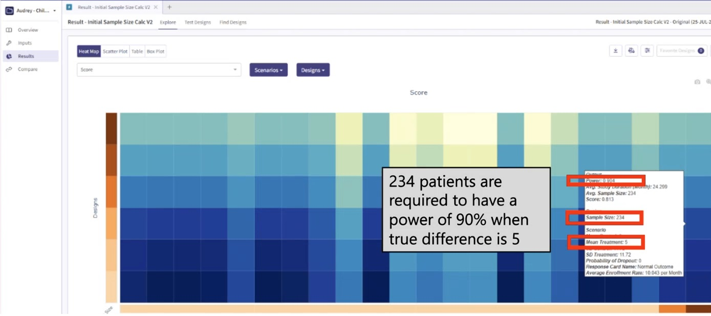
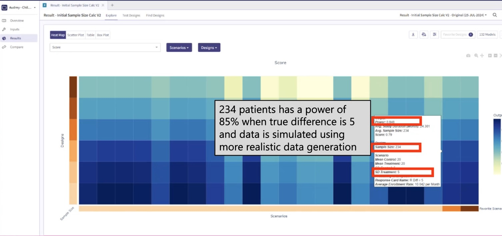
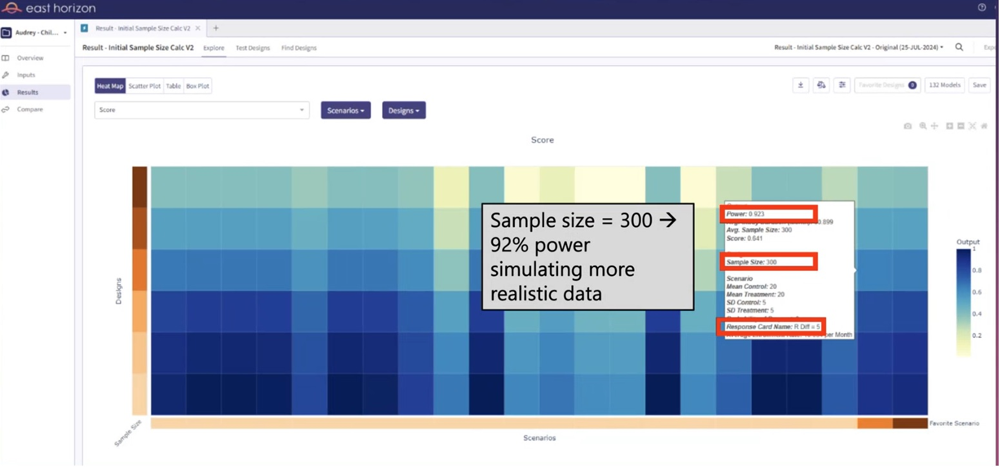
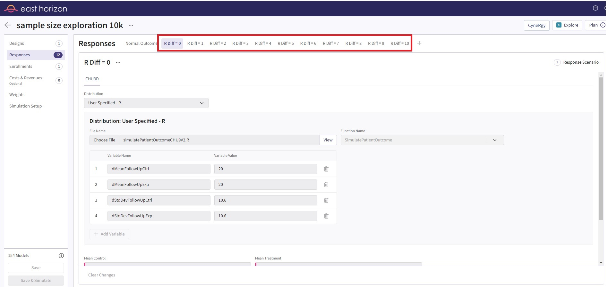
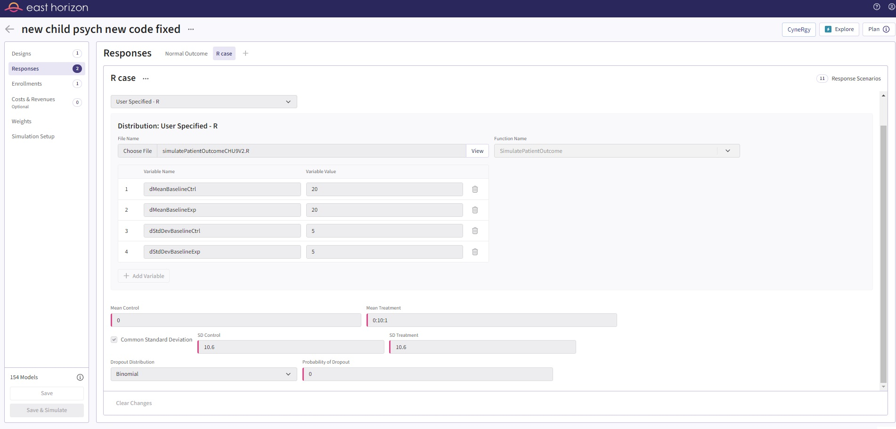

<div class="alert alert-primary" role="alert">
  <p style="margin-bottom:0">This example is related to the <a href="IntegrationPointResponseContinuous.html" class="alert-link"><strong>Integration Point: Response - Continuous Outcome</strong></a>. Click on the link for more information about this integration point.</p>
</div>

# Introduction

In this example, we cover the situation where the patient data simulation (*response* endpoint) needs to be customized to match what is expected in a clinical trial in childhood anxiety.  

The primary outcome in this clinical trial is the change from baseline to follow-up of the Child Health Utility 9D (CHU9D), which is a health-related quality of life measure that assesses health status across nine dimensions for children with anxiety.   This example focuses on developing an approach to simulate the patient data that is realistic and understanding the impact on the power or the study.  Each item in the CHU9D is scored from 1 to 5 and the total of the scores on the 9 elements is the CHU9D.  The higher the total value the lower the quality of life.  Thus, the CHU9D ranges from 9 to 45 and the difference between baseline and follow-up must range between -36 and 36 with all values being an integer value.

To try out this example, start by creating a new project on East Horizon using the **Two Arm Confirmatory** study objective and the **Continuous** endpoint, and then create an input set using the **Explore** task.

Once CyneRgy is installed, you can load this example in RStudio with the following commands:
```{r, eval=FALSE}
CyneRgy::RunExample( "ChildhoodAnxiety" )
```

Running the command above will load the RStudio project in RStudio. 

**RStudio Project File**: [ChildhoodAnxiety.Rproj](https://github.com/Cytel-Inc/CyneRgy/blob/main/inst/Examples/ChildhoodAnxiety/ChildhoodAnxiety.Rproj)

In this example, we first develop the necessary R code to simulate the patient data as well as a script to call the function and plot example data generated with the new function. In this example you will find the following R files:

1. [ChildPsychology.R](https://github.com/Cytel-Inc/CyneRgy/blob/main/inst/Examples/ChildhoodAnxiety/ChildPsychology.R) - This file contains example code that call the patient simulation function. 
2. [ChildPsychologyV2.R](https://github.com/Cytel-Inc/CyneRgy/blob/main/inst/Examples/ChildhoodAnxiety/ChildPsychologyV2.R) - This file contains example code that call the updated patient simulation function. 
3. [SimulatePatientOutcomeCHU9.R](https://github.com/Cytel-Inc/CyneRgy/blob/main/inst/Examples/ChildhoodAnxiety/R/SimulatePatientOutcomeCHU9.R) - This file contains the R code for patient simulation.  This version of the file utilizes the UserParam variable in a way that required many scenario cards to be setup in East Horizon Explore.  
3. [SimulatePatientOutcomeCHU9V2.R](https://github.com/Cytel-Inc/CyneRgy/blob/main/inst/Examples/ChildhoodAnxiety/R/SimulatePatientOutcomeCHU9V2.R) - This file contains the R code for patient simulation.  This version of the function utilizes an improved approach to make better use of the native East Horizon Explore parameters and *UserParam* to make simulation setup much easier.  

This example demonstrates the importance of simulating patient data that is comparable to what is expected when the trial is executed and illustrates the impact this may have on the power of the study.  In addition, it provides some insight into an efficient approach for utilizing the native parameters in East Horizon Explore and the user-defined parameters that may be specified.  

The figure below illustrates where this example fits within the R integration points of Cytel products, accompanied by a flowchart outlining the general steps performed by the R code.

```{r echo=FALSE,  warning=FALSE, fig.retina=3}
CyneRgy::PlotExampleFlowchart(
    lIntPoints = list(
        "Response" = c(
            "Load means and standard deviations (including baselines if V2 of script)", 
            "Loop through patients", 
            "Simulate baseline and follow-up outcomes using normal distributions", 
            "Clamp outcomes to range [9, 45] and compute improvements", 
            "Return improvements as responses"
        )
    )
)
```

# Patient Simulation Function

<div class="alert alert-primary" role="alert">
  <p style="margin-bottom:0"> This example is related to this R file: <a href="https://github.com/Cytel-Inc/CyneRgy/blob/main/inst/Examples/ChildhoodAnxiety/R/SimulatePatientOutcomeCHU9.R" class="alert-link">SimulatePatientOutcomeCHU9.R</a></p>
</div>

The first step is to create an R function for simulating patient outcomes. In the [ChildPsychology.R](https://github.com/Cytel-Inc/CyneRgy/blob/main/inst/Examples/ChildhoodAnxiety/ChildPsychology.R) file you will find example code that was used to test and call the patient simulation function in  [SimulatePatientOutcomeCHU9.R](https://github.com/Cytel-Inc/CyneRgy/blob/main/inst/Examples/ChildhoodAnxiety/R/SimulatePatientOutcomeCHU9.R). 

First, the script sets up the parameters for the simulation. From East Horizon built-in inputs, it uses the number of subjects (*NumSub*), the treatment each subject receives (*TreatmentID*), and the mean and standard deviation for the two treatments (*Mean* and *StdDev*). User-defined parameters for the mean and standard deviation at follow-up for both the control and experimental groups are also set. Refer to the table below for the definitions of the user-defined parameters used in this example.

|**User parameter**|**Definition**|
|---|------|
|**dMeanFollowUpCtrl**|Mean at follow-up for the control group.|
|**dMeanFollowUpExp**|Mean at follow-up for the experimental group.|
|**dStdDevFollowUpCtrl**|Standard deviation at follow-up for the control group.|
|**dStdDevFollowUpExp**|Standard deviation at follow-up for the experimental group.|

See the [Initial R Code Development](#initial-r-code-developement) section for more information about the user parameters.

The *SimulatePatientOutcome* function is then called with these parameters, and the results are stored in a dataframe, *dfPatientData*. The dataframe contains the *TreatmentID* for each patient and the corresponding simulated patient outcome response.

The script then checks the validity of the simulated data. It verifies that the response values (which represent changes in CHU9D scores) lie within the expected range (-36 to 36), and that the mean responses for the control and experimental groups match the expected values.

As an example, one simulated data set could look like the following:

```{r echo=FALSE}
suppressWarnings( source( "ChildPsychology.R" ) )
```


# Simulation Results

In a clinical trial setting, the sample size and statistical power are key determinants of the study's ability to detect true treatment effects. When we assume a sample size of 234 and a true difference of 5 under normal data distribution, the statistical power is 90%. This power signifies that we have a 90% chance of detecting a true treatment effect, if one exists. As shown in Figure 1, East Horizon Explore was used to compute the power using simulations.

**Figure 1**: Power assuming data is normally distributed


However, the power figure drops when we introduce a more realistic patient simulation method. In this context, the statistical power drops to approximately 85%. This decrease implies that, under these more realistic conditions, we would have an 85% chance of detecting a true treatment effect, given the same sample size of 234 and true treatment difference of 5. See Figure 2.

**Figure 2**: Power assuming realistic patient simulation


Knowing that a sample size of 234 is insufficient under realistic conditions, it would be prudent to conduct further tests with larger sample sizes. For instance, we could run simulations with sample sizes ranging from 240 to 300, increasing in increments of 10. By examining the resulting statistical power for each of these sample sizes utilizing the realistic patient simulation, we could identify the smallest sample size that brings us closest to a desired power of 90%.  These simulations were easily executed in East Horizon Explore and the results are provided in Figure 3.  From Figure 3, we can see that a sample size of 300 yields the desired 90% power.  Thus, the trial should increase the sample size from 234, the required sample size per standard sample size calculations, to 300, the sample size needed under realistic patient simulation. 

**Figure 3**: Sample size determination using realistic patient simulation


If we were to proceed with the original sample size of 234 under realistic conditions, our study would be under powered. Being under powered means that our study would have a reduced likelihood of identifying a significant treatment effect, even if one truly exists. This could potentially lead to the erroneous conclusion that a potentially effective treatment is ineffective, thereby missing an opportunity for treatment advancement.

In summary, while a sample size of 234 yields a power of 90% under normal data distribution, the power decreases to around 85% when we implement a more realistic patient simulation. This highlights the importance of considering realistic conditions when determining the sample size for a study, to ensure adequate power to detect true treatment effects.

# Initial R Code Development

<div class="alert alert-primary" role="alert">
  <p style="margin-bottom:0"> This example is related to this R file: <a href="https://github.com/Cytel-Inc/CyneRgy/blob/main/inst/Examples/ChildhoodAnxiety/R/SimulatePatientOutcomeCHU9.R" class="alert-link">SimulatePatientOutcomeCHU9.R</a></p>
</div>

The initial R code was developed assuming the user would supply additional parameters as user-defined parameters via the *UserParam* variable in the R section of East Horizon to supply the follow-up mean for each treatment and the standard deviation for each treatment arm, since these variables are not native inputs in East Horizon. The *UserParam* is a list that holds user defined parameters. These parameters are used to define the mean and standard deviation of the follow-up scores for both the control group and experimental group in the simulation. Specifically, the *UserParam* list includes the following elements:

- **dMeanFollowUpCtrl**: This parameter represents the mean follow-up score for the control group. It is used to generate simulated patient outcomes for individuals in the control group.
- **dMeanFollowUpExp**: This parameter signifies the mean follow-up score for the experimental group. It is used to generate simulated patient outcomes for individuals in the experimental group.
- **dStdDevFollowUpCtrl**: This parameter denotes the standard deviation of the follow-up scores for the control group. It influences the spread of the simulated patient outcomes around the mean for the control group.
- **dStdDevFollowUpExp**: This parameter indicates the standard deviation of the follow-up scores for the experimental group. It affects the spread of the simulated patient outcomes around the mean for the experimental group.

In the original version of the code, we had to manually create 12 different Response cards to represent the 12 distinct scenarios. This was necessary because the *UserParam* argument in our function was designed to accept only a single value for each variable.  Refer to the table below for the values of the user-defined parameters used in the first card.

|**User parameter**|**Value**|
|---|------|
|**dMeanFollowUpCtrl**|20|
|**dMeanFollowUpExp**|20|
|**dStdDevFollowUpCtrl**|10.6|
|**dStdDevFollowUpExp**|10.6|

The second card has a **dMeanFollowUpExp** value of 19, the third card has 18, and so on, down to 10. For all Response cards, the built-in inputs of East Horizon are described in the table below.

|**East Horizon parameter**|**Name in the code**|**Value**|
|----|----|---|
|**Mean Control**|$Mean [ 0 ]$|20|
|**Mean Treatment**|$Mean [ 1 ]$|20|
|**SD Control**|$StdDev [ 0 ]$|5|
|**SD Treatment**|$StdDev [ 1 ]$|5|

This approach, however, was not only labor-intensive but also presented challenges in terms of data filtering. Specifically, it was difficult to extract and display the desired information from these scenarios. The process of setting up the scenarios and then filtering the results to show what we wanted was cumbersome and inefficient.  See Figure 4 for the initial setup.  

**Figure 4**: Initial input in East Horizon 


# Improved R Code

<div class="alert alert-primary" role="alert">
  <p style="margin-bottom:0"> This example is related to this R file: <a href="https://github.com/Cytel-Inc/CyneRgy/blob/main/inst/Examples/ChildhoodAnxiety/R/SimulatePatientOutcomeCHU9V2.R" class="alert-link">SimulatePatientOutcomeCHU9V2.R</a></p>
</div>

To improve the process, we can use built-in parameters provided by East Horizon, which support the ability to input multiple values for each parameter on a single line (boxes with pink color). This streamlines the process, making it easier to manage and adjust the parameters. Unfortunately, the current *UserParam* list in our script does not offer this capability.

Reflecting on this, it's clear that the original structure of our input during the development phase can significantly impact the ease of design exploration. By considering the user experience and optimizing for efficiency in the early stages of code development, it creates a less cumbersome and more intuitive process. This approach would be particularly beneficial when dealing with complex simulations or data models, where the ability to easily adjust and experiment with different parameters is crucial.

In light of this, we can change the patient simulation function to utilize the *UserParam* in a slightly different way. This change can enhance the flexibility and user-friendliness of our code, making design input and exploration a smoother, more efficient process.  The major change is to use the *UserParam* to input the baseline simulation information, since it stays constant for all scenarios, and utilize the native input from East Horizon (*Mean Treatment* as *0:10:1*) to input the follow-up information, as shown in Figure 5.   This simple improvement allows the user to have just 1 input card and simulate the same scenarios as previously done with 10 cards.   This also makes the native filters and other aspects of East Horizon easier to use.  

**Figure 5**: Updated input in East Horizon 


Refer to the table below for the values of the user-defined parameters used in this improved example.

|**User parameter**|**Value**|
|---|------|
|**dMeanBaselineCtrl**|20|
|**dMeanBaselineExp**|20|
|**dStdDevBaselineCtrl**|5|
|**dStdDevBaselineExp**|5|

For this example, the built-in inputs of East Horizon are described in the table below.

|**East Horizon parameter**|**Name in the code**|**Value**|
|----|----|---|
|**Mean Control**|$Mean [ 0 ]$|0|
|**Mean Treatment**|$Mean [ 1 ]$|0:10:1|
|**SD Control**|$StdDev [ 0 ]$|10.6|
|**SD Treatment**|$StdDev [ 1 ]$|10.6|

*0:10:1* means 0 to 10 with increments of 1.
