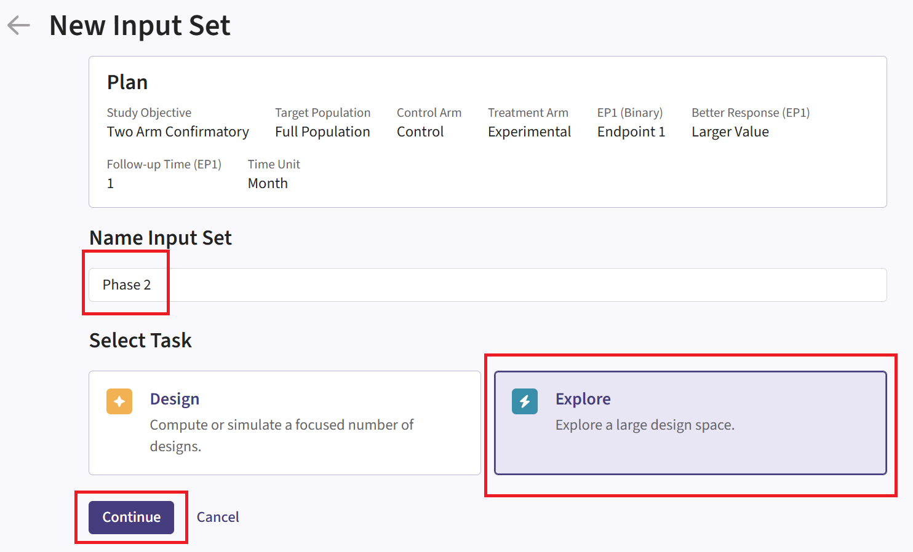
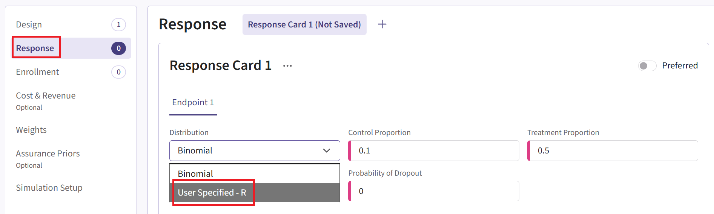
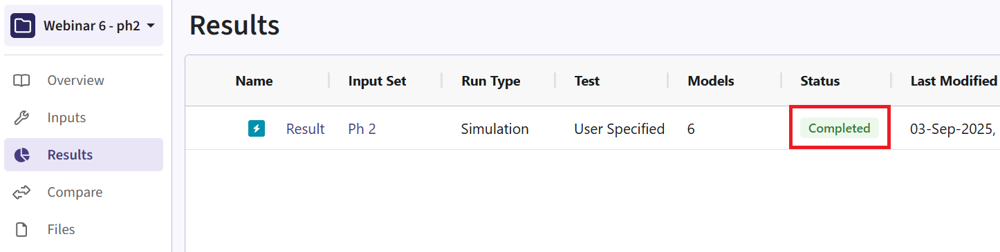

  
The following scripts are related to the <a href="IntegrationPointAnalysis.html" class="alert-link"><strong>Integration Point: Analysis</strong></a>, the <a href="IntegrationPointResponse.html" class="alert-link"><strong>Integration Point: Response</strong></a>, and the <a href="IntegrationPointInitialization.html" class="alert-link"><strong>Integration Point: Initialization</strong></a>. Click on the links for more information about these integration points.

# Introduction

This example demonstrates the computation of conditional probability of success in consecutive studies through the integration of R with Cytel products by using custom R scripts for the **Response (Patient Simulation)** and the **Analysis** integration points. The examples feature a sequential design involving a Phase 2 trial followed by a Phase 3 trial, both with a binary endpoint. Specifically, we compute the conditional assurance of Phase 3 given success in Phase 2. It illustrates how simulation results from Phase 2 can be saved, transferred, and reused to inform Phase 3. This type of simulation is particularly relevant in drug development, where Phase 3 trials are costly and resource-intensive.

## Why do we need R Integration for this example?

(...)

By combining the R functions described below with the East Horizon native inputs, users are able to simulate and compute the probability of success of each simulated trial. Users will also continue to benefit from East Horizon’s output visualizations – with the caveat that the Conditional Probability of Success metric will be labeled as “Power” in the native outputs of East Horizon.

## What do the R functions do?

In the [R directory of this example](https://github.com/Cytel-Inc/CyneRgy/tree/main/inst/Examples/ConsecutiveStudiesBinary/R) you will find the following R files:

- **[AnalyzeUsingEastManualFormula.R](https://github.com/Cytel-Inc/CyneRgy/blob/main/inst/Examples/ConsecutiveStudiesBinary/R/AnalyzeUsingEastManualFormula.R)**

   This R file is used for the **Analysis** integration point of Phase 2 only. It contains a function that performs the analysis the same way as East Horizon, but also saves relevant outputs.

   For more information on this function, see the [Analysis Integration Point](#analysis-integration-point) section below.

- **[SimulatePatientOutcomeBinaryWithAssurance.R](https://github.com/Cytel-Inc/CyneRgy/blob/main/inst/Examples/ConsecutiveStudiesBinary/R/SimulatePatientOutcomeBinaryWithAssurance.R)**

   This R file is used for the **Response (Patient Simulation)** integration point of the Phase 2 study only. It contains a function that...

   For more information on this function, see the [Response (Patient Simulation) Integration Point](#response-patient-simulation-integration-point) section of the Phase 2 study below.
   
- **[SimulatePatientOutcomeBinaryWithAssurancePh3.R](https://github.com/Cytel-Inc/CyneRgy/blob/main/inst/Examples/ConsecutiveStudiesBinary/R/SimulatePatientOutcomeBinaryWithAssurancePh3.R)**

   This R file is used for the **Response (Patient Simulation)** integration point of the Phase 3 study only. It contains a function that...

   For more information on this function, see the [Response (Patient Simulation) Integration Point](#response-patient-simulation-integration-point-1) section of the Phase 3 study below.

------

# Step-by-Step Instructions

Before starting, make sure you have the required tools and files.

1. [East Horizon](https://platform.cytel.com)
2. Download R Files from our public Github repo: [AnalyzeUsingEastManualFormula.R](https://github.com/Cytel-Inc/CyneRgy/blob/main/inst/Examples/ConsecutiveStudiesBinary/AnalyzeUsingEastManualFormula.R), [SimulatePatientOutcomeBinaryWithAssurance.R](https://github.com/Cytel-Inc/CyneRgy/blob/main/inst/Examples/ConsecutiveStudiesBinary/SimulatePatientOutcomeBinaryWithAssurance.R) and [SimulatePatientOutcomeBinaryWithAssurancePh3](https://github.com/Cytel-Inc/CyneRgy/blob/main/inst/Examples/ConsecutiveStudiesBinary/SimulatePatientOutcomeBinaryWithAssurancePh3).

## New Project Page

1. On East Horizon, create a new project with a binary endpoint.

{width=300px}

In this example, we will create two different input sets: one for the Phase 2 study and one for the Phase 3 study.

## Phase 2 Study

### New Input Set Page

2. Navigate to the Inputs tab, and create a new input set using the Explore task. Add phase 2 details.

{width=300px}

### Design Page

3. Click on the input set you just created, then select “User Specified – R” in the Test field.

{width=800px}

4. Click the pencil icon to open the R Integration pop-up window.

5. Click on “Select File” and then on “Continue”.

{width=800px}

6. Select the file **AnalyzeUsingEastManualFormula.R**.

7. Check that the correct file has been imported and the correct Function Name has been specified by the system. Click on the “Save” button to exit the R Integration details window.

{width=300px}

### Response Page

8. Navigate to the Response page and the relevant response card, and then select “User Specified – R” in the Distribution field.

{width=800px}

9. Click on the pencil icon to open the R Integration pop-up window.

10.	Click on “Select File” and then on “Continue”.

{width=800px}

11. Select the file **SimulatePatientOutcomeBinaryWithAssurance.R**.

12. Check that the correct file has been imported and the correct Function Name has been specified by the system. Note that the User Parameter variables have been automatically pulled from the R function that was imported.

13. Fill the parameter values to define the Beta distribution that you are using. In our case, we use the example values below. See the [Response Integration Point](#response-integration-point) section below for more information about these variables.

Note that in this example, we used Beta priors but you could use any other distribution by changing the R code to sample from a different one on lines 37 and 38 of the file. 

{width=300px}

14. Click on the “Save” button to exit the R Integration details window.

### Simulation Setup Page

15. Specify the number of simulation runs as needed. You can choose any number you require. For the Phase 2 input set, it is recommended to run as many simulations as possible (e.g., 20,000). This is because Phase 3 will only use data from successful Phase 2 trials, so the more simulations you run, the larger the pool of usable trials for Phase 3.

{width=800px}

16. Check the box to “Generate Data File for All Simulated Models”.

{width=800px}

17. Click the "Save & Simulate" button.

{width=400px}

18. Confirm by clicking on "Simulate" in the pop-up window, and wait for the simulation runs to finish.

{width=500px}

### Results Page

19. Navigate to the Results tab, then check whether the Phase 2 simulation failed or was completed by looking at the Status column.

{width=600px}

20. If the simulation failed, open the Log window to see if there are any helpful error messages.

   a. Click on the “?” icon in the top right corner of your screen.
    
{width=800px}
    
   b. Click on “Log”.
    
{width=200px}
    
   c. Identify any errors that appear. For example:
    
{width=300px}

21. If the simulation has completed, click on the Result name. If you have multiple scenarios in your simulation, you will be prompted to label at least one scenario from the list. Alternatively, you may also skip this step by selecting the “Skip” button in the bottom left corner.

{width=500px}

22. The Explore page of the results appears. You will notice a checkbox on the left side of each row in the table, below the heatmap. Click on the box of model that generated the data using your prior distribution, e.g.:

{width=800px}

23. Now click on Download dropdown menu, that is in the top right of the screen, and Summary Statistics option. Wait until the file is downloaded.

{width=800px}

24. Open the downloaded file in Excel. Filter the Decision column (column F) to only show rows with “Efficacy”. This will keep only one row per trial, removing the rows with no decision at interim.

{width=400px}

25. Save this subset of the data and copy paste the values of the True Prob Control and True Prob Experimental into the LoadData function in the SimulatePatientOutcomeBinaryWithAssurancePh3.R file – you will see mine at the bottom of the file, you can replace my values with yours.

** complete this

## Phase 3 Study

### New Input Set Page

26. Navigate to the Inputs tab again, and create a new input set using the Explore task. Add Phase 3 details.

{width=300px}

### Design Page

27. Click on the input set you just created. For Phase 3, it is not needed to customize the Analysis element unless you want to use its simulation data for an additional phase.

### Response Page

28. Navigate to the Response page and the relevant response card of the Phase 3 input set, and then select “User Specified – R” in the Distribution field.

{width=800px}

29. Click on the pencil icon to open the R Integration pop-up window.

30.	Click on “Select File” and then on “Continue”.

{width=800px}

31. Select the file **SimulatePatientOutcomeBinaryWithAssurancePh3.R** that we updated at Step 25.

32. Check that the correct file has been imported and the correct Function Name has been specified by the system. Click on the “Save” button to exit the R Integration details window.

{width=400px}

33. Click on the “Save” button to exit the R Integration details window.

### Simulation Setup Page

34. Simulate the input set the same way as described before. See Steps 15 to 18 for more information. However, for Phase 3, we recommend choosing a lower number of simulations (e.g., 10,000). This is because the simulation will fail when specifying a number of simulation higher than the number of successful Phase 2 trials. In our case, it was about 13,000.

### Results Page

35. Load the results as described before (see steps 19 to 21 for more information). In the Explore page of the results, hover over each cell in the heatmap to see a summary of the outputs. Because of our custom R scripts, the result “Power” is actually now equivalent to the Conditional Probability of Success of the Phase 3 study, i.e., the probability that Phase 3 succeeds given that Phase 2 succeeded.

** + more information on results, maybe another screenshot

See the [Results](#results) section below for more information.

------

# Technical Information and Example Values

## Phase 2 Study

For Phase 2, we customize both response and analysis integration points.

### Response (Patient Simulation) Integration Point

  
 This endpoint is related to this R file: <a href="https://github.com/Cytel-Inc/CyneRgy/blob/main/inst/Examples/ConsecutiveStudiesBinary/R/SimulatePatientOutcomeBinaryWithAssurance.R" class="alert-link">SimulatePatientOutcomeBinaryWithAssurance.R</a>

Using the file above, the Response element of the Phase 2 study is customized to generate patient outcomes for a binary response trial while incorporating uncertainty about the true response rates by sampling them from prior distributions. Here, we use a **Beta distribution** prior. However, you could use any other distribution by changing the R code to sample from a different one on lines 37 and 38 of the file. 

For each arm, the true response probability is drawn from a Beta distribution:

$$
\pi_\text{ctrl} \sim \text{Beta}(\alpha_\text{ctrl}, \beta_\text{ctrl})
$$

$$
\pi_\text{exp} \sim \text{Beta}(\alpha_\text{exp}, \beta_\text{exp})
$$

where $\alpha_\text{ctrl}$, $\beta_\text{ctrl}$, $\alpha_\text{exp}$, $\beta_\text{exp}$ are the parameters of the Beta distributions and can be user-defined. Refer to the table below for the values of the user-defined parameters and some example values.

|**User parameter**|**Definition**|**Example Value**|
|---|------|---|
|**dParameter1Ctrl**|Parameter 1 of the Beta distribution for control arm ($\alpha_\text{ctrl}$)|25|
|**dParameter2Ctrl**|Parameter 2 of the Beta distribution for control arm ($\beta_\text{ctrl}$)|75|
|**dParameter1Exp**|Parameter 1 of the Beta distribution for experimental arm ($\alpha_\text{exp}$)|40|
|**dParameter2Exp**|Parameter 2 of the Beta distribution for experimental arm ($\beta_\text{exp}$)|60|

These two true response probabilities are returned as outputs **TrueProbabilityControl** and **TrueProbabilityExperimental** at the end of the R function. This is important because this is why these variables will then be included in the *SimData* variable and picked up in the Phase 2 Analysis script, and finally appear in the Phase 2 results CSV file. They are later reused in Phase 3 by loading the saved values. See Steps 24 and 25 of the [Step-by-Step Instructions](#step-by-step-instructions) section for more information on the loading process.

Then, each patient's binary outcome is drawn from a Bernoulli distribution:

$$
Y_i \sim \text{Bernoulli}(\pi_j)
$$

where $Y_i \in \{0,1\}$ is the binary response, and $\pi_j$ is the true response probability ($\pi_\text{ctrl}$ or $\pi_\text{exp}$ depending whether the patient $i$ is in the control or experimental arm).

### Analysis Integration Point

  
 This endpoint is related to this R file: <a href="https://github.com/Cytel-Inc/CyneRgy/blob/main/inst/Examples/ConsecutiveStudiesBinary/R/AnalyzeUsingEastManualFormula.R" class="alert-link">AnalyzeUsingEastManualFormula.R</a>

The analysis is the same as East Horizon, based on formulas of the **Chapter 24: Binomial Superiority Two‐Sample** from the East manual (24.2). No user parameter is used for this integration point.

**Test Statistic:**

$$Z_j = \frac{\hat{\pi}_{tj} - \hat{\pi}_{cj}}{\sqrt{\hat{\pi}_j \cdot (1 - \hat{\pi}_j) \cdot ( \frac{1}{n_{tj}} + \frac{1}{n_{cj}} )}}$$

Where:

- $\hat{\pi}_{tj}$ and $\hat{\pi}_{cj}$ are the observed response rate at the jth interim look in the treatment and control groups, respectively.
- $n_{tj}$ and $n_{cj}$ are the numbers of patients at the jth interim look in the treatment and control groups, respectively.
- $\hat{\pi}_{j} = \frac{n_{tj} \cdot \hat{\pi}_{tj} + n_{cj} \cdot \hat{\pi}_{cj}}{n_{tj} + n_{cj}}$ is the pooled response rate estimate.

In the R script, the **TrueProbabilityControl** and **TrueProbabilityExperimental** that were generated in the Response section are loaded from *SimData* outputs, and returned at the end function. This is important because these variables will appear in the Phase 2 results and will be saved to a CSV file. They will later be reused in Phase 3 by loading the saved values. See Steps 24 and 25 of the [Step-by-Step Instructions](#step-by-step-instructions) section for more information on the loading process.

## Phase 3 Study

For Phase 3, we only customize the response integration point.

### Response (Patient Simulation) Integration Point

  
 This endpoint is related to this R file: <a href="https://github.com/Cytel-Inc/CyneRgy/blob/main/inst/Examples/ConsecutiveStudiesBinary/R/SimulatePatientOutcomeBinaryWithAssurancePh3.R" class="alert-link">SimulatePatientOutcomeBinaryWithAssurancePh3.R</a>

Using the file above, the Response element of the Phase 3 study is customized. Here, instead of sampling from a Beta distribution, we use the true response rates informed by the Phase 2 study to compute the conditional probability of success. This is the probability that Phase 3 succeeds given that Phase 2 succeeded. The *LoadData* function is used to load the results of the Phase 2 study. See Steps 24 and 25 of the [Step-by-Step Instructions](#step-by-step-instructions) section for more information about how to load your own results.

(...)

# Results

(...)

