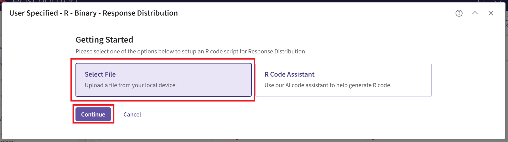
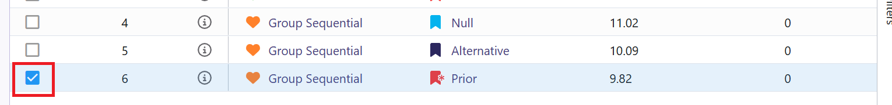

<div class="alert alert-primary" role="alert">
  <p style="margin-bottom:0">The following scripts are related to the <a href="IntegrationPointAnalysis.html" class="alert-link"><strong>Integration Point: Analysis</strong></a>, the <a href="IntegrationPointResponse.html" class="alert-link"><strong>Integration Point: Response</strong></a>, and the <a href="IntegrationPointInitialization.html" class="alert-link"><strong>Integration Point: Initialization</strong></a>. Click on the links for more information about these integration points.</p>
</div>

# Introduction

This example demonstrates the computation of conditional probability of success in consecutive studies by using custom R scripts for the **Response (Patient Simulation)** and the **Analysis** integration points of East Horizon. It features a sequential trial program involving a Phase 2 trial followed by a Phase 3 trial, both with the same binary endpoint. We show how Phase 2 results are simulated, saved, and then used as the prior data for Phase 3, allowing the Phase 3 patient outcomes to be generated only conditional on the Phase 2 trial's success. This approach illustrates how simulations can mimic using an earlier trial's data to directly inform subsequent trials, which is particularly valuable in drug development where Phase 3 studies are expensive and resource-intensive.

*Note: The conditional probability of success of the Phase 3 trial can be computed and used for comparisons directly within East Horizon's native output visualizations. However, users must process the data externally in a post-processing manner to compute the probability of success of the program, which may also be of interest when evaluating whether to run the combination of Phase 2 and Phase 3 trials.*

## Why do we need R Integration for this example?

The decision to move forward with certain trials is relying more and more on the computation of the trial's probability of success and the optimization of parameters that will boost it. To identify a realistic probability of success, though, can be difficult without having sufficient prior knowledge of the treatment in question. Data from previous historical studies is not always readily accessible to many clinicians that are tasked with this type of decision-making. 

Simulations and creating this prior data through the combination of R functions with the East Horizon product can help alleviate this gap in knowledge and help clinical teams decide to invest in an entire program of trials (e.g. a Phase 2 followed by a Phase 3) rather than just one confirmatory trial (e.g. only move forward with a Phase 3). 

By combining the R functions described below with the East Horizon native inputs, users are able to simulate data taking into account uncertainty around their scenario's assumptions, pass generated data from the first trial in a program to the inputs of the second trial's simulation, and then compute the probability of success of each simulated trial as well as the program's probability of success overall. Users will also continue to benefit from East Horizon’s output visualizations for each trial – with the caveat that the Probability of Success & Conditional Probability of Success metrics will be labeled as “Power” in the native outputs of East Horizon.

R Integration is required for this type of trial design because East Horizon does not natively support transferring results from one trial's simulations to another. The R functions created for this example enable users to leverage simulated data from one simulation into a following simulation's inputs. 

## What do the R functions do?

In the [R directory of this example](https://github.com/Cytel-Inc/CyneRgy/tree/main/inst/Examples/ConsecutiveStudiesBinary/R) you will find the following R files:

- **[SimulatePatientOutcomeBinaryWithAssurance.R](https://github.com/Cytel-Inc/CyneRgy/blob/main/inst/Examples/ConsecutiveStudiesBinary/R/SimulatePatientOutcomeBinaryWithAssurance.R)**

   This R file is used for the **Response (Patient Simulation)** integration point of the Phase 2 study. It contains a function that generates patient outcomes for a binary response trial while incorporating uncertainty about the true response rates, for the control and treatment arms, by sampling them from a **Beta distribution** prior.

   For more information on this function, see the [Response (Patient Simulation) Integration Point](#response-patient-simulation-integration-point) section of the Phase 2 study below.
   
- **[AnalyzeUsingEastManualFormula.R](https://github.com/Cytel-Inc/CyneRgy/blob/main/inst/Examples/ConsecutiveStudiesBinary/R/AnalyzeUsingEastManualFormula.R)**

   This R file is used for the **Analysis** integration point of the Phase 2 study. It contains a function that performs the analysis the same way as East Horizon, but additionally saves relevant outputs required for the Phase 3 simulation.

   For more information on this function, see the [Analysis Integration Point](#analysis-integration-point) section of the Phase 2 study below.
   
- **[SimulatePatientOutcomeBinaryWithAssurancePh3.R](https://github.com/Cytel-Inc/CyneRgy/blob/main/inst/Examples/ConsecutiveStudiesBinary/R/SimulatePatientOutcomeBinaryWithAssurancePh3.R)**

   This R file is used for the **Response (Patient Simulation)** integration point of the Phase 3 study. It contains a function that generates patient outcomes for a binary response trial. This time, we sample the true response rates from the posterior distribution obtained from the Phase 2 simulations.

   For more information on this function, see the [Response (Patient Simulation) Integration Point](#response-patient-simulation-integration-point-1) section of the Phase 3 study below.
   
- **[PostProcess.R](https://github.com/Cytel-Inc/CyneRgy/blob/main/inst/Examples/ConsecutiveStudiesBinary/R/PostProcess.R)**

   This R file is run directly in RStudio to load the Phase 2 results and to insert them into the SimulatePatientOutcomeBinaryWithAssurancePh3.R file so they can be used for the Phase 3 study.

   For more information on how to load your own results, see Steps 24 and 25 of the [Step-by-Step Instructions](#step-by-step-instructions) section below.

------

# Step-by-Step Instructions

Before starting, make sure you have the required tools and files.

* [East Horizon](https://platform.cytel.com)
* Download R Files from our public Github repo: [AnalyzeUsingEastManualFormula.R](https://github.com/Cytel-Inc/CyneRgy/blob/main/inst/Examples/ConsecutiveStudiesBinary/AnalyzeUsingEastManualFormula.R), [SimulatePatientOutcomeBinaryWithAssurance.R](https://github.com/Cytel-Inc/CyneRgy/blob/main/inst/Examples/ConsecutiveStudiesBinary/SimulatePatientOutcomeBinaryWithAssurance.R), [SimulatePatientOutcomeBinaryWithAssurancePh3](https://github.com/Cytel-Inc/CyneRgy/blob/main/inst/Examples/ConsecutiveStudiesBinary/SimulatePatientOutcomeBinaryWithAssurancePh3), and [PostProcess.R](https://github.com/Cytel-Inc/CyneRgy/blob/main/inst/Examples/ConsecutiveStudiesBinary/R/PostProcess.R).
* RStudio with CyneRgy installed: `remotes::install_github( "Cytel-Inc/CyneRgy@main" )`.

## New Project Page

1. On East Horizon, create a new project with a binary endpoint.

{width=300px}

In this example, we will create two different input sets: one for the Phase 2 study and one for the Phase 3 study.

## Phase 2 Study

### New Input Set Page

2. Navigate to the Inputs tab, and create a new input set using the Explore task. Rename the input set as "Phase 2".

{width=300px}

### Design Page

3. Within the input set you just created, create an input card, and enter the Phase 2 details, e.g. sample size. Then select the “User Specified – R” option in the Test field.

{width=800px}

4. Click the pencil icon to open the R Integration pop-up window.

5. Click on “Select File” and then on “Continue”.

{width=800px}

6. Select the file **AnalyzeUsingEastManualFormula.R**.

7. Check that the correct file has been imported and the correct Function Name has been specified by the system. Click on the “Save” button to exit the R Integration details window.

{width=300px}

### Response Page

8. Navigate to the Response page, create an input card, and then select “User Specified – R” in the Distribution field.

{width=800px}

9. Click on the pencil icon to open the R Integration pop-up window.

10.	Click on “Select File” and then on “Continue”.

{width=800px}

11. Select the file **SimulatePatientOutcomeBinaryWithAssurance.R**.

12. Check that the correct file has been imported and the correct Function Name has been specified by the system. Note that the User Parameter variables have been automatically pulled from the R function that was imported.

13. Fill the parameter values to define the Beta distribution that you would like to use to generate patient outcome data for the Phase 2 trial. In our case, we use the example values below. See the [Response Integration Point](#response-integration-point) section below for more information about these variables.

Note that in this example, we used Beta priors but you could use any other distribution by changing the R code to sample from a different one on lines 29 and 30 of the file. 

{width=300px}

14. Click on the “Save” button to exit the R Integration details window.

### Simulation Setup Page

15. Specify the number of simulation runs as needed. You can select any number from the dropdown list as you require. For the Phase 2 input set, it is recommended to run as many simulations as possible (e.g., 20,000). This is because the Phase 3 simulation will only use data from successful Phase 2 trials, so the more simulations you run, the larger the pool of usable response rates for Phase 3's data generation.

{width=800px}

16. Check the box to “Generate Data File for All Simulated Models”.

{width=800px}

17. Click the "Save & Simulate" button.

{width=400px}

18. Confirm by clicking on "Simulate" in the pop-up window, and wait for the simulation runs to finish.

{width=500px}

### Results Page

19. Navigate to the Results tab, then check whether the Phase 2 simulation failed or was completed by looking at the Status column.

{width=600px}

20. If the simulation failed, open the Log window to see if there are any helpful error messages.

   a. Click on the “?” icon in the top right corner of your screen. 
    
{width=800px}
    
   b. Click on “Log”.
    
{width=200px}
    
   c. Identify any errors that appear. For example:
    
{width=200px}

21. If the simulation has completed, click on the Result Set's name to open the outputs within East Horizon. If you have multiple scenarios in your simulation, you will be prompted to label at least one scenario from the list by clicking the ribbon icon in the Favorites column and assigning it a name and color. Alternatively, you may also skip this step by selecting the “Skip” button in the bottom left corner.

{width=400px}

22. The Explore page of the results appears. You will notice a checkbox on the left side of each row in the table, below the heatmap. Click on the checkbox of the model you'd like to use as your first trial in your program. In our example, we chose the model that generated the data using our beta prior distributions, e.g.:

{width=800px}

23. Now click on the Download dropdown menu, that is in the top right of the screen, and the Summary Statistics option. Wait until the file is downloaded and rename it to **Ph2_results.csv**.

{width=800px}

24. Open the file **PostProcess.R** in RStudio. Locate the "TO DO" comments: verify that both file paths are correct and accessible from RStudio. If either path is incorrect or inaccessible, update it to enable RStudio to read the files correctly.

**Ph2_results.csv** should be the file you just downloaded from East Horizon. Alternatively, you can use the example file provided in the `R/Outputs` directory of this example if you want to test the workflow with our example data.

{width=500px}

25. Run the script. It should load the Phase 2 results, process them (including filtering on only the successful simulated trials), and then insert the true probabilities of each arm into **SimulatePatientOutcomeBinaryWithAssurancePh3.R**. After running, confirm that the script executed without errors and that the simulation file has been updated (by checking the last modified timestamp of the file).

{width=500px}

## Phase 3 Study

### New Input Set Page

26. In East Horizon, navigate to the Inputs tab again, and create a new input set using the Explore task. Rename the input set as "Phase 3".

{width=300px}

### Design Page

27. Within the input set you just created, create an input card, and enter the Phase 3 details, e.g. sample size. For Phase 3, it is not necessary to customize the Analysis element unless you want to use its simulation data for an additional phase.

### Response Page

28. Navigate to the Response page, create an input card, and then select “User Specified – R” in the Distribution field.

{width=800px}

29. Click on the pencil icon to open the R Integration pop-up window.

30.	Click on “Select File” and then on “Continue”.

{width=800px}

31. Select the file **SimulatePatientOutcomeBinaryWithAssurancePh3.R** that you updated using RStudio in Steps 24-25.

32. Check that the correct file has been imported and the correct Function Name has been specified by the system.

{width=400px}

33. Click on the “Save” button to exit the R Integration details window.

### Simulation Setup Page

34. Simulate the input set the same way as described before. See Steps 15 to 18 for more information. However, for Phase 3, we recommend choosing a lower number of simulations (e.g., 10,000). This is because the simulation will fail when specifying a number of simulation higher than the number of successful Phase 2 trials. In our case, it was about 13,000.

### Results Page

35. Load the results as described before (see steps 19 to 21 for more information). In the Explore page of the results, hover over each cell in the heatmap to see a summary of the outputs. Because of our custom R scripts, the result printed as “Power” is actually now equivalent to the Conditional Probability of Success of the Phase 3 study, i.e., the probability that Phase 3 succeeds given that Phase 2 succeeded.

{width=350px}

See the [Results](#results) section below for more information.

------

# Technical Information and Example Values

## Phase 2 Study

For the Phase 2 study, we customize both Response and Analysis integration points. The figure below illustrates where everything fits within the R integration points of Cytel products, accompanied by flowcharts outlining the general steps performed by the R code.

```{r echo=FALSE,  warning=FALSE, fig.retina=3}
CyneRgy::PlotExampleFlowchart(
    lIntPoints = list(
        "Response" = c(
            "Load Beta distribution parameters", 
            "Sample true probability of response using Beta prior",
            "Sample patient binary outcomes from a Bernoulli distribution",
            "Return patient responses and true response probabilities"
        ),
        "Analysis" = c(
            "Load patient responses and true response probabilities",
            "Calculate Z-statistic using East formula (same way as East Horizon)", 
            "Return decision and true response probabilities (will be part of Phase 2 results)"
        )
    )
)
```

### Response (Patient Simulation) Integration Point

<div class="alert alert-primary" role="alert">
  <p style="margin-bottom:0"> This endpoint is related to this R file: <a href="https://github.com/Cytel-Inc/CyneRgy/blob/main/inst/Examples/ConsecutiveStudiesBinary/R/SimulatePatientOutcomeBinaryWithAssurance.R" class="alert-link">SimulatePatientOutcomeBinaryWithAssurance.R</a></p>
</div>

Using the file above, the Response element of the Phase 2 study is customized to generate patient outcomes for a binary response trial while incorporating uncertainty about the true response rates by sampling them from prior distributions. Here, we use a **Beta distribution** prior. However, you could use any other distribution by changing the R code to sample from a different one on lines 29 and 30 of the file.

{width=500px}

For each arm, the true response probability is drawn from a Beta distribution:

$$
\pi_\text{ctrl} \sim \text{Beta}(\alpha_\text{ctrl}, \beta_\text{ctrl})
$$

$$
\pi_\text{exp} \sim \text{Beta}(\alpha_\text{exp}, \beta_\text{exp})
$$

where $\alpha_\text{ctrl}$, $\beta_\text{ctrl}$, $\alpha_\text{exp}$, $\beta_\text{exp}$ are the parameters of the Beta distributions and can be user-defined. Refer to the table below for the values of the user-defined parameters and some example values.

|**User parameter**|**Definition**|**Example Value**|
|---|------|---|
|**dParameter1Ctrl**|Parameter 1 of the Beta distribution for control arm ($\alpha_\text{ctrl}$)|25|
|**dParameter2Ctrl**|Parameter 2 of the Beta distribution for control arm ($\beta_\text{ctrl}$)|75|
|**dParameter1Exp**|Parameter 1 of the Beta distribution for experimental arm ($\alpha_\text{exp}$)|40|
|**dParameter2Exp**|Parameter 2 of the Beta distribution for experimental arm ($\beta_\text{exp}$)|60|

These two true response probabilities are returned as outputs **TrueProbabilityControl** and **TrueProbabilityExperimental** at the end of the R function. This is important because this is why these variables will then be included in the *SimData* list of variables and picked up in the Phase 2 Analysis script, and finally appear in the Phase 2 results CSV file, which is downloadable from East Horizon. They are later reused in Phase 3 by loading the saved values. See Steps 24 and 25 of the [Step-by-Step Instructions](#step-by-step-instructions) section for more information on the loading process.

Then, each patient's binary outcome is drawn from a Bernoulli distribution:

$$
Y_i \sim \text{Bernoulli}(\pi_j)
$$

where $Y_i \in \{0,1\}$ is the binary response, and $\pi_j$ is the true response probability ($\pi_\text{ctrl}$ or $\pi_\text{exp}$ depending whether the patient $i$ is in the control or experimental arm).


### Analysis Integration Point

<div class="alert alert-primary" role="alert">
  <p style="margin-bottom:0"> This endpoint is related to this R file: <a href="https://github.com/Cytel-Inc/CyneRgy/blob/main/inst/Examples/ConsecutiveStudiesBinary/R/AnalyzeUsingEastManualFormula.R" class="alert-link">AnalyzeUsingEastManualFormula.R</a></p>
</div>

The analysis is the same as East Horizon, based on formulas of the **Chapter 24: Binomial Superiority Two‐Sample** from the East manual (24.2). No user-defined parameter is required for this integration point.

**Test Statistic:**

$$Z_j = \frac{\hat{\pi}_{tj} - \hat{\pi}_{cj}}{\sqrt{\hat{\pi}_j \cdot (1 - \hat{\pi}_j) \cdot ( \frac{1}{n_{tj}} + \frac{1}{n_{cj}} )}}$$

Where:

- $\hat{\pi}_{tj}$ and $\hat{\pi}_{cj}$ are the observed response rate at the jth interim look in the treatment and control groups, respectively.
- $n_{tj}$ and $n_{cj}$ are the numbers of patients at the jth interim look in the treatment and control groups, respectively.
- $\hat{\pi}_{j} = \frac{n_{tj} \cdot \hat{\pi}_{tj} + n_{cj} \cdot \hat{\pi}_{cj}}{n_{tj} + n_{cj}}$ is the pooled response rate estimate.

In the R script, the **TrueProbabilityControl** and **TrueProbabilityExperimental** that were generated in the Response section are loaded from *SimData* outputs, and returned at the end function. This is important because these variables will appear in the Phase 2 results and will be saved to a CSV file. They will later be reused in Phase 3 by loading the saved values as the input for the response generation step in the simulations. See Steps 24 and 25 of the [Step-by-Step Instructions](#step-by-step-instructions) section for more information on the loading process.

## Phase 3 Study

For Phase 3, we customize the Response integration point only. The figure below illustrates where everything fits within the R integration points of Cytel products, accompanied by flowcharts outlining the general steps performed by the R code.

```{r echo=FALSE,  warning=FALSE, fig.retina=3}
CyneRgy::PlotExampleFlowchart(
    lIntPoints = list(
        "Response" = c(
            "Load Phase 2 posterior probabilities", 
            "Sample one pair of true probabilities for both arms",
            "Simulate patient-level binary outcomes using rbinom()",
            "Return patient responses"
        )
    )
)
```

### Response (Patient Simulation) Integration Point

<div class="alert alert-primary" role="alert">
  <p style="margin-bottom:0"> This endpoint is related to this R file: <a href="https://github.com/Cytel-Inc/CyneRgy/blob/main/inst/Examples/ConsecutiveStudiesBinary/R/SimulatePatientOutcomeBinaryWithAssurancePh3.R" class="alert-link">SimulatePatientOutcomeBinaryWithAssurancePh3.R</a></p>
</div>

Using the file above, the Response element of the Phase 3 study is customized to generate patient outcomes for a binary response trial while incorporating uncertainty about the true response rates by **sampling them from the posterior distribution obtained from the successful Phase 2 simulated trials**. In this case, the posterior values are inserted directly into the *LoadData* function as pairs of true response probabilities for control and experimental arms. Each simulated trial samples one pair and uses it to generate patient-level outcomes with rbinom().

See Steps 24 and 25 of the [Step-by-Step Instructions](#step-by-step-instructions) section for more information about how to load your own results.

This part of the program simulation could also be replaced by including actual data from a previous Phase 2 trial to inform the Phase 3 simulation. This is, in practice, what one would do when deciding whether to move forward with the Phase 3 trial once the Phase 2 completes and the data has been collected and analysed. 

# Results

By simulating the entire program, this example helps decision-makers that are investigating whether it will be worth investing in the program, as a whole, including a smaller Phase 2 trial to precede a larger Phase 3 trial. This program could be compared to running simply the Phase 3 trial with a vague prior distribution, like perhaps the one used in our example for the Phase 2 simulation, or running the Phase 3 trial without prior knowledge and only an assumed value for the response rates of the control and treatment arm. 

When comparing these options through simulating each scenario, we noticed that the Conditional Probability of Success of the combined program was about 10% higher than the Probability of Success of only running a Phase 3 trial with a vague prior distribution. This suggested that, with the assumptions included in our example, it was indeed worth investing further resources into a small Phase 2 before running a Phase 3. 

To extend this analysis, one could also compute the Probability of Success of the entire program by combining the Probability of Success of the Phase 2 with the Probability of Success of the Phase 3, and then compare this new metric to the original Probability of Success of running only a Phase 3 trial. This may give clinical teams even more oversight into the benefits of committing to a more expensive and longer program for the higher chance of proving their treatment is working as expected, and that the treatment arm's patients indeed show health benefits over the control arm's patients. 
