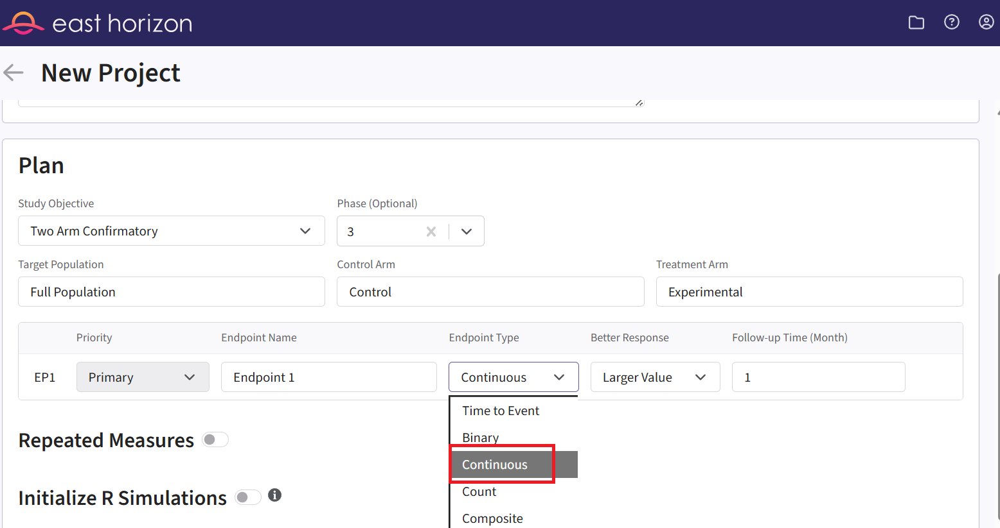
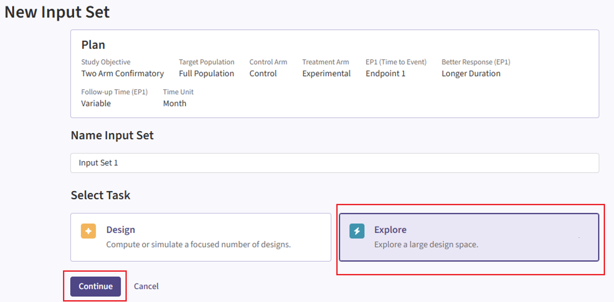
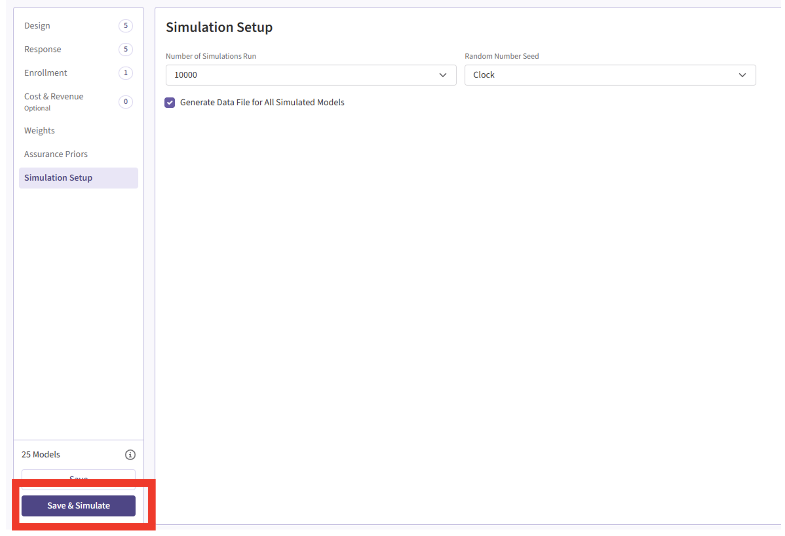

<div class="alert alert-primary" role="alert">
<p style="margin-bottom:0">This example is related to the <a href="IntegrationPointResponseContinuous.html" class="alert-link">**Integration Point: Response - Continuous Outcome**</a>, the <a href="IntegrationPointAnalysisContinuous.html" class="alert-link">**Integration Point: Analysis - Continuous Outcome**</a>, the <a href="IntegrationPointResponseTimeToEvent.html" class="alert-link">**Integration Point: Response - Time-to-Event Outcome**</a>, and the <a href="IntegrationPointAnalysisTimeToEvent.html" class="alert-link">**Integration Point: Analysis - Time-to-Event Outcome**</a>. Click the links for setup instructions, variable details, and additional information about the integration points.</p>
</div>

<div class="alert alert-danger" role="alert">
To try this example, create two new projects in East Horizon using the following configuration:
<ul style="margin-bottom:0">
<li>**Study objective:** Two Arm Confirmatory</li>
<li>**Number of endpoints:** Single Endpoint</li>
<li>**Endpoint type:** Continuous Outcome (project 1) and Time-to-Event Outcome (project 2)</li>
<li>**Task:** Explore</li>
</ul></div>

<div class="alert alert-warning" role="alert">
<p style="margin-bottom:0">**Note:** This example is compatible with both Fixed Sample and Group Sequential statistical designs. The R code automatically detects whether interim look information (*LookInfo*) is available and adjusts the analysis parameters accordingly.</p>
</div>

# Introduction

The intent of the following example is to demonstrate the computation of Bayesian assurance, or probability of success, and conditional assurance in consecutive studies by using custom R scripts for the **Response (Patient Simulation)** and the **Analysis** integration points of East Horizon. It features a sequential design involving a Phase 2 trial with a normal endpoint followed by a Phase 3 trial with a time-to-event endpoint.

The objective is to understand how conducting a Phase 2 study can reduce the risk associated with the Phase 3 trial. This **de-risking** is evaluated by comparing two scenarios: (1) the probability of a No-Go decision in Phase 3 if Phase 2 is skipped, and (2) the probability of a No-Go in Phase 3 if a preceding Phase 2 trial is conducted and yields a Go decision. Specifically, we compute the conditional assurance of Phase 3 given success in Phase 2.

The scenarios covered are as follows:

1. Two consecutive studies: phase 2 with a normal endpoint followed by phase 3, with a time-to-event endpoint.

Once CyneRgy is installed, you can load this example in RStudio with the following commands:
```{r, eval=FALSE}
CyneRgy::RunExample( "ConsecutiveStudiesContinuousTimeToEvent" )
```

Running the command above will load the RStudio project in RStudio. 

In the [R directory of this example](https://github.com/Cytel-Inc/CyneRgy/tree/main/inst/Examples/ConsecutiveStudiesContinuousTimeToEvent/R) you will find the R files used in the examples:

1. [SimulatePatientOutcomeNormalAssurance.R](https://github.com/Cytel-Inc/CyneRgy/blob/main/inst/Examples/ConsecutiveStudiesContinuousTimeToEvent/R/SimulatePatientOutcomeNormalAssurance.R) - Functions to simulate patient outcomes under a normal distribution informed by mixture priors.
2. [AnalyzeUsingBayesianNormals.R](https://github.com/Cytel-Inc/CyneRgy/blob/main/inst/Examples/ConsecutiveStudiesContinuousTimeToEvent/R/AnalyzeUsingBayesianNormals.R) - Implements Bayesian analysis of simulated outcomes using normal priors.
3. [SimulatePatientSurvivalAssuranceUsingPh2Prior.R](https://github.com/Cytel-Inc/CyneRgy/blob/main/inst/Examples/ConsecutiveStudiesContinuousTimeToEvent/R/SimulatePatientSurvivalAssuranceUsingPh2Prior.R) - This function simulates patient-level outcomes within a Bayesian assurance framework.
4. [AnalyzeSurvivalDataUsingCoxPH.R](https://github.com/Cytel-Inc/CyneRgy/blob/main/inst/Examples/ConsecutiveStudiesContinuousTimeToEvent/R/AnalyzeUsingBayesianNormals.R) - Implements Bayesian analysis of simulated outcomes using Cox proportional hazards model.

**Note:** This example builds on the [Bayesian Assurance, Continuous Outcome](BayesianAssuranceContinuous.html) and the [Bayesian Assurance, Time-to-Event Outcome](BayesianAssuranceTimeToEvent.html) examples, and utilizes some of the same R code. Please refer to them for more information. The difference is that we now have two different studies: Phase 3 is conducted **only** if Phase 2 results in a Go decision.

```{r echo=FALSE,  warning=FALSE, fig.retina=3}
library(ggplot2)

# Data for boxes
boxes <- data.frame(
  label = c("Phase 2", "Phase 3"),
  x = c(0, 1.5),
  y = c(0, 0)
)

# Data for arrows
edges <- data.frame(
  x = c(0.3),
  y = c(0),
  xend = c(1.2),
  yend = c(0)
)

# Plot
ggplot() +
  # Draw boxes
  geom_rect(data = boxes, aes(xmin = x - 0.3, xmax = x + 0.3, ymin = y - 0.2, ymax = y + 0.2), 
            fill = "lightblue", color = "black") +
  # Add text inside boxes
  geom_text(data = boxes, aes(x = x, y = y, label = label), size = 5) +
  # Draw arrow
  geom_segment(data = edges, aes(x = x, y = y, xend = xend, yend = yend), 
               arrow = arrow(length = unit(0.03, "npc")), size = 1) +
  # Add conditional label above the arrow
  annotate("text", x = 0.75, y = 0.3, label = "Only if Go", size = 4, fontface = "italic") +
  coord_fixed(ratio = 1, xlim = c(-0.5, 2), ylim = c(-0.5, 0.7)) +
  theme_void() +
  theme(
    plot.background = element_rect(fill = "white", color = NA),  
    panel.background = element_rect(fill = "white", color = NA), 
    plot.margin = margin(0, 0, 0, 0),
    panel.spacing = margin(0, 0, 0, 0) 
  )
```

------

# Step-by-Step Instructions

Before starting, make sure you have the required tools and files.

- [East Horizon](https://platform.cytel.com)
- Download R Files from our public Github repo: [SimulatePatientOutcomeNormalAssurance.R](https://github.com/Cytel-Inc/CyneRgy/blob/main/inst/Examples/ConsecutiveStudiesContinuousTimeToEvent/R/SimulatePatientOutcomeNormalAssurance.R), [AnalyzeUsingBayesianNormals.R](https://github.com/Cytel-Inc/CyneRgy/blob/main/inst/Examples/ConsecutiveStudiesContinuousTimeToEvent/R/AnalyzeUsingBayesianNormals.R), [SimulatePatientSurvivalAssuranceUsingPh2Prior.R](https://github.com/Cytel-Inc/CyneRgy/blob/main/inst/Examples/ConsecutiveStudiesContinuousTimeToEvent/R/SimulatePatientSurvivalAssuranceUsingPh2Prior.R), and [AnalyzeSurvivalDataUsingCoxPH.R](https://github.com/Cytel-Inc/CyneRgy/blob/main/inst/Examples/ConsecutiveStudiesContinuousTimeToEvent/R/AnalyzeUsingBayesianNormals.R).

In this example, we will create two different projects: one for the Phase 2 study and one for the Phase 3 study.

## Phase 2 Study

### New Project Page

1. On East Horizon, create a new project with a continuous endpoint.

{width=800px}

### New Input Set Page

2. Navigate to the Inputs tab, and create a new input set using the Explore task.

{width=800px}

### Design Page

3. Within the input set you just created, navigate to the Design page, then select “User Specified – R” in the Test field.

{width=800px}

4. Click the "+" icon next to "User Specified - R" to open the R Integration pop-up window.

5. Click on “Select File” and then on “Continue”.

{width=800px}

6. Upload and select the file **AnalyzeUsingBayesianNormals.R**.

7. Check that the correct file has been imported and the correct Function Name has been specified by the system. Note that the User Parameter variables have been automatically pulled from the R function that was imported. If the variables **dPriorMeanCtrl**, **dPriorStdDevCtrl**, **dPriorMeanExp**, and **dPriorStdDevExp** are missing, add them to the list using the button "+ Add Variable".

8. Fill the parameter values. In our case, we use the example values below. See the [Analysis Integration Point](#analysis-integration-point) section of the phase 2 study below for more information about these variables.

{width=800px}

9. Click on the “Save” button to exit the R Integration details window. 

### Response Page

9. Navigate to the Response page and the relevant response card, and then select “User Specified – R” in the Distribution field.

{width=800px}

10. Click on the "+" icon next to "User Specified - R" to open the R Integration pop-up window.

11.	Click on “Select File” and then on “Continue”.

{width=800px}

12. Upload and select the file **SimulatePatientOutcomeNormalAssurance.R**.

13. Check that the correct file has been imported and the correct Function Name has been specified by the system. Note that the User Parameter variables have been automatically pulled from the R function that was imported.

14. Fill the parameter values. In our case, we use the example values below. See the [Response Integration Point](#response-integration-point) section of the phase 2 study below for more information about these variables.

{width=800px}

15. Click on the “Save” button to exit the R Integration details window.

### Simulation Setup Page

16. Specify the number of simulation runs as needed. You can choose any number you require. For the Phase 2 input set, it is recommended to run as many simulations as possible (e.g., 20,000). This is because Phase 3 will only use data from successful Phase 2 trials, so the more simulations you run, the larger the pool of usable trials for Phase 3.

{width=800px}

17. Check the box to “Generate Data File for All Simulated Models”.

{width=800px}

18. Click the "Save & Simulate" button.

{width=800px}

19. Confirm by clicking on "Simulate" in the pop-up window, and wait for the simulation runs to finish.

{width=500px}

### Results Page

20. Navigate to the Results tab, then check whether the Phase 2 simulation failed or was completed by looking at the Status column.

{width=800px}

21. If the simulation failed, open the Log window to see if there are any helpful error messages.

   a. Click on the “?” icon in the top right corner of your screen.
    
{width=800px}
    
   b. Click on “Log”.
    
{width=400px}
    
   c. Identify any errors that appear. For example:
    
{width=600px}

22. If the simulation has completed, click on the Result name. If you have multiple scenarios in your simulation, you will be prompted to label at least one scenario from the list. Alternatively, you may also skip this step by selecting the “Skip” button in the bottom left corner.

{width=800px}

23. The Explore page of the results appears. You will notice a checkbox on the left side of each row in the table, below the heatmap. Click on the box of model that generated the data using your prior distribution, e.g.:

{width=800px}

24. Now click on Download dropdown menu, that is in the top right of the screen, and Summary Statistics option. Wait until the file is downloaded and rename it to **Ph2_results.csv**.

{width=800px}

## Phase 3 Study

### New Project Page

25. On East Horizon, create a new project with a time-to-event endpoint.

{width=800px}
### Files Page

26. Navigate to the Files page and click on the Inputs folder.

{width=800px}

27. Click on "Upload" and select the file you just downloaded from East Horizon. Alternatively, you can use the example file provided in the `Outputs` directory of this example if you want to test the workflow with our example data. Make sure the file is renamed to "Ph2_results.csv" and placed in the Inputs folder if you intend to use the R script as provided. If you prefer a different file name, you can update the script accordingly.

{width=800px}

### New Input Set Page

28. Navigate to the Inputs page and and create a new input set using the Explore task.

{width=800px}

### Design Page

29. Within the input set you just created, navigate to the Design page, then select “User Specified – R” in the Test Statistic field.

{width=800px}

30. Click the "+" icon next to "User Specified - R" to open the R Integration pop-up window.

31. Click on “Select File” and then on “Continue”.

{width=800px}

32. Upload and select the file **AnalyzeSurvivalDataUsingCoxPH.R**.

33. Check that the correct file has been imported and the correct Function Name has been specified by the system. Note that the User Parameter variables have been automatically pulled from the R function that was imported.

34. Fill the parameter values. In our case, we use the example values below. See the [Analysis Integration Point](#analysis-integration-point-1) section of the phase 3 study below for more information about these variables.

{width=800px}

35. Click on the “Save” button to exit the R Integration details window. 

### Response Page

36. Navigate to the Response page and the relevant response card of the Phase 3 input set, and then select “User Specified – R” in the Distribution field.

{width=800px}

37. Click on the "+" icon next to "User Specified - R" to open the R Integration pop-up window.

38.	Click on “Select File” and then on “Continue”.

{width=800px}

39. Upload and select the file **SimulatePatientSurvivalAssuranceUsingPh2Prior.R**.

40. Check that the correct file has been imported and the correct Function Name has been specified by the system. Note that the User Parameter variables have been automatically pulled from the R function that was imported.

41. Fill the parameter values. In our case, we use the example values below. See the [Response Integration Point](#response-integration-point-1) section of the phase 3 study below for more information about these variables.

{width=800px}

42. Click on the “Save” button to exit the R Integration details window.

### Simulation Setup Page

43. Simulate the input set the same way as described before. See Steps 16 to 19 for more information. However, for Phase 3, we recommend choosing a lower number of simulations (e.g., 5,000). This is because the simulation will fail when specifying a number of simulation higher than the number of successful Phase 2 trials.

### Results Page

44. Load the results as described before (see steps 20 to 22 for more information). In the Explore page of the results, hover over each cell in the heatmap to see a summary of the outputs. Because of our custom R scripts, the result “Power” is actually now equivalent to the Conditional Probability of Success of the Phase 3 study, i.e., the probability that Phase 3 succeeds given that Phase 2 succeeded.

See the [Results](#results) section below for more information.

------

# Technical Information and Example Values

## Phase 2 Study

This study considers a two-arm fixed sample design with normally distributed outcomes $Y$, with 80 patients per treatment arm.

The figure below illustrates where this phase fits within the R integration points of Cytel products, accompanied by flowcharts outlining the general steps performed by the R code.

```{r echo=FALSE,  warning=FALSE, fig.retina=3}
CyneRgy::PlotExampleFlowchart(
    lIntPoints = list(
        "Response" = c(
            "Load prior distribution parameters, mean, and standard deviations", 
            "Sample treatment effect from mixture of normal distributions",
            "Compute treatment means including sampled effect",
            "Simulate patient outcomes based on treatment assignment",
            "Return simulated outcomes and true treatment effect"
        ),
        "Analysis" = c(
            "Load prior distribution parameters, SD, MAV and PU",
            "Compute posterior parameters",
            "Sample posterior distributions of each arm",
            "Make decision based on posterior probability and user-defined cutoff",
            "Return posterior parameters, probabilities, and decision"
        )
    )
)
```

### Response (Patient Simulation) Integration Point

<div class="alert alert-primary" role="alert">
  <p style="margin-bottom:0"> This endpoint is related to this R file: <a href="https://github.com/Cytel-Inc/CyneRgy/blob/main/inst/Examples/ConsecutiveStudiesContinuousTimeToEvent/R/SimulatePatientOutcomeNormalAssurance.R" class="alert-link">SimulatePatientOutcomeNormalAssurance.R</a></p>
</div>

This function simulates patient-level outcomes within a **Bayesian assurance framework**, using a **two-component mixture prior** to reflect uncertainty about the true treatment effect. It allows for assessing the probability of trial success (assurance) under uncertainty about the true treatment effect. Information generated from this simulation will be used later for the [Analysis Integration Point](#analysis-integration-point).

In this example, the true treatment effect ($\mu_E - \mu_S$) is sampled from a mixture of two normal priors:

- 25% weight on $\mathcal{N}(0, 0.05^2)$.
- 75% weight on $\mathcal{N}(0.7, 0.3^2)$.
  
The control mean is fixed, while the experimental mean is computed as $d\text{MeanCtrl} + \text{treatment effect}$. Each patient’s response is then simulated from a normal distribution corresponding to their assigned treatment group, with standard deviations defined separately for each arm.

```{r echo=FALSE,  warning=FALSE}
library(ggplot2)
######################################################################################################################## .
# Plot the assurance prior ####
######################################################################################################################## .
vMean1 <- rnorm(250000, mean = 0,   sd = 0.05)
vMean2 <- rnorm(750000, mean = 0.7, sd = 0.3)

vMean    <- c( vMean1, vMean2 )
dfSample <- data.frame( SampleMean = vMean )

# Assuming dfSample is your data frame
# Adjusted ggplot code
ggplot(dfSample, aes(SampleMean)) +
    geom_density(fill = "skyblue", color = "black") +
    labs(title = expression("Assurance Prior Distribution of True Treatment Effect (" * mu[E] - mu[S] * ")" ), 
             x = expression( "True Treatment Effect " * mu[E] - mu[S]  ), y ="Density") +
    theme_bw() +
    theme(
        plot.title = element_text(hjust = 0.5),  # Center the title
        axis.text.x = element_text(size = 10),    # Adjust x-axis text size
        axis.title.x = element_text(size = 12),   # Adjust x-axis title size
        axis.title.y = element_text(size = 12),   # Adjust y-axis title size
        plot.margin = margin(20, 20, 20, 20),      # Adjust plot margins
        panel.border = element_blank(),            # Remove panel border
        axis.line = element_line(color = "black")  # Add black axis line
    ) +
    xlim(-0.25, 1.75)  # Set x-axis range from 0 to 1
```

Refer to the table below for the definitions and values of the user-defined parameters used in this example.

|**User parameter**|**Definition**|**Value**|
|--|------|--|
|**dWeight1**|Weight of prior component 1.|0.25|
|**dWeight2**|Weight of prior component 2.|0.75|
|**dMean1**|Mean of prior component 1.|0|
|**dMean2**|Mean of prior component 2.|0.7|
|**dSD1**|Standard deviation of prior component 1.|0.05|
|**dSD2**|Standard deviation of prior component 2.|0.3|
|**dMeanCtrl**|Mean of control arm (experimental arm will be sampled).|0|
|**dSDCtrl**|Standard deviation for control arm.|1.9|
|**dSDExp**|Standard deviation for experimental arm.|1.9|

### Analysis Integration Point

<div class="alert alert-primary" role="alert">
  <p style="margin-bottom:0"> This endpoint is related to this R file: <a href="https://github.com/Cytel-Inc/CyneRgy/blob/main/inst/Examples/ConsecutiveStudiesContinuousTimeToEvent/R/AnalyzeUsingBayesianNormals.R" class="alert-link">AnalyzeUsingBayesianNormals.R</a></p>
</div> 

This function evaluates the **posterior probability** that the experimental treatment arm is better than the control arm by more than a clinically meaningful threshold, and returns a Go/No-Go decision based on a cutoff ($P_U$). It uses information from the simulation that is generated by the [Response](#response-patient-simulation-integration-point) element of East Horizon's simulation, explained above.

For patients receiving treatment $j \in \{\text{S}, \text{E}\}$ (S = standard/control, E = experimental), we assume the outcomes $Y \sim \mathcal{N}(\mu_j, \sigma^2)$, where $\mu_j$ is an unknown mean and $\sigma^2$ is a known, fixed variance.

We assume *a priori* that:

$$
\mu_j \sim \mathcal{N}(\theta_j, \tau_j^2 = 1000^2), \quad j \in \{\text{S}, \text{E}\}
$$

After observing $n$ patients on treatment $j$, the posterior distribution of $\mu_j$ becomes:

$$
\mu_j \mid \bar{y} \sim \mathcal{N}(\theta_j^*, \tau_j^{2*})
$$

where:

$$
\theta_j^* = \frac{\frac{\theta_j}{\tau_j^2} + \frac{n \bar{y}}{\sigma^2}}{\frac{1}{\tau_j^2} + \frac{n}{\sigma^2}}, \quad \text{and} \quad
\frac{1}{\tau_j^{2*}} = \frac{1}{\tau_j^2} + \frac{n}{\sigma^2}
$$

At the conclusion of the study, the posterior probability that the experimental arm exceeds the control arm by more than the minimum acceptable value (MAV) is calculated as:

$$
\rho = \Pr(\mu_E > \mu_S + \text{MAV} \mid \text{data})
$$

The decision rule is as follows:

- If $\rho > P_U \rightarrow$ Go.
- If $\rho \leq P_U \rightarrow$ No-Go.

For this study, the *MAV* is set to 0.6 and $P_U$ to 0.8. Refer to the table below for all the definitions and values of the user-defined parameters used in this example.

|**User parameter**|**Definition**|**Value**|
|---|------|--|
|**dPriorMeanCtrl**|Prior mean for control arm.|0|
|**dPriorStdDevCtrl**|Prior standard deviation for control arm.|1000|
|**dPriorMeanExp**|Prior mean for experimental arm.|0|
|**dPriorStdDevExp**|Prior standard deviation for experimental arm.|1000|
|**dSigma**|Known sampling standard deviation.|1.9|
|**dMAV**|Minimum Acceptable Value (clinically meaningful difference).|0.6|
|**dPU**|Go threshold (posterior probability cutoff).|0.8|
|**dPUFutility**|Threshold probability of futility stopping. If the predictive probability of a No Go decision at the end exceeds this value, the trial is stopped early for futility.|0.8|

## Phase 3 Study

This study considers a two-arm fixed sample design with a time-to-event endpoint, with 300 patients per arm.

The figure below illustrates where the integration points used in this study fit within the R integration points of Cytel products, accompanied by flowcharts outlining the general steps performed by the R code.

```{r echo=FALSE,  warning=FALSE, fig.retina=3}
CyneRgy::PlotExampleFlowchart(
    lIntPoints = list(
        "Response" = c(
            "Load prior distribution parameters, scaling bounds, and mean TTE", 
            "Sample from prior distribution for log hazard ratio",
            "Compute true hazard rates",
            "Simulate patient survival times based on treatment assignment",
            "Return simulated survival times and true hazard ratio"
        ),
        "Analysis" = c(
            "Load survival data, mean TTE, and relationship parameters",
            "Sample true treatment effect from prior distribution (from CSV file)",
            "Compute true log hazard ratio and hazard rates for each arm",
            "Generate exponential survival times based on hazard rates",
            "Return simulated survival times and true hazard ratio"
        )
    )
)
```

### Response (Patient Simulation) Integration Point

<div class="alert alert-primary" role="alert">
  <p style="margin-bottom:0"> This endpoint is related to this R file: <a href="https://github.com/Cytel-Inc/CyneRgy/blob/main/inst/Examples/ConsecutiveStudiesContinuousTimeToEvent/R/SimulatePatientSurvivalAssuranceUsingPh2Prior.R" class="alert-link">SimulatePatientSurvivalAssuranceUsingPh2Prior.R</a></p>
</div>

This function simulates patient-level outcomes within a **Bayesian assurance framework**. The relationship between the continuous endpoint in Phase 2 and the time-to-event endpoint in Phase 3 is modeled using a linear function:

$$ 
\log(\text{True HR})_{\text{Phase 3}} = 0.1 - 0.4 \times (\text{True Treatment Difference})_{\text{Phase 2}}
$$

Note that this relationship is defined in terms of the true treatment effects. Since Phase 2 informs the prior on the true treatment difference and a direct link is established between the true difference and the true hazard ratio, there is no need to specify a separate prior for the true HR as done in the [Bayesian Assurance, Time-to-Event Outcome](BayesianAssuranceTimeToEvent.html) example.

Both conditional and unconditional Phase 3 simulations use an R initialization function to **load Phase 2 output and extract the true treatment differences**. These values are then converted to the log of the true hazard ratio (HR) using the **linear link function**. Note that while unconditional assurance could be calculated by sampling directly from the Phase 2 prior, reading the saved values ensures a consistent comparison between conditional and unconditional assurance. This approach provides a more accurate assessment of the benefit of conducting a Phase 2 trial before Phase 3.

In the R code, note that the `<<-` operator is used to define two global variables:

- `vPrior`: a vector containing the true treatment differences.
- `nSimIndex`: an index tracking the current replication being executed during the Phase 3 simulation. This value is updated with each simulation iteration.

Refer to the table below for the definitions and values of the user-defined parameters used in this example.

|**User parameter**|**Definition**|**Value**|
|--|------|--|
|**dMeanTTECtrl**|Mean time-to-event for the control group.|12|
|**dIntercept**|Intercept for the linear relationship between true treatment difference and log(HR).|0.1|
|**dSlope**|Slope for the linear relationship between true treatment difference and log(HR).|-0.4|

### Analysis Integration Point

<div class="alert alert-primary" role="alert">
  <p style="margin-bottom:0"> This endpoint is related to this R file: <a href="https://github.com/Cytel-Inc/CyneRgy/blob/main/inst/Examples/ConsecutiveStudiesContinuousTimeToEvent/R/AnalyzeSurvivalDataUsingCoxPH.R" class="alert-link">AnalyzeSurvivalDataUsingCoxPH.R</a></p>
</div>

A single analysis is conducted once 50% of patients have experienced the event of interest. Using the function in the file, the analysis employs a **Cox proportional hazards model**, with a hazard ratio (HR) less than 1 indicating a benefit in favor of the experimental arm. It uses information from the simulation that is generated by the [Response](#response-patient-simulation-integration-point-1) element of East Horizon's simulation, explained above. A Go decision is made if the resulting p-value is less than or equal to 0.025.

Refer to the table below for the definitions of the user-defined parameters used in this example.

|**User parameter**|**Definition**|
|---|------|
|**bReturnLogTrueHazard**|If `True`, the function returns the natural logarithm of the true hazard ratio instead of its raw value.|
|**bReturnNAForNoGoTrials**|If `True` and the trial does not meet the Go decision criterion, the function returns `NA` for the hazard ratio.|

## Results

```{r echo=FALSE,  warning=FALSE, include = FALSE}
######################################################################################################################## .
# Read in the output from East and compute the assurance and probability of a stop ####
######################################################################################################################## .
library(readr)

dfEastResults <- read_csv("Outputs/Example1/Phase2.csv")

# Compute the assurance - Probability of a Go - The BdryStopCode == 2
dProbGo <- round(mean( ifelse( dfEastResults$BdryStopCode==2,1,0) ) * 100, 1) # want it as a percent

# Probability of a stop, BdryStopCode = 3 is a No-Go
dProbNoGo <- mean( ifelse( dfEastResults$BdryStopCode==3,1,0) )

# Get trials that are successful so we can build posterior of true delta when a Go decision is made
dfSuccess <- dfEastResults[ dfEastResults$BdryStopCode==2, ]
dMeanTrueDetalGivenGo <- mean( dfSuccess$dTrueDelta )
```

For the phase 2 study independently, the probability of a Go is `r dProbGo`% and the probability of a No-Go is `r 100-dProbGo`%.  

```{r echo = FALSE, warning = FALSE}
ggplot( data = dfSuccess, aes( x = dTrueDelta ) ) + 
    geom_density( aes(y = ..scaled..), fill = "skyblue", color = "black" ) +
    
    labs(title = expression("Conditional Posterior of True Treatment Effect (" * mu[E] - mu[S] * ") Given A Go Decision"), 
             x = expression( "True Treatment Effect " * mu[E] - mu[S]  ), y ="Density") +
    xlim( 0,2) +
    theme_bw() +
    theme(
        plot.title = element_text(hjust = 0.5),  # Center the title
        axis.text.x = element_text(size = 10),    # Adjust x-axis text size
        axis.title.x = element_text(size = 12),   # Adjust x-axis title size
        axis.title.y = element_text(size = 12),   # Adjust y-axis title size
        plot.margin = margin(20, 20, 20, 20),      # Adjust plot margins
        panel.border = element_blank(),            # Remove panel border
        axis.line = element_line(color = "black")  # Add black axis line
    ) 
```

```{r  echo=FALSE,  warning=FALSE, include = FALSE}
######################################################################################################################## .
# Example 2 Post Process                                                                                               ####
# This file provides functions and R Code example to post process the East output for useful graphs and numeric values ####
# 
######################################################################################################################## .
library(readr)

dfEastResultsEx5Ph3Uncond <- read_csv("Outputs/Example1/Phase3Unconditional.csv")

dProbGoUncond   <- mean( dfEastResultsEx5Ph3Uncond$BdryStopCode )  # Pr( Go )

vCredIntervalUncond <- log( quantile(dfEastResultsEx5Ph3Uncond$TrueHR, probs=c(0.025,0.975)) )
```

For the phase 3 study independently, the unconditional probability of a Go decision is `r round( dProbGoUncond*100, 0)`% and the unconditional probability of a No-Go Decision is `r 100 - round( dProbGoUncond*100, 0)`%. The 95% posterior credible for the Log( True HR ) is (-$\infty$, `r round( vCredIntervalUncond[2],2)` ). The posterior distribution of the true Log( HR ) given a Go decision is:

```{r echo = FALSE, warning = FALSE}
# Get trials that are successful so we can build posterior of true delta when a Go decision is made
dfSuccess <- dfEastResultsEx5Ph3Uncond[ dfEastResultsEx5Ph3Uncond$BdryStopCode==1, ]
dfDensity <- density( log( dfSuccess$TrueHR) )

vY <- dfDensity$y/max( dfDensity$y )
vX <- dfDensity$x 

dfPostDensity <- data.frame( y = vY, x = vX)

# Assuming dfPostDensity is your data frame
# Adjusted ggplot code
ggplot(dfPostDensity, aes(x = x, y = y)) +
    geom_area( fill = "skyblue", color = "black") +
    labs(title = expression("Assurance Posterior Distribution of True Log(HR)" ), 
             x = expression( "True Log(HR) "  ), y ="Density") +
    theme_bw() +
    theme(
        plot.title = element_text(hjust = 0.5),  # Center the title
        axis.text.x = element_text(size = 10),    # Adjust x-axis text size
        axis.title.x = element_text(size = 12),   # Adjust x-axis title size
        axis.title.y = element_text(size = 12),   # Adjust y-axis title size
        plot.margin = margin(20, 20, 20, 20),      # Adjust plot margins
        #panel.grid.major = element_blank(),        # Remove major grid lines
        #panel.grid.minor = element_blank(),        # Remove minor grid lines
        panel.border = element_blank(),            # Remove panel border
        axis.line = element_line(color = "black")  # Add black axis line
    ) +
    xlim(-0.6, 0.1)  # Set x-axis range from 0 to 1
```

```{r  echo=FALSE,  warning=FALSE, include = FALSE}
######################################################################################################################## .
# This is the case when the phase 2 was a Go decision followed by phase 3 ####
# 
######################################################################################################################## .

dfEastResultsEx5Ph3Cond <- read_csv("Outputs/Example1/Phase3Conditional.csv")

dProbGoCond    <- mean( dfEastResultsEx5Ph3Cond$BdryStopCode )  # Pr( Go )

vCredIntervalCond <- log( quantile(dfEastResultsEx5Ph3Cond$TrueHR , probs=c(0.025,0.975)) )
```

If the two studies are run sequentially, conducting Phase 3 only if Phase 2 results in a Go decision, the probability of a Go decision is `r round( dProbGoCond*100, 0)`% and the unconditional probability of a No-Go Decision is `r 100 - round( dProbGoCond*100, 0)`%. The 95% posterior credible for the Log( True HR ) is (`r round( vCredIntervalCond[1],2)`, `r  round( vCredIntervalCond[2],2)`). The posterior distribution of the true Log( HR ) given a Phase 3 Go decision is:

```{r echo = FALSE, warning = FALSE}

# Get trials that are successful so we can build posterior of true delta when a Go decision is made
dfSuccess <- dfEastResultsEx5Ph3Cond[ dfEastResultsEx5Ph3Cond$BdryStopCode==1, ]

dfDensity <- density( log( dfSuccess$TrueHR) )


#dfPostSample <- data.frame( SampleMean = dfSuccess$dTrueDelta )

#dfDensity   <- density( dfDen$SampleMean)
vY <- dfDensity$y/max( dfDensity$y )
vX <- dfDensity$x 

dfPostDensity <- data.frame( y = vY, x = vX)

# Assuming dfPostDensity is your data frame
# Adjusted ggplot code
ggplot(dfPostDensity, aes(x = x, y = y)) +
    geom_area( fill = "skyblue", color = "black") +
    labs(title = expression("Conditional Posterior Distribution of True Log(HR) Given a Go Decision in Ph 2 & 3" ), 
             x = expression( "True Log(HR) "  ), y ="Density") +
    theme_bw() +
    theme(
        plot.title = element_text(hjust = 0.5),  # Center the title
        axis.text.x = element_text(size = 10),    # Adjust x-axis text size
        axis.title.x = element_text(size = 12),   # Adjust x-axis title size
        axis.title.y = element_text(size = 12),   # Adjust y-axis title size
        plot.margin = margin(20, 20, 20, 20),      # Adjust plot margins
        #panel.grid.major = element_blank(),        # Remove major grid lines
        #panel.grid.minor = element_blank(),        # Remove minor grid lines
        panel.border = element_blank(),            # Remove panel border
        axis.line = element_line(color = "black")  # Add black axis line
    ) +
    xlim(-0.6, 0.1)  # Set x-axis range from 0 to 1

```

Comparing the option of running only a Phase 3 versus a Phase 2 followed by a Phase 3 if Phase 2 is successful, the probability of Go in phase 3 increases from **`r round(100*dProbGoUncond,0)`%** to **`r round( 100*dProbGoCond,0)`%** and the probability of a No-Go in Phase 3 decreases from **`r 100-round(100*dProbGoUncond,0)`%** to **`r 100-round( 100*dProbGoCond,0)`%**.

# See Also

Other relevant examples include:

- [Bayesian Assurance, Continuous Outcome](BayesianAssuranceContinuous.html)
- [Bayesian Assurance, Time-to-Event Outcome](BayesianAssuranceTimeToEvent.html)
- [Consecutive Studies, Continuous Outcome](ConsecutiveStudiesContinuous.html)
- [Consecutive Studies, Binary Outcome](ConsecutiveStudiesBinary.html)
- [Probability of Success, Dual Endpoints](ProbabilitySuccessDualEndpoints.html)
