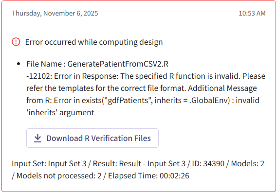
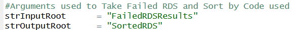

```{r setup, include=FALSE}
knitr::opts_chunk$set(echo = TRUE)
library( CyneRgy )
```

# Introduction
When using R integration in East Horizon, it is common for buggy code to fail. This will lead to East Horizon giving something like what is found below in the logs. The RDS files provided can often be confusing and tricky for users to understand. This example aims to provide a solution to this issue by creating a piece of code that is easy for users to understand and follow. It will allow them to run and debug their code locally by sorting the RDs files from the code used and allow users to run said code for debugging.

**An Example of a Failed Simulation in East Horizon:**


<br>
**Example of a Failed Simulation in East Horizon**

**Required Files**
1. [FailedSimulations.RProj](https://github.com/Cytel-Inc/CyneRgy/blob/316-error-in-simulations-JCW/inst/Examples/FailedSimulations/FailedSimulations.Rproj) - This is the project file that allows all the code to be kept in one concise place.

2. [FailedSimulationsExample.R](https://github.com/Cytel-Inc/CyneRgy/blob/316-error-in-simulations-JCW/inst/Examples/FailedSimulations/R/FailedSimulationsExample.R) - This code runs all the functions in one spot, that is easy for the user to change the names of functions and folders used in their failed simulation.

3. [sortTrialsByCode.R](https://github.com/Cytel-Inc/CyneRgy/blob/316-error-in-simulations-JCW/inst/Examples/FailedSimulations/R/SortTrialsByCode.R) - This code takes the input file of RDS and returns it in an output folder. The output folder sorts all RDS files based on the code used to run them. It will, in each file, return an R script containing the code that failed that set of simulations, and it will contain an RDS file that has all of the failed simulations using that code.

4. [BugCheck.R](https://github.com/Cytel-Inc/CyneRgy/blob/316-error-in-simulations-JCW/inst/Examples/FailedSimulations/R/BugCheck.R) - This code contains the function used to check for bugs used in a given piece of code. It will be given an input of a failed simulation from the RDS folder and the buggy R code. Then it will run the bugged code using data from the RDS file to store the data used, the call to the function, arguments, the code, and the error message into a variable. This will allow users to see where the R code went wrong and bug test locally.

5. [InternalFunction.R](https://github.com/Cytel-Inc/CyneRgy/blob/316-error-in-simulations-JCW/inst/Examples/FailedSimulations/R/InternalFunction.R) - This code contains all the behind the scenes function used to help make the main functions **BugCheck.R** and **SortTrialsByCode.R** function smoothly.

**An example of running the code:**
1. Download the RDS files from East Horizon.
2. Open the **FailedSimulations.Rproj** file.
3. Open the **FailedSimulationsExample.R** code.
4. Set the inputs for **SortTrialsByCode.R**. The inputs should include the file path for where you downloaded your failed simulation RDS files and a file path for your outputs. It should look something like this: 

5. Run the SortTrialsByCode function.
6. Afterthe  code is finished running, there should be some files in your output folder that contain each piece of code used. It should look something like this: 

7. Go into a folder of your choosing and take the file paths of both the .RDS file and the .R files and put them into the bug checker inputs like so:

8. Run the ErrorCheck function.
9. Check the variable the function is stored in for desired information about the code. Below are a few points of interest to index and find the error text, the function call, and a value if the function succeeds.
