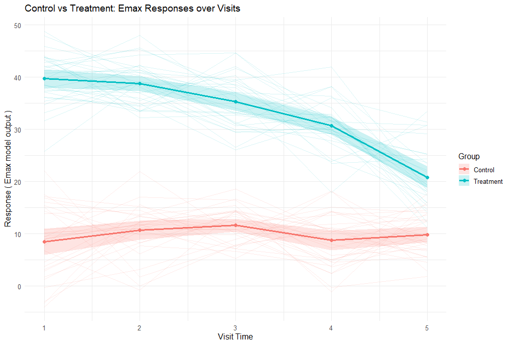

<div class="alert alert-primary" role="alert">
  <p style="margin-bottom:0">These examples are related to the <strong>Integration Point: Response</strong>.
  <a href="IntegrationPointResponse.html" class="alert-link">Click here for more information about this integration point.</a></p>
</div>

# Introduction

The following example demonstrates the capabilities of pharmacokinetic pharmacodynamic (PK/PD) modeling in East Horizon using R integration. We simulate plasma drug concentrations using a one-compartment model with first-order absorption and elimination, then transform concentration to effect via an Emax model to generate continuous outcomes for a two-arm trial (control vs treatment). A final example shows how to integrate externally sourced PK/PD data from a CSV file.

To try out this example, start by creating a new project on East Horizon using the **Two Arm Confirmatory** study objective and the **Continuous** endpoint. Turn on **Repeated Measures**. You can use the following example values for Time (Month):

- Visit 1: 0.25
- Visit 2: 0.5
- Visit 3: 0.75
- Final Visit: 1

Then, create an input set using the **Explore** task.

Once CyneRgy is installed, you can load this example in RStudio with the following command:

```{r, eval=FALSE}
CyneRgy::RunExample( "PKPDResponseGeneration" )
```

**RStudio Project File**: [PKPDResponseGeneration.Rproj](https://github.com/Cytel-Inc/CyneRgy/blob/main/inst/Examples/PKPDResponseGeneration/PKPDResponseGeneration)

In the [R directory of this example](https://github.com/Cytel-Inc/CyneRgy/tree/main/inst/Examples/PKPDResponseGeneration/R) you will find the following R files:

1. [GenerateDrugConcentration.R](https://github.com/Cytel-Inc/CyneRgy/blob/main/inst/Examples/PKPDResponseGeneration/R/GenerateDrugConcentration.R) - This file contains the R code for simulating drug concentrations.

2. [PKPDResponseGeneration.R](https://github.com/Cytel-Inc/CyneRgy/blob/main/inst/Examples/PKPDResponseGeneration/R/PKPDResponseGeneration.R) - This file contains the R code to simulate treatment effect responses for patients. (Note: Contains *GenerateDrugConcentration.R* function inside)

3. [PlotEmax.R](https://github.com/Cytel-Inc/CyneRgy/blob/main/inst/Examples/PKPDResponseGeneration/R/PlotEmax.R) - This file plots a visual that shows the mean response for each treatment group as a function of time.


# Example 1 - Simulate Drug Concentration Response from a One-Compartment Model with First-order Absorption

<div class="alert alert-primary" role="alert">
  <p style="margin-bottom:0"> 
  This example is related to the R file: <a href="https://github.com/Cytel-Inc/CyneRgy/blob/main/inst/Examples/PKPDResponseGeneration/R/GenerateDrugConcentration.R" class="alert-link">GenerateDrugConcentration.R</a>.</p>
</div>

In the R function *GenerateDrugConcentration*, we use a one-compartment PK model with first-order absorption to generate simulate plasma concentrations for patients. The patient outcome is defined as a list of vectors, the exact quantity of vectors determined by the number of visits defined in the function parameters. Each vector contains the drug concentration for each patient at the given *visitTime*. In addition, an output of either `0` or `-1` will also be printed, where the former represents a successful response and the latter is a failure.

Refer to the table below for the definitions of the user-defined parameters used in this example and some example values.

|**User parameter**|**Definition**|**Example value**|
|----|------|----|
|**ka**|Dose first-order absorption rate constant. Describes the rate at which a drug moves from the site of administration into the central compartment.|1|
|**ke**|Dose first-order elimination rate constant. Describes the fraction of drug eliminated from the body per unit of time once the drug is in the central compartment.|0.2|
|**Dose**|Amount of drug administered to the body at the start of the model.|500|

The *OneCompartmentModelPK* function is called inside of the main function, and the `deSolve` package will generate a vector of concentrations that are stored inside the *concentration* variable. Then, depending on whether a patient is assigned to the control or treatment group, a normal distribution with their respective means and standard deviations are added to the concentration vector.

The figure below illustrates where this example fits within the R integration points of Cytel products, accompanied by a flowchart outlining the general steps performed by the R code.

```{r echo=FALSE,  warning=FALSE, fig.retina=3}
CyneRgy::PlotExampleFlowchart(
    lIntPoints = list(
        "Response" = c(
            "Load means, standard deviations, and user parameters", 
            "Generate concentration output using deSolve package", 
            "Generate normal responses for control and treatment groups", 
            "Store patient response data"
        )
    )
)
```

# Example 2 - Simulate Treatment Effect with Emax Model

<div class="alert alert-primary" role="alert">
  <p style="margin-bottom:0"> 
  This example is related to the R file: <a href="https://github.com/Cytel-Inc/CyneRgy/blob/main/inst/Examples/PKPDResponseGeneration/R/PKPDResponseGeneration.R" class="alert-link">PKPDResponseGeneration.R</a></p>
</div>

*PKPDResponseGeneration.R* serves as an extension of *GenerateDrugConcentration.R*. It converts per-visit plasma concentrations into treatment responses using the Emax PD model. It first calls the PK function to generate drug concentrations per subject per visit, then applies the Emax equation to convert the concentrations to our expected treatment effect: 

$$E = E_0 + \frac{E_{\text{max}} \times C_p}{E_{C_{50}} + C_p}$$

where:

- $E$ is the predicted treatment effect (response) at concentration $C_p$.
- $E_0$ is the baseline effect in the absence of drug (intercept).
- $E_{\text{max}}$ is the maximum incremental effect achievable above baseline.
- $C_p$ is the per-visit plasma concentration for a subject generated by the PK step.
- $E_{C_{50}}$ is the concentration at which 50% of $E_{\text{max}}$ is achieved.

Control group subjects are simulated from normal distributions around control means and std, while treatment subjects receive responses from the Emax-predicted effect with added variability. The output of this function is shown as visit-level response arrays for all subjects, along with an error code of `0` for success, and an error code of `-1` if parameter requirements are not met.

Refer to the table below for the definitions of the user-defined parameters used in this example and some example values.

|**User parameter**|**Definition**|**Example value**|
|----|------|----|
|**ka**|Dose first-order absorption rate constant. Describes the rate at which a drug moves from the site of administration into the central compartment.|1|
|**ke**|Dose first-order elimination rate constant. Describes the fraction of drug eliminated from the body per unit of time once the drug is in the central compartment.|0.2|
|**Dose**|Amount of drug administered to the body at the start of the model.|500|
|**E0**|Baseline effect, when there is an absence of the drug. Can also be interpreted as the intercept in a effect vs. concentration graph.|0|
|**Emax**|Maximum drug effect the system can achieve above baseline.|-12|
|**EC50**|Drug concentration at which 50% of the maximum effect is achieved.|15|

The figure below illustrates where this example fits within the R integration points of Cytel products, accompanied by a flowchart outlining the general steps performed by the R code.

```{r echo=FALSE,  warning=FALSE, fig.retina=3}
CyneRgy::PlotExampleFlowchart(
    lIntPoints = list(
        "Response" = c(
            "Load means, standard deviations, and user parameters", 
            "Calls GenerateDrugConcentration to get concentrations", 
            "Use concentrations as input to calculate TreatmentEffect", 
            "Generate patient responses with treatment data",
            "Store results in response matrix"
        )
    )
)
```

*PlotEmax.R* was used to plot a visual that shows the mean response for each treatment group as a function of time.



The plot shows simulated responses over five visits for control and treatment groups. Control responses remain around the baseline (~10), while treatment responses start high (~40) and gradually decline, reflecting the Emax effect of the drug as its concentration decreases over time.

# Example 3 - Integrating externally sourced PK/PD data from a CSV file
