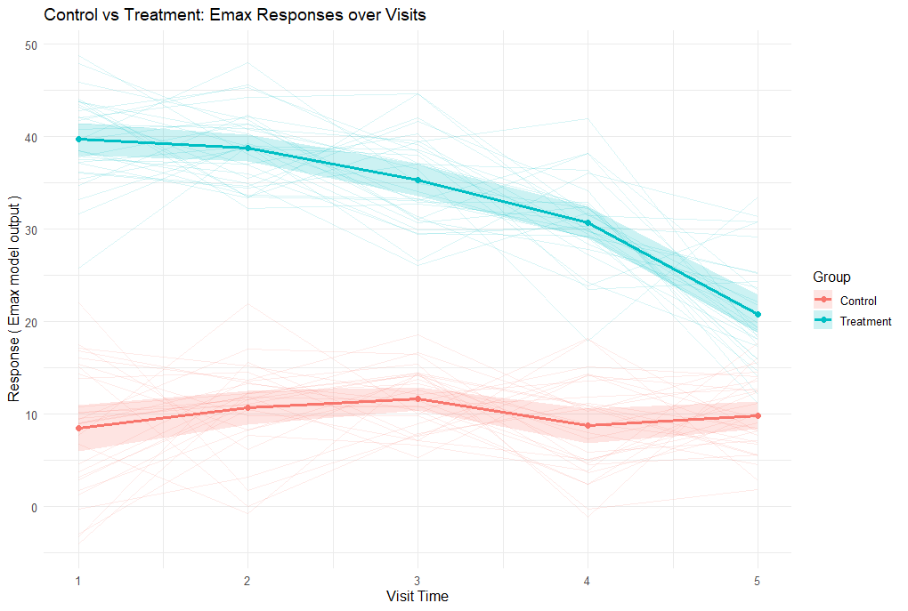
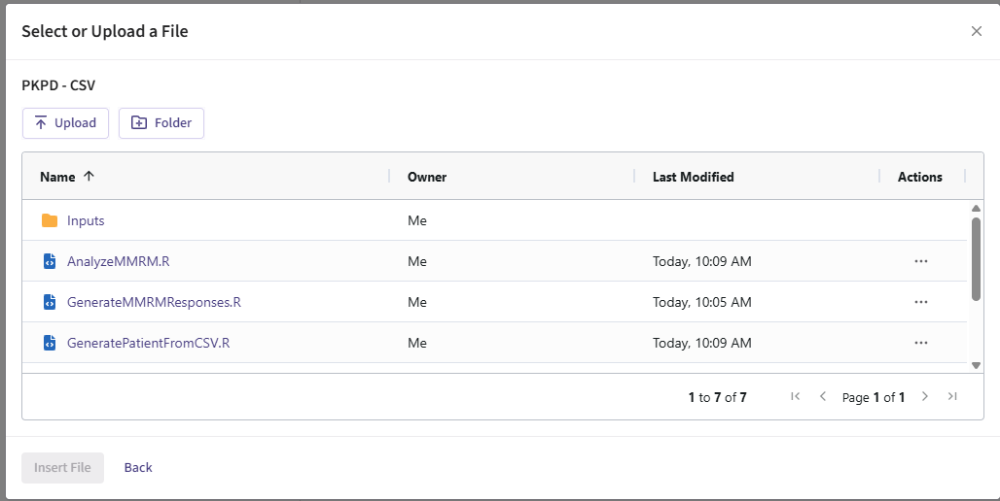
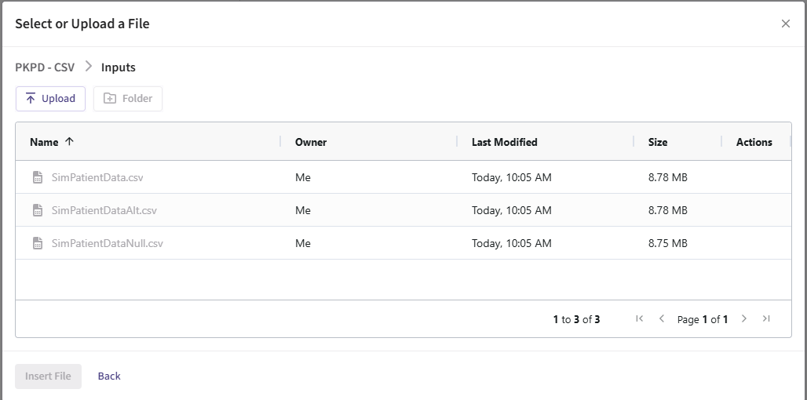

<div class="alert alert-primary" role="alert">
  <p style="margin-bottom:0">These examples are related to the <strong>Integration Point: Response</strong>.
  <a href="IntegrationPointResponse.html" class="alert-link">Click here for more information about this integration point.</a></p>
</div>

<div class="alert alert-danger" role="alert">
To try this example, create a new project in East Horizon using the following configuration:
<ul style="margin-bottom:0">
<li>**Study objective:** Two Arm Confirmatory</li>
<li>**Number of endpoints:** Single Endpoint</li>
<li>**Endpoint type:** Continuous Outcome</li>
<li>**Repeated measures:** On, with visits at these times (month):</li>
<ul>
<li>Visit 1: 0.25</li>
<li>Visit 2: 0.5</li>
<li>Visit 3: 0.75</li>
<li>Final Visit: 1</li>
</ul>
<li>**Task:** Explore</li>
</ul></div>

# Introduction

The following example demonstrates the capabilities of pharmacokinetic pharmacodynamic (PK/PD) modeling in East Horizon using R integration. We simulate plasma drug concentrations using a one-compartment model with first-order absorption and elimination, then transform concentration to effect via an Emax model to generate continuous outcomes for a two-arm trial (control vs treatment). A final example shows how to integrate externally sourced PK/PD data from a CSV file.

Once CyneRgy is installed, you can load this example in RStudio with the following command:

```{r, eval=FALSE}
CyneRgy::RunExample( "PKPDResponseGeneration" )
```

**RStudio Project File**: [PKPDResponseGeneration.Rproj](https://github.com/Cytel-Inc/CyneRgy/blob/main/inst/Examples/PKPDResponseGeneration/PKPDResponseGeneration)

In the [R directory of this example](https://github.com/Cytel-Inc/CyneRgy/tree/main/inst/Examples/PKPDResponseGeneration/R) you will find the following R files:

1. [GenerateDrugConcentration.R](https://github.com/Cytel-Inc/CyneRgy/blob/main/inst/Examples/PKPDResponseGeneration/R/GenerateDrugConcentration.R) - This file contains the R code for simulating drug concentrations for Example 1.

2. [PKPDResponseGeneration.R](https://github.com/Cytel-Inc/CyneRgy/blob/main/inst/Examples/PKPDResponseGeneration/R/PKPDResponseGeneration.R) - This file contains the R code to simulate treatment effect responses for patients for Example 2. (Note: Contains *GenerateDrugConcentration.R* function inside)

3. [PlotEmax.R](https://github.com/Cytel-Inc/CyneRgy/blob/main/inst/Examples/PKPDResponseGeneration/R/PlotEmax.R) - This file plots a visual that shows the mean response for each treatment group as a function of time based on the output of *PKPDResponseGeneration.R*. It is used to create the Emax over visits plot shown in the Example 2 section below.

4. [GeneratePatientFromCSVSpecific.R](https://github.com/Cytel-Inc/CyneRgy/blob/main/inst/Examples/PKPDResponseGeneration/R/GeneratePatientFromCSVSpecific.R) - This file is able to read in and use simulated patient data from CSV files with a specific formatting style to allow for faster run times. It is used in Example 3.

5. [GeneratePatientFromCSVGeneral.R](https://github.com/Cytel-Inc/CyneRgy/blob/main/inst/Examples/PKPDResponseGeneration/R/GeneratePatientFromCSVGeneral.R) - This file is able to work in the same way as the specific code, but it has a more general formatting style that leads to slower run times. It is used in Example 3.

6. [GenerateTreatmentControlCSV.R](https://github.com/Cytel-Inc/CyneRgy/blob/main/inst/Examples/PKPDResponseGeneration/R/GenerateTreatmentControlCSV.R) - This file generates CSV files for treatment and control groups based on the simulated patient data. It is used in Example 3.

In the [Inputs directory of this example](https://github.com/Cytel-Inc/CyneRgy/tree/main/inst/Examples/PKPDResponseGeneration/Inputs), you will find the following CSV files:

1. [SimPatientDataNull.csv](https://github.com/Cytel-Inc/CyneRgy/blob/main/inst/Examples/PKPDResponseGeneration/Inputs/SimPatientDataNull.csv) - This file contains simulated patient data with no treatment effect. It is used in Example 3.

2. [SimPatientDataAlt.csv](https://github.com/Cytel-Inc/CyneRgy/blob/main/inst/Examples/PKPDResponseGeneration/Inputs/SimPatientDataAlt.csv) - This file contains simulated patient data with a treatment effect. It is used in Example 3.


# Example 1 - Simulate Drug Concentration Response from a One-Compartment Model with First-order Absorption

<div class="alert alert-primary" role="alert">
  <p style="margin-bottom:0"> 
  This example is related to the R file: <a href="https://github.com/Cytel-Inc/CyneRgy/blob/main/inst/Examples/PKPDResponseGeneration/R/GenerateDrugConcentration.R" class="alert-link">GenerateDrugConcentration.R</a>.</p>
</div>

In the R function *GenerateDrugConcentration*, we use a one-compartment PK model with first-order absorption to generate simulate plasma concentrations for patients. The patient outcome is defined as a list of vectors, the exact quantity of vectors determined by the number of visits defined in the function parameters. Each vector contains the drug concentration for each patient at the given *visitTime*. In addition, an output of either `0` or `-1` will also be printed, where the former represents a successful response and the latter is a failure.

Refer to the table below for the definitions of the user-defined parameters used in this example and some example values.

|**User parameter**|**Definition**|**Example value**|
|----|------|----|
|**ka**|Dose first-order absorption rate constant. Describes the rate at which a drug moves from the site of administration into the central compartment.|1|
|**ke**|Dose first-order elimination rate constant. Describes the fraction of drug eliminated from the body per unit of time once the drug is in the central compartment.|0.2|
|**Dose**|Amount of drug administered to the body at the start of the model.|500|

The *OneCompartmentModelPK* function is called inside of the main function, and the `deSolve` package will generate a vector of concentrations that are stored inside the *concentration* variable. Then, depending on whether a patient is assigned to the control or treatment group, a normal distribution with their respective means and standard deviations are added to the concentration vector.

The figure below illustrates where this example fits within the R integration points of Cytel products, accompanied by a flowchart outlining the general steps performed by the R code.

```{r echo=FALSE,  warning=FALSE, fig.retina=3}
CyneRgy::PlotExampleFlowchart(
    lIntPoints = list(
        "Response" = c(
            "Load means, standard deviations, and user parameters", 
            "Generate concentration output using deSolve package", 
            "Generate normal responses for control and treatment groups", 
            "Store patient response data"
        )
    )
)
```

# Example 2 - Simulate Treatment Effect with Emax Model

<div class="alert alert-primary" role="alert">
  <p style="margin-bottom:0"> 
  This example is related to the R file: <a href="https://github.com/Cytel-Inc/CyneRgy/blob/main/inst/Examples/PKPDResponseGeneration/R/PKPDResponseGeneration.R" class="alert-link">PKPDResponseGeneration.R</a></p>
</div>

*PKPDResponseGeneration.R* serves as an extension of *GenerateDrugConcentration.R*. It converts per-visit plasma concentrations into treatment responses using the Emax PD model. It first calls the PK function to generate drug concentrations per subject per visit, then applies the Emax equation to convert the concentrations to our expected treatment effect: 

$$E = E_0 + \frac{E_{\text{max}} \times C_p}{E_{C_{50}} + C_p}$$

where:

- $E$ is the predicted treatment effect (response) at concentration $C_p$.
- $E_0$ is the baseline effect in the absence of drug (intercept).
- $E_{\text{max}}$ is the maximum incremental effect achievable above baseline.
- $C_p$ is the per-visit plasma concentration for a subject generated by the PK step.
- $E_{C_{50}}$ is the concentration at which 50% of $E_{\text{max}}$ is achieved.

Control group subjects are simulated from normal distributions around control means and std, while treatment subjects receive responses from the Emax-predicted effect with added variability. The output of this function is shown as visit-level response arrays for all subjects, along with an error code of `0` for success, and an error code of `-1` if parameter requirements are not met.

Refer to the table below for the definitions of the user-defined parameters used in this example and some example values.

|**User parameter**|**Definition**|**Example value**|
|----|------|----|
|**ka**|Dose first-order absorption rate constant. Describes the rate at which a drug moves from the site of administration into the central compartment.|1|
|**ke**|Dose first-order elimination rate constant. Describes the fraction of drug eliminated from the body per unit of time once the drug is in the central compartment.|0.2|
|**Dose**|Amount of drug administered to the body at the start of the model.|500|
|**E0**|Baseline effect, when there is an absence of the drug. Can also be interpreted as the intercept in a effect vs. concentration graph.|0|
|**Emax**|Maximum drug effect the system can achieve above baseline.|-12|
|**EC50**|Drug concentration at which 50% of the maximum effect is achieved.|15|

The figure below illustrates where this example fits within the R integration points of Cytel products, accompanied by a flowchart outlining the general steps performed by the R code.

```{r echo=FALSE,  warning=FALSE, fig.retina=3}
CyneRgy::PlotExampleFlowchart(
    lIntPoints = list(
        "Response" = c(
            "Load means, standard deviations, and user parameters", 
            "Calls GenerateDrugConcentration to get concentrations", 
            "Use concentrations as input to calculate TreatmentEffect", 
            "Generate patient responses with treatment data",
            "Store results in response matrix"
        )
    )
)
```

*PlotEmax.R* was used to plot a visual that shows the mean response for each treatment group as a function of time.



The plot shows simulated responses over five visits for control and treatment groups. Control responses remain around the baseline (~10), while treatment responses start high (~40) and gradually decline, reflecting the Emax effect of the drug as its concentration decreases over time.

# Example 3 - Integrating externally sourced PK/PD data from a CSV file

<div class="alert alert-primary" role="alert">
  <p style="margin-bottom:0"> This endpoint is related to the following R files: <a href="https://github.com/Cytel-Inc/CyneRgy/blob/main/inst/Examples/PKPDResponseGeneration/R/GeneratePatientFromCSVGeneral.R" class="alert-link">GeneratePatientFromCSVGeneral.R</a>, <a href="https://github.com/Cytel-Inc/CyneRgy/blob/main/inst/Examples/PKPDResponseGeneration/R/GeneratePatientFromCSVSpecific.R" class="alert-link">GeneratePatientFromCSVSpecific.R</a>, and <a href="https://github.com/Cytel-Inc/CyneRgy/blob/main/inst/Examples/PKPDResponseGeneration/R/GenerateTreatmentControlCSV.R" class="alert-link">GenerateTreatmentControlCSV.R</a>.</p>
</div>

In some situations, you may have pre-simulated patient data from external PK/PD models or other sources that you want to integrate into your trial simulation. This example demonstrates how to read patient responses from a CSV file instead of generating them on-the-fly during each simulation run. This approach offers several advantages: first, reading pre-generated data is much faster than computing complex PK/PD models for each patient in each simulation replicate. Second, using the same CSV file ensures consistent patient data across simulation runs. Finally, you can also leverage data generated from sophisticated external tools or empirical datasets.

The example includes three R files:

**1. GenerateTreatmentControlCSV.R** - A helper function that generates sample CSV files with simulated patient data. This is provided to help you test the CSV reading functionality. It creates a CSV file with treatment assignments (0 = control, 1 = treatment) and response values across multiple visits. The function simulates normally distributed responses with an optional treatment effect that grows across visits.

In the [Inputs directory of this example](https://github.com/Cytel-Inc/CyneRgy/tree/main/inst/Examples/PKPDResponseGeneration/Inputs), you will find two sample CSV files that were generated using this function:

- **SimPatientDataNull.csv** - Contains 500,000 simulated patients with no treatment effect (null hypothesis scenario). Both control and treatment groups have similar response distributions.
- **SimPatientDataAlt.csv** - Contains 500,000 simulated patients with a treatment effect (alternative hypothesis scenario). Treatment group shows progressively better responses across visits compared to control.

These files serve as examples of properly formatted CSV data that can be used with the CSV reader functions.

**2. GeneratePatientFromCSVGeneral.R** - A flexible CSV reader that accepts various column naming conventions and treatment/control identifiers. This function is more permissive in the CSV formats it accepts:

- **Visit columns**: Accepts "Visit X", "Visit.X", or "VisitX" (case-insensitive)
- **Treatment column**: Must be named "Treatment" (case-insensitive)
- **Treatment identifiers**: Accepts "1", "t", "trt", "treatment", or "active" (case-insensitive)
- **Control identifiers**: Accepts "0", "c", "ctl", "control", "placebo", or "cntl" (case-insensitive)
- **Missing values**: Recognizes "", "NA", "NaN", "na", "null", or "N/A"

**3. GeneratePatientFromCSVSpecific.R** - A faster CSV reader with stricter formatting requirements. This function runs faster than the general version but requires a specific CSV format:

- **Visit columns**: Must be named exactly "Visit 1", "Visit 2", etc.
- **Treatment column**: Must be named "Treatment"
- **Treatment identifiers**: Must be "1"
- **Control identifiers**: Must be "0"
- **Missing values**: Recognizes "", "NA", "NaN", "na", "null", or "N/A"

Both CSV readers perform the following steps:

1. Load the CSV file from the specified path (cached across function calls for efficiency)
2. Validate that required columns exist (Treatment column and sufficient Visit columns)
3. Filter and validate treatment assignments
4. Randomly sample patients from the CSV without replacement, ensuring each arm has enough patients
5. Map the sampled patients to subjects according to the trial's randomization scheme
6. Return response values for each visit

The figure below illustrates where this example fits within the R integration points of Cytel products, accompanied by a flowchart outlining the general steps performed by the R code.

```{r echo=FALSE,  warning=FALSE, fig.retina=3}
CyneRgy::PlotExampleFlowchart(
    lIntPoints = list(
        "Response" = c(
            "Load CSV file with pre-simulated patient data", 
            "Validate Treatment and Visit columns", 
            "Sample patients by treatment arm without replacement", 
            "Map sampled patients to trial subjects", 
            "Return visit-level responses for all subjects"
        )
    )
)
```

Refer to the table below for the definitions of the user-defined parameters used in this example and some example values.

|**User parameter**|**Definition**|**Example value**|
|----|------|----|
|**InputFileName**|The name of the CSV file (including the `.csv` extension) that contains the pre-simulated patient data. This file should be uploaded to the Inputs folder of your East Horizon project.|`SimPatientDataAlt.csv`|

## Using CSV-based Patient Data in East Horizon

To use pre-simulated patient data from a CSV file in your East Horizon simulation, follow these steps:

### Step 1: Upload R Files to Project Root

Upload one of the CSV reader R files to the root folder of your East Horizon project:

- `GeneratePatientFromCSVGeneral.R` (for flexible formatting), or
- `GeneratePatientFromCSVSpecific.R` (for faster performance with strict formatting)



<br>

### Step 2: Upload CSV File to Inputs Folder

Upload your patient data CSV file to the **Inputs** folder of your East Horizon project. You can use one of the provided example files:

- `SimPatientDataNull.csv` (null hypothesis scenario - no treatment effect)
- `SimPatientDataAlt.csv` (alternative hypothesis scenario - with treatment effect)
- Or upload your own CSV file following the required format.



<br>

### Step 3: Configure Response Card

1. In East Horizon's Response card, select **"User Specified - R"** as your distribution.
2. In the R code selection, choose the CSV reader file you uploaded in Step 1.
3. Set the user parameter `InputFileName` to the name of your CSV file (include the `.csv` extension).
   - For example: `InputFileName = "SimPatientDataAlt.csv"`
4. Configure the remaining design parameters as desired.
5. Run the simulation.

Note: Ensure your CSV file contains enough patients for both treatment arms across all simulation replicates. The CSV readers will return an error if there are insufficient patients available.
