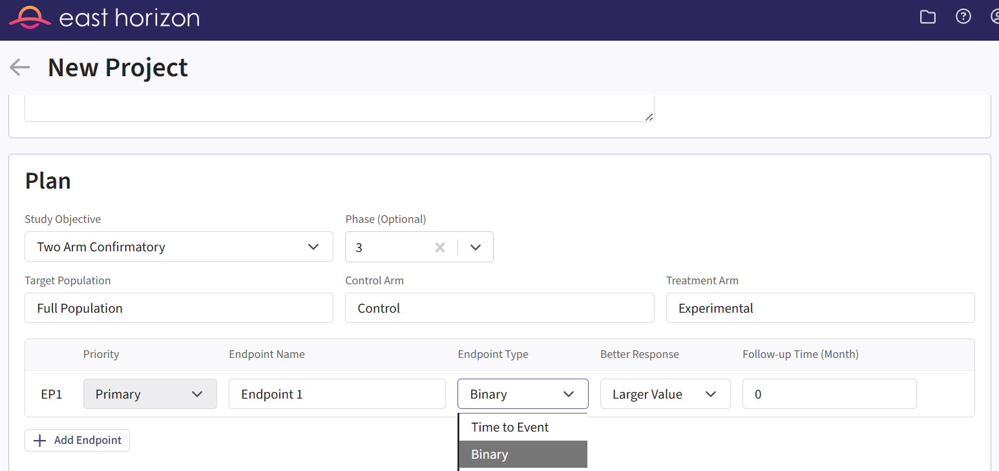
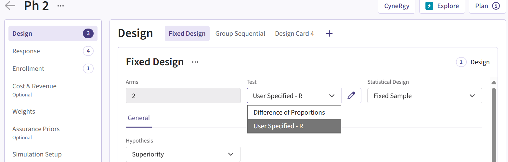
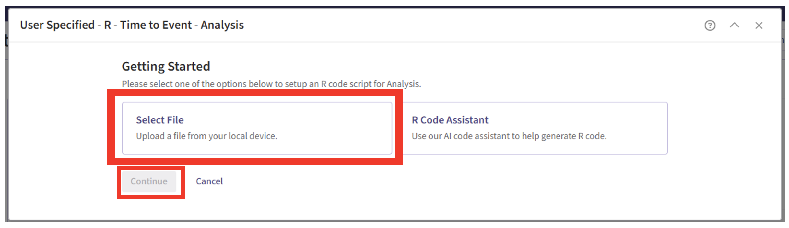
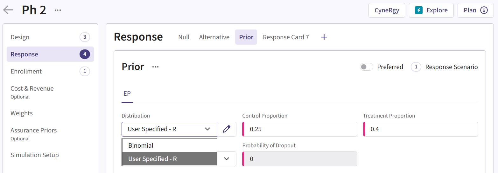
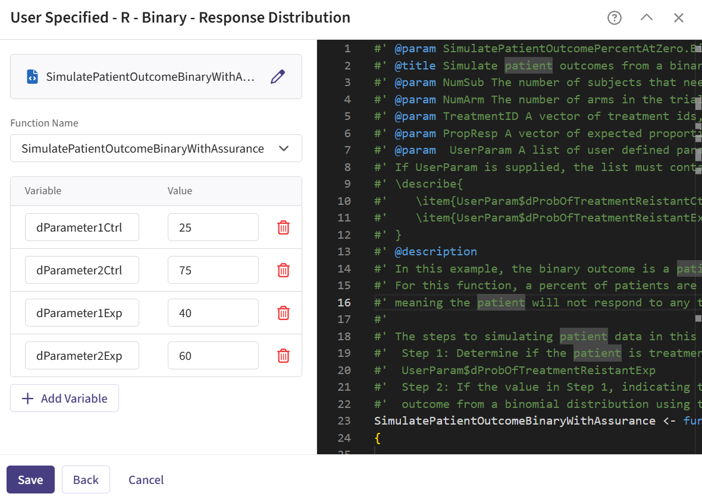
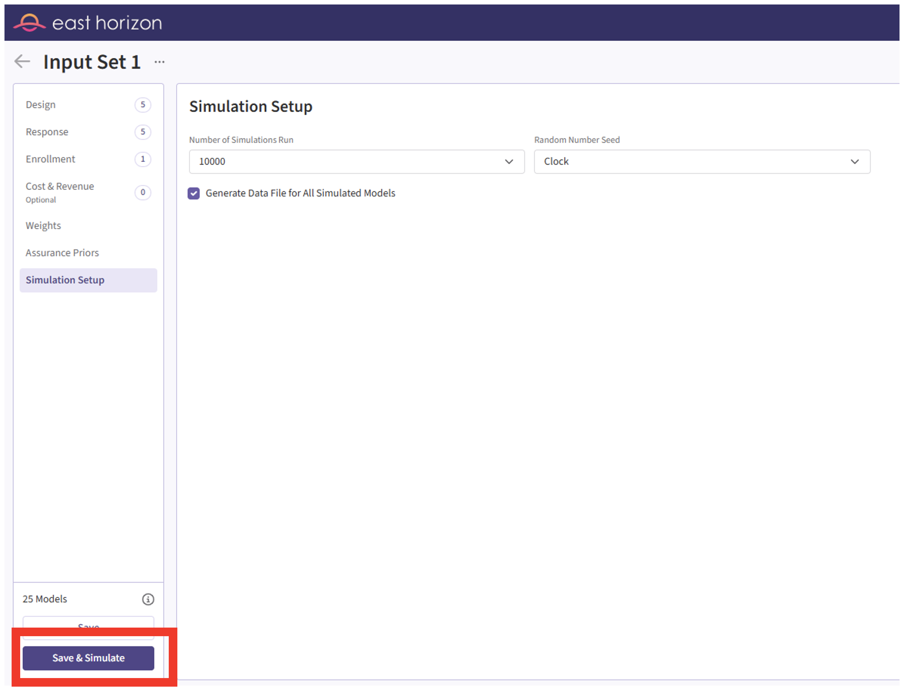

# Step-by-Step Instructions

Before starting, make sure you have the required tools and files.

1. [East Horizon](https://platform.cytel.com)
2. Download R Files from our public Github repo:  and .

## New Project Page

1. On East Horizon, create a new project with a binary endpoint.

{width=800px}

## New Input Set Page

2. Navigate to the Inputs tab, and create a new input set using the Explore task. Add phase 2 details.

{width=800px}

## Design Page

3. Click on the input set you just created, then select “User Specified – R” in the Test field.

{width=800px}

4. Click the pencil icon to open the R Integration pop-up window.

5. Click on “Select File” and then on “Continue”.

{width=800px}

6. Select the file “AnalyzeUsingEastManualFormula.R”.

7. Check that the correct file has been imported and the correct Function Name has been specified by the system. Click on the “Save” button to exit the R Integration details window.

{width=800px}

## Response Page

8. Navigate to the Response page and the relevant response card (add explanations for this), and then select “User Specified – R” in the Distribution field.

{width=800px}

9. Click on the pencil icon to open the R Integration pop-up window.

10.	Click on “Select File” and then on “Continue”.

{width=800px}

11. Select the file “SimulatePatientOutcomeBinaryWithAssurance.R”.

12. Check that the correct file has been imported and the correct Function Name has been specified by the system.

13. Note that the User Parameter variables have been automatically pulled from the R function that was imported. Specify parameters to define the beta distribution that you are using. In this example, we used Beta priors but you could use any other distribution by changing the R code to sample from a different one on lines 29 and 30 of the file. 

{width=400px}

See the [Response (Patient Simulation) Integration Point](#example-using-prior-distributions) section below for more information on these variables and example values.

14. Click on the “Save” button to exit the R Integration details window.

## Simulation Setup Page

15. Specify the number of simulation runs as needed.

{width=800px}

16. Check the box to “Generate Data File for All Simulated Models”.

{width=800px}

17. Click the "Save & Simulate" button.

{width=800px}

18. Confirm by clicking on "Simulate" in the pop-up window, and wait for the simulation runs to finish.

{width=500px}

## Results Page

19. Check whether the simulation failed or was completed by looking at the Status column.

{width=600px}

20. If the simulation failed, open the Log window to see if there are any helpful error messages.

   a. Click on the “?” icon in the top right corner of your screen.
    
{width=800px}
    
   b. Click on “Log”.
    
{width=800px}
    
   c. Identify any errors that appear. For example:
    
{width=400px}

21. If the simulation has completed, click on the Result name. If you have multiple scenarios in your simulation, you will be prompted to label at least one scenario from the list. Alternatively, you may also skip this step by selecting the “Skip” button in the bottom left corner.

{width=800px}

22. The Explore page of the results appears. You will notice a checkbox on the left side of each row in the table, below the heatmap. Click on the model that generated the data using your prior distribution, e.g.: 

23. Now click on Download dropdown menu, that is in the top right of the screen, and Summary Statistics option.

24. Using Excel, filter this CSV – use the Decision column (column F), and filter to only show rows with “Efficacy”.

25. Save this subset of the data and copy paste the values of the True Prob Control and True Prob Experimental into the LoadData function in the SimulatePatientOutcomeBinaryWithAssurancePh3.R file – you will see mine at the bottom of the file, you can replace my values with yours.

## New Input Set Page

26. Navigate to the Inputs tab again, and create a new input set using the Explore task. Add phase 3 details.

## Response Page

27. Navigate to the Response page and the relevant response card (add explanations for this), and then select “User Specified – R” in the Distribution field.

{width=800px}

28. Click on the pencil icon to open the R Integration pop-up window.

29.	Click on “Select File” and then on “Continue”.

{width=800px}

30. Select the file “SimulatePatientOutcomeBinaryWithAssurancePh3.R”.

31. Check that the correct file has been imported and the correct Function Name has been specified by the system.

32. Note that the User Parameter variables have been automatically pulled from the R function that was imported. Specify parameters to define the beta distribution that you are using. In this example, we used Beta priors but you could use any other distribution by changing the R code to sample from a different one on lines 29 and 30 of the file. 

{width=400px}

See the [Response (Patient Simulation) Integration Point](#example-using-prior-distributions) section below for more information on these variables and example values.

33. Click on the “Save” button to exit the R Integration details window.

## Simulation Setup Page

34. Simulate the same way as described before.

## Results Page

35. Load the results as described before. The Explore page of the results appears. Hover over each cell in the heat map to see a summary of the outputs. Because of our custom R scripts, “Power” is actually now equivalent to “Probability of Success” of the ph3
