<div class="alert alert-primary" role="alert">
  <p style="margin-bottom:0">The following scripts are related to both the <a href="IntegrationPointResponse.html" class="alert-link"><strong>Integration Point: Response</strong></a> and the <a href="IntegrationPointAnalysis.html" class="alert-link"><strong>Integration Point: Analysis</strong></a>. Click on the links for more information about these integration points.</p>
</div>

# Introduction

This example demonstrates how to compute the probability of success of a clinical trial by extending East Horizon’s single-endpoint framework to handle dual endpoints using custom R scripts for the **Response (Patient Simulation)** and the **Analysis** integration points. This example uses **Progression Free Survival (PFS)** and **Overall Survival (OS)** as endpoints, however, this could be extended to other types of endpoints by modifying the R code. 

## Why do we need R Integration for this example?

To compute the Probability of Success of a trial, users need to simulate patient outcomes by sampling the true rates from prior distributions. This is something that East Horizon cannot handle yet with its current response generation algorithms, so we must integrate a custom R file for the simulation to do so.

When a trial involves multiple success criteria, users must change how “Success” is defined from a traditional success analysis with only one endpoint. East Horizon cannot handle multiple success criteria for a Winning Condition yet, so we must integrate a custom R file for the simulation to take into account changing success criteria from the traditional “statistically significant” criteria. 

## What do the R functions do?

In the [R directory of this example](https://github.com/Cytel-Inc/CyneRgy/tree/main/inst/Examples/ProbabilitySuccessDualEndpoints/R) you will find the following R files:

- **[Simulate2EndpointTTEWithMultiState.R](https://github.com/Cytel-Inc/CyneRgy/blob/main/inst/Examples/ProbabilitySuccessDualEndpoints/R/Simulate2EndpointTTEWithMultiState.R)**

   This R file contains a function that executes the response data generation for both PFS and OS endpoints. Due to the typically assumed correlation between PFS and OS, the timing of the events for each simulated patient must take into account that these endpoints are not completely independent of each other. This function therefore handles this concern by using a multi-state model that takes into consideration:

   1. The rate at which events occur from trial start to a progression event, 
   2. The rate at which events occur from trial start to a death, and
   3. The probability that death takes place before a progression event.<br><br>
   
   As there may be uncertainty around each of these assumed parameters, the function simulates each of them based on prior distributions rather than single values for each. Users must provide input assumptions that parametrize the prior distributions that will be sampled from to simulate each patient’s response times. 

   For more information on this function, see the [Response (Patient Simulation) Integration Point](#response-patient-simulation-integration-point) section below.

- **[AnalyzePFSAndOS.R](https://github.com/Cytel-Inc/CyneRgy/blob/main/inst/Examples/ProbabilitySuccessDualEndpoints/R/AnalyzePFSAndOS.R)**

   This R file contains a function that executes the interim and final analyses of each simulated trial. The function takes into account that both PFS and OS event time stamps are being generated. The function computes the probability of success of the trial, where success is defined as: 

   1. **Statistical significance for PFS**: PFS data and frequentist analysis using a Logrank test statistic proves that the difference between the control and treatment arms is proven to be statistically significant.
   2. **Positive trend observed for OS**: OS data shows a positive trend in the difference between the control and treatment arms – the positive trend is defined by a user-specified threshold for the Hazard Ratio observation.<br><br>
   
   *The success criteria can be changed to compute the probability of success for varying success criteria. The lines in the code that need to be modified are line 170 for interim analyses and line 193 for final analysis.*

   For more information on this function, see the [Analysis Integration Point](#analysis-integration-point) section below.

## Combining it all together…

The figure below illustrates where this example fits within the R integration points of Cytel products, accompanied by flowcharts outlining the general steps performed by the R code.

```{r echo=FALSE,  warning=FALSE, fig.retina=3}
library(ggplot2)

bigcolxmin = 5
bigcolxmax = bigcolxmin + 3

bigcolxmin2 = 8.5
bigcolxmax2 = bigcolxmin2 + 3

# Define main columns
columns <- data.frame(
  xmin = c(0, 1, 2, 3, 4, bigcolxmin, bigcolxmin2),
  xmax = c(0.5, 1.5, 2.5, 3.5, 4.5, bigcolxmax, bigcolxmax2),
  ymin = rep(3, 7),
  ymax = rep(10, 7),
  label = c("Initialization", "Enrollment", "Randomization", "Dropout", "Treatment\nSelection", "Response", "Analysis"),
  fill = c("lightgray", "lightgray", "lightgray", "lightgray", "lightgray", "#cfe2ff", "#cfe2ff"),
  border = c("lightgray", "lightgray", "lightgray", "lightgray", "lightgray", "#cfe2ff", "#cfe2ff")
)

unitybox = 0.7
spaceybox = 0.5
ymaxfirstbox = 9.75
yminfirstbox = ymaxfirstbox - unitybox
ymaxsecondbox = yminfirstbox - spaceybox
yminsecondbox = ymaxsecondbox - unitybox*1.5
ymaxthirdbox = yminsecondbox - spaceybox
yminthirdbox = ymaxthirdbox - unitybox*1.5
ymaxfourthbox = yminthirdbox - spaceybox
yminfourthbox = ymaxfourthbox - unitybox*1.5

ymaxfifthbox = yminfourthbox - spaceybox
yminfifthbox = ymaxfifthbox - unitybox

# Define flowchart steps 
flowchart <- data.frame(
  xmin = rep(bigcolxmin + 0.1, 5),
  xmax = rep(bigcolxmax - 0.1, 5),
  ymax = c(ymaxfirstbox, ymaxsecondbox, ymaxthirdbox, ymaxfourthbox, ymaxfifthbox),
  ymin = c(yminfirstbox, yminsecondbox, yminthirdbox, yminfourthbox, yminfifthbox),
  label = c("Load prior distribution parameters", 
            "Sample median time to PFS \nand OS from Gamma distribution",
            "Sample probability of death \nbefore PFS from Beta distribution",
            "Simulate PFS and OS \nusing multi-state model", 
            "Return survival times"),
  fill = rep("#cfe2ff", 5)
)

# Define arrows for flowchart 
flowchart_arrows <- data.frame(
  x = rep((bigcolxmin+bigcolxmax)/2, 4),
  xend = rep((bigcolxmin+bigcolxmax)/2, 4),
  y = c(flowchart$ymin[1], flowchart$ymin[2], flowchart$ymin[3], flowchart$ymin[4]),
  yend = c(flowchart$ymax[2], flowchart$ymax[3], flowchart$ymax[4], flowchart$ymax[5])
)

yminfirstbox2 = ymaxfirstbox - unitybox
ymaxsecondbox2 = yminfirstbox2 - spaceybox
yminsecondbox2 = ymaxsecondbox2 - unitybox
ymaxthirdbox2 = yminsecondbox2 - spaceybox
yminthirdbox2 = ymaxthirdbox2 - unitybox
ymaxfourthbox2 = yminthirdbox2 - spaceybox
yminfourthbox2 = ymaxfourthbox2 - unitybox*2

ymaxfifthbox2 = yminfourthbox2 - spaceybox
yminfifthbox2 = ymaxfifthbox2 - unitybox*1.5

# Define flowchart steps 
flowchart2 <- data.frame(
  xmin = rep(bigcolxmin2 + 0.1, 5),
  xmax = rep(bigcolxmax2 - 0.1, 5),
  ymax = c(ymaxfirstbox, ymaxsecondbox2, ymaxthirdbox2, ymaxfourthbox2, ymaxfifthbox2),
  ymin = c(yminfirstbox2, yminsecondbox2, yminthirdbox2, yminfourthbox2, yminfifthbox2),
  label = c("Load OS hazard ratio thresholds", 
            "Analyze PFS using Cox regression",
            "Analyze OS using Cox regression",
            "Make interim or final analysis\ndecisions based on efficacy and\nfutility boundaries", 
            "Return test statistics, hazard ratios,\nand decision outcomes"),
  fill = rep("#cfe2ff", 5)
)

# Define arrows for flowchart 
flowchart_arrows2 <- data.frame(
  x = rep((bigcolxmin2+bigcolxmax2)/2, 4),
  xend = rep((bigcolxmin2+bigcolxmax2)/2, 4),
  y = c(flowchart2$ymin[1], flowchart2$ymin[2], flowchart2$ymin[3], flowchart2$ymin[4]),
  yend = c(flowchart2$ymax[2], flowchart2$ymax[3], flowchart2$ymax[4], flowchart2$ymax[5])
)

# Define the legend elements
legend_data <- data.frame(
  xmin = c(9, 10.5),
  xmax = c(10, 11.5),
  ymin = c(2.5, 2.5),
  ymax = c(2.8, 2.8),
  fill = c("lightgray", "#cfe2ff"),
  label = c("Not Used", "Used")
)

# Create the plot
p <- ggplot() +
  # Add main column sections
  geom_rect(data = columns, aes(xmin = xmin, xmax = xmax, ymin = ymin, ymax = ymax, fill = fill),
            color = columns$border) + 
  scale_fill_identity() +
  # Add labels for the columns
  geom_text(data = columns, aes(x = (xmin + xmax) / 2, y = ymax + 0.7, label = label), size = 3, angle = 20, vjust = 1) +
  # Add flowchart 
  geom_rect(data = flowchart, aes(xmin = xmin, xmax = xmax, ymin = ymin, ymax = ymax, fill = fill), color = "black") +
  geom_text(data = flowchart, aes(x = (xmin + xmax) / 2, y = (ymin + ymax) / 2, label = label), size = 2.5) +
  # Add arrows between flowchart boxes
  geom_curve(data = flowchart_arrows, aes(x = x, y = y, xend = xend, yend = yend),
             curvature = 0, arrow = arrow(length = unit(0.15, "cm")), color = "black") +
  # Add flowchart 
  geom_rect(data = flowchart2, aes(xmin = xmin, xmax = xmax, ymin = ymin, ymax = ymax, fill = fill), color = "black") +
  geom_text(data = flowchart2, aes(x = (xmin + xmax) / 2, y = (ymin + ymax) / 2, label = label), size = 2.5) +
  # Add arrows between flowchart boxes
  geom_curve(data = flowchart_arrows2, aes(x = x, y = y, xend = xend, yend = yend),
             curvature = 0, arrow = arrow(length = unit(0.15, "cm")), color = "black") +
  # Remove grid and axes
  theme_void() + 
  theme(panel.background = element_rect(fill = 'white', colour = 'white')) +
  geom_rect(data = legend_data, aes(xmin = xmin, xmax = xmax, ymin = ymin, ymax = ymax, fill = fill), color = "black") +
  geom_text(data = legend_data, aes(x = (xmin + xmax) / 2, y = ymin - 0.1, label = label), size = 2.5, vjust = 1) 

print(p)
```

By combining the above R functions with the East Horizon native inputs, users are able to simulate and compute the probability of success of each simulated trial. Users will also continue to benefit from East Horizon’s output visualizations – with the caveat that the Probability of Success metric will be labeled as “Power” in the native outputs of East Horizon.

------

# Step-by-Step Instructions

Before starting, make sure you have the required tools and files.

1. [East Horizon](https://platform.cytel.com)
2. Download R Files from our public Github repo: [Simulate2EndpointTTEWithMultiState.R](https://github.com/Cytel-Inc/CyneRgy/blob/main/inst/Examples/ProbabilitySuccessDualEndpoints/R/Simulate2EndpointTTEWithMultiState.R) and [AnalyzePFSAndOS.R](https://github.com/Cytel-Inc/CyneRgy/blob/main/inst/Examples/ProbabilitySuccessDualEndpoints/R/AnalyzePFSAndOS.R).

## New Project Page

1. On East Horizon, create a new project with a single endpoint.

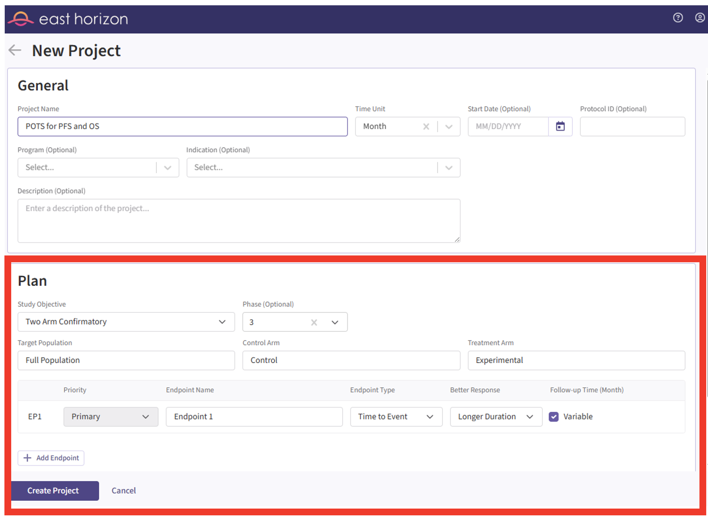{width=800px}

## New Input Set Page

2. Navigate to the Inputs tab, and create a new input set using the Explore task.

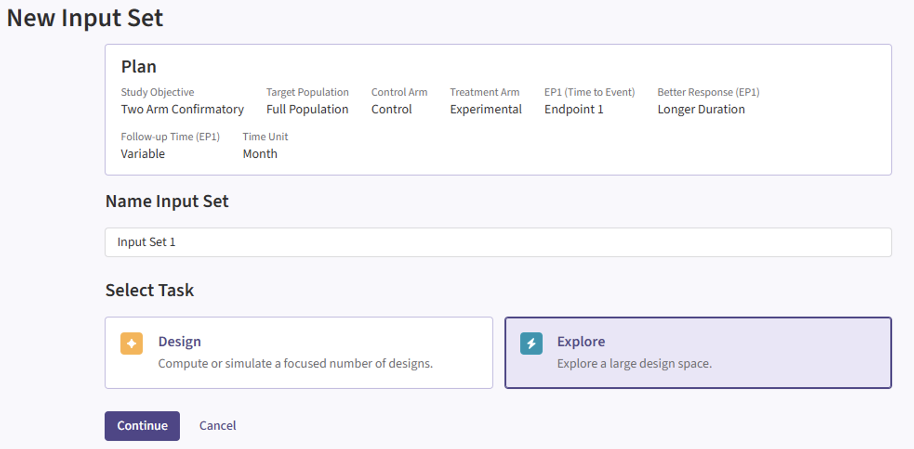{width=800px}

## Design Page

3. Click on the input set you just created, then select “User Specified – R” in the Test Statistic field.

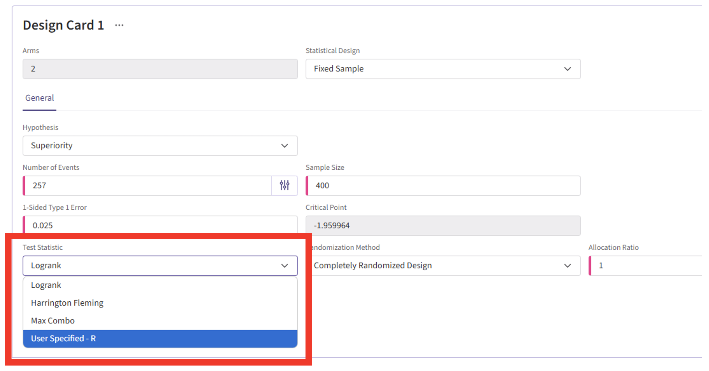{width=800px}

4. Click the “+” icon to open the R Integration pop-up window.

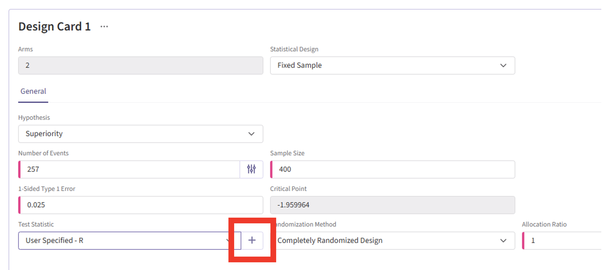{width=800px}

5. Click on “Select File” and then on “Continue”.

{width=800px}

6. Select the file “AnalyzePFSAndOS.R”.

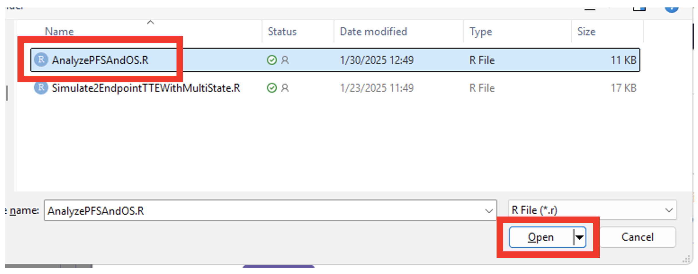{width=800px}

7. Check that the correct file has been imported and the correct Function Name has been specified by the system.

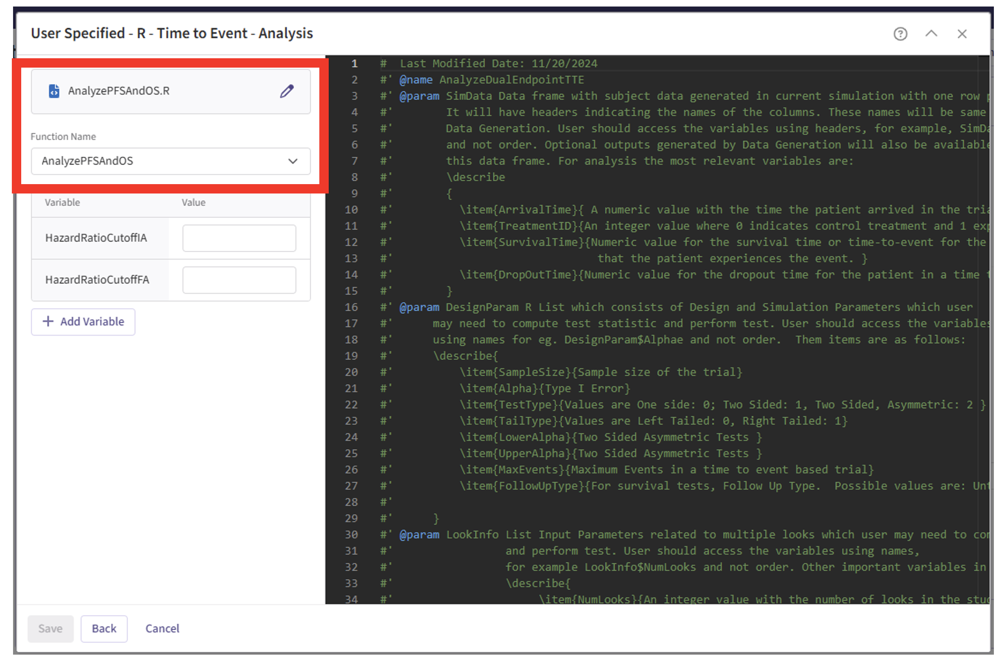{width=800px}

8. Note that the User Parameter variables have been automatically pulled from the R function that was imported. Specify the values for each of these variables.

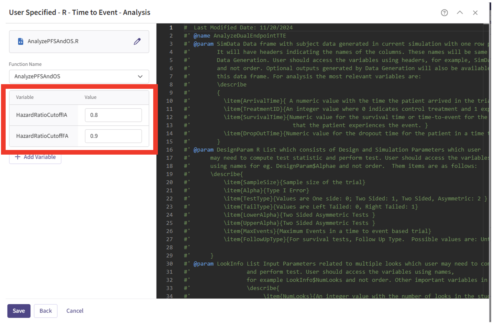{width=800px}

These variables are the thresholds for the Hazard Ratio for Overall Survival to be considered “TRENDING” for the trial’s second success criteria. Users must specify a threshold for the interim analysis, if using a group sequential design, and always for the final analysis. See the [Analysis Integration Point](#analysis-integration-point) section below for more information about these variables and example values. 

*Note: We typically make success criteria more CONSERVATIVE (i.e. making it more difficult to declare a “win”) on a trending OS at the interim analysis compared to the final analysis because you want to be “more sure” of your decision when you have less evidence/data available at the time of decision.*

9. Click on the “Save” button to exit the R Integration details window.

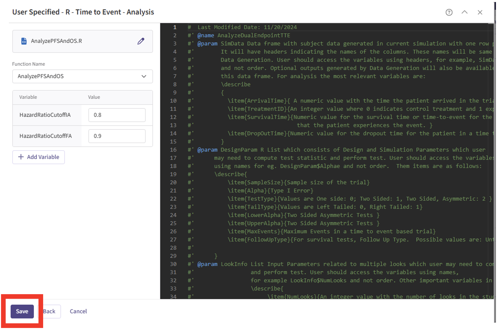{width=800px}

## Response Page

10. Start with identifying:

a. Median time to PFS for Control arm & Variance.
b. Median time to PFS for Experimental arm (this can be computed using above parameter and an assumed Hazard Ratio) & Variance.
c. Median time to OS for Control arm & Variance.
d. Median time to OS for Experimental arm (this can be computed using above parameter and an assumed Hazard Ratio) & Variance.
e. Probability of Death event Happening BEFORE Progression event for Control arm.
f. Probability of Death event Happening BEFORE Progression event for Treatment arm.

See the [Response (Patient Simulation) Integration Point](#example-using-prior-distributions) section below for more information about these variables and example values.

11. Use the Parameter Solving Tool below to convert Median Survival Time & Variance parameters into Shape & Rate parameters.

<div class="alert alert-primary" role="alert">
**Parameter Solving Tool**
<p style="margin-bottom:0">Enter your desired **mean** and **variance** to calculate the **shape** and **rate** parameters for the Gamma distribution:</p>

<label for="mean">Mean:</label>
<input type="number" id="mean" value="1" step="any"> <br>
<label for="variance">Variance:</label>
<input type="number" id="variance" value="1" step="any"> <br>

<button type="button" class="btn btn-primary" onclick="calculateGammaParams()">Calculate</button> <br>

<p><strong>Shape:</strong> <span id="shapeOut">-</span></p>
<p><strong>Rate:</strong> <span id="rateOut">-</span></p>

<script>
function calculateGammaParams() {
  const mean = parseFloat(document.getElementById("mean").value);
  const variance = parseFloat(document.getElementById("variance").value);

  if (isNaN(mean) || isNaN(variance) || mean <= 0 || variance <= 0) {
    alert("Please enter valid positive numbers for both mean and variance.");
    return;
  }

  const shape = mean * mean / variance;
  const rate = mean / variance;

  document.getElementById("shapeOut").innerText = shape.toFixed(4);
  document.getElementById("rateOut").innerText = rate.toFixed(4);
}
</script>
</div>

12. Navigate to the Response page, and then select “User Specified – R” in the Distribution field.

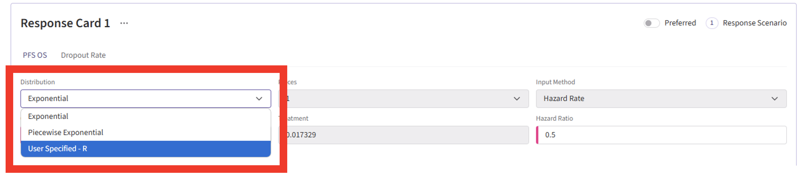{width=800px}

13. Click on the “+” icon to open the R Integration pop-up window. 

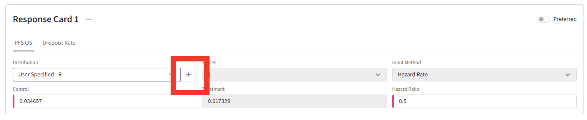{width=800px}

14.	Click on “Select File” and then on “Continue”.

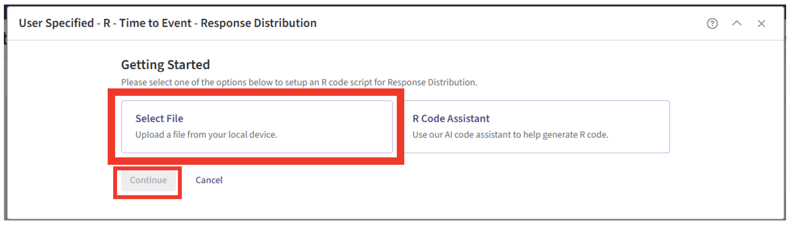{width=800px}

15. Select the file “Simulate2EndpointTTEWithMultiState.R”.

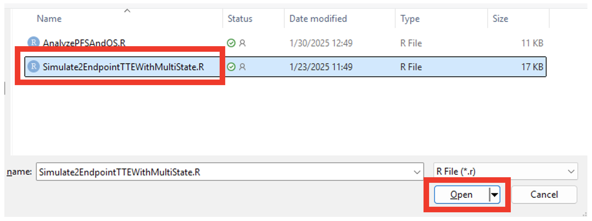{width=800px}

16. Check that the correct file has been imported and the correct Function Name has been specified by the system.

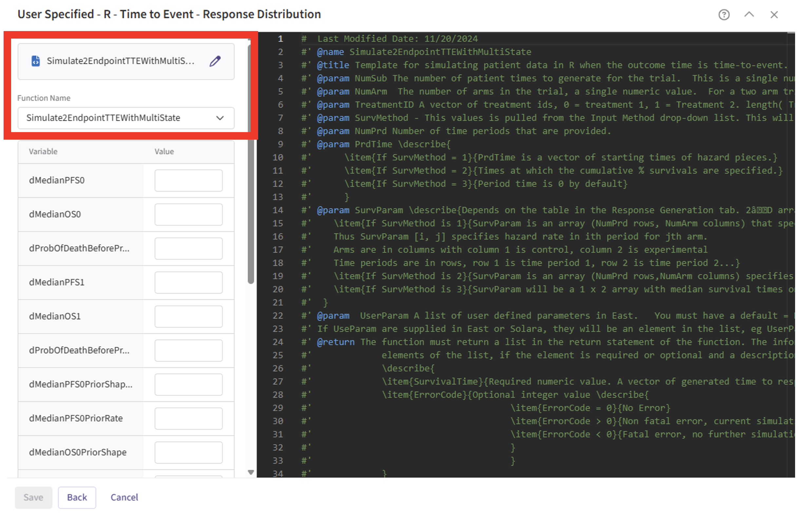{width=800px}

17. Note that the User Parameter variables have been automatically pulled from the R function that was imported. Delete the first six variables from the list, as we are not using them right now. As the Delete feature is not available yet, you can specify a value of 0 for each parameter instead.

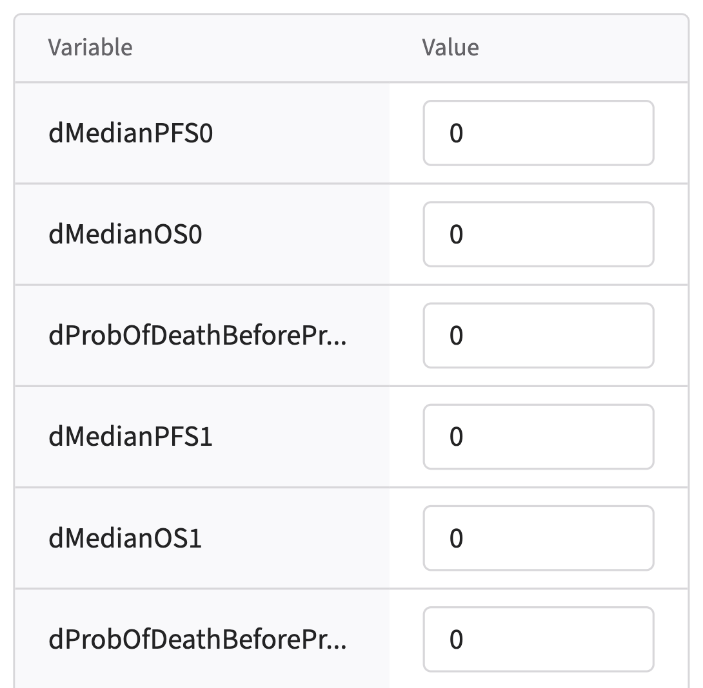{width=400px}

18. Specify the values for each of the required User Parameter variables for the function.

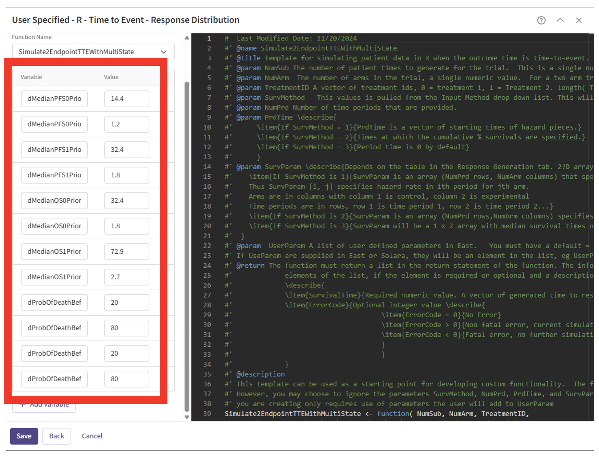{width=800px}

See the [Response (Patient Simulation) Integration Point](#example-using-prior-distributions) section below for more information on these variables and example values.

19. Click on the “Save” button to exit the R Integration details window.

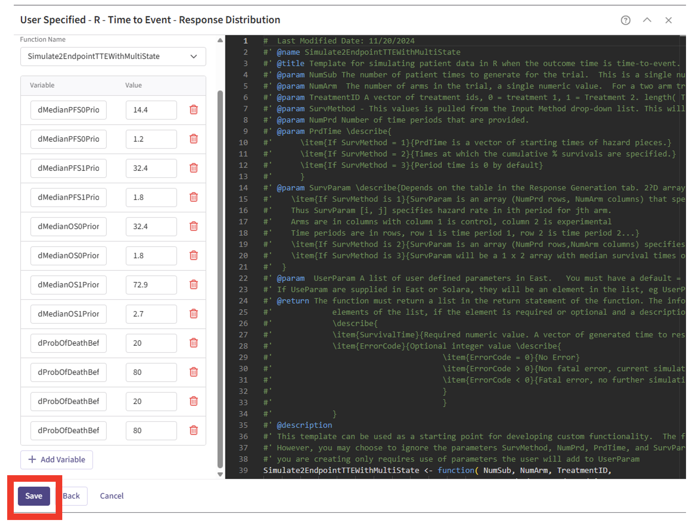{width=800px}

20. Navigate to the “Dropout Rate” tab within the Response Card to include dropout information if needed.

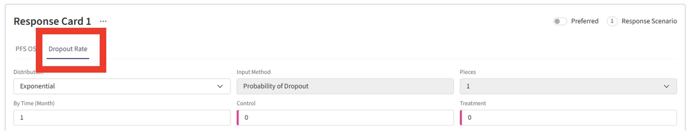{width=800px}

## Enrollment Page

21. Navigate to the Enrollment page, and specify the average number of subjects enrolled per time unit (e.g. default is per month).

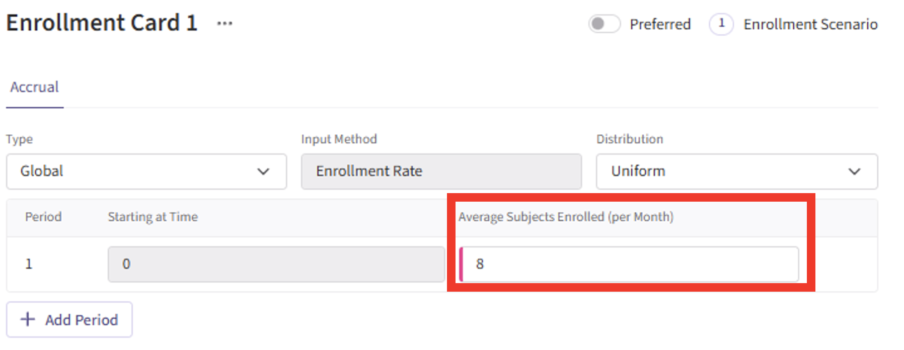{width=800px}

## Simulation Setup Page

22. Specify the number of simulation runs as needed.

{width=800px}

23.	Check the checkbox to save the simulation data for all simulated models.

{width=800px}

24. Click the "Save & Simulate" button.

{width=800px}

25. Confirm by clicking on "Simulate" in the pop-up window, and wait for the simulation runs to finish.

{width=500px}

## Results Page

26. Check whether the simulation failed or was completed by looking at the Status column.

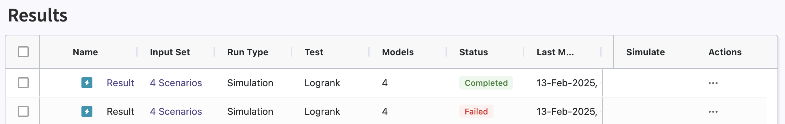{width=600px}

27. If the simulation failed, open the Log window to see if there are any helpful error messages.

   a. Click on the “?” icon in the top right corner of your screen.
    
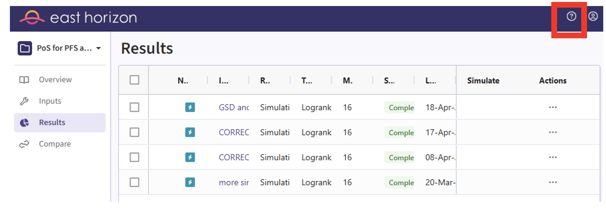{width=800px}
    
   b. Click on “Log”.
    
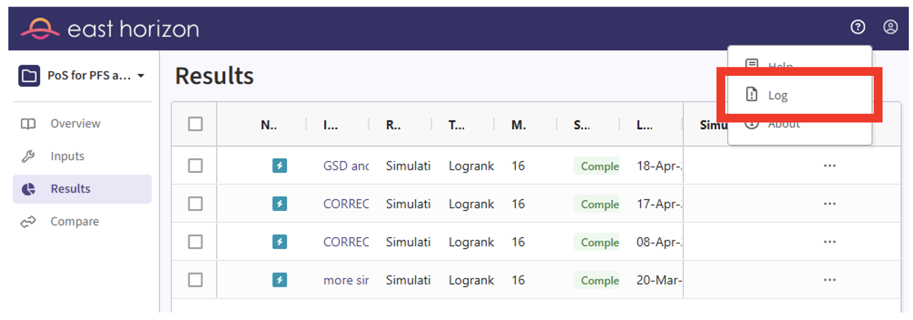{width=800px}
    
   c. Identify any errors that appear. For example:
    
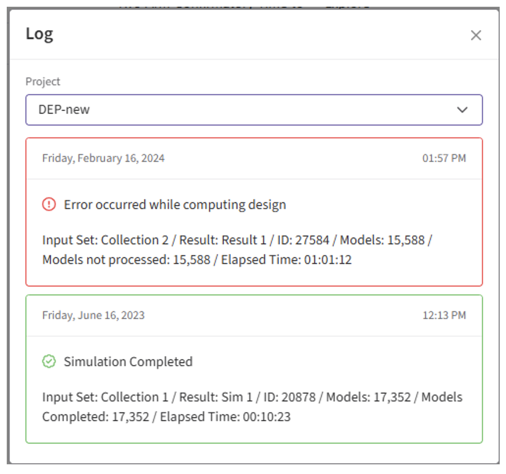{width=400px}

28. If the simulation has completed, click on the Result name. If you have multiple scenarios in your simulation, you will be prompted to label at least one scenario from the list. Alternatively, you may also skip this step by selecting the “Skip” button in the bottom left corner.

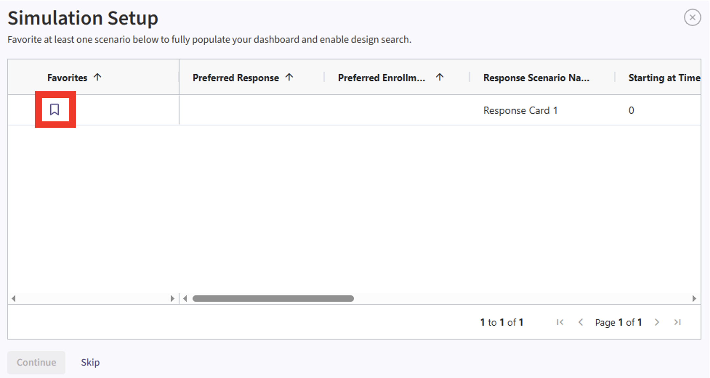{width=800px}

29. The Explore page of the results appears. Hover over each cell in the heat map to see a summary of the outputs. Because of our custom R scripts, “Power” is actually now equivalent to “Probability of Success”, where success means that PFS is statistically significant and OS is trending.

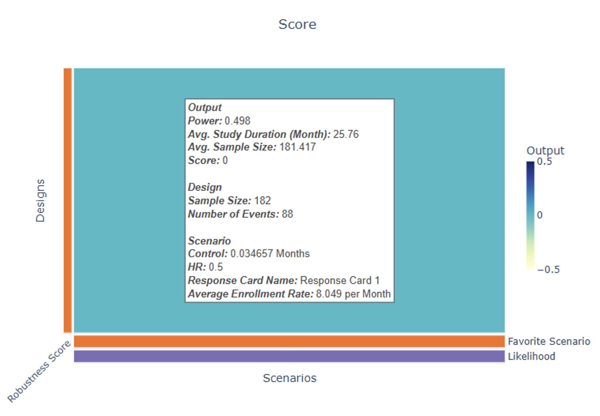{width=800px}

See the [Results](#results) section below for more information.

30. To visualize the Probability of Success at an interim look, click on the cell in the heat map to open the Detailed Model Output Card. Scroll to the bottom and open the “Simulation Boundaries and Boundary Crossing Probabilities” Table.

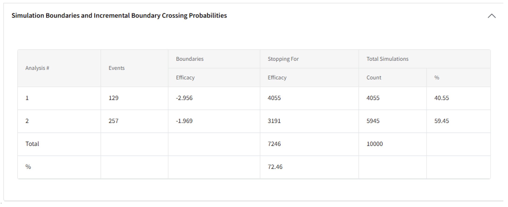{width=800px}

31. If you need to be reminded which threshold for the OS success criteria was used, scroll up to the top of the Detailed Output page and find details of your inputs in the “Summary” card.

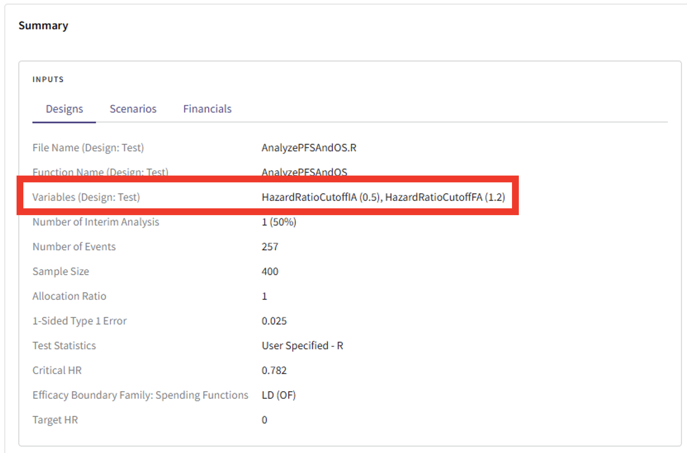{width=800px}

32. Compute the Probability of Success at each analysis by identifying the number of times the trial stopped for Efficacy at a given analysis over the total number of simulations. For example:

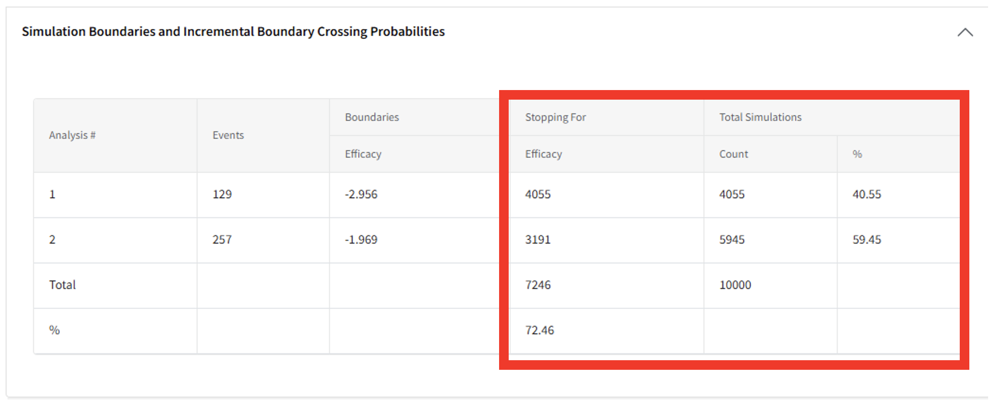{width=800px}

- Probability of Success at interim: 4055/10000 = 40.55%
- Probability of Success at the final analysis conditional on an unsuccessful interim: 3191/5945 = 53.68%
- Probability of Success by the final analysis (either at IA1 or FA): 7246/10000 = 72.46%

------

# Technical Information and Example Values

## Response (Patient Simulation) Integration Point

<div class="alert alert-primary" role="alert">
  <p style="margin-bottom:0"> This endpoint is related to this R file: <a href="https://github.com/Cytel-Inc/CyneRgy/blob/main/inst/Examples/ProbabilitySuccessDualEndpoints/R/Simulate2EndpointTTEWithMultiState.R" class="alert-link">Simulate2EndpointTTEWithMultiState.R</a></p>
</div>

We are using East Horizon’s single-endpoint framework, which we customize to support dual endpoints through the Response Integration Point via our R script linked above. The two endpoints of interest are:

- **Progression-Free Survival (PFS)**: The duration during which a patient lives with a disease without experiencing further progression.
- **Overall Survival (OS)**: The total time elapsed from treatment until death.

We use a multi-state model to simulate event times for each patient in every simulated trial. This model captures the relationship between PFS and OS by generating both outcomes together, rather than independently. Information generated from this simulation will be used later for the [Analysis Integration Point](#analysis-integration-point).

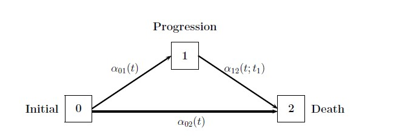

The diagram above illustrates the multistate model for survival analysis, with three states:

1. **State 0**: Initial, no progression.
2. **State 1**: Progression, event occurs that makes the disease progress.
3. **State 2**: Death.

There are also three transitions between states:

1. $\alpha_{01}$: Transition rate from Initial to Progression.
1. $\alpha_{02}$: Transition rate from Initial to Death.
1. $\alpha_{12}$: Transition rate from Progression to Death.

From Meller et al. [1], the probability of progression before death is:

$$ q = \frac{\alpha_{01}}{\alpha_{01} + \alpha_{02}} \ \ \ \ \ (1) $$

Where $q = 1 - p$, with $p$ being the probability of Death before Progression.

Using this relationship:

$$ \alpha_{02} = \frac{\alpha_{01}(1-q)}{q} =  \frac{\alpha_{01} \cdot p}{q} \ \ \ \ \ (2) $$

Or equivalently:

$$ \alpha_{01} = \frac{\alpha_{02} \cdot q}{p} \ \ \ \ \ (3) $$

Progression-Free Survival (PFS) is treated as the minimum of two competing times:

- $X_1 \sim \text{Exp}(\alpha_{01})$: Time from Initial to Progression.
- $X_2 \sim \text{Exp}(\alpha_{02})$: Time from Initial to Death without Progression.

Using the property of the minimum of two exponential random variables [2]:

$$ Z = \min(X_1, X_2) \sim \text{Exp}(\alpha_{01} + \alpha_{02}) $$

The mean of an exponential distribution is given by:

$$ M = \frac{1}{\alpha_{01} + \alpha_{02}} $$

Substituting $\alpha_{01}$ in terms of $\alpha_{02}$:

$$ M = \frac{1}{\alpha_{01} + \alpha_{02}} = \frac{1}{\frac{\alpha_{02} \cdot q}{p} + \alpha_{02}} = \frac{1}{\alpha_{02} \cdot \left(\frac{q}{p} + 1\right)} $$

Solving for $\alpha_{02}$:

$$ \alpha_{02} = \frac{1}{M \cdot \left(\frac{q}{p} + 1\right)} $$

Once $\alpha_{02}$ is calculated, it can be plugged into (3) to obtain $\alpha_{01}$.


Overall Survival (OS) accounts for both pathways:

1. Directly Initial to Death without Progression:
   - Occurs with probability $p$.
   - Survival time is $OS = X_2$ (time to death without progression).

2. Initial to Progression to Death:
   - Occurs with probability $q$.
   - Survival time is $OS = X_1 + X_3$, where:
     - $X_1 \sim \text{Exp}(\alpha_{01})$ (time to progression),
     - $X_3 \sim \text{Exp}(\alpha_{12})$ (time from progression to death).

Thus, OS is $X_2$ with probability $p$ and $X_1 + X_3$ and with probability $q$. We also know that the median OS is $M_{OS}$ since the user provides it and thus could solve for $\alpha_{12}$ numerically given $\alpha_{01}$ and $\alpha_{02}$.   This approach would require using a root finding function, such as uniroot, to compute $\alpha_{12}$ .  

In this example, the function SimulateDualMultiStateTTE has arguments for the median PFS, median OS, and probability of death before progression, and will solve for the desired $\alpha$ parameters and simulate patient data from the multistate model for each treatment independently. 

**Sources**

- [1] Joint Modeling of progression-free and overall survival and computation of correlation measures, Meller M, Beyersmann J, Rufibach K, 2018
- [2] Purdue University, [minimum_two_exponentials.pdf](https://web.archive.org/web/20221223040709/https://llc.stat.purdue.edu/2014/41600/notes/prob3205.pdf)

### Example Using Median Times

One option is to directly input the median times and probabilities of death before progression into the script as user parameters. Refer to the table below for the definitions and example values of these user-defined parameters.

|**User parameter**|**Definition**|**Value**|
|---|------|---|
|**dMedianPFS0**|Median time to PFS event for control group|12|
|**dMedianPFS1**|Median time to PFS event for treatment group|18|
|**dMedianOS0**|Median time to OS event for control group|18|
|**dMedianOS1**|Median time to OS event for treatment group|27|
|**dProbOfDeathBeforeProgression0**|Probability of death before PFS for control group|0.2|
|**dProbOfDeathBeforeProgression1**|Probability of death before PFS for treatment group|0.2|

Here, the median times are in months and the hazard ratio for both endpoints (PFS & OS) is equal to $\frac{12}{18} = \frac{18}{27} = 0.6667$. The probability of death before progression is 20% for both control and treatment arms.

### Example Using Prior Distributions

Another option is to customize how patient data is simulated by building a more realistic model for both PFS and OS outcomes using prior distributions instead of directly using median times and probabilities. Using prior distributions allows us to account for uncertainty around the true treatment effect, which enables users to identify the Probability of Success of a trial rather than statistical Power. Here’s how the event data is generated:

- Time to PFS event is sampled from a Gamma distribution.
- Time to OS event is also sampled from a Gamma distribution.
- The probability that the OS event happens before the PFS event is sampled from a Beta distribution.

All three parameters are treated as random variables, sampled from prior distributions, allowing each simulated trial to reflect a range of possible real-world outcomes.

Refer to the table below for the definitions of the user-defined parameters used in this example.

|**User Parameter**|**Definition**|
|---|------|
|**dMedianPFS0PriorShape**|Shape parameter for the median time to PFS event for control group|
|**dMedianPFS0PriorRate**|Rate parameter for the median time to PFS event for control group|
|**dMedianPFS1PriorShape**|Shape parameter for the median time to PFS event for treatment group|
|**dMedianPFS1PriorRate**|Rate parameter for the median time to PFS event for treatment group|
|**dMedianOS0PriorShape**|Shape parameter for the median time to OS event for control group|
|**dMedianOS0PriorRate**|Rate parameter for the median time to OS event for control group|
|**dMedianOS1PriorShape**|Shape parameter for the median time to OS event for treatment group|
|**dMedianOS1PriorRate**|Rate parameter for the median time to OS event for treatment group|
|**dProbOfDeathBeforeProgression0Param1**|Alpha parameter for probability of death before progression for control group|
|**dProbOfDeathBeforeProgression0Param2**|Beta parameter for probability of death before progression for control group|
|**dProbOfDeathBeforeProgression1Param1**|Alpha parameter for probability of death before progression for treatment group|
|**dProbOfDeathBeforeProgression1Param2**|Beta parameter for probability of death before progression for treatment group|

The shape and rate parameters can be calculated from the assumed mean (i.e. median survival time) and its variance. You can use the [Parameter Solving tool](#response-page) from the Step-by-Step section above to compute these required parameters.

If you have the scale parameter for your assumption instead of the rate parameter, you can convert from one to the other using the formula $Rate = \frac{1}{Scale}$.

#### Scenario 1: Alternative Hypothesis & Equal Variance

In this first example scenario, we want:

- A variance of 10 for both endpoints (PFS and OS) and both arms (control and treatment).
- For the control arm:
    - A mean time to PFS event of 12 months.
    - A mean time to OS event of 18 months.
- For the treatment arm:
    - A mean time to PFS event of 18 months.
    - A mean time to OS event of 27 months.
- A probability of death before progression of 20% for both arms.

Using the tool above, we get:

- For $mean = 12$, $variance = 10$ $\rightarrow$ $shape = 14.4$, $rate = 1.2$
- For $mean = 18$, $variance = 10$ $\rightarrow$ $shape = 32.4$, $rate = 1.8$
- For $mean = 27$, $variance = 10$ $\rightarrow$ $shape = 72.9$, $rate = 2.7$

Refer to the table below for the values of all user-defined parameters used in this example.

|**User parameter**|**Value**|
|---|------|
|**dMedianPFS0PriorShape**|14.4|
|**dMedianPFS0PriorRate**|1.2|
|**dMedianPFS1PriorShape**|32.4|
|**dMedianPFS1PriorRate**|1.8|
|**dMedianOS0PriorShape**|32.4|
|**dMedianOS0PriorRate**|1.8|
|**dMedianOS1PriorShape**|72.9|
|**dMedianOS1PriorRate**|2.7|
|**dProbOfDeathBeforeProgression0Param1**|20|
|**dProbOfDeathBeforeProgression0Param2**|80|
|**dProbOfDeathBeforeProgression1Param1**|20|
|**dProbOfDeathBeforeProgression1Param2**|80|

#### Scenario 2: Alternative Hypothesis & Higher Variance

In this second example scenario, we want:

- For the control arm:
    - A variance of 10 for both endpoints (PFS and OS).
    - A mean time to PFS event of 12 months.
    - A mean time to OS event of 18 months.
- For the treatment arm:
    - A variance of 20 for both endpoints (PFS and OS).
    - A mean time to PFS event of 18 months.
    - A mean time to OS event of 27 months.
- A probability of death before progression of 20% for both arms.

Using the tool above, we get:

- For $mean = 12$, $variance = 10$ $\rightarrow$ $shape = 14.4$, $rate = 1.2$
- For $mean = 18$, $variance = 10$ $\rightarrow$ $shape = 32.4$, $rate = 1.8$
- For $mean = 18$, $variance = 20$ $\rightarrow$ $shape = 16.2$, $rate = 0.9$
- For $mean = 27$, $variance = 20$ $\rightarrow$ $shape = 36.45$, $rate = 1.35$

Refer to the table below for the values of all user-defined parameters used in this example.

|**User parameter**|**Value**|
|---|------|
|**dMedianPFS0PriorShape**|14.4|
|**dMedianPFS0PriorRate**|1.2|
|**dMedianPFS1PriorShape**|16.2|
|**dMedianPFS1PriorRate**|0.9|
|**dMedianOS0PriorShape**|32.4|
|**dMedianOS0PriorRate**|1.8|
|**dMedianOS1PriorShape**|36.45|
|**dMedianOS1PriorRate**|1.35|
|**dProbOfDeathBeforeProgression0Param1**|20|
|**dProbOfDeathBeforeProgression0Param2**|80|
|**dProbOfDeathBeforeProgression1Param1**|20|
|**dProbOfDeathBeforeProgression1Param2**|80|

#### Scenario 3: Null Hypothesis & Equal Variance

In this third example scenario, we want:

- A variance of 10 for both endpoints (PFS and OS) and both arms (control and treatment).
- For the control arm:
    - A mean time to PFS event of 12 months.
    - A mean time to OS event of 18 months.
- For the treatment arm:
    - A mean time to PFS event of 12 months.
    - A mean time to OS event of 18 months.
- A probability of death before progression of 20% for both arms.

Using the tool above, we get:

- For $mean = 12$, $variance = 10$ $\rightarrow$ $shape = 14.4$, $rate = 1.2$
- For $mean = 18$, $variance = 10$ $\rightarrow$ $shape = 32.4$, $rate = 1.8$

Refer to the table below for the values of all user-defined parameters used in this example.

|**User parameter**|**Value**|
|---|------|
|**dMedianPFS0PriorShape**|14.4|
|**dMedianPFS0PriorRate**|1.2|
|**dMedianPFS1PriorShape**|14.4|
|**dMedianPFS1PriorRate**|1.2|
|**dMedianOS0PriorShape**|32.4|
|**dMedianOS0PriorRate**|1.8|
|**dMedianOS1PriorShape**|32.4|
|**dMedianOS1PriorRate**|1.8|
|**dProbOfDeathBeforeProgression0Param1**|20|
|**dProbOfDeathBeforeProgression0Param2**|80|
|**dProbOfDeathBeforeProgression1Param1**|20|
|**dProbOfDeathBeforeProgression1Param2**|80|

#### Scenario 4: Null Hypothesis & Higher Variance

In this final example scenario, we want:

- For the control arm:
    - A variance of 10 for both endpoints (PFS and OS)
    - A mean time to PFS event of 12 months.
    - A mean time to OS event of 18 months.
- For the treatment arm:
    - A variance of 20 for both endpoints (PFS and OS)
    - A mean time to PFS event of 12 months.
    - A mean time to OS event of 18 months.
- A probability of death before progression of 20% for both arms.

Using the tool above, we get:

- For $mean = 12$, $variance = 10$ $\rightarrow$ $shape = 14.4$, $rate = 1.2$
- For $mean = 18$, $variance = 10$ $\rightarrow$ $shape = 32.4$, $rate = 1.8$
- For $mean = 12$, $variance = 20$ $\rightarrow$ $shape = 7.2$, $rate = 0.6$
- For $mean = 18$, $variance = 20$ $\rightarrow$ $shape = 16.2$, $rate = 0.9$

Refer to the table below for the values of all user-defined parameters used in this example.

|**User parameter**|**Value**|
|---|------|
|**dMedianPFS0PriorShape**|14.4|
|**dMedianPFS0PriorRate**|1.2|
|**dMedianPFS1PriorShape**|7.2|
|**dMedianPFS1PriorRate**|0.6|
|**dMedianOS0PriorShape**|32.4|
|**dMedianOS0PriorRate**|1.8|
|**dMedianOS1PriorShape**|16.2|
|**dMedianOS1PriorRate**|0.9|
|**dProbOfDeathBeforeProgression0Param1**|20|
|**dProbOfDeathBeforeProgression0Param2**|80|
|**dProbOfDeathBeforeProgression1Param1**|20|
|**dProbOfDeathBeforeProgression1Param2**|80|

## Analysis Integration Point

<div class="alert alert-primary" role="alert">
  <p style="margin-bottom:0"> This endpoint is related to this R file: <a href="https://github.com/Cytel-Inc/CyneRgy/blob/main/inst/Examples/ProbabilitySuccessDualEndpoints/R/AnalyzePFSAndOS.R" class="alert-link">AnalyzePFSAndOS.R</a></p>
</div>

Using the file above, the Analysis element of East Horizon's simulation is customized to compute the probability of success (PoS) for the trial, based on dual endpoints: Progression-Free Survival (PFS) and Overall Survival (OS). The file uses information from the simulation (*SimData* variable) that is generated by the Response element of East Horizon's simulation. See the [Response section](#response-patient-simulation-integration-point) above for more information about the PFS and OS endpoints generation.

The criteria for declaring trial success are as follows. Both criteria must be met to declare success:

- **PFS Endpoint**: Statistical significance must be achieved by crossing the predefined efficacy boundary (defined by East Horizon, using a frequentist analysis).
- **OS Endpoint**: A positive trend must be observed, defined as the OS hazard ratio being below a pre-specified threshold (defined with user parameters).

**Note:** At an interim analysis, we usually set stricter criteria for a positive trend on OS compared to the final analysis. This is because we have less data early on, so we want to be more confident in any decision we make at that stage. Therefore, the threshold defining a positive trend at the interim is typically lower than the threshold used at the final analysis. 

Refer to the table below for the definitions of the user-defined parameters used in this example.

|**User parameter**|**Definition**|
|---|------|
|**HazardRatioCutoffIA**|OS hazard ratio threshold used for the interim analysis|
|**HazardRatioCutoffFA**|OS hazard ratio threshold used for the final analysis|

### Option 1: Fixed Sample Design

The first example option is a fixed sample design with a hazard ratio threshold of 0.9. This option shows that we can still use this script without interim analyses. Refer to the table below for the values of the user-defined parameters used in this option.

|**User parameter**|**Value**|
|---|------|
|**HazardRatioCutoffFA**|0.9|

### Option 2: Group Sequential Design

The second example option is a group sequential design with hazard ratio thresholds of 0.8 (for interim analysis) and 0.9 (for final analysis). Refer to the table below for the values of the user-defined parameters used in this option.

|**User parameter**|**Value**|
|---|------|
|**HazardRatioCutoffIA**|0.8|
|**HazardRatioCutoffFA**|0.9|

### Option 3: Low PoS Group Sequential Design

The third example option is a group sequential design with a lower hazard ratio threshold of 0.5 for both interim and final analyses. Refer to the table below for the values of the user-defined parameters used in this option.

|**User parameter**|**Value**|
|---|------|
|**HazardRatioCutoffIA**|0.5|
|**HazardRatioCutoffIA**|0.5|

### Option 4: High PoS Group Sequential Design

The fourth example option is a group sequential design with a lower hazard ratio threshold of 0.5 (for interim analysis) and a higher hazard ratio threshold of 1.2 (for final analysis). Refer to the table below for the values of the user-defined parameters used in this option.

|**User parameter**|**Value**|
|---|------|
|**HazardRatioCutoffIA**|0.5|
|**HazardRatioCutoffIA**|1.2|

## Results

In the Results section, *Power* now refers to the probability of success, where success is defined as a statistically significant difference in time to progression-free survival (PFS) between the control and treatment arm as well as a positive trend in overall survival (OS), i.e. the time to overall survival (OS) is longer in magnitude for the patients in the treatment arm compared to those in the control arm. Below is an example of the heatmap that could be generated by East Horizon following the simulation. Each square represents the simulated probability of success for a trial, based on a specific combination of Response scenario (columns) and Analysis option (rows).


