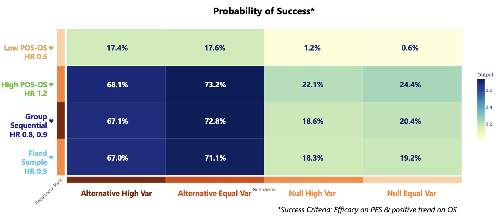

<div class="alert alert-primary" role="alert">
  <p style="margin-bottom:0">The following scripts are related to both the <a href="IntegrationPointAnalysis.html" class="alert-link"><strong>Integration Point: Analysis</strong></a> and the <a href="IntegrationPointResponse.html" class="alert-link"><strong>Integration Point: Response</strong></a>. Click on the links for more information about these integration points.</p>
</div>

# Introduction

This example demonstrates how to compute the probability of success of clinical trial by extending East Horizon’s single-endpoint framework to handle dual endpoints (Progression-Free Survival and Overall Survival) using custom R scripts for the **Analysis** and **Response (Patient Simulation)** endpoints. This example could be extended to other types of endpoints by modifying the R code. 

To try out this example, start by creating a new project on East Horizon using the **Two Arm Confirmatory** study objective and the **Time to Event** single endpoint, and then create an input set using the **Explore** task.

The figure below illustrates where this example fits within the R integration points of Cytel products, accompanied by flowcharts outlining the general steps performed by the R code.

```{r echo=FALSE,  warning=FALSE, fig.retina=3}
library(ggplot2)

bigcolxmin = 5
bigcolxmax = bigcolxmin + 3

bigcolxmin2 = 8.5
bigcolxmax2 = bigcolxmin2 + 3

# Define main columns
columns <- data.frame(
  xmin = c(0, 1, 2, 3, 4, bigcolxmin, bigcolxmin2),
  xmax = c(0.5, 1.5, 2.5, 3.5, 4.5, bigcolxmax, bigcolxmax2),
  ymin = rep(3, 7),
  ymax = rep(10, 7),
  label = c("Initialization", "Enrollment", "Randomization", "Dropout", "Treatment\nSelection", "Response", "Analysis"),
  fill = c("lightgray", "lightgray", "lightgray", "lightgray", "lightgray", "#cfe2ff", "#cfe2ff"),
  border = c("lightgray", "lightgray", "lightgray", "lightgray", "lightgray", "#cfe2ff", "#cfe2ff")
)

unitybox = 0.7
spaceybox = 0.5
ymaxfirstbox = 9.75
yminfirstbox = ymaxfirstbox - unitybox
ymaxsecondbox = yminfirstbox - spaceybox
yminsecondbox = ymaxsecondbox - unitybox*1.5
ymaxthirdbox = yminsecondbox - spaceybox
yminthirdbox = ymaxthirdbox - unitybox*1.5
ymaxfourthbox = yminthirdbox - spaceybox
yminfourthbox = ymaxfourthbox - unitybox*1.5

ymaxfifthbox = yminfourthbox - spaceybox
yminfifthbox = ymaxfifthbox - unitybox

# Define flowchart steps 
flowchart <- data.frame(
  xmin = rep(bigcolxmin + 0.1, 5),
  xmax = rep(bigcolxmax - 0.1, 5),
  ymax = c(ymaxfirstbox, ymaxsecondbox, ymaxthirdbox, ymaxfourthbox, ymaxfifthbox),
  ymin = c(yminfirstbox, yminsecondbox, yminthirdbox, yminfourthbox, yminfifthbox),
  label = c("Load prior distribution parameters", 
            "Sample median time to PFS \nand OS from Gamma distribution",
            "Sample probability of death \nbefore PFS from Beta distribution",
            "Simulate PFS and OS \nusing multi-state model", 
            "Return survival times"),
  fill = rep("#cfe2ff", 5)
)

# Define arrows for flowchart 
flowchart_arrows <- data.frame(
  x = rep((bigcolxmin+bigcolxmax)/2, 4),
  xend = rep((bigcolxmin+bigcolxmax)/2, 4),
  y = c(flowchart$ymin[1], flowchart$ymin[2], flowchart$ymin[3], flowchart$ymin[4]),
  yend = c(flowchart$ymax[2], flowchart$ymax[3], flowchart$ymax[4], flowchart$ymax[5])
)

yminfirstbox2 = ymaxfirstbox - unitybox
ymaxsecondbox2 = yminfirstbox2 - spaceybox
yminsecondbox2 = ymaxsecondbox2 - unitybox
ymaxthirdbox2 = yminsecondbox2 - spaceybox
yminthirdbox2 = ymaxthirdbox2 - unitybox
ymaxfourthbox2 = yminthirdbox2 - spaceybox
yminfourthbox2 = ymaxfourthbox2 - unitybox*2

ymaxfifthbox2 = yminfourthbox2 - spaceybox
yminfifthbox2 = ymaxfifthbox2 - unitybox*1.5

# Define flowchart steps 
flowchart2 <- data.frame(
  xmin = rep(bigcolxmin2 + 0.1, 5),
  xmax = rep(bigcolxmax2 - 0.1, 5),
  ymax = c(ymaxfirstbox, ymaxsecondbox2, ymaxthirdbox2, ymaxfourthbox2, ymaxfifthbox2),
  ymin = c(yminfirstbox2, yminsecondbox2, yminthirdbox2, yminfourthbox2, yminfifthbox2),
  label = c("Load OS hazard ratio thresholds", 
            "Analyze PFS using Cox regression",
            "Analyze OS using Cox regression",
            "Make interim or final analysis\ndecisions based on efficacy and\nfutility boundaries", 
            "Return test statistics, hazard ratios,\nand decision outcomes"),
  fill = rep("#cfe2ff", 5)
)

# Define arrows for flowchart 
flowchart_arrows2 <- data.frame(
  x = rep((bigcolxmin2+bigcolxmax2)/2, 4),
  xend = rep((bigcolxmin2+bigcolxmax2)/2, 4),
  y = c(flowchart2$ymin[1], flowchart2$ymin[2], flowchart2$ymin[3], flowchart2$ymin[4]),
  yend = c(flowchart2$ymax[2], flowchart2$ymax[3], flowchart2$ymax[4], flowchart2$ymax[5])
)

# Define the legend elements
legend_data <- data.frame(
  xmin = c(9, 10.5),
  xmax = c(10, 11.5),
  ymin = c(2.5, 2.5),
  ymax = c(2.8, 2.8),
  fill = c("lightgray", "#cfe2ff"),
  label = c("Not Used", "Used")
)

# Create the plot
p <- ggplot() +
  # Add main column sections
  geom_rect(data = columns, aes(xmin = xmin, xmax = xmax, ymin = ymin, ymax = ymax, fill = fill),
            color = columns$border) + 
  scale_fill_identity() +
  # Add labels for the columns
  geom_text(data = columns, aes(x = (xmin + xmax) / 2, y = ymax + 0.7, label = label), size = 3, angle = 20, vjust = 1) +
  # Add flowchart 
  geom_rect(data = flowchart, aes(xmin = xmin, xmax = xmax, ymin = ymin, ymax = ymax, fill = fill), color = "black") +
  geom_text(data = flowchart, aes(x = (xmin + xmax) / 2, y = (ymin + ymax) / 2, label = label), size = 2.5) +
  # Add arrows between flowchart boxes
  geom_curve(data = flowchart_arrows, aes(x = x, y = y, xend = xend, yend = yend),
             curvature = 0, arrow = arrow(length = unit(0.15, "cm")), color = "black") +
  # Add flowchart 
  geom_rect(data = flowchart2, aes(xmin = xmin, xmax = xmax, ymin = ymin, ymax = ymax, fill = fill), color = "black") +
  geom_text(data = flowchart2, aes(x = (xmin + xmax) / 2, y = (ymin + ymax) / 2, label = label), size = 2.5) +
  # Add arrows between flowchart boxes
  geom_curve(data = flowchart_arrows2, aes(x = x, y = y, xend = xend, yend = yend),
             curvature = 0, arrow = arrow(length = unit(0.15, "cm")), color = "black") +
  # Remove grid and axes
  theme_void() + 
  theme(panel.background = element_rect(fill = 'white', colour = 'white')) +
  geom_rect(data = legend_data, aes(xmin = xmin, xmax = xmax, ymin = ymin, ymax = ymax, fill = fill), color = "black") +
  geom_text(data = legend_data, aes(x = (xmin + xmax) / 2, y = ymin - 0.1, label = label), size = 2.5, vjust = 1) 

print(p)
```

Once CyneRgy is installed, you can load this example in RStudio with the following commands:
```{r, eval=FALSE}
CyneRgy::RunExample( "ProbabilitySuccessDualEndpointsPFSOS" )
```

Running the command above will load the RStudio project in RStudio. 

**RStudio Project File**: [DualEndpoint.Rproj](https://github.com/Cytel-Inc/CyneRgy/blob/main/inst/Examples/GeneratePoissonArrival/DualEndpoint.Rproj)

In the [R directory of this example](https://github.com/Cytel-Inc/CyneRgy/tree/main/inst/Examples/ProbabilitySuccessDualEndpointsPFSOS/R) you will find the following R filse:

1. [AnalyzePFSAndOS.R](https://github.com/Cytel-Inc/CyneRgy/blob/main/inst/Examples/ProbabilitySuccessDualEndpointsPFSOS/R/AnalyzePFSAndOS.R) - This file provides the code used for the Analysis endpoint below.

1. [Simulate2EndpointTTEWithMultiState.R](https://github.com/Cytel-Inc/CyneRgy/blob/main/inst/Examples/ProbabilitySuccessDualEndpointsPFSOS/R/Simulate2EndpointTTEWithMultiState.E) - This file provides the code used for the Response endpoint below.

# Analysis Endpoint

<div class="alert alert-primary" role="alert">
  <p style="margin-bottom:0"> This endpoint is related to this R file: <a href="https://github.com/Cytel-Inc/CyneRgy/blob/main/inst/Examples/ProbabilitySuccessDualEndpointsPFSOS/R/AnalyzePFSAndOS.R" class="alert-link">AnalyzePFSAndOS.R</a></p>
</div>

Using the file above, the Analysis Endpoint is customized to compute the probability of success (PoS) for the trial, based on dual endpoints: Progression-Free Survival (PFS) and Overall Survival (OS). The file uses information from the simulation (*SimData* variable) that is generated by the Response Endpoint. See the [Response section](#response-patient-simulation-endpoint) below for more information about the PFS and OS endpoints generation.

The criteria for declaring trial success are as follows. Both criteria must be met to declare success:

- **PFS Endpoint**: Statistical significance must be achieved by crossing the predefined efficacy boundary (defined in East Horizon, frequentist analysis).
- **OS Endpoint**: A positive trend must be observed, defined as the OS hazard ratio being below a pre-specified threshold (defined with user parameters).

**Note:** At an interim analysis, we usually set stricter criteria for a positive trend on OS compared to the final analysis. This is because we have less data early on, so we want to be more confident in any decision we make at that stage.

Refer to the table below for the definitions of the user-defined parameters used in this example.

|**User parameter**|**Definition**|
|---|------|
|$UserParam\$HazardRatioCutoffIA$|OS hazard ratio threshold for interim analysis|
|$UserParam\$HazardRatioCutoffFA$|OS hazard ratio threshold for final analysis|

## Option 1: Fixed Sample Design, HR 0.9

The first option is a fixed sample design. It shows that we can still use this script without interim analyses. Refer to the table below for the values of the user-defined parameters used in this option.

|**User parameter**|**Value**|
|---|------|
|$UserParam\$HazardRatioCutoffIA$|0.8|
|$UserParam\$HazardRatioCutoffFA$|0.9|

As we don't have an interim analysis here, the first user parameter (*HazardRatioCutoffIA*) is skipped.


## Option 2: Group Sequential Design, HR 0.8/0.9

The second option is a group sequential design. Refer to the table below for the values of the user-defined parameters used in this option.

|**User parameter**|**Value**|
|---|------|
|$UserParam\$HazardRatioCutoffIA$|0.8|
|$UserParam\$HazardRatioCutoffFA$|0.9|

## Option 3: Low Marginal PoS for OS, HR 0.5

The third option is a fixed sample design. Refer to the table below for the values of the user-defined parameters used in this option.

|**User parameter**|**Value**|
|---|------|
|$UserParam\$HazardRatioCutoffIA$|0.5|
|$UserParam\$HazardRatioCutoffFA$|0.5|

As we don't have an interim analysis here, the first user parameter (*HazardRatioCutoffIA*) is skipped.

## Option 4: High Marginal PoS for OS, HR 1.2

The fourth option is a fixed sample design. Refer to the table below for the values of the user-defined parameters used in this option.

|**User parameter**|**Value**|
|---|------|
|$UserParam\$HazardRatioCutoffIA$|0.5|
|$UserParam\$HazardRatioCutoffFA$|1.2|

As we don't have an interim analysis here, the first user parameter (*HazardRatioCutoffIA*) is skipped.

# Response (Patient Simulation) Endpoint

<div class="alert alert-primary" role="alert">
  <p style="margin-bottom:0"> This endpoint is related to this R file: <a href="https://github.com/Cytel-Inc/CyneRgy/blob/main/inst/Examples/ProbabilitySuccessDualEndpointsPFSOS/R/Simulate2EndpointTTEWithMultiState.R" class="alert-link">Simulate2EndpointTTEWithMultiState.R</a></p>
</div>

We are using East Horizon’s single-endpoint framework. The Response Endpoint is customized to handle dual endpoints using our R script. These two endpoints are:

- **Progression-Free Survival (PFS)**: Measurement of how long a patient lives with a disease without it getting worse.
- **Overall Survival (OS)**: Time before death.

We use a multi-state model to simulate event times for each patient in every simulated trial. This model captures the relationship between PFS and OS by generating both outcomes together, rather than independently.


## Example with median times

We start by giving the median times and probability directly as inputs to the script. Refer to the table below for the definitions of the user-defined parameters used in this example.

|**User parameter**|**Definition**|**Value**|
|---|------|---|
|$UserParam\$dMedianPFS0$|Median time to PFS event for control group|12|
|$UserParam\$dMedianPFS1$|Median time to PFS event for treatment group|18|
|$UserParam\$dMedianOS0$|Median time to OS event for control group|18|
|$UserParam\$dMedianOS1$|Median time to OS event for treatment group|27|
|$UserParam\$dProbOfDeathBeforeProgression0$|Probability of death before PFS for control group|0.2|
|$UserParam\$dProbOfDeathBeforeProgression1$|Probability of death before PFS for treatment group|0.2|

Here, the median times are in months and the hazard ratio for both groups is equal to $\frac{12}{18} = \frac{18}{27} = 0.6667$. The probability of death before progression is 20% for both groups.

## Example with distributions

Now we customize how patient data is simulated by building a more realistic model for both PFS and OS outcomes using prior distributions instead of directly using median times and probabilities. Here’s how the event data is generated:

- Time to PFS event is sampled from a Gamma distribution.
- Time to OS event is also sampled from a Gamma distribution.
- The probability that the OS event happens before the PFS event is sampled from a Beta distribution.

All three parameters are treated as random variables, sampled from prior distributions, allowing each simulated trial to reflect a range of possible real-world outcomes.

Refer to the table below for the definitions of the user-defined parameters used in this example.

|**User parameter**|**Definition**|
|---|------|---|
|$UserParam\$dMedianPFS0PriorShape$|Shape parameter for the median time to PFS event for control group|
|$UserParam\$dMedianPFS0PriorRate$|Rate parameter for the median time to PFS event for control group|
|$UserParam\$dMedianOS0PriorShape$|Shape parameter for the median time to OS event for control group|
|$UserParam\$dMedianOS0PriorRate$|Rate parameter for the median time to OS event for control group|
|$UserParam\$dMedianPFS1PriorShape$|Shape parameter for the median time to PFS event for treatment group|
|$UserParam\$dMedianPFS1PriorRate$|Rate parameter for the median time to PFS event for treatment group|
|$UserParam\$dMedianOS1PriorShape$|Shape parameter for the median time to OS event for treatment group|
|$UserParam\$dMedianOS1PriorRate$|Rate parameter for the median time to OS event for treatment group|
|$UserParam\$dProbOfDeathBeforeProgression0Param1$|Alpha parameter for probability of death before PFS for control group|
|$UserParam\$dProbOfDeathBeforeProgression0Param2$|Beta parameter for probability of death before PFS for control group|
|$UserParam\$dProbOfDeathBeforeProgression1Param1$|Alpha parameter for probability of death before PFS for treatment group|
|$UserParam\$dProbOfDeathBeforeProgression1Param2$|Beta parameter for probability of death before PFS for treatment group|

The shape and rate parameters can be calculated from the desired mean and variance. You can use the following tool. 

<div class="alert alert-primary" role="alert">
<p style="margin-bottom:0">Enter your desired **mean** and **variance** to calculate the **shape** and **rate** parameters:</p>

<label for="mean">Mean:</label>
<input type="number" id="mean" value="1" step="any"> <br>
<label for="variance">Variance:</label>
<input type="number" id="variance" value="1" step="any"> <br>

<button onclick="calculateGammaParams()">Calculate</button> <br>

<p><strong>Shape:</strong> <span id="shapeOut">-</span></p>
<p><strong>Rate:</strong> <span id="rateOut">-</span></p>

<script>
function calculateGammaParams() {
  const mean = parseFloat(document.getElementById("mean").value);
  const variance = parseFloat(document.getElementById("variance").value);

  if (isNaN(mean) || isNaN(variance) || mean <= 0 || variance <= 0) {
    alert("Please enter valid positive numbers for both mean and variance.");
    return;
  }

  const shape = mean * mean / variance;
  const rate = mean / variance;

  document.getElementById("shapeOut").innerText = shape.toFixed(4);
  document.getElementById("rateOut").innerText = rate.toFixed(4);
}
</script>
</div>

If you have the scale instead of the rate, you can use the formula $Rate = \frac{1}{Scale}$.

### Scenario 1: Alternative & Equal Variance 

Here, the desired median time to PFS event for control is 12 months, and the desired variance is 10. Using the tool above, we get a shape of 14.4 and a rate of 1.2. Similarly, we get shape and rate values for a desired median time to OS event for control of 18 months, a desired median time to PFS event for treatment of 18 months, and a desired median time to OS event for treatment of 27 months.

|**User parameter**|**Value**|
|---|------|---|
|$UserParam\$dMedianPFS0PriorShape$|14.4|
|$UserParam\$dMedianPFS0PriorRate$|1.2|
|$UserParam\$dMedianOS0PriorShape$|32.4|
|$UserParam\$dMedianOS0PriorRate$|1.8|
|$UserParam\$dMedianPFS1PriorShape$|32.4|
|$UserParam\$dMedianPFS1PriorRate$|1.8|
|$UserParam\$dMedianOS1PriorShape$|72.9|
|$UserParam\$dMedianOS1PriorRate$|2.7|
|$UserParam\$dProbOfDeathBeforeProgression0Param1$|20|
|$UserParam\$dProbOfDeathBeforeProgression0Param2$|80|
|$UserParam\$dProbOfDeathBeforeProgression1Param1$|20|
|$UserParam\$dProbOfDeathBeforeProgression1Param2$|80|

### Scenario 2: Alternative & Higher Variance

Now, we still use a variance of 10 for both endpoints for the control arm, but a variance of 20 for both endpoints for the treatment arm. That gives us different values for *dMedianPFS1PriorShape*, *dMedianPFS1PriorRate*, *dMedianOS1PriorShape*, and *dMedianOS1PriorRate*.

|**User parameter**|**Value**|
|---|------|---|
|$UserParam\$dMedianPFS0PriorShape$|14.4|
|$UserParam\$dMedianPFS0PriorRate$|1.2|
|$UserParam\$dMedianOS0PriorShape$|32.4|
|$UserParam\$dMedianOS0PriorRate$|1.8|
|$UserParam\$dMedianPFS1PriorShape$|16.2|
|$UserParam\$dMedianPFS1PriorRate$|0.9|
|$UserParam\$dMedianOS1PriorShape$|36.45|
|$UserParam\$dMedianOS1PriorRate$|1.35|
|$UserParam\$dProbOfDeathBeforeProgression0Param1$|20|
|$UserParam\$dProbOfDeathBeforeProgression0Param2$|80|
|$UserParam\$dProbOfDeathBeforeProgression1Param1$|20|
|$UserParam\$dProbOfDeathBeforeProgression1Param2$|80|

### Scenario 3: Null & Equal Variance

Now, we use a variance of 10 for all (like scenario 1), but a desired median time to PFS event for treatment of 12 months, and a desired median time to OS event for treatment of 18 months for both control and treatment.

|**User parameter**|**Value**|
|---|------|---|
|$UserParam\$dMedianPFS0PriorShape$|14.4|
|$UserParam\$dMedianPFS0PriorRate$|1.2|
|$UserParam\$dMedianOS0PriorShape$|32.4|
|$UserParam\$dMedianOS0PriorRate$|1.8|
|$UserParam\$dMedianPFS1PriorShape$|14.4|
|$UserParam\$dMedianPFS1PriorRate$|1.2|
|$UserParam\$dMedianOS1PriorShape$|32.4|
|$UserParam\$dMedianOS1PriorRate$|1.8|
|$UserParam\$dProbOfDeathBeforeProgression0Param1$|20|
|$UserParam\$dProbOfDeathBeforeProgression0Param2$|80|
|$UserParam\$dProbOfDeathBeforeProgression1Param1$|20|
|$UserParam\$dProbOfDeathBeforeProgression1Param2$|80|

### Scenario 4: Null & Higher Variance

Now, we use a variance of 10 for both endpoints for the control arm, and a variance of 20 for both endpoints for the treatment arm (like scenario 2). We have a desired median time to PFS event for treatment of 12 months, and a desired median time to OS event for treatment of 18 months (like scenarios 1 and 3).

|**User parameter**|**Value**|
|---|------|---|
|$UserParam\$dMedianPFS0PriorShape$|14.4|
|$UserParam\$dMedianPFS0PriorRate$|1.2|
|$UserParam\$dMedianOS0PriorShape$|32.4|
|$UserParam\$dMedianOS0PriorRate$|1.8|
|$UserParam\$dMedianPFS1PriorShape$|7.2|
|$UserParam\$dMedianPFS1PriorRate$|0.6|
|$UserParam\$dMedianOS1PriorShape$|16.2|
|$UserParam\$dMedianOS1PriorRate$|0.9|
|$UserParam\$dProbOfDeathBeforeProgression0Param1$|20|
|$UserParam\$dProbOfDeathBeforeProgression0Param2$|80|
|$UserParam\$dProbOfDeathBeforeProgression1Param1$|20|
|$UserParam\$dProbOfDeathBeforeProgression1Param2$|80|

# Conclusion


