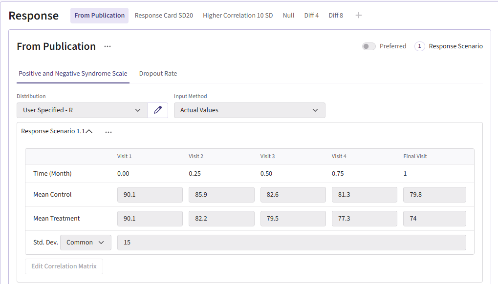

```{r setup, include=FALSE}
knitr::opts_chunk$set(echo = TRUE)
library( CyneRgy )
```


# Introduction

Many clinical trials often involve repeated measures of a continuous endpoint across multiple visits. Due to the burden on the trial subjects, data can be missing for a variety of reasons such as missed visits or patient dropout.  Efficiently, analyzing this type of data requires methods that handle within-patient correlation and missing data appropriately. 

The **Mixed Model for Repeated Measures (MMRM)** is widely used because it provides opportunity to:  
-  Adjusts for baseline and visit effects,  
-  Accounts for correlation between repeated observations,  
-  Avoids simplistic imputation approaches such as LOCF (Last Observation Carried Forward).  

This example has two goals:  
1. **East Horizon R Integration Scripts** Create the R scripts for analyzing data employing a MMRM approach and simulating trial data.  
2. **Compare MMRM to Native East Horizon Analysis**  Compare the different analysis approaches to understand potential gains from using an MMRM

Together, this example provides a foundation for trial designers to estimate power, evaluate operating characteristics, and explore design choices in schizophrenia studies using an additional analysis that are not native to East Horizon.

# Required Files

Before running anything in East Horizon, load the Schizophrenia example by installing CyneRgy and running this command into RStudio:

```{r, eval=FALSE}
CyneRgy::RunExample( "SchizophreniaTrial" )
```

Running this code above will load the RStudio project.

**RStudio Project File**: SchizophreniaTrial.Rproj

This project has the required R code files needed to simulate, analyze, plot, and run patient data. Below in the R code folder, there should be the following files:

[AnalyzeMMRM.R](https://github.com/Cytel-Inc/CyneRgy/blob/304-create-mmrm-analysis-example-for-clinical-trial/inst/Examples/SchizophreniaTrial/R/AnalyzeMMRM.R) -  This code takes simulated patient data and run analysis.

[AnalyzeMMRM_GLS.R](https://github.com/Cytel-Inc/CyneRgy/blob/304-create-mmrm-analysis-example-for-clinical-trial/inst/Examples/SchizophreniaTrial/R/AnalyzeMMRM_GLS.R) -  This code is a slower version of the original analysis, but it has slightly increased power and an alternative form of analysis.

[GenerateMMRMResponses.R](https://github.com/Cytel-Inc/CyneRgy/blob/304-create-mmrm-analysis-example-for-clinical-trial/inst/Examples/SchizophreniaTrial/R/GenerateMMRMResponses.R) -  This code generates the responses for patients across treatment visits.

[PlotPatientData.R](https://github.com/Cytel-Inc/CyneRgy/blob/304-create-mmrm-analysis-example-for-clinical-trial/inst/Examples/SchizophreniaTrial/R/PlotPatientData.R) -  This code takes the generated patient data and can plot individual patient trajectories.

[PlotTrialdata.R](https://github.com/Cytel-Inc/CyneRgy/blob/304-create-mmrm-analysis-example-for-clinical-trial/inst/Examples/SchizophreniaTrial/R/PlotTrialData.R) -  This code takes the overall data generated and creates a plot of the difference of means with a 95% CI.

[RunSimulation.R](https://github.com/Cytel-Inc/CyneRgy/blob/304-create-mmrm-analysis-example-for-clinical-trial/inst/Examples/SchizophreniaTrial/R/RunSimulation.R) -  This code allows for the code to be run locally, change variables around, and visualize data.  It can helpful to run the R code locally before uploading to East Horizon (EH) to make sure no bugs are present if changes are made to the code. 

This example looks into an analysis using MMRM. It allows for dropout information to not impact power as much as other analysis methods. It works well in East Horizon (EH) for providing a longitudinal analysis design.  While not all of the R files listed above are required, they can be used to help simulate patient data and run analysis locally in R Studio.  This can be very helpful to allow users a good starting point in case they need to adjust the details in the analysis.  The various plot functions can be very helpful for visualizing the simulated patient data to make sure it looks realistic. 

For EH, you will need AnalyzeMMRM.R and/or AnalyzeMMRM_GLS.R for the MMRM analysis.  Both files provide MMRM analysis but use different R packages and the AnalyzeMMRM.R file has the most efficient approach.  Additionally, the GenerateMMRMResponses.R file provides a R function for patient generation that can be used in EH, but it is not required as the native approach to data generation could be used.


## Example outputs 

Below are some graphs as example outputs from the code from the GenerateMMRResponse function.  It it always good to review example data sets to verify that they the data is realistic. 

 <br><br><br>
<span style="font-size:15pt">**Figure 1**: An example plot of the trial data with a 95% CI</span>

{width=90%}

 <br><br><br>
<span style="font-size:15pt">**Figure 2**: An example plot of individual patient trajectories</span>
{width=90%}

# Flowchart of Clinical Trial Process

The flowchart below shows the points of R integration in Cytel products, and it outlines the steps performed by the R code.


```{r echo=FALSE,  warning=FALSE, fig.retina=3}
CyneRgy::PlotExampleFlowchart(
    lIntPoints = list(
        "Response" = c(
            "Generates the responses of each patient at each time point (visit), depending on the patient’s treatment",
            "Return responses"
        ),
        "Analysis" = c(
            "Takes the generated data and runs analysis",
            "Extracts treatment effect",
            "Uses the rpact package to find the alpha so it can be used for decision rules",
            "Returns the decision, p-value, error code, and prime delta"
        )
    )
)
```

# East Horizon Simulation Setup

To recreate this example in EH, begin by creating a new project in EH using a Study Objective of "Two Arm Confirmatory." On the Plan page, select the Continuous endpoint type. After selecting the continuous endpoint, choose the "Repeated Measure" option and click "Add Visit" so that the project will have a total of 5 visits: 4 interim visits and 1 final visit. 

The visit times should be set as follows:
- Visit 1: 0
- Visit 2: 0.25
- Visit 3: 0.5
- Visit 4: 0.75
- Final Visit: 1

For Better Response, select "Small Value," since a patient's outcome is improved with a smaller score. The project setup should look like the following.

<span style="font-size:15pt">**Project Setup**:</span>
{width=90%}

Once you "Create Project", you then need to create an input set using the explore option.  When setting up the project details, make sure to select the option to have repeated measurements and specify the times of the visits. 

## Designs

MMRM fixed‑sample (baseline N ~266) and group‑sequential MMRM in the sample size box insert 200:360:20 (this will create sample sizes ranging from 200 to 360 in steps of 20) (both at Type I error 0.025 and an allocation ratio of 1). For the Test type, select User Defined R, then upload the  [AnalyzeMMRM.R](https://github.com/Cytel-Inc/CyneRgy/blob/304-create-mmrm-analysis-example-for-clinical-trial/inst/Examples/SchizophreniaTrial/R/AnalyzeMMRM.R).  

**Below your design card for the fixed design should look something like this**:

<br>

<span style="font-size:15pt">**MMRM Fixed Sample**:</span>
{width=90%}
 <br><br><br>
 To add a group sequential option, you can duplicate the card so that the sample sizes are retained.  Switch the Statistical Design to Group Sequential.  The card should look like:
 <br><br>
<span style="font-size:15pt">**MMRM Group Sequential**:</span>
{width=90%}
<br><br><br>

## Responses

For this example, we create a total of 6 different response cards. The first card use the result data from  Correll *et. al. * for the mean differences between treatment and control arms (Mead Difference = 6 points) and the given standard deviation (Std. Dev = 15). There should be two cards called Difference 4, 8 these cards will change the mean difference between the arms to 4 and 8 respectively. Next, there should be two response cards that change the standard deviation from 15 to 10 and 20.  The different standard deviations and mean different are included to understand the impact on power.  Lastly, there should be a null card where the standard deviation is 15 but the mean difference between treatment and control are the same. The null case is used to understand the false-positive of each analysis method. 

All cards use the R integration and the [GenerateMMRMResponses.R](https://github.com/Cytel-Inc/CyneRgy/blob/304-create-mmrm-analysis-example-for-clinical-trial/inst/Examples/SchizophreniaTrial/R/GenerateMMRMResponses.R) file can be uploaded..

**Below are the response cards and how they should look**:

<br>


<span style="font-size:15pt">**Response card using data from the publication**:</span>
{width=90%}
<br><br><br>

<span style="font-size:15pt">**Null Case Card**:</span>

{width=90%}
<br><br><br>

<span style="font-size:15pt">**Difference cards 4 and 8 respectively**:</span>
{width=90%}
{width=90%}
<br><br><br>

<span style="font-size:15pt">**Standard deviation cards 10 and 20 respectively**:</span>
{width=90%}
{width=90%}

<br><br><br>

## Dropout & Enrollment

All dropout cards share the same dropout rates as the publication (0.26 control and 0.15 experimental). Next, there should be one enrollment card with a rate of 30 subjects per month. Once all of these are set up, go to simulation setup and select 1000 repetitions.

**Here are what the dropout and enrollment cards should look like**:
<br><br>

<span style="font-size:15pt">**Dropout Information**:</span>
{width=90%}
<br><br><br>


<span style="font-size:15pt">**Enrollment card**:</span>
{width=90%}
<br><br><br>

# Results

- **Target power**: Approximately 90% power is achieved with about 266 completers when the standard deviation is 15 and the mean difference is 6. For reaching this power there are 2 designs that effectively accomplish this. One should be the MMRM fixed design and the other being MMRM Group-sequential with a sample size of 300. Either of these designs are viable and the trade off will be discussed in the results discussion section.

<br><br><br>

<span style="font-size:15pt">**Figure 3**: Publication Results</span>
{width=100%}
<br><br><br>

- **Sensitivity**: Power changed as standard deviation and mean difference were varied (Std. Dev ↑ → power ↓; Std. Dev ↓ → power ↑).The standard deviation 20 cards and the mean difference 4 cards resulted in significantly lower power ranging 36%-76%. As for the standard deviation 10 and mean difference 8 cards, the powers came out substantially higher where all designs ranged from 95%-100% power.

<br><br><br>

<span style="font-size:15pt">**Figure 4**: Difference of Means Results</span>

<br><br><br>

<span style="font-size:15pt">**Figure 5**: Standard Deviation Results</span>


<br><br><br>

- **Null behavior (MMRM)**: Type I error around 2.1–3.6%, close to nominal 2.5%.

<br><br><br>

<span style="font-size:15pt">**Figure 6**: Null Case Results</span>


# Discussion

-  **Fixed Vs. selected Sample**: While the selected design (i.e., the group-sequential design that allows for interim analyses and potential early stopping) does feature a lower power than the fixed sample, it does come with several benefits worth weight when simulating the study. The selected design boasts a 30% chance of stopping early, a shorter average study duration, and smaller average sample size. In return, it comes with a decrease in power by ~1.4%. These difference are significant as it can save money in a trial for even one of these other improved results.

<br><br><br>

-  **Sensitivity Analysis**: The reason for including the difference of means cards and the standard deviation cards was to illustrate how sensitive the power in this study is if the researchers' initial assumptions were off. When increasing standard deviation to 20 or decreasing the difference of means to 4 led to the power becoming under powered. This means we would have to increase the sample size to detect if there is a significant difference. As for the standard deviation 10 and difference of means 8 cards, the power dramatically increased to the mid-high 90's range. This would allow for the sample size of the study to be shrunk down and still maintain a 90% power.
-  **Null Cases**: The null cases all hovered around 2.1%-3.6%. These percentages fall within a tolerable range. This demonstrates that the MMRM analysis code only detects a false positive rate of approximately 2.5%, which matches the originally specified type I error.


# Conclusion

This work successfully built and validated an MMRM analysis framework in both R and East Horizon. The R pipeline enables transparent simulation, analysis, and visualization, while East Horizon supports large-scale scenario evaluation. Together, they provide trial designers with flexible tools to plan studies, anticipate power, and identify risks.  

The findings confirm MMRM’s suitability for longitudinal endpoints and highlight areas for further improvement, particularly around sequential testing and dropout handling. Through the R integration for analysis we have added an MMRM analysis that can better support clinical trial decision-making and design optimization than the native analysis option in EH for this particular trial example.


# Reference

Correll CU, Davis RE, Weingart M, et al. Efficacy and Safety of Lumateperone for Treatment of Schizophrenia: A Randomized Clinical Trial. JAMA Psychiatry. 2020;77(4):349–358. [doi:10.1001/jamapsychiatry.2019.4379](https://jamanetwork.com/journals/jamapsychiatry/fullarticle/2758022)
 
