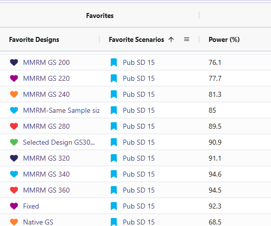

<div class="alert alert-primary" role="alert">
  <p style="margin-bottom:0">The following scripts are related to both the <a href="IntegrationPointResponse.html" class="alert-link"><strong>Integration Point: Response</strong></a> and the <a href="IntegrationPointAnalysis.html" class="alert-link"><strong>Integration Point: Analysis</strong></a>. Click on the links for more information about these integration points.</p>
</div>

# Introduction

Many clinical trials often involve repeated measures of a continuous endpoint across multiple visits. Due to the burden on the trial subjects, data can be missing for a variety of reasons such as missed visits or patient dropout. Efficiently, analyzing this type of data requires methods that handle within-patient correlation and missing data appropriately. 

The **Mixed Model for Repeated Measures (MMRM)** is widely used because it provides opportunity to:  

- Adjusts for baseline and visit effects,  
- Accounts for correlation between repeated observations,  
- Avoids simplistic imputation approaches such as LOCF (Last Observation Carried Forward).  

This example has two goals:  

1. **East Horizon R Integration Scripts** - Create the R scripts for analyzing data employing an MMRM approach and simulating trial data.  
2. **Compare MMRM to Native East Horizon Analysis** - Compare the difference of means analysis approach in East Horizon to MMRM analysis in the hopes of understanding potential gains from using an alternative form of analysis.

Together, this example provides a foundation for trial designers to estimate power, evaluate operating characteristics, and explore design choices in schizophrenia studies using an additional analysis that are not native to East Horizon.

## Required Files

Before running anything in East Horizon, load the Schizophrenia example by installing CyneRgy and running this command into RStudio:

```{r, eval=FALSE}
CyneRgy::RunExample( "SchizophreniaTrial" )
```

Running this code above will load the RStudio project.

**RStudio Project File**: [SchizophreniaTrial.Rproj](https://github.com/Cytel-Inc/CyneRgy/blob/main/inst/Examples/SchizophreniaTrial/SchizophreniaTrial.Rproj)

This project has the required R code files needed to run in both East Horizon and locally. The files allow you to do many things such as including the ability to generate patient data, run analysis using MMRM on the simulated data, and plot data from the overall trial or indivdual patient trajectories.

- [AnalyzeUsingMMRM.R](https://github.com/Cytel-Inc/CyneRgy/blob/main/inst/Examples/SchizophreniaTrial/R/AnalyzeUsingMMRM.R) -  This code takes simulated patient data and runs MMRM analysis.
- [AnalyzeUsingMMRMWithGLS.R](https://github.com/Cytel-Inc/CyneRgy/blob/main/inst/Examples/SchizophreniaTrial/R/AnalyzeUsingMMRMWithGLS.R) -  This code is a slower version of the original analysis, but it has slightly increased power and an alternative form of analysis using the function for generalized least squares in the R package nlme.
- [GenerateMMRMResponses.R](https://github.com/Cytel-Inc/CyneRgy/blob/main/inst/Examples/SchizophreniaTrial/R/GenerateMMRMResponses.R) -  This code generates the responses for patients across treatment visits.
- [PlotSelectedPatients.R](https://github.com/Cytel-Inc/CyneRgy/blob/main/inst/Examples/SchizophreniaTrial/R/PlotSelectedPatients.R) -  This code takes the generated patient data and creates plots of individual patient trajectories.
- [PlotTreatmentControlCI.R](https://github.com/Cytel-Inc/CyneRgy/blob/main/inst/Examples/SchizophreniaTrial/R/PlotTreatmentControlCI.R) -  This code takes the overall data generated and creates a plot of the difference of means with a 95% CI.
- [RunSimulation.R](https://github.com/Cytel-Inc/CyneRgy/blob/main/inst/Examples/SchizophreniaTrial/R/RunSimulation.R) -  This code allows for the code to be run locally, change variables around, and visualize data. It can helpful to run the R code locally before uploading to East Horizon to make sure no bugs are present if changes are made to the code. 

This example looks into an analysis using MMRM. It allows for dropout information to not impact power as much as other analysis methods. It works well in East Horizon for providing a longitudinal analysis design. While not all of the R files listed above are required, they can be used to help simulate patient data and run analysis locally in RStudio. This can be very helpful to allow users a good starting point in case they need to adjust the details in the analysis. The various plot functions can be very helpful for visualizing the simulated patient data to make sure it looks realistic. 

For East Horizon, you will need **AnalyzeUsingMMRM.R** and/or **AnalyzeUsingMMRMWithGLS.R** for the MMRM analysis. Both files provide MMRM analysis but use different R packages and the **AnalyzeUsingMMRM.R file** has the most efficient approach. Additionally, the **GenerateMMRMResponses.R** file provides a R function for patient generation that can be used in East Horizon, but it is not required as the native approach to data generation could be used.

## Example outputs 

Below are some graphs as example outputs from the code from the **GenerateMMRMResponses** function. It is always good to review example data sets to verify that the data is realistic. 

{width=90%}

<br>

{width=90%}


## Clinical Trial Simulation Process

The flowchart below shows the points of R integration in Cytel products, and it outlines the steps performed by the R code.

```{r echo=FALSE,  warning=FALSE, fig.retina=3}
 CyneRgy::PlotExampleFlowchart(
     lIntPoints = list(
         "Response" = c(
             "Generates the responses of each patient at each time point (visit), depending on the patient’s treatment",
             "Return responses"
         ),
         "Analysis" = c(
             "Takes the generated data and runs analysis",
             "Extracts treatment effect",
             "Uses the rpact package to find the alpha so it can be used for decision rules",
             "Returns the decision, p-value, error code, and prime delta"
         )
     )
 )
```


# Project Setup

To recreate this example in East Horizon, start by creating a new project in East Horizon with the **Two Arm Confirmatory** study objective. On the Plan page, select the **Continuous** as the endpoint type and choose the **Repeated Measure** option. For *Better Response*, select **Smaller Value** since a patient's outcome is improved with a smaller score. Lastly, click  **Add Visit** so that the project has a total of 5 visits: 4 interim visits and 1 final visit. 

The visit times should be set as follows:

- Visit 1: 0
- Visit 2: 0.25
- Visit 3: 0.5
- Visit 4: 0.75
- Final Visit: 1

The project setup should look like the following.

{width=90%}

<br>Once you create Project, you then need to create an input set using the **Explore** option.

# Input Setup

## Design Page

In the MMRM fixed-sample card, the sample size should be 266. The group sequential MMRM card should have the input "200:360:20." This will create samples ranging from 200-360 patients counting up in steps of 20. Both cards use a Type I error of 0.025 and an allocation ration of 1. For the Test type, select **User Specified-R**, the upload the 
[AnalyzeUsingMMRM.R](https://github.com/Cytel-Inc/CyneRgy/blob/main/inst/Examples/SchizophreniaTrial/R/AnalyzeUsingMMRM.R).  

Your design card for the fixed design should look something like this:

{width=90%}

<br>To add a group sequential option, you can duplicate the card so that the sample sizes are retained. Switch the Statistical Design to **Group Sequential**. The card should look like:
 
{width=90%}

## Response Page

For this example, we create a total of 6 different response cards. The first card uses the result data from Correll *et. al. * for the mean differences between treatment and control arms (Mean Difference = 6 points) and the given standard deviation (Std. Dev = 15). There should be two cards called "Diff 4" and "Diff 8". These cards change the mean difference between the arms to 4 and 8, respectively. Next, there should be two response cards that change the standard deviation from 15 to 10 and 20. The different standard deviations and mean differences are included to understand the impact on power. Lastly, there should be a null card where the standard deviation is 15 but the mean difference between treatment and control is 0. The null case is used to understand the false-positive of each analysis method. (Note: No UserParam is needed)

All cards use the R integration and the [GenerateMMRMResponses.R](https://github.com/Cytel-Inc/CyneRgy/blob/main/inst/Examples/SchizophreniaTrial/R/GenerateMMRMResponses.R) file can be uploaded.

Below are the response cards and how they should look:

{width=90%}

<br>

{width=90%}

<br>

{width=90%}

<br>

{width=90%}

<br>

{width=90%}

<br>

{width=90%}

## Dropout Page

All dropout cards share the same dropout rates as the publication (0.26 for control and 0.15 for experimental arm). 

Here is what the dropout card should look like:

{width=90%}

## Enrollment Page

There should be one enrollment card with an accrual rate of 30 subjects per month.

Here is what the Enrollment card should look like:

{width=90%}

## Simulation Page

For the simulation setup, there should be a total of 1000 repetitions and random number seed set to clock.

Here is what the Simulation Setup card should look like:

{width=90%}

# Results

- **Target power**: Approximately 90% power is achieved with about 266 completers when the standard deviation is 15 and the mean difference is 6 (using the MMRM Fixed Design). For reaching this power there are 2 designs that effectively accomplish this. One should be the MMRM fixed design (named “Fixed”) and the other being MMRM Group-sequential with a sample size of 300 (named “Selected Design GS300”). Either of these designs are viable and the trade off will be discussed in the results discussion section.

{width=100%}

<br>

- **Sensitivity**: Power changed as standard deviation and mean difference were varied (Std. Dev ↑ → power ↓; Std. Dev ↓ → power ↑). The cards with standard deviation of 20 (named “SD20”) and the cards with mean difference of 4 (named “Diff 4”) resulted in significantly lower power ranging from 36% to 76%. In contrast, the cards with a standard deviation of 10 (named “SD10”) and a mean difference of 8 (named “Diff 8”) showed substantially higher power, with all designs achieving between 95% and 100%.


<br>


<br>

- **Null behavior (MMRM)**: Type I error was observed between 2.1 and 3.6%, close to nominal 2.5%.


# Discussion

-  **Fixed Vs. Selected Sample GS300**: While the Selected Sample GS300 design (i.e., the group sequential design that allows for interim analyses and potential early stopping) does feature a lower power than the Fixed design, it does come with several benefits worth weight when simulating the study. Selected Sample GS300 design boasts a 30% chance of stopping early, a shorter average study duration, and smaller average sample size. In return, it comes with a decrease in power by ~1.4%. These difference are significant as it can save money in a trial for even one of these other improved results. These designs were considered over larger sample sizes due to meeting the required 90% power with the smallest sample sizes.


<br>

-  **Sensitivity Analysis**: The reason for including the difference of means cards and the standard deviation cards was to illustrate how sensitive the power in this study is if the researchers' initial assumptions were off. When increasing standard deviation to 20 or decreasing the difference of means to 4 led to the power becoming under powered. This suggests we would have to increase the sample size to detect if there is a significant difference. When the standard deviation was set to 10 and the difference between means was 8, the power increased, reaching the mid-to-high 90% range. This would allow for a reduction in the study's sample size while still maintaining 90% power.

-  **Null Cases**: Across all null cases, the observed rates consistently ranged from 2.1% to 3.6%. These percentages fall within a tolerable range. This demonstrates that the MMRM analysis code only detects a false positive rate of approximately 2.5%, which matches the originally specified type I error.


# Conclusion

This work successfully built and validated an MMRM analysis framework in both R and East Horizon. The R pipeline enables transparent simulation, analysis, and visualization, while East Horizon supports large-scale scenario evaluation. Together, they provide trial designers with flexible tools to plan studies, anticipate power, and identify risks.

The findings confirm MMRM’s suitability for longitudinal endpoints and highlight areas for further improvement, particularly around sequential testing and dropout handling. Through the R integration for analysis we have added an MMRM analysis that can better support clinical trial decision-making and design optimization than the native analysis option in East Horizon for this particular trial example.


# Reference

- Correll CU, Davis RE, Weingart M, et al. Efficacy and Safety of Lumateperone for Treatment of Schizophrenia: A Randomized Clinical Trial. JAMA Psychiatry. 2020;77(4):349–358. [doi:10.1001/jamapsychiatry.2019.4379](https://jamanetwork.com/journals/jamapsychiatry/fullarticle/2758022)
