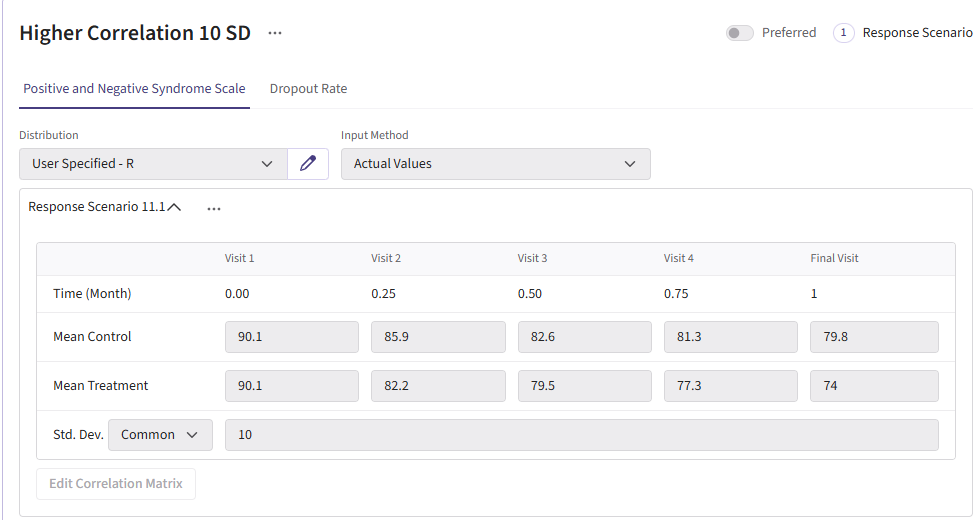
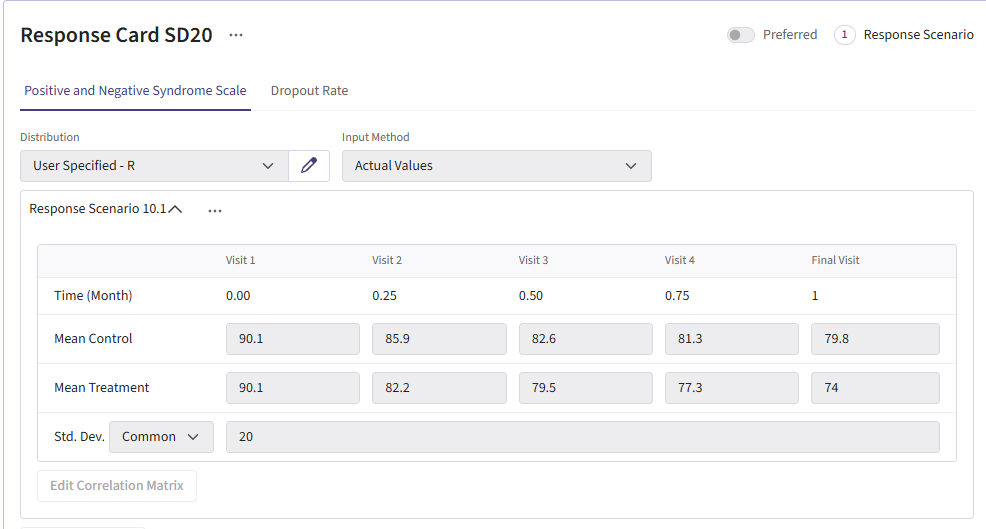

```{r setup, include=FALSE}
knitr::opts_chunk$set(echo = TRUE)
library( CyneRgy )
```

# 📘 **Abstract**
This write-up describes the development and evaluation of an **MMRM (Mixed Model for Repeated Measures)** analysis pipeline in R, along with a parallel implementation in **East Horizon**. The project focused on simulating longitudinal trial data, applying MMRM to estimate treatment effects, and assessing statistical properties such as power and Type I error.  

  
-  Implementing R functions for data generation, analysis, and visualization.  
-  Designing **East Horizon** simulations with different sample sizes, response variances, and group-sequential settings.  
-  Comparing R and **East Horizon** results to confirm consistency while identifying caveats with sequential testing.  


The purpose of this work is to demonstrate how **CyneRgy** can support clinical trial planning by providing robust simulation and analysis frameworks for longitudinal endpoints.

# 🎯 **Introduction**
Clinical trials often involve repeated measures of a continuous endpoint across multiple visits. Accurately analyzing this type of data requires methods that handle within-patient correlation and missingness appropriately.  

The **Mixed Model for Repeated Measures (MMRM)** is widely used because it: 

-  Adjusts for baseline and visit effects,  
-  Accounts for correlation between repeated observations,  
-  Avoids simplistic imputation approaches such as LOCF (Last Observation Carried Forward).  

This project had two parallel goals:  
1. **Develop an R implementation** for simulating and analyzing **MMRM** trial data.  
2. Mirror the workflow in **East Horizon** to compare results and evaluate performance in a platform setting.  

Together, these workflows provide a foundation for trial designers to estimate power, evaluate operating characteristics, and explore design choices in schizophrenia studies and beyond.


# ⚡️ **Required Files**

Before running anything in East Horizon, load the Schizophrenia example by installing CyneRgy and running this command into RStudio:

```{r, eval=FALSE}
CyneRgy::RunExample( "Schizophreniatrial" )
```

Running this code above will load the RStudio project.

**RStudio Project File**: SchizophreniaTrial.Rproj

This project has the required R code files needed to simulate, analyze, plot, and run patient data. Below in the R code folder, there should be the following files:

[AnalyzeMMRM.R](https://github.com/Cytel-Inc/CyneRgy/blob/304-create-mmrm-analysis-example-for-clinical-trial/inst/Examples/SchizophreniaTrial/RCode/AnalyzeMMRM.R) -  This code takes simulated patient data and run analysis.

[AnalyzeMMRM_GLS.R](https://github.com/Cytel-Inc/CyneRgy/blob/304-create-mmrm-analysis-example-for-clinical-trial/inst/Examples/SchizophreniaTrial/RCode/AnalyzeMMRM_GLS.R) -  This code is a slower version of the original analysis, but it has slightly increased power and an alternative form of analysis.

[GenerateMMRMResponses.R](https://github.com/Cytel-Inc/CyneRgy/blob/304-create-mmrm-analysis-example-for-clinical-trial/inst/Examples/SchizophreniaTrial/RCode/GenerateMMRMResponses.R) -  This code generates the responses for patients across treatment visits.

[PlotPatientData.R](https://github.com/Cytel-Inc/CyneRgy/blob/304-create-mmrm-analysis-example-for-clinical-trial/inst/Examples/SchizophreniaTrial/RCode/PlotPatientData.R) -  This code takes the generated patient data and can plot individual patient trajectories.

[PlotTrialdata.R](https://github.com/Cytel-Inc/CyneRgy/blob/304-create-mmrm-analysis-example-for-clinical-trial/inst/Examples/SchizophreniaTrial/RCode/PlotTrialData.R) -  This code takes the overall data generated and creates a plot of the difference of means with a 95% CI.

[RunSimulation.R](https://github.com/Cytel-Inc/CyneRgy/blob/304-create-mmrm-analysis-example-for-clinical-trial/inst/Examples/SchizophreniaTrial/RCode/RunSimulation.R) -  This code allows for the code to be run locally, change variables around, and visualize data.

This example looks into primarily the analysis behind MMRM. It allows for dropout information to not affect power as much has other analysis methods. It works well in East Horizon for providing a longitudinal analysis design.


## Example outputs 

**Below are some graphs as example outputs from the code**:

 <br><br><br>
<span style="font-size:15pt">**Figure 1**: An example plot of the trial data with a 95% CI</span>

{width=90%}

 <br><br><br>
<span style="font-size:15pt">**Figure 2**: An example plot of individual patient trajectories</span>
{width=90%}
 <br><br><br>

# 🖼 **Flowchart of Clinical Trial Process**

The flowchart below shows the points of R integration in Cytel products, and it outlines the steps performed by the R code.


```{r flowchart_response_box_wider, fig.width=10, fig.height=6, echo=FALSE, message=FALSE, warning=FALSE}
library(ggplot2)
library(grid)

# ----------------------------
# Layout controls
# ----------------------------
ymin_band  <-  2
ymax_band  <-  10
wrap_width <-  32
wrap_resp  <-  34   # allow wider wrapping for Response
gutter_w   <-  0.08

# ----------------------------
# Columns
# ----------------------------
columns <-  data.frame(
  xmin   = c(0, 1, 2, 3, 4, 5, 6),
  xmax   = c(1, 2, 3, 4, 5, 6.75, 8.5),  # Response widened (5→6.75)
  ymin   = ymin_band,
  ymax   = ymax_band,
  label  = c("Initialization","Enrollment","Randomization","Dropout",
             "Treatment\nSelection","Response","Analysis"),
  used   = c(FALSE, FALSE, FALSE, FALSE, FALSE, TRUE, TRUE)
)
columns$fill   <-  ifelse(columns$used, "#cfe2ff", "lightgray")
columns$border <-  columns$fill

# Gutters (keep uniform spacing)
gutters_x <-  c(1, 2, 3, 4, 5, 6.75, 8.5)
gutters <-  data.frame(
  xmin = gutters_x -  gutter_w/2,
  xmax = gutters_x + gutter_w/2,
  ymin = ymin_band,
  ymax = ymax_band
)

# ----------------------------
# Response box (wider)
# ----------------------------
resp_xmin <-  5.1
resp_xmax <-  6.65   # widened width
resp_ymin <-  6.0
resp_ymax <-  8.5

wrap_text <-  function(s, width) paste(strwrap(s, width = width), collapse = "\n")
resp_label <-  wrap_text(
  "Generates the responses of each patient at each time point (visit), depending on the patient’s treatment",
  width = wrap_resp
)

resp_steps <-  data.frame(
  xmin  = resp_xmin,
  xmax  = resp_xmax,
  ymin  = resp_ymin,
  ymax  = resp_ymax,
  label = resp_label
)

# ----------------------------
# Analysis boxes (4 boxes)
# ----------------------------
a_xmin <-  6.9
a_xmax <-  8.35

labels_raw <-  c(
  "Takes the generated data and runs analysis",
  "Extracts treatment effect",
  "Uses the rpact package to find the alpha so it can be compared to in step 5 for decision rules",
  "Returns the decision, p-value, error code, and prime delta"
)
labels_wrapped <- vapply(labels_raw, wrap_text, character(1), width = wrap_width)

n_boxes <-  4
top_y   <-  9.5
bot_y   <-  2.5
gap     <-  0.22
box_h   <-  (top_y -  bot_y - gap*(n_boxes-1)) / n_boxes

steps <- data.frame(
  xmin  = a_xmin,
  xmax  = a_xmax,
  ymin  = seq(from = top_y - box_h, by = -(box_h + gap), length.out = n_boxes),
  ymax  = seq(from = top_y,         by = -(box_h + gap), length.out = n_boxes),
  label = labels_wrapped
)

# Outside arrows (Analysis)
mid_y_vec <- (steps$ymin + steps$ymax) / 2
x_out <- a_xmax + 0.08

right_connect <- data.frame(
  x    = rep(a_xmax, n_boxes - 1),
  y    = mid_y_vec[1:(n_boxes-1)],
  xend = rep(x_out,  n_boxes - 1),
  yend = mid_y_vec[1:(n_boxes-1)]
)
vertical_arrows <- data.frame(
  x    = rep(x_out, n_boxes - 1),
  y    = mid_y_vec[1:(n_boxes-1)] - 0.05,
  xend = rep(x_out, n_boxes - 1),
  yend = mid_y_vec[2:n_boxes] + 0.05
)
left_connect <- data.frame(
  x    = rep(x_out,  n_boxes - 1),
  y    = mid_y_vec[2:n_boxes],
  xend = rep(a_xmax, n_boxes - 1),
  yend = mid_y_vec[2:n_boxes]
)

# ----------------------------
# Arrow: Response -> top Analysis box
# ----------------------------
resp_to_analysis <- data.frame(
  x    = resp_xmax + 0.02,
  y    = (resp_ymin + resp_ymax)/2,
  xend = a_xmin - 0.02,
  yend = (steps$ymin[1] + steps$ymax[1]) / 2
)

# ----------------------------
# Legend
# ----------------------------
legend_data <- data.frame(
  xmin  = c(3.1, 4.4),
  xmax  = c(4.7, 6.0),
  ymin  = c(0.95, 0.95),
  ymax  = c(1.35, 1.35),
  fill  = c("lightgray", "#cfe2ff"),
  label = c("Not Used", "Used")
)

# ----------------------------
# Draw
# ----------------------------
p <- ggplot() +
  # Columns
  geom_rect(
    data = columns,
    aes(xmin = xmin, xmax = xmax, ymin = ymin, ymax = ymax,
        fill = fill, color = border)
  ) +
  scale_fill_identity() + scale_color_identity() +
  # Column labels
  geom_text(
    data = columns,
    aes(x = (xmin + xmax)/2, y = ymax + 0.7, label = label),
    size = 3, vjust = 1
  ) +
  # Gutters
  geom_rect(
    data = gutters,
    aes(xmin = xmin, xmax = xmax, ymin = ymin, ymax = ymax),
    fill = "white", color = NA
  ) +
  # Response box
  geom_rect(
    data = resp_steps,
    aes(xmin = xmin, xmax = xmax, ymin = ymin, ymax = ymax),
    fill = "white", color = "black"
  ) +
  geom_text(
    data = resp_steps,
    aes(x = (xmin + xmax)/2, y = (ymin + ymax)/2, label = label),
    size = 2.6, lineheight = 1.05
  ) +
  # Analysis boxes
  geom_rect(
    data = steps,
    aes(xmin = xmin, xmax = xmax, ymin = ymin, ymax = ymax),
    fill = "white", color = "black"
  ) +
  geom_text(
    data = steps,
    aes(x = (xmin + xmax)/2, y = (ymin + ymax)/2, label = label),
    size = 2.7, lineheight = 1.08
  ) +
  # Outside arrows
  geom_segment(data = right_connect, aes(x = x, y = y, xend = xend, yend = yend),
               linewidth = 0.5, color = "black") +
  geom_segment(data = vertical_arrows, aes(x = x, y = y, xend = xend, yend = yend),
               arrow = arrow(length = unit(6, "pt"), type = "closed"),
               linewidth = 0.5, color = "black") +
  geom_segment(data = left_connect, aes(x = x, y = y, xend = xend, yend = yend),
               linewidth = 0.5, color = "black") +
  # Arrow Response -> Analysis
  geom_curve(
    data = resp_to_analysis,
    aes(x = x, y = y, xend = xend, yend = yend),
    curvature = 0.1,
    arrow = arrow(length = unit(6, "pt"), type = "closed"),
    linewidth = 0.6
  ) +
  # Legend
  geom_rect(
    data = legend_data,
    aes(xmin = xmin, xmax = xmax, ymin = ymin, ymax = ymax, fill = fill),
    color = "black"
  ) +
  geom_text(
    data = legend_data,
    aes(x = (xmin + xmax)/2, y = ymin - .15, label = label),
    size = 3.1, vjust = 1
  ) +
  coord_cartesian(xlim = c(0, 9.0), ylim = c(0.6, 10.9), expand = FALSE) +
  theme_void() +
  theme(
    panel.background = element_rect(fill = "white", colour = "white"),
    plot.margin = margin(10, 20, 36, 20)
  )

p


```

# 🔬 **East Horizon Simulation Setup**

To recreate this example for yourself, create a new project in East Horizon using the Continuous endpoint type. Next create an input set using the explore option.

<div style="background-color:#bfbfbf; padding:10px; border-radius:6px;">

<div class="alert alert-primary" role="alert">
  <p style="margin-bottom:0">
    This setup uses <a href="https://github.com/Cytel-Inc/CyneRgy/blob/304-create-mmrm-analysis-example-for-clinical-trial/inst/Examples/SchizophreniaTrial/RCode/AnalyzeMMRM.R" class="alert-link">AnalyzeMMRM.R</a> 
    but it also applies to 
    <a href="https://github.com/Cytel-Inc/CyneRgy/blob/304-create-mmrm-analysis-example-for-clinical-trial/inst/Examples/SchizophreniaTrial/RCode/AnalyzeMMRM_GLS.R" class="alert-link">AnalyzeMMRM_GLS.R</a>
  </p>
</div>

</div>


## Designs: 


MMRM fixed‑sample (baseline N ~266) and group‑sequential MMRM in the sample size box insert 200:360:20 (this will create samples from 200 to 360 in steps of 20) (both at Type I error 0.025 and an allocation ratio of 1). For the test box, insert the [AnalyzeMMRM.R](https://github.com/Cytel-Inc/CyneRgy/blob/304-create-mmrm-analysis-example-for-clinical-trial/inst/Examples/SchizophreniaTrial/RCode/AnalyzeMMRM.R) In total, there should be 2 design cards.

**Below your design cards should look something like this**:

<br>

<span style="font-size:15pt">**MMRM Fixed Sample**:</span>
{width=90%}
 <br><br><br>
 
<span style="font-size:15pt">**MMRM Group Sequential**:</span>
{width=90%}
<br><br><br>

## Responses: 
There should be a total of 6 different response cards. The first card should use the data use the data given from the publication on the mean differences between treatment and control arms (Mean Difference = 6 points) and the given standard deviation (Std. Dev = 15). There should be two cards called Difference 4, 8 these cards will change the mean difference between the arms to 4 and 8 respectively. Next, there should be two response cards that change the standard deviation from 15 to 10 and 20. Lastly, there should be a null card where the standard deviation is 15 but the mean difference between treatment and control are the same. All of these cards for their distribution should use the [GenerateMMRMResponses.R](https://github.com/Cytel-Inc/CyneRgy/blob/304-create-mmrm-analysis-example-for-clinical-trial/inst/Examples/SchizophreniaTrial/RCode/GenerateMMRMResponses.R).

**Below are the response cards and how they should look**:

<br>


<span style="font-size:15pt">**Response card using data from the publication**:</span>
{width=90%}
<br><br><br>

<span style="font-size:15pt">**Null Case Card**:</span>

{width=90%}
<br><br><br>

<span style="font-size:15pt">**Difference cards 4 and 8 respectively**:</span>
{width=90%}
{width=90%}
<br><br><br>

<span style="font-size:15pt">**Standard deviation cards 10 and 20 respectively**:</span>
{width=90%}
{width=90%}

<br><br><br>

## Dropout & Enrollment:
All dropout cards share the same dropout rates as the publication (0.26 control and 0.15 treatment). Next, there should be one enrollment card with a rate of 30 subjects per month. One all of this is done, go to simulation setup and select the 1000 repetitions.

**Here are what the dropout and enrollment cards should look like**:
<br><br>

<span style="font-size:15pt">**Dropout Information**:</span>
{width=90%}
<br><br><br>


<span style="font-size:15pt">**Enrollment card**:</span>
{width=90%}
<br><br><br>

# 📊 **Results**


- **Target power**: ≈90% power achieved with ~266 completers at Std. Dev = 15 and Mean Diff = 6. For reaching this power there are 2 designs that effectively accomplish this. One should be the MMRM fixed design and the other being MMRM Group-sequential with a sample size of 300. Either of these designs are viable and the trade off will be discussed in the results discussion section.

<br><br><br>

<span style="font-size:15pt">**Figure 3**: Publication Results</span>
{width=100%}
<br><br><br>

- **Sensitivity**: Power changed as standard deviation and mean difference were varied (Std. Dev ↑ → power ↓; Std. Dev ↓ → power ↑).The standard deviation 20 cards and the mean difference 4 cards resulted in significantly lower power ranging 36%-76%. As for the standard deviation 10 and mean difference 8 cards, the powers came out substantially higher where all designs ranged from 95%-100% power.

<br><br><br>

<span style="font-size:15pt">**Figure 4**: Difference of Means Results</span>

<br><br><br>

<span style="font-size:15pt">**Figure 5**: Standard Deviation Results</span>


<br><br><br>

- **Null behavior (MMRM)**: Type I error around 2.1–3.6%, close to nominal 2.5%.

<br><br><br>

<span style="font-size:15pt">**Figure 6**: Null Case Results</span>


# 💬 **Discussion**

-  **Fixed Vs. selected Sample**:While the selected design does feature a lower power than the fixed sample, it does come with several benefits worth weighing when simulating the study. The selected design boasts a 30% chance of stopping early, a shorter average study duration, and smaller average sample size. In return, it comes with a decrease in power by ~1.4%. These difference are significant as it can save money in a trial for even one of these other improved results.

<br><br><br>

-  **Sensitivity Analysis**: The reason for including the difference of means cards and the standard deviation cards was to illustrate how sensitive the power in this study is if the researchers' initial assumptions were off. When increasing standard deviation to 20 or decreasing the difference of means to 4 led to the power becoming under powered. This means we would have to increase the sample size to detect if there is a significant difference. As for the standard deviation 10 and difference of means 8 cards, the power dramatically increased to the mid-high 90's range. This would allow for the sample size of the study to be shrunk down and still maintain a 90% power.
-  **Null Cases**:The null cases all hovered around 2.1%-3.6%. These percentages fall within a tolerable range. This proves that the MMRM analysis code only detect a false positive ~2.5% which is originally what the type 1 error was set to initially.


# 🔚 **Conclusion**
This work successfully built and validated an MMRM analysis framework in both R and East Horizon. The R pipeline enables transparent simulation, analysis, and visualization, while East Horizon supports large-scale scenario evaluation. Together, they provide trial designers with flexible tools to plan studies, anticipate power, and identify risks.  

The findings confirm MMRM’s suitability for longitudinal endpoints and highlight areas for further improvement, particularly around sequential testing and dropout handling. By strengthening these tools, CyneRgy can better support clinical trial decision-making and design optimization.


# 📖 **Reference**
Correll CU, Davis RE, Weingart M, et al. Efficacy and Safety of Lumateperone for 
    Treatment of Schizophrenia: A Randomized Clinical Trial. _JAMA Psychiatry_. 
    2020;77(4):349–358. [doi:10.1001/jamapsychiatry.2019.4379](https://jamanetwork.com/journals/jamapsychiatry/fullarticle/2758022)
 