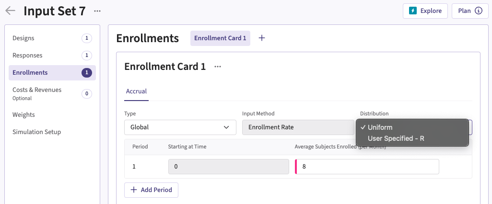
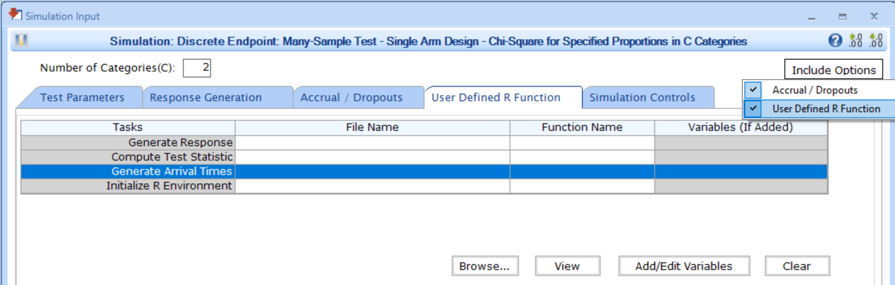

[$\leftarrow$ Go back to the *Getting Started: Overview* page](Overview.html)

# Description

The Enrollment integration point allows you to customize the distribution of subject arrival times using a custom R script. Instead of relying on a default uniform distribution, you can implement alternative enrollment patterns such as Poisson, equidistant, or exponential enrollment, among others, to better suit your trial's requirements.

# Availability

## East Horizon Explore

This integration point is available in East Horizon Explore for the following study objectives and endpoint types:

- **Two Arm Confirmatory**: continuous, continuous with repeated measures, binary, and time-to-event outcomes.
- ***Two Arm Confirmatory**: dual time-to-event/time-to-event, dual time-to-event/binary outcomes.* <span class="badge text-bg-secondary">Coming soon</span>
- ***Multiple Arm Confirmatory**: continuous and binary outcomes.* <span class="badge text-bg-secondary">Coming soon</span>

## East Horizon Design <span class="badge text-bg-secondary">Coming soon</span>

*This integration point will be available in East Horizon Design in the future.*

## East

<details>
<summary>This integration point is available in East for the following tests (click to expand/collapse):</summary>

- Design, Continuous Endpoint
    - Two-Sample Test, Parallel Design, Difference of Means (MN-2S-DI)
- Design, Discrete Endpoint
    - Two-Sample Test, Parallel Design
        - Difference of Proportions (PN-2S-DI)
        - Ratio of Proportions (PN-2S-RA)
        - Odds Ratio of Proportions (PN-2S-OR)
    - Many-Sample Test
        - Single Arm Design, Chi-Square for Specified Proportions in C Categories (PN-ns-CH1C)
        - Parallel Design, Two Group Chi-Square for Specified Proportions in C Categories (PN-ns-CH2C)
- Design, Survival Endpoint
    - Two-Sample Test, Parallel Design
        - Logrank Given Accrual Duration and Accrual Rates (SU-2S-LRAR)
        - Logrank Given Accrual Duration and Study Duration (SU-2S-LRSD)

</details>

# Instructions

## In East Horizon Explore

You can set up an enrollment function in East Horizon Explore under **Distribution** in a **Enrollment Card** while creating or editing an **Input Set**.

<details>
<summary>Follow these steps (click to expand/collapse):</summary>

1. Select **User Specified-R** from the dropdown in the **Distribution** field in the **Enrollment Card**.
1. Browse and select the appropriate R file (`filename.r`) from your computer, or use the built-in **R Code Assistant** to create one. This file should contain function(s) written to perform various tasks to be used throughout your Project.
1. Choose the appropriate function name. If the expected function is not displaying, then check your R code for errors.
1. Set any required user parameters (variables) as needed for your function using **+ Add Variables**.
1. Continue creating your project.

For a visual guide of where to find the option, refer to the screenshot below:


</details>

## In East

You can set up an enrollment function in East by navigating to the **Generate Arrival Times** task of the **User Defined R Function** tab of a **Simulation Input** window, after including the option.

<details>
<summary>Follow these steps (click to expand/collapse):</summary>

1. Choose the appropriate test in the **Design** tab.
1. If you see the **Design Input** window, compute the scenario using the **Compute** button, save the design using the **Save in Workbook** button, then navigate to the **Simulation Input** window by clicking on the **Simulate Design** button under **Library**.
1. Click on the **Include Options** button on the top right corner of the **Simulation Input** window and select both **Accrual / Dropouts** and **User Defined R Function**.
1. In the tab **User Defined R Function**, a list of tasks will appear. Place your cursor in the **File Name** field for the task **Generate Arrival Times**.
1. Click on the button **Browse...** to select the appropriate R file (`filename.r`) from your computer. This file should contain function(s) written to perform various tasks to be used throughout your Project.
1. Specify the function name you want to initialize. To copy the function's name from the R script, click on the button **View**.
1. Set any required user parameters (variables) as needed for your function using the button **Add/Edit Variables**.
1. Continue setting up your project.

For a visual guide of where to find the option, refer to the screenshot below:



</details>

# Input Variables

When creating a custom R script, you can optionally use certain variables provided by East Horizon's or East's engine itself. These variables are automatically available and do not need to be set by the user, except for the `UserParam` variable. Refer to the table below for the variable that is available for this integration point.

| **Variable**   | **Type** | **Description**                                                                 |
|----------------|--------------|---------------------------------------------------------------------------------|
|**NumSub**|Integer|Number of subjects in the trial.|
|**NumPrd**|Integer|Number of accrual periods in the trial.|
|**PrdStart**|Vector of Numeric|Vector of length `NumPrd`, indicating the start time of each period, with `PrdStarr[ 1 ] = 0`.|
|**AccrRate**|Vector of Numeric|Vector of length `NumPrd`, indicating the accrual rate of each period.|
| **UserParam**  | List     | Contains all user-defined parameters specified in East Horizon's or East's interface (refer to the [Instructions](#instructions) section). To access these parameters in your R code, use the syntax: `UserParam$NameOfTheVariable`, replacing `NameOfTheVariable` with the appropriate parameter name. |

# Expected Output Variable

East Horizon expects an output of a specific type. Refer to the table below for the expected output for this integration point:

| **Type**  | **Description**                                                                                  |
|------------------|--------------------------------------------------------------------------------------------------|
| List  | A named list containing `ArrivalTime` and `ErrorCode`.                    |

## Expected Members of the Output List

| **Members**     | **Type**  | **Description**                                                                                  |
|----------------|--------------|---------------------------------------------------------------------------------|
| **ArrivalTime**   | Vector of Double  | Vector of length `NumSub`, containing the generated arrival time for all subjects.|
| **ErrorCode**   | Integer  | Optional. Can be used to handle errors in your script:<br>– `0`: No error.<br> – `Positive Integer`: Nonfatal error, the current simulation will be aborted, but the next simulation will proceed.<br>– `Negative Integer`: Fatal error, no further simulations will be attempted.                  |

# Minimal Template

Your R script could contain a function such as this one, with a name of your choice. All input variables must be declared, even if they are not used in the script. We recommend always declaring `UserParam` as a default `NULL` value in the function arguments, as this will ensure that the same function will work regardless of whether the user has specified any custom parameters in the interface.

```
GenArrTimes <- function( NumSub, NumPrd, PrdStart, AccrRate, UserParam = NULL )
{
  nError        	    <- 0 # Error handling (no error)
  vPatientArrivalTime 	<- rep( 0, NumSub ) # Initializing arrival time array to 0
  
  # Write the actual code here.
  # Store the generated arrival times in a vector called vPatientArrivalTime.

  return( list( ArrivalTime = as.double( vPatientArrivalTime ), ErrorCode = as.integer( nError ) ) )
}
```

A detailed template with step-by-step explanations is available here: [GenerateArrivalTimes.R](https://github.com/Cytel-Inc/CyneRgy/blob/main/inst/Templates/GenerateArrivalTimes.R) 

# Examples

Explore the following examples for more context:

1. [**Generate Patient Arrival Times with Poisson Process**](GeneratePoissonArrival.html)
    - [GeneratePoissonArrival.R](https://github.com/Cytel-Inc/CyneRgy/blob/main/inst/Examples/GeneratePoissonArrival/R/GeneratePoissonArrival.R)

