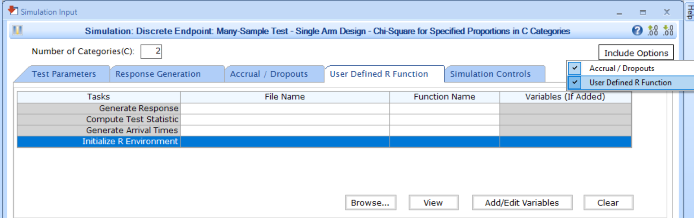
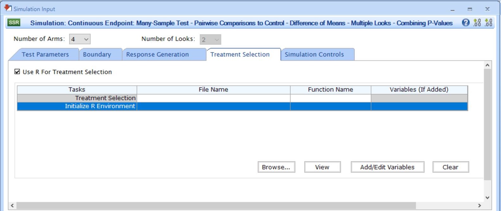

[$\leftarrow$ Go back to the *Getting Started: Overview* page](Overview.html)

# Description

The Initialization integration point allows you to specify an optional function that will run before any other user-defined functions during simulations. This function can serve various purposes, such as:

- Setting a seed for reproducibility in the R environment.
- Loading required R packages or libraries.
- Setting global variables.
- Setting the working directory.
- Sourcing an additional file.
- Performing other initial setup tasks.

# Availability

## East Horizon Explore

This integration point is available in East Horizon Explore for the following study objectives and endpoint types:

- **Two Arm Confirmatory**: continuous, continuous with repeated measures, binary, and time-to-event outcomes.
- ***Two Arm Confirmatory**: dual time-to-event/time-to-event, dual time-to-event/binary outcomes.* <span class="badge text-bg-secondary">Coming soon</span>
- ***Multiple Arm Confirmatory**: continuous and binary outcomes.* <span class="badge text-bg-secondary">Coming soon</span>

## East Horizon Design <span class="badge text-bg-secondary">Coming soon</span>

*This integration point will be available in East Horizon Design in the future.*

## East

<details>
<summary>This integration point is available in East for the following tests (click to expand/collapse):</summary>

- Design, Continuous Endpoint
    - Two-Sample Test, Parallel Design, Difference of Means (MN-2S-DI)
    - Many-Sample Test, Pairwise Comparisons to Control - Difference of Means, Multiple Looks - Combining P-Values (MN-MAMS-PC)
- Design, Discrete Endpoint
    - Two-Sample Test, Parallel Design
        - Difference of Proportions (PN-2S-DI)
        - Ratio of Proportions (PN-2S-RA)
        - Odds Ratio of Proportions (PN-2S-OR)
    - Many-Sample Test
        - Single Arm Design, Chi-Square for Specified Proportions in C Categories (PN-ns-CH1C)
        - Parallel Design, Two Group Chi-Square for Specified Proportions in C Categories (PN-ns-CH2C)
        - Multiple Pairwise Comparisons to Control - Difference of Proportions, Multiple Looks - Combining P-Values (PN-MAMS-PC)
- Design, Survival Endpoint
    - Two-Sample Test, Parallel Design
        - Logrank Given Accrual Duration and Accrual Rates (SU-2S-LRAR)
        - Logrank Given Accrual Duration and Study Duration (SU-2S-LRSD)
    - Many-Sample Test, Pairwise Comparisons to Control - Logrank Test, Multiple Looks - Combining P-Values (SU-MAMS-PC)

</details>

# Instructions

## In East Horizon

You can set up an initialization function when **creating a new project** in East Horizon by navigating to the **Initialize R Simulations** option under the **Plan** section.

<details>
<summary>Follow these steps (click to expand/collapse):</summary>

1. Choose **Initialize R Simulations** in the **Plan** section when setting up a **new Project**.
1. Turn on the switch to enable the feature.
1. Browse and select the appropriate R file (`filename.r`) from your computer, or use the built-in **R Code Assistant** to create one. This file should contain function(s) written to perform various tasks to be used throughout your Project.
1. Specify the function name you want to initialize. If the expected function is not displaying, then check your R code for errors.
1. Set any required user parameters (variables) as needed for your function using **+ Add Variables**.
1. Continue creating your project.

For a visual guide of where to find the option, refer to the screenshot below:


</details>

## In East

You can set up an initialization function in East by navigating to the **Initialize R Environment** task of the **User Defined R Function** tab of a **Simulation Input** window, after including the option. For some tests, the option will be available in the **Treatment Selection** tab.

<details>
<summary>Follow these steps (click to expand/collapse):</summary>

1. Choose the appropriate test in the **Design** tab.
1. If you see the **Design Input** window, compute the scenario using the **Compute** button, save the design using the **Save in Workbook** button, then navigate to the **Simulation Input** window by clicking on the **Simulate Design** button under **Library**.
1. Click on the **Include Options** button on the top right corner of the **Simulation Input** window and select both **Accrual / Dropouts** and **User Defined R Function**.
1. In the tab **User Defined R Function**, a list of tasks will appear. Place your cursor in the **File Name** field for the task **Initialize R Environment**.
1. Click on the button **Browse...** to select the appropriate R file (`filename.r`) from your computer. This file should contain function(s) written to perform various tasks to be used throughout your Project.
1. Specify the function name you want to initialize. To copy the function's name from the R script, click on the button **View**.
1. Set any required user parameters (variables) as needed for your function using the button **Add/Edit Variables**.
1. Continue setting up your project.

For a visual guide of where to find the option, refer to the screenshot below:



For the **Multiple Looks - Combining P-Values (MAMS)** tests, the option will be available when checking the box **Use R for Treatment Selection** in the **Treatment Selection** tab of the **Simulation Input** window. Refer to the screenshot below:



</details>

# Input Variables

When creating a custom R script, you can optionally use certain variables provided by East Horizon's or East's engine itself. These variables are automatically available and do not need to be set by the user, except for the `UserParam` variable. Refer to the table below for the variable that is available for this integration point.

| **Variable**   | **Type** | **Description**                                                                 |
|----------------|----------|---------------------------------------------------------------------------------|
|**Seed**|Integer|Randomization seed set by the engine.|
| **UserParam**  | List     | Contains all user-defined parameters specified in East Horizon's or East's interface (refer to the [Instructions](#instructions) section). To access these parameters in your R code, use the syntax: `UserParam$NameOfTheVariable`, replacing `NameOfTheVariable` with the appropriate parameter name. |

# Expected Output Variable

East Horizon expects an output of a specific type. Refer to the table below for the expected output for this integration point:

| **Output**     | **Type**  | **Description**                                                                                  |
|-----------------|----------|--------------------------------------------------------------------------------------------------|
| **ErrorCode**   | Integer  | Optional. Can be used to handle errors in your script:<br>– `0`: No error.<br> – `Positive Integer`: Nonfatal error, the current simulation will be aborted, but the next simulation will proceed.<br>– `Negative Integer`: Fatal error, no further simulations will be attempted.                  |

# Minimal Template

Your R script could contain a function such as this one, with a name of your choice. All input variables must be declared, even if they are not used in the script. We recommend always declaring `UserParam` as a default `NULL` value in the function arguments, as this will ensure that the same function will work regardless of whether the user has specified any custom parameters in the interface.

```
Init <- function( Seed = NULL, UserParam = NULL )
{
  # Do something, for example set the seed
  set.seed( 42 )
  # If you want the user to set the seed using East Horizon's or East's interface, you could use set.seed( UserParam$seed ) 
  
  # Error handling (no error)
  nError <- 0

  return( as.integer( nError ) )
}
```

A detailed template with step-by-step explanations is available here: [Initialize.R](https://github.com/Cytel-Inc/CyneRgy/blob/220-create-getting-started-page-with-subpages-GP/inst/Templates/Initialize.R) 

# Examples

Used to load libraries in the following examples:
    
1.  [**2-Arm, Normal Outcome, Repeated Measures - Patient Simulation**](2ArmNormalRepeatedMeasuresResponseGeneration.html)
    - [LibraryMASS.R](https://github.com/Cytel-Inc/CyneRgy/blob/main/inst/Examples/2ArmNormalRepeatedMeasuresResponseGeneration/RCode/LibraryMASS.R)
    - [LibraryNIme.R](https://github.com/Cytel-Inc/CyneRgy/blob/main/inst/Examples/2ArmNormalRepeatedMeasuresResponseGeneration/RCode/LibraryNIme.R)
1. **2-Arm, Normal Outcome, Repeated Measures - Analysis**
    - [LibraryRM.R](https://github.com/Cytel-Inc/CyneRgy/blob/main/inst/Examples/2ArmNormalRepeatedMeasuresOutcomeAnalysis/RCode/LibraryRM.R)
1. [**2-Arm, Time-To-Event Outcome - Analysis**](2ArmTimeToEventOutcomeAnalysisDescription.html)
    - [Librarysurvival.R](https://github.com/Cytel-Inc/CyneRgy/blob/main/inst/Examples/2ArmTimeToEventOutcomeAnalysis/RCode/Librarysurvival.R)
1. [**Bayesian Assurance of Consecutive Studies**](AssuranceConsecutiveStudies.html)
    - [InitializeSurvival.R](https://github.com/Cytel-Inc/CyneRgy/blob/main/inst/Examples/AssuranceConsecutiveStudies/RCode/InitializeSurvival.R)
1. [**Generate Patient Arrival Times with Poisson Process**](GeneratePoissonArrival.html)
    - [Initialize.R](https://github.com/Cytel-Inc/CyneRgy/blob/main/inst/Examples/GeneratePoissonArrival/RCode/Initialize.R)
1. [**2-Arm - Randomization of Subjects**](PatientRandomization.html)
    - [LoadRandomizeR.R](https://github.com/Cytel-Inc/CyneRgy/blob/main/inst/Examples/RandomizeSubjects/Rcode/LoadRandomizeR.R)
