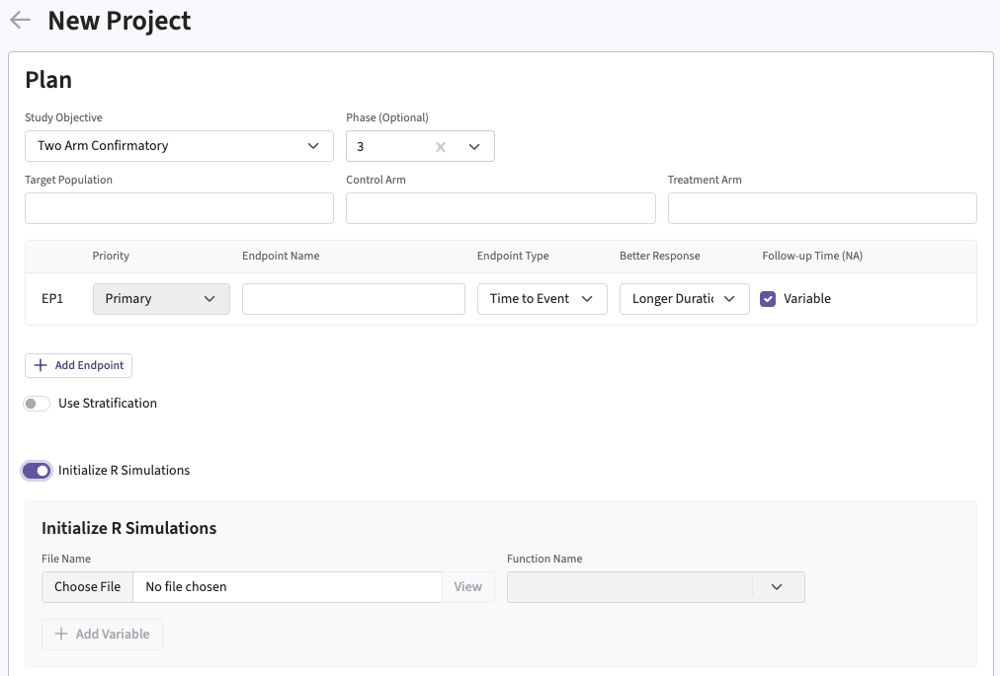

[$\leftarrow$ Go back to the *Getting Started: Overview* page](Overview.html)

# Description

The Initialization integration point allows you to specify an optional function that will run before any other user-defined functions during simulations. This function can serve various purposes, such as:

- Setting a seed for reproducibility in the R environment
- Loading required R packages or libraries
- Setting global variables
- Setting the working directory
- Performing other initial setup tasks

# How to Use It in East Horizon

You can set up an initialization function when **creating a new project** in East Horizon by navigating to the **Initialize R Simulations** option under the **Plan** section. Follow these steps:

1. Choose **Initialize R Simulations** in the Plan section when setting up a new Project.
1. Turn on the switch to enable the feature.
1. Browse and select the appropriate R file (`filename.r`) from your computer, or use the built-in **R Code Assistant** to create one. This file should contain function(s) written to perform various tasks to be used throughout your Project.
1. Specify the function name you want to initialize. If the expected function is not displaying, then check your R code for errors.
1. Set any required user parameters (variables) as needed for your function using **+ Add Variables**.
1. Continue creating your project.

For a visual guide of where to find the option, refer to the screenshot below:



# Input Variable

When creating a custom R script, you can optionally use certain variables provided by East Horizon's engine itself. These variables are automatically available and do not need to be set by the user, except for the `UserParam` variable. Refer to the table below for the variable that is available for this integration point.

| **Variable**   | **Type** | **Description**                                                                 |
|----------------|----------|---------------------------------------------------------------------------------|
| **UserParam**  | List     | Contains all user-defined parameters specified in the East Horizon interface (refer to the [How to Use It in East Horizon](#how-to-use-it-in-east-horizon) section). To access these parameters in your R code, use the syntax: `UserParam$NameOfTheVariable`, replacing `NameOfTheVariable` with the appropriate parameter name. |

# Expected Output Variable

East Horizon expects an output of a specific type. Refer to the table below for the expected output for this integration point:

| **Output**     | **Type**  | **Description**                                                                                  |
|-----------------|----------|--------------------------------------------------------------------------------------------------|
| **ErrorCode**   | Integer  | Optional. Can be used to handle errors in your script:<br>– `0`: No Error<br> – `Positive Integer`: Nonfatal Error, the current simulation will be aborted, but the next simulation will proceed.<br>– `Negative Integer`: Fatal Error, no further simulations will be attempted.                  |

# Minimal Template

Your R script could contain a function such as this one, with a name of your choice. We recommend always declaring `UserParam` as a default `NULL` value in the function arguments, as this will ensure that the same function will work regardless of whether the user has specified any custom parameters in East Horizon.

```
Init <- function( UserParam = NULL )
{
  # Do something, for example set the seed
  set.seed( 42 )
  # If you want the user to set the seed using East Horizon interface, you could use set.seed( UserParam$seed ) 
  
  # Error handling (no error)
  nError <- 0

  return( as.integer( nError ) )
}
```

