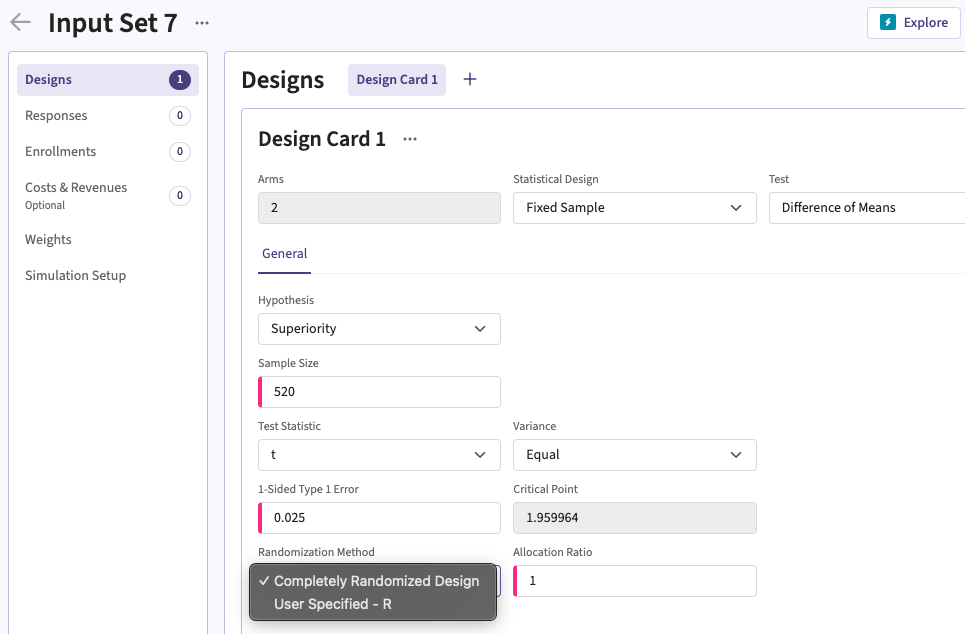

[$\leftarrow$ Go back to the *Getting Started: Overview* page](Overview.html)

# Description

The Randomization integration point allows you to incorporate custom randomization methods into East Horizon. By specifying a function, you can control how subjects are assigned to designated arms based on your specific requirements, replacing the default complete randomization approach. For example, you can implement advanced randomization techniques such as block randomization, stratified randomization, or cluster randomization.

# How to Use It in East Horizon

This integration point is currently available in East Horizon Explore for the **Two Arm Confirmatory** (all endpoint types) study objective. It is expected to be available in the future for the **Multiple Arm Confirmatory** (continuous and binary outcomes) study objective.

You can set up a response function in East Horizon Explore under **Randomization Method** in a **Design Card** while creating or editing an **Input Set**. Follow these steps:

1. Select "User Specified-R" from the dropdown in the Randomization Method field in the Design card.
1. Browse and select the appropriate R file (`filename.r`) from your computer, or use the built-in **R Code Assistant** to create one. This file should contain function(s) written to perform various tasks to be used throughout your Project.
1. Choose the appropriate function name. If the expected function is not displaying, then check your R code for errors.
1. Set any required user parameters (variables) as needed for your function using **+ Add Variables**.
1. Continue creating your project by specifying scenarios for patient Response, Enrollments, etc.

For a visual guide of where to find the option, refer to the screenshot below:



# Input Variable

When creating a custom R script, you can optionally use certain variables provided by East Horizon's engine itself. These variables are automatically available and do not need to be set by the user, except for the `UserParam` variable. Refer to the table below for the variable that is available for this integration point.

| **Variable**   | **Type** | **Description**                                                                 |
|----------------|--------------|---------------------------------------------------------------------------------|
|**NumSub**|Integer|Number of subjects in the trial.|
|**NumArms**|Integer|Number of arms in the trial ﴾including placebo/control, and experimental﴿.|
|**AllocRatio**|Vector of Numeric|Vector of length `NumArm - 1`, indicating the expected allocation ratios for each treatment arm relative to the control arm ($n_{t_i}/n_c$).|
| **UserParam**  | List     | Contains all user-defined parameters specified in the East Horizon interface (refer to the [How to Use It in East Horizon](#how-to-use-it-in-east-horizon) section). To access these parameters in your R code, use the syntax: `UserParam$NameOfTheVariable`, replacing `NameOfTheVariable` with the appropriate parameter name. |

# Expected Output Variable

East Horizon expects an output of a specific type. Refer to the table below for the expected output for this integration point:

| **Type**  | **Description**                                                                                  |
|------------------|--------------------------------------------------------------------------------------------------|
| List  | A named list containing `TreatmentID` and `ErrorCode`.                    |

## Expected Members of the Output List

| **Members**     | **Type**  | **Description**                                                                                  |
|----------------|--------------|---------------------------------------------------------------------------------|
| **TreatmentID**   | Vector of Integer  | Vector of length equal to the number of subjects, containing the allocation indices for all subjects:<br>– `0`: Control arm<br>– `1`: First experimental arm<br>– etc.).|
| **ErrorCode**   | Integer  | Optional. Can be used to handle errors in your script:<br>– `0`: No Error<br> – `Positive Integer`: Nonfatal Error, the current simulation will be aborted, but the next simulation will proceed.<br>– `Negative Integer`: Fatal Error, no further simulations will be attempted.                  |

# Minimal Template

Your R script could contain a function such as this one, with a name of your choice. All input variables must be declared, even if they are not used in the script. We recommend always declaring `UserParam` as a default `NULL` value in the function arguments, as this will ensure that the same function will work regardless of whether the user has specified any custom parameters in East Horizon.

```
Randomize <- function( NumSub, NumArms, AllocRatio, UserParam = NULL )
{
  nError        	    <- 0 # Error handling (no error)
  vTreatmentArmIndex 	<- rep( 0, NumSub ) # Initializing response array to 0: in that case all patients are in the control group
  
  # Write the actual code here.
  # Store the generated allocation indices in a vector called vTreatmentArmIndex.

  return( list( Response = as.Integer( vTreatmentArmIndex ), ErrorCode = as.integer( nError ) ) )
}
```

A detailed template with step-by-step explanations is available here: [Randomization.R](https://github.com/Cytel-Inc/CyneRgy/blob/main/inst/Templates/Randomization.R) 

# Examples

Explore the following examples for more context:

1. [**2-Arm - Randomization of Subjects**](PatientRandomization.html)
    - [RandomizationSubjectsUsingUniformDistribution.R](https://github.com/Cytel-Inc/CyneRgy/blob/main/inst/Examples/RandomizeSubjects/RCode/RandomizationSubjectsUsingUniformDistribution.R)
    - [RandomizationSubjectsUsingSampleFunctionInR.R](https://github.com/Cytel-Inc/CyneRgy/blob/main/inst/Examples/RandomizeSubjects/RCode/RandomizationSubjectsUsingSampleFunctionInR.R)
    - [BlockRandomizationSubjectsUsingRPackage.R](https://github.com/Cytel-Inc/CyneRgy/blob/main/inst/Examples/RandomizeSubjects/RCode/BlockRandomizationSubjectsUsingRPackage.R)


