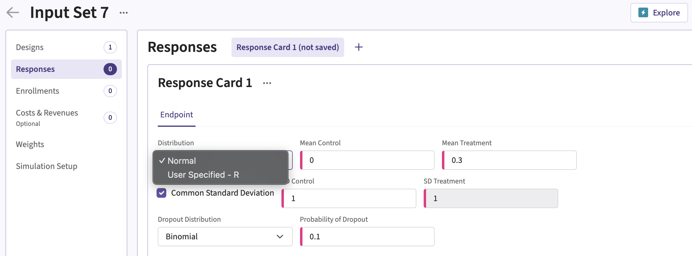
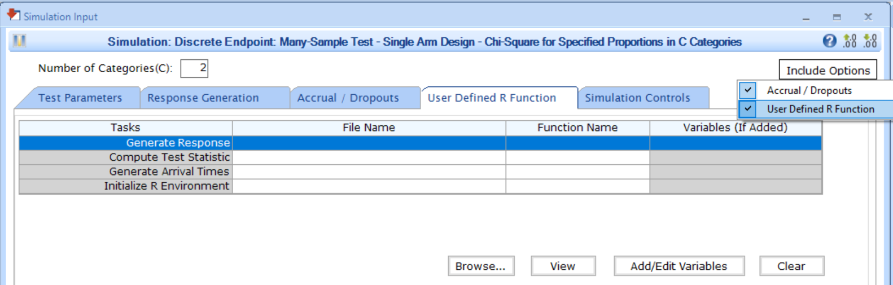

[$\leftarrow$ Go back to the *Getting Started: Overview* page](Overview.html)

# Description

The Response integration point allows you to incorporate custom patient outcome simulation capabilities into East Horizon. By specifying a function, you can simulate patient outcomes according to your requirements, replacing the native generation method for patient response. For example, you can:

- Simulate patient data using a mixture distribution where a proportion of patients do not respond to treatment.
- Simulate patient data from a statistical distribution not natively supported by East Horizon, such as:
  - Gamma distribution for continuous outcomes,
  - Beta distribution for binary outcomes,
  - Weibull distribution for time-to-event outcomes.
  
# Availability

## East Horizon Explore

This integration point is available in East Horizon Explore for the following study objectives and endpoint types:

- **Two Arm Confirmatory**: continuous, continuous with repeated measures, binary, and time-to-event outcomes.
- ***Two Arm Confirmatory**: dual time-to-event/time-to-event, dual time-to-event/binary outcomes.* Coming soon
- ***Multiple Arm Confirmatory**: continuous and binary outcomes.* Coming soon

## East Horizon Design Coming soon

*This integration point will be available in East Horizon Design in the future.*

## East

This integration point is available in East for the following tests (click to expand/collapse):

- Design, Continuous Endpoint
    - Two-Sample Test, Parallel Design, Difference of Means (MN-2S-DI)
- Design, Discrete Endpoint
    - Two-Sample Test, Parallel Design
        - Difference of Proportions (PN-2S-DI)
        - Ratio of Proportions (PN-2S-RA)
        - Odds Ratio of Proportions (PN-2S-OR)
    - Many-Sample Test
        - Single Arm Design, Chi-Square for Specified Proportions in C Categories (PN-ns-CH1C)
        - Parallel Design, Two Group Chi-Square for Specified Proportions in C Categories (PN-ns-CH2C)
- Design, Survival Endpoint
    - Two-Sample Test, Parallel Design
        - Logrank Given Accrual Duration and Accrual Rates (SU-2S-LRAR)
        - Logrank Given Accrual Duration and Study Duration (SU-2S-LRSD)

# Instructions

## In East Horizon Explore

You can set up a response function in East Horizon Explore under **Distribution** in a **Response Card** while creating or editing an **Input Set**.

Follow these steps (click to expand/collapse):

1. Select **User Specified-R** from the dropdown in the **Distribution** field in the **Response Card**.
1. Browse and select the appropriate R file (`filename.r`) from your computer, or use the built-in **R Code Assistant** to create one. This file should contain function(s) written to perform various tasks to be used throughout your Project.
1. Choose the appropriate function name. If the expected function is not displaying, then check your R code for errors.
1. Set any required user parameters (variables) as needed for your function using **+ Add Variables**.
1. Continue creating your project.

For a visual guide of where to find the option, refer to the screenshot below:

## In East

You can set up an enrollment function in East by navigating to the **Generate Response** task of the **User Defined R Function** tab of a **Simulation Input** window, after including the option.

Follow these steps (click to expand/collapse):

1. Choose the appropriate test in the **Design** tab.
1. If you see the **Design Input** window, compute the scenario using the **Compute** button, save the design using the **Save in Workbook** button, then navigate to the **Simulation Input** window by clicking on the **Simulate Design** button under **Library**.
1. Click on the **Include Options** button on the top right corner of the **Simulation Input** window and select both **Accrual / Dropouts** and **User Defined R Function**.
1. In the tab **User Defined R Function**, a list of tasks will appear. Place your cursor in the **File Name** field for the task **Generate Response**.
1. Click on the button **Browse...** to select the appropriate R file (`filename.r`) from your computer. This file should contain function(s) written to perform various tasks to be used throughout your Project.
1. Specify the function name you want to initialize. To copy the function's name from the R script, click on the button **View**.
1. Set any required user parameters (variables) as needed for your function using the button **Add/Edit Variables**.
1. Continue setting up your project.

For a visual guide of where to find the option, refer to the screenshot below:

# Endpoint Types

The input variables, expected output variables, examples, and templates for this integration point depend on the endpoint type (or outcome) you are using. Refer to the relevant pages below:

:::: {.button-container}
<a href="IntegrationPointResponseContinuous.html" class="btn btn-primary"><i class="fas fa-chart-line"></i> Continuous (Normal) Outcome</a>

<a href="IntegrationPointResponseTimeToEvent.html" class="btn btn-primary"><i class="fas fa-hourglass-half"></i> Time-to-Event (Survival) Outcome</a>

<a href="IntegrationPointResponseRepeatedMeasures.html" class="btn btn-primary"><i class="fas fa-sync"></i> Continuous (Normal) Outcome with Repeated Measures</a>

<a href="IntegrationPointResponseBinary.html" class="btn btn-primary"><i class="fas fa-toggle-on"></i> Binary Outcome</a>
::::
